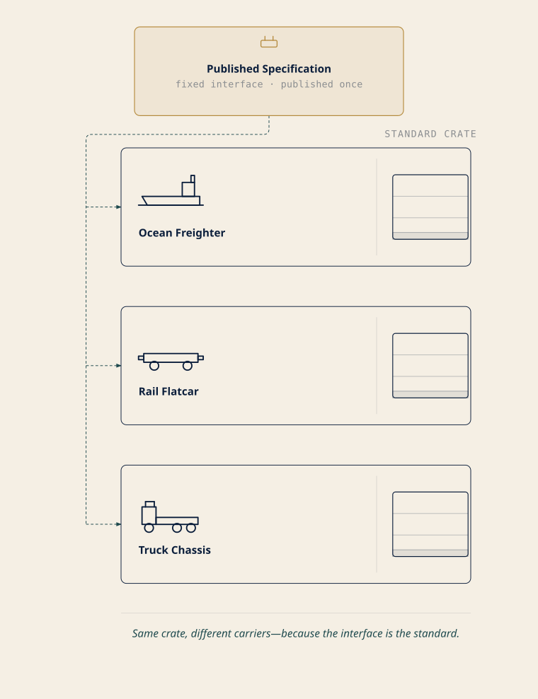

# Chapter 2: Cargo in Standard Crates
## *"Why the shipping container beat the ship"*

**Exam domain: Kubernetes Fundamentals (44% of the exam) — competency: Containerization** [source: cncf-kcna-certification-page-2026-08-23] [source: cncf-kcna-curriculum-pdf-2026-08-23] **| Estimated share of the exam: ~9% (authored allocation — CNCF publishes domain weights, not competency weights** [source: cncf-kcna-curriculum-pdf-2026-08-23]**; see front matter) | Complexity: Mixed | Novelty: Moderate**

---

## Attention Budget

**Total time: ~90 minutes | Recommended: single session if you're fresh; otherwise split after §5**

| Section | Time | Attention Cost | Best Time to Study |
|---|---|---|---|
| §1 What a Container Actually Is | 8 min | Low | Anytime |
| §2 What's Inside an Image | 12 min | Low | Anytime |
| §3 Registries, Tags, and Digests | 14 min | Medium | When alert |
| ☆ Taking Your Bearings #1 | 6 min | Medium | After a short break |
| §4 The Container Runtime Interface | 12 min | Medium | When alert |
| §5 The Open Container Initiative | 10 min | Medium | When alert |
| §6 When Kubernetes Pulls, and When It Doesn't | 9 min | High | Peak attention |
| §7 Not All Isolation Is Equal: RuntimeClass | 6 min | Medium | When alert |
| ☆ Taking Your Bearings #2 | 9 min | Medium | After a short break |
| §8 The Crate, Not the Cargo | 4 min | Low | Anytime |

**Attention Cost Key:**
- **Low:** Concrete, familiar concepts. Study anytime.
- **Medium:** New vocabulary requiring focus. Study when alert.
- **High:** Conditional rules that must be recalled precisely. Study at peak attention.

*If you only have 15 minutes: read §3 and §4, then take Taking Your Bearings #1 and #2. Those two sections carry two of the chapter's three Fixed Points, and in the author's judgment they are the material a reader is least likely to reconstruct on their own.*

---

> *"The crate outlives the ship. Standardize the crate."*
> — Lodestar Ledgers

---

## 🧭 Soundings

Before reading this chapter, try these eight questions. Your score decides how to approach the material. No shame in any score, just different reading strategies.

1. An application is running in a container, and one line of a configuration file inside it needs to change. Is editing that file in the running container the intended way to make the change persist, or is the intended workflow something else entirely?

2. You pull `myapp:v2` today. A teammate pulls the same reference next week. Which statement is true?

   A) The bytes are identical, because the reference string is identical
   B) The bytes may differ
   C) The bytes are identical, because registries reject re-pushing an existing reference
   D) The bytes are identical only if both pulls hit the same registry replica

3. You write an image reference as just `nginx`, with no hostname in front of it. Where does that image get fetched from?

4. You build two images from the same base and push both to the same registry. Is that shared base stored once, or twice?

5. Kubernetes runs containers. Which best describes what that requires on the machines running them?

   A) Docker specifically must be installed
   B) Any of several different runtimes will do
   C) Nothing — Kubernetes starts containers itself
   D) A runtime is required, but only on control-plane machines

6. Who publishes the specification that defines the container image format — the layout of the artifact you push to a registry and pull onto a machine?

   A) The Docker company
   B) The Kubernetes project
   C) An industry standards body
   D) Each registry vendor, independently

7. A workload must run untrusted third-party code with a stronger boundary than an ordinary container provides. What are your options inside a single cluster?

   A) None — you need a separate cluster, because isolation strength is fixed
   B) You can select a stronger isolation model for just that workload
   C) You can raise the isolation level for the whole cluster, but not per workload
   D) You can restrict the image it runs, which is the isolation mechanism

8. A machine has already downloaded a particular image. The next time it needs to start a container from that image, does it download it again?

<details>
<summary>Click for answers + reading strategy</summary>

1. **The intended workflow is something else.** The change belongs in a new image, not in a live container. §2 covers why this is the rule rather than a preference.

2. **B.** *[cross-bearing: see Ch 2 §3 — tags, digests, and what an image reference actually resolves to]*

3. **From a default registry that Kubernetes assumes when you don't name one.** §3 names it and shows the other two defaults hiding in the same short string.

4. **Once.** The layered format allows layers to be reused between images [source: docker-docs-image-layers-2026-08-24]; §2 has the structure.

5. **B.** §4 explains what makes them interchangeable.

6. **C.** §5 names who does.

7. **B.** §7 covers the mechanism and, more importantly, why anyone would want it.

8. **It depends, and what it depends on will surprise you.** §6 has the four-case rule, and it hinges on how you wrote the reference, not on what you configured.

**If you got 6+ right:** skim. Focus on the ★ Fixed Points and ⚠ Navigational Hazards callouts, and take both Taking Your Bearings checkpoints. Do not skip §5 (OCI) or §7 (RuntimeClass) regardless of your score. Those two sections score well on intuition and still repay a careful read.

**If you got 3–5 right:** read at normal pace. This chapter is calibrated for you.

**If you got 0–2 right:** read carefully, in its own session. This is the chapter every later chapter rests on, and there's no shortcut through it. Nothing here is difficult; there's simply a lot of new vocabulary, and every term is defined before it's used.

</details>

---

## Why This Chapter Matters

Here is a sentence that should stop you: **Kubernetes cannot run a container.** Not one, not ever, on any cluster you will ever touch. Every container on every node is started by software that is not Kubernetes, reached across a boundary that Kubernetes only defines. That is not a limitation someone forgot to fix. It is the design, it is deliberate, and by the time you finish §4 you will be able to draw it.

Chapter 1 told you that an orchestrator is not a runtime *[cross-bearing: see Ch 1 §Soundings A2 — orchestrator versus runtime]*. That was a one-line correction. This chapter turns it into a mechanism.

What you are building here is discrimination: the ability to tell near-identical things apart. That is the competence the whole exam measures, and it is the competence this chapter installs at the deepest level in the stack. A practitioner who has this chapter can be handed any unfamiliar container tool, a runtime they've never heard of, a new build system, somebody's registry product, and place it on a map in about ten seconds. Does this thing *produce* images, *distribute* them, or *run* them, and which specification is it conforming to? That placement instinct separates someone who has memorized the words "containerd, CRI-O, runC" from someone who understands why those three names are not a list of alternatives.

The stakes here are structural, and worth stating plainly once. This is the first content chapter because containerization is the deepest root in the book's dependency graph, not because it's an easy warm-up. A reader who leaves this chapter treating "container" as an undefined primitive will find that Chapter 3's runtime boundary, Chapter 13's failed-image-pull diagnosis, and Chapter 17's entire argument about how Kubernetes is extended each land slightly wrong. Not catastrophically. Just slightly, three times, in ways that are hard to trace back here. Better to spend the time now.

---

## What You'll Learn

By the end of this chapter, you'll be able to:

- **Distinguish** a container from a virtual machine by what each one shares with the host, and explain why that single difference produces every other difference people cite.
- **Explain** what a container image contains, what it deliberately does not contain, and why the correct response to a needed change is a new image rather than an edited container.
- **Describe** how an image is assembled from stacked filesystem layers, and why two images built from a common base share that base rather than duplicating it.
- **Predict** which bytes a given image reference resolves to, including when a tag will silently resolve to something different than it did last week, and when a digest guarantees that it cannot.
- **Trace** the path from a Pod's image field to a running process, naming each component in the chain and stating which specification governs each hop.
- **Choose** an `imagePullPolicy` deliberately, and state what Kubernetes will do by default when you don't.
- **Recognize** the interface-and-implementations pattern that CRI exemplifies, and name the other places Kubernetes applies it.

*You'll also be able to look at an unfamiliar container tool and say what layer it operates at, which is how practitioners actually navigate this ecosystem.*

---

## ⚪ §1 — What a Container Actually Is

**If you remember nothing else:** a container is repeatable because everything it needs travels with it.

Start with what a container buys you, because the definition follows from the benefit. Each container that you run is repeatable; the standardization that comes from having dependencies included means that you get the same behavior wherever you run it [source: k8s-docs-containers-2026-08-23]. That's the whole proposition. Containers decouple applications from the underlying host infrastructure, which is what makes deployment easier across different cloud or operating-system environments [source: k8s-docs-containers-2026-08-23].

Notice what that claim is *not*. It is not "containers are fast." It is not "containers are small." Speed and size are consequences. The proposition is *sameness*: the thing that ran on your laptop is the thing that runs on the node, because the dependencies are not assumptions about the host. They're contents.

Now the comparison everyone reaches for, done at the level that actually explains it.

Virtualization lets you run multiple virtual machines on a single physical server's CPU, isolating applications between VMs so that one application's information cannot be freely accessed by another. Each VM is a full machine running all the components, including its own operating system, on top of virtualized hardware [source: k8s-docs-overview-2026-08-23]. Read that last clause again: *its own operating system*. Ten VMs on a host means ten operating systems booted, patched, and consuming memory before a single line of your application runs.

Containers are similar to VMs, but they have relaxed isolation properties in order to share the operating system among the applications, and *therefore* containers are considered lightweight. Similar to a VM, a container has its own filesystem, share of CPU, memory, process space, and more; because containers are decoupled from the underlying infrastructure, they are portable across clouds and OS distributions [source: k8s-docs-overview-2026-08-23].

Two registers are in use here, and both are correct. The Kubernetes documentation and the CNCF glossary say a container **shares the operating system** [source: cncf-glossary-container-2026-08-24]. That is, in the author's judgment, the phrasing an exam item is likeliest to echo, and the one to recognize on an answer sheet. Practitioners and the container-runtime documentation usually sharpen it: a container **shares the host's kernel**, meaning the part of the operating system that talks to hardware, schedules processes, and enforces boundaries. Everything above the kernel that the application needs, its libraries, its files, its view of the process table, comes from the container itself. That is why a container has its own filesystem and its own process space while still running on somebody else's kernel. [source: docker-docs-what-is-a-container-2026-08-24]

The sharpening is not a stylistic preference; the mechanism only parses one way. Kubernetes describes a sandboxed alternative runtime as one that supplies "a user-space kernel (such as gVisor)" [source: k8s-docs-runtime-class-2026-08-23]. That phrase is only meaningful if the ordinary, non-sandboxed case is the *host's* kernel. Hold both registers: **operating system** as the published wording, **kernel** as the mechanism underneath it.

Now the single most useful move you can make with this material: stop memorizing the comparison table and derive it instead. Every difference between a container and a VM that anybody cites comes out of that one architectural choice.

<!-- FIGURE: ch02-fig01-vm-vs-container-stack -->


<!-- ASCII-FALLBACK
```
        VIRTUAL MACHINES                       CONTAINERS

   ┌──────┐ ┌──────┐ ┌──────┐          ┌──────┐ ┌──────┐ ┌──────┐
   │ App  │ │ App  │ │ App  │          │ App  │ │ App  │ │ App  │
   ├──────┤ ├──────┤ ├──────┤          └──┬───┘ └──┬───┘ └──┬───┘
   │Guest │ │Guest │ │Guest │             │        │        │
   │  OS  │ │  OS  │ │  OS  │          ┌──┴────────┴────────┴──┐
   └──┬───┘ └──┬───┘ └──┬───┘          │   container runtime    │
      │        │        │              ├────────────────────────┤
   ┌──┴────────┴────────┴──┐           │        host OS         │
   │      hypervisor        │          ├────────────────────────┤
   ├────────────────────────┤          │       hardware         │
   │        host OS         │          └────────────────────────┘
   ├────────────────────────┤
   │       hardware         │           ONE OS · three apps
   └────────────────────────┘
    THREE OS COPIES · three apps
```
-->

**Figure 2-1.** The duplication on the left is the entire story. Notice what to look for: the guest-OS row repeats once per workload on the VM side and does not appear at all on the container side. Start-up time, image size, and how many workloads fit on a host are all downstream of that one row.

Derive it yourself. Booting a guest operating system takes time, so VMs start slowly and containers start quickly. A guest operating system occupies disk and memory, so VM images are large and containers are small. Three guest kernels on one host means three times the baseline resource cost, so container density is higher. You do not need three facts. You need one fact and the willingness to follow it.

> ⚓ **Worth Securing:** "Relaxed isolation" is a *tradeoff*, not a deficiency. The docs use exactly that word, *relaxed* [source: k8s-docs-overview-2026-08-23], and being honest about it is what makes the rest of the picture coherent. You gave up a boundary in exchange for weight, and because it was a trade, it can be renegotiated per workload when a particular workload deserves the boundary back. *[cross-bearing: see Ch 2 §7 — when relaxed isolation is not enough]*

One forward plant, then we move on. Containers in a Pod are co-located and co-scheduled to run on the same node [source: k8s-docs-containers-2026-08-23]. You do not need to know what a Pod is yet. It is Chapter 5's whole subject, and it comes with a shared Linux network namespace [source: k8s-docs-network-model-2026-08-23] and a lifecycle of its own *[cross-bearing: see Ch 5 §1 — the Pod as the unit of scheduling]*. For now, register only this: containers are not the unit Kubernetes schedules. Something wraps them.

---

## ⚪ §2 — What's Inside an Image

A container is a running thing. An image is the package it runs from, and the contents repay precision, because the exam tests the contents and, more usefully, because the negative space in that list explains §1 backwards.

A container image is a ready-to-run software package containing everything needed to run an application: the code and any runtime it requires, application **and** system libraries, and default values for any essential settings [source: k8s-docs-containers-2026-08-23]. Said another way, a container image represents binary data that encapsulates an application and all its software dependencies; images are executable software bundles that can run standalone and that make very well-defined assumptions about their runtime environment. You typically create a container image of your application and push it to a registry before referring to it in a Pod [source: k8s-docs-images-2026-08-23].

That phrase, *very well-defined assumptions about their runtime environment*, is doing quiet work. An image is not self-sufficient. It is *explicit* about what it expects from underneath. And the largest thing it expects from underneath is the one thing it does not carry.

**An image contains no kernel.** That is not a separate fact to memorize, and it is deliberately not presented here as a quotation, because no authority states it as a negative. It is §1 read in reverse. If containers get the kernel by sharing the host's [source: k8s-docs-overview-2026-08-23], the image cannot be shipping one. A shipped kernel would have to be booted, and booting it is precisely what a virtual machine does and a container does not. Every time you see a question implying that a container image bundles an operating system kernel, you are looking at the same misconception wearing a different hat.

System libraries, though, *are* included [source: k8s-docs-containers-2026-08-23], which is where people get tangled, because system libraries feel like part of the OS. They belong to the operating system's userspace rather than to its kernel, and userspace is exactly what the image supplies, which follows from the same sharing model. Kernel below, everything above it in the crate.

### Immutability, and why it's a rule rather than a preference

Containers are intended to be stateless and immutable: you should not change the code of a container that is already running. If you have a containerized application and want to make changes, the correct process is to build a new image that includes the change, then recreate the container to start from the updated image [source: k8s-docs-containers-2026-08-23].

Read the shape of that instruction. It does not say "editing a running container is discouraged." It says the *correct process* is different in kind: build, then recreate. Two steps, neither of which is "edit."

This is the habit that readers with virtual-machine or bare-metal backgrounds find hardest to break, and the reason deserves naming, because the reason is honorable. If you have spent years administering long-lived servers, the skill you built was *repair*: log in, diagnose, fix in place, verify. That skill is genuinely valuable and it is genuinely the wrong instinct here. In a container world, the fix goes in the image and the container gets replaced. Repair-in-place produces a running thing that no image can reproduce, which forfeits the one property you adopted containers to get: sameness.

The payoff is concrete. Image immutability is exactly what makes quick and efficient rollbacks possible [source: k8s-docs-overview-2026-08-23]. You can go back to the previous version because the previous version still exists, unchanged, as a distinct artifact. Edit containers in place and there is nothing to go back to.

### Layers

An image is not a single opaque blob. The OCI Image Format encompasses the image manifest, **filesystem layer serialization**, and image configuration needed to launch applications on target platforms [source: oci-overview-2026-08-23]. In other words, the contents arrive as a set of filesystem layers, described by a manifest that names them, plus a configuration that says how to start the thing. The specification's own definition of a layer is a changeset that describes a container's filesystem [source: oci-image-spec-overview-2026-08-24], and one or more layers are applied on top of each other to create a complete filesystem [source: oci-image-spec-layers-2026-08-24]. (The image *manifest* here is an OCI artifact — a different thing from the Kubernetes manifests, the YAML files, you'll meet in Chapter 4 *[cross-bearing: see Ch 4 §2 — the anatomy of a record]*.)

Three consequences follow from that structure, and all three matter downstream.

**The layers stack, in order.** The manifest lists them as an ordered array, and the specification is strict about it: the array must have the base layer at index 0, and subsequent layers must follow in stack order [source: oci-image-spec-manifest-2026-08-24]. The image you finally run is the result of that stack resolved into a single filesystem view.

**A shared base is a shared layer.** If two images are built starting from the same base, both of their manifests name that same base layer. The layer has one identity, so it is one object: stored once and transferred once, rather than duplicated per image. Docker's documentation states the payoff without hedging: the layered format allows layers to be reused between images, which reduces the amount of storage and bandwidth required to distribute them [source: docker-docs-image-layers-2026-08-24].

**Position in the stack determines rebuild cost.** Because each layer is applied on top of the ones beneath it, changing a lower layer invalidates everything above it: once a layer changes, all downstream layers need to be rebuilt as well [source: docker-docs-build-cache-2026-09-04]. This is why the conventional advice is to put the parts that change least at the bottom.

<!-- FIGURE: ch02-fig02-image-layers-and-digests -->
![Left: two image stacks, image A and image B, each with an app layer above a shared base layer, the two base layers joined to show they are one stored layer named by both manifests. Right: a card showing a truncated digest sha256:9f2c...be41 labeled content hash and immutable, with two identical :v2 tag boxes below it — one labeled today connected by a solid arrow, one labeled next week connected by a dashed arrow to a different point, showing that a tag is a label that can be moved to point at a different image.](figures/ch02-fig02-image-layers-and-digests.svg)

<!-- ASCII-FALLBACK
```
        LAYERS                                 IDENTITY

   image A      image B                ┌──────────────────────────┐
  ┌─────────┐  ┌─────────┐             │   sha256:9f2c…be41       │
  │   app   │  │   app   │             │   digest = content hash  │
  ├─────────┤  ├─────────┤             │   immutable              │
  │ shared  │══│ shared  │             └──────────────────────────┘
  │  base   │  │  base   │                  ▲                ▲
  └─────────┘  └─────────┘            ───────┘         ┄┄┄┄┄┄┄┘
                                      solid            dashed
   both manifests name               ┌──────┐         ┌──────┐
   the SAME base layer               │ :v2  │         │ :v2  │
   → stored once                     └──────┘         └──────┘
                                      today          next week

                                  a tag is a LABEL — it can be
                                  moved to point at a different image
```
-->

**Figure 2-2.** Two ideas in one frame, because §3 depends on the right half. What to notice: the dashed arrow. The tag `:v2` is attached to the image, not part of it, and an attachment can be re-attached.

Note what the layer structure buys forward: the layers described here are precisely the thing that a specification standardizes, which is why any registry can serve any image and any conformant runtime can unpack one *[cross-bearing: see Ch 2 §5 — the OCI image specification]*.

### Building images without writing build files

You do not have to hand-author a build file to produce an image, and the exam's ecosystem awareness extends to knowing the alternative exists.

A **buildpack** is software that transforms application source code into runnable artifacts by analyzing the code and determining the best way to build it, and what comes out the far end is an ordinary, runnable OCI image, produced without anyone writing a build file. Cloud Native Buildpacks is a CNCF graduated project [source: buildpacks-concepts-2026-08-23].

> ⚓ **Worth Securing:** Buildpacks build your application in one base image and ship it on a different one [source: buildpacks-concepts-2026-08-23], and that split is the idea to take from them even if you never use them. The environment that *compiles* your application and the environment that *runs* it do not have to be the same environment, and they usually shouldn't be. Compilers, headers, and build tooling are attack surface that your production image has no use for; a multi-stage build achieves the same separation by hand, so that none of the build tools required to build the application are included in the resulting image [source: docker-docs-multi-stage-2026-08-24]. Buildpacks make that separation structural rather than a discipline you have to remember. The same instinct scales down to base-image choice generally: a small image with minimal dependencies can considerably lower the attack surface [source: docker-docs-build-best-practices-2026-08-24].

Supply-chain security, meaning scanning, signing, and bills of materials, is a real concern that attaches to everything in this section, and it is not this chapter's. It gets a full treatment later *[cross-bearing: see Ch 12 — securing the image supply chain]*.

---

## 🔵 §3 — Registries, Tags, and Digests

This section carries the chapter's sharpest single distinction, and it is one most practitioners carry wrong for years without consequence, right up until the afternoon it costs them.

### An image reference has parts

Container images are usually given a name such as `pause`, `example/mycontainer`, or `kube-apiserver`. Images can also include a registry hostname, for example `fictional.registry.example/imagename`, and possibly a port number as well. **If you don't specify a registry hostname, Kubernetes assumes that you mean the Docker public registry.** After the image name, you can add a tag or a digest. Tags let you identify different versions of the same series of images. **If you don't specify a tag, Kubernetes assumes you mean the tag `latest`.** So `busybox` is equivalent to `docker.io/library/busybox:latest` [source: k8s-docs-images-2026-08-23].

Here are the defaults as a table, because that is what a table is for:

| What you write | What it resolves to | Which default filled the gap |
|---|---|---|
| `busybox` | `docker.io/library/busybox:latest` | registry **and** tag |
| `busybox:<version>` | `docker.io/library/busybox:<version>` | registry |
| `registry.k8s.io/pause` | `registry.k8s.io/pause:latest` | tag |
| `registry.k8s.io/pause:3.5` | exactly that | none |
| `registry.k8s.io/pause@sha256:1ff6…` | exactly those bytes | none |

The `busybox` equivalence and both `registry.k8s.io/pause` forms are the documentation's own examples [source: k8s-docs-images-2026-08-23]; `<version>` is a placeholder, not a real published tag.

> 🪝 **Snag:** A bare name is not a bare name. `busybox` is three defaults stacked in a trench coat: a registry you didn't name, a registry namespace you didn't name, and a tag you didn't name. Every one of the three is a decision somebody made on your behalf, and at least two of them will matter to you eventually.

### The distinction this section exists for

Tags let you identify different versions of the same series of images. Digests are a unique identifier for a specific version of an image, **a hash of the image's content**, and are immutable; **tags can be moved to point to different images** [source: k8s-docs-images-2026-08-23].

Sit with the asymmetry. A digest is *derived from* the image. Change one byte of the image and you get a different digest, necessarily, because that is what a content hash is. You cannot move a digest to point at different content, in the same way that you cannot move the number 4 to mean 5. The OCI's distribution specification says the same thing in a standards body's register: a digest is a unique identifier created from a cryptographic hash of a blob's content [source: oci-distribution-spec-2026-08-24].

A tag is *attached to* the image. It is a label, and labels come off.

★ **Fixed Point:**
> **A tag identifies a series and can be moved to point at a different image. A digest is a hash of the image's content and is immutable. Two pulls of `myapp:v2` a week apart are not guaranteed to be the same bytes. Two pulls of an image by digest are.**

If you recite one sentence from §1 through §3 cold, recite that one.

> ⚠ **Navigational Hazards**
>
> You should avoid using the `:latest` tag when deploying containers in production, as it is harder to track which version of the image is running and more difficult to roll back properly. Instead, specify a meaningful tag such as `v1.42.0` and/or a digest [source: k8s-docs-images-2026-08-23].
>
> That is the documented guidance, and most candidates absorb it as a naming-hygiene rule: untidy, faintly unprofessional, not really *dangerous*. That reading is incomplete, and the incompleteness is the trap. The `:latest` problem has a second half that has nothing to do with naming. **The tag you write also silently determines when Kubernetes will go looking for a new copy of the image.** Same field, second effect, and the caution above doesn't mention it. §6 completes it. *[cross-bearing: see Ch 2 §6 — the tag determines the default pull policy]*

### Registries, briefly

A registry is where images live between being built and being run. You push there and nodes pull from there [source: k8s-docs-images-2026-08-23]. The specification that governs it defines all three words plainly: a registry is a service that handles the required APIs defined in that specification, a push is the act of uploading blobs and manifests to a registry, and a pull is the act of downloading blobs and manifests from one [source: oci-distribution-spec-2026-08-24]. It is a distribution layer, and it speaks a standardized API for the purpose, which is a fact §5 will hand you *[cross-bearing: see Ch 2 §5 — the distribution specification]*.

Private registries may require credentials to read images from them. Credentials can be supplied by: configuring nodes to authenticate to the private registry; a kubelet credential provider that fetches credentials dynamically; pre-pulled images; specifying `imagePullSecrets` on a Pod, which references a Secret of type `kubernetes.io/dockerconfigjson`; or vendor-specific and local extensions [source: k8s-docs-images-2026-08-23].

Five paths, named and left there deliberately. The one most teams reach for, `imagePullSecrets`, requires understanding Secrets, which you do not have yet and which arrive with their own security caveats. *[cross-bearing: see Ch 4 §4 — Secrets, and the `dockerconfigjson` type]* Registry access is also a genuine security boundary rather than a convenience feature *[cross-bearing: see Ch 12 — restricting who can pull what]*.

---

## ☆ Taking Your Bearings #1: Containers, Images, and Identity

Four questions on §1 through §3. Answer before reading on.

**1.** A team needs to run a workload that requires a different operating-system kernel version than the one on the host machines. Which of the following is true?

A) Use a container and specify the required kernel in the image
B) Use a container and set the kernel version in the container's configuration defaults
C) A container is the wrong instrument here; the workload needs a virtual machine or a host with the required kernel
D) Use a container built from a base image matching the required kernel version

**2.** A running container's application needs a configuration change that must survive the container being replaced. Which describes the correct process?

A) Edit the file in the container; the change is written to the image's top layer
B) Build a new image containing the change, then recreate the container from it
C) Edit the file and restart the container so the change is committed
D) Edit the file and record it in the Pod spec so it is reapplied on restart

**3.** You deploy a manifest referencing `myapp:v2` in April. In May, you redeploy the identical manifest — no changes of any kind — to the same cluster. Which statement is correct?

A) The bytes are guaranteed identical, because the reference is identical
B) The bytes are guaranteed identical, because tags are immutable by specification
C) The bytes may differ, because a tag can be moved to point at a different image
D) The bytes may differ, because the kubelet's cache expires and the image is re-pulled

**4.** A Pod specifies the image `redis`. Nothing else. What does that reference resolve to?

A) `redis:latest` from the cluster's configured default registry, whatever that is
B) `docker.io/library/redis:latest`
C) `registry.k8s.io/redis:latest`
D) It fails to resolve; a registry hostname is mandatory

---

**Answers with Explanations**

**1 — C.** A container shares the host's operating system [source: k8s-docs-overview-2026-08-23], so a kernel-version requirement cannot be satisfied by the container. A virtual machine boots its own guest operating system on virtualized hardware [source: k8s-docs-overview-2026-08-23], which is exactly the capability needed.
- **A is wrong**, and it is a very common misconception in this chapter: an image bundles application and system libraries [source: k8s-docs-containers-2026-08-23], and since the kernel comes from the host, the image is not supplying one.
- **B is wrong** because the "default values for essential settings" an image carries are application settings, not kernel selection.
- **D is wrong**, and it is the tempting one, because base images genuinely do carry a distribution's userspace: the libraries and files that make an image "look like" Debian or Alpine. What they do not carry is that distribution's kernel. Choosing a base image changes what is above the kernel, never the kernel itself.

**2 — B.** Containers are intended to be stateless and immutable; the correct process to make a change is to build a new image that includes it, then recreate the container from the updated image [source: k8s-docs-containers-2026-08-23].
- **A is wrong** in mechanism and in outcome. Writes in a running container do not update the image; the image is the artifact you built, and nothing about running a container edits it. What you get is a running thing no image can reproduce.
- **C is wrong.** "Committing" a running container's state is not part of the documented workflow, and it inverts the direction of the process: images produce containers, not the other way round.
- **D is wrong.** The Pod spec references an image; it is not a place to record file edits, and re-applying an edit on every restart is exactly the repair-in-place habit immutability replaces.

**3 — C.** Tags can be moved to point to different images [source: k8s-docs-images-2026-08-23]. An identical reference is not a guarantee of identical content; only a digest gives you that, because a digest is a hash of the image's content and is immutable [source: k8s-docs-images-2026-08-23].
- **A is wrong** for exactly that reason. This is the prior many readers arrive with.
- **B is wrong** and inverts the specification: digests are immutable; tags are movable.
- **D is wrong**, and it is worth separating carefully, because it confuses two different sections. Caching is keyed on digest, and when the kubelet re-fetches is a *pull-policy* question (§6), not an *identity* question. The reason the bytes can differ is that the tag itself may now name different content, which is true whether or not anything was cached.

**4 — B.** Omitting the registry hostname means Kubernetes assumes the Docker public registry, and omitting the tag means it assumes `latest`; the documentation's own worked example is `busybox` ≡ `docker.io/library/busybox:latest` [source: k8s-docs-images-2026-08-23].
- **A is wrong** because the default is not a cluster-configurable "whatever that is." The assumption is specific.
- **C is wrong.** `registry.k8s.io` hosts Kubernetes project images and is used in the docs' examples, but it is not the assumed default.
- **D is wrong.** The whole point is that the hostname is optional and defaulted.

---

**Checkpoint: You've Now Mastered**
✓ Why a container is lightweight, and why every other container-versus-VM difference follows from that
✓ What an image contains, what it cannot contain, and why immutability is the process rather than a preference
✓ The tag/digest distinction, the chapter's sharpest single fact
✓ The three defaults hiding inside a bare image name

**If you scored 0–2:** stop here and reread §3, specifically the ★ Fixed Point and the table of reference forms. §4 through §6 all assume you can look at an image reference and say what it resolves to. That is about eight minutes of rereading and it will save you the rest of the chapter.

Two components left in the stack, and then you'll be able to draw the whole path from a manifest to a running process.

---

## 🔵 §4 — The Container Runtime Interface

Time to pay off the opening. Kubernetes cannot run a container, and here is the machinery.

### The runtime is a node component

The container runtime is a fundamental component that empowers Kubernetes to run containers effectively. It is responsible for managing the execution and lifecycle of containers within the Kubernetes environment. Kubernetes supports container runtimes such as **containerd**, **CRI-O**, and **any other implementation of the Kubernetes CRI (Container Runtime Interface)** [source: k8s-docs-containers-2026-08-23] [source: k8s-docs-cluster-architecture-2026-08-23].

Read the third item in that list carefully, because it is not padding. It is a promise about the shape of the system: the list of supported runtimes is *open*. Two are named because two are widely deployed; the qualifying condition is conformance to an interface, not membership in a list.

The runtime is a **node** component. It runs on every machine that runs workloads, alongside the kubelet and (optionally) kube-proxy [source: k8s-docs-components-2026-08-23]. A container runtime, containerd or CRI-O, must be installed on every node [source: k8s-docs-setup-tooling-2026-08-23]. Not on the control plane's behalf, not centrally: on each node, because that is where containers actually run.

The **kubelet**, the agent on each node, ensures that the containers described in its PodSpecs are running and healthy [source: k8s-docs-cluster-architecture-2026-08-23]; its full treatment, as one node component among several, is Chapter 3's *[cross-bearing: see Ch 3 §3 — node components in context]*.

So the kubelet is the component that *wants* containers to exist. The runtime is the component that *makes* them exist. Between them is the interface.

### CRI is an interface, not an implementation

Kubernetes' extension points include, under infrastructure extensions, the "container runtime (CRI, the Container Runtime Interface, to support alternative container runtimes)" [source: k8s-docs-extending-kubernetes-2026-08-23]. That single parenthetical is the whole design in one line, and the CRI's own page states it as a thesis: the CRI is a plugin interface which enables the kubelet to use a wide variety of container runtimes, without having a need to recompile the cluster components; the kubelet acts as a client when connecting to the container runtime via gRPC [source: k8s-docs-cri-2026-08-24]. CRI exists *in order to* support alternatives. It is a socket, and the socket is the product.

And beneath the CRI runtime there is one more hop. Docker donated its container runtime, **runC**, to the Open Container Initiative to serve as the cornerstone of that effort [source: oci-overview-2026-08-23], and an OCI runtime's job is defined by the runtime specification: it runs a filesystem bundle that has been unpacked on disk [source: oci-overview-2026-08-23]. The hand-off between the two is in containerd's own description of itself: most interactions with the Linux and Windows container feature sets are handled via runc or OS-specific libraries [source: containerd-cri-o-runc-2026-08-24]. That is the lowest hop, the one where a process actually starts.

<!-- FIGURE: ch02-fig04-cri-runtime-chain -->


<!-- ASCII-FALLBACK
```
  ┌───────────┐
  │  kubelet  │   the node agent Kubernetes ships
  └─────┬─────┘
        │
  ══════╪══════════  C R I  ═══════════════════  interface boundary
        │            Kubernetes DEFINES this line
        │            and implements nothing below it
        ▼
  ┌──────────────────────────┐
  │ ▛▀▀▀▀▀▀▀▀▀▀▀▀▀▀▀▀▀▀▀▀▀▜ │    socket:
  │ ▌      containerd     ▐ │    exactly one conformant
  │ ▌       — or —        ▐ │    CRI runtime plugs in here
  │ ▌        CRI-O        ▐ │
  │ ▙▄▄▄▄▄▄▄▄▄▄▄▄▄▄▄▄▄▄▄▄▄▟ │
  └────────────┬─────────────┘
               ▼
        ┌────────────┐       ┌──────────────────┐
        │    runC    │  ──►  │ running process  │
        └────────────┘       └──────────────────┘
```
-->

**Figure 2-3.** What to notice is the socket, not the boxes. containerd and CRI-O are not two parallel paths through the system; they are two things that fit the same opening. Swap one for the other and the kubelet above does not change.

★ **Fixed Point:**
> **kubelet → CRI → containerd or CRI-O → runC → a running process.**
>
> **Kubernetes defines the CRI. It does not implement it. Kubernetes never starts a container itself.**

> 🪝 **Snag:** "Docker" is four things wearing one name: a company, a command-line tool, a build format, and, historically, a runtime. So when someone says "Kubernetes runs Docker containers," at least three of those four meanings are doing no work at all. These are easy to confuse, and the confusion is historical rather than careless; for years the shorthand was accurate enough, and the Kubernetes project's own 2022 FAQ on the subject records why: early versions of Kubernetes only worked with a specific container runtime, Docker Engine [source: k8s-blog-dockershim-faq-2026-08-24]. The precise statement now is that Kubernetes runs containers via a CRI-conformant runtime, of which several exist [source: k8s-docs-containers-2026-08-23]. The era that produced the shorthand is Chapter 3's material *[cross-bearing: see Ch 3 §1 — how the cluster got the shape it has]*.

Both of the runtimes named in the documentation, containerd and CRI-O, are CNCF **graduated** projects, meaning they are considered stable, widely adopted, and production ready [source: cncf-project-maturity-levels-2026-08-23]. That matters less as trivia than as evidence: the pluggable position in the middle of Figure 2-3 is not theoretical. It has two mature occupants.

Usually, you can allow your cluster to pick the default container runtime for a Pod. If you need more than one container runtime in your cluster, you can specify a RuntimeClass for a Pod to make sure Kubernetes runs those containers using a particular container runtime [source: k8s-docs-containers-2026-08-23]. Most of the time, then, the runtime is invisible to you, which is exactly why §7 exists.

### The pattern to name now

> ⚓ **Worth Securing:** Give this move a name in your head, because you are about to see it three more times: **Kubernetes defines an interface and lets the ecosystem implement it.** The published extension points include not just CRI for runtimes but CSI (the Container Storage Interface) for storage types and CNI (the Container Network Interface) for pod networking, alongside device plugins and API extensions [source: k8s-docs-extending-kubernetes-2026-08-23]. One design instinct behind all of them — and the four this book tracks as its canon (CRI, CNI, CSI, API extensions) are the sockets the exam cares about. You are looking at the first.

That is not a stray observation; it is the spine of the book's closing argument. *[cross-bearing: see Ch 9 §1 — CNI and pod networking]* *[cross-bearing: see Ch 11 §5 — CSI and storage drivers]* *[cross-bearing: see Ch 6 §8 — CRDs and extending the API]* *[cross-bearing: see Ch 17 §4 — the four pluggable interfaces, collected]*

One more pointer, then §5. Knowing there is a layer *below* the Kubernetes API is what makes a particular diagnostic tool make sense. `crictl` is a command-line interface for CRI-compatible container runtimes, used to inspect and debug container runtimes and applications on a Kubernetes node [source: k8s-docs-crictl-2026-08-31]: it reaches the runtime directly, beneath Kubernetes, which is why it is listed under debugging Kubernetes nodes [source: k8s-docs-debug-overview-2026-08-23] and why it is occasionally exactly what you need *[cross-bearing: see Ch 13 §5 — debugging nodes with crictl]*.

---

## 🔵 §5 — The Open Container Initiative

You now know that Kubernetes talks to a runtime through an interface. Underneath *that* is a second question the interface does not answer: who decided what an image looks like, how it moves across a network, and what it means to run one? Not Kubernetes. Kubernetes is a consumer of those answers, not their author.

### What the OCI is

The Open Container Initiative is an **open governance structure** for the express purpose of creating open industry standards around container formats and runtimes. It was established in **June 2015** by Docker and other leaders in the container industry [source: oci-overview-2026-08-23], and it operates under the Linux Foundation [source: oci-overview-2026-08-23].

Governance structure. Not software. It publishes documents.

★ **Fixed Point:**
> **The OCI is a governance body that publishes three specifications: the image specification, the distribution specification, and the runtime specification. It is not a runtime, not a company, and not a product you install.**

### The three specifications, each explaining a section you already read

Here is the satisfying part. Each specification retroactively explains something from earlier in this chapter.

- The **Image Specification** (`image-spec`) defines the OCI Image Format, which encompasses the image manifest, filesystem layer serialization, and image configuration needed to launch applications on target platforms [source: oci-overview-2026-08-23]. That is §2's layers. The stack-with-a-shared-base is not a convention that happens to be widely followed; it is a published format.

- The **Distribution Specification** (`distribution-spec`) reached v1.0 in May 2020 and was introduced to standardize the API to distribute container images [source: oci-overview-2026-08-23]. That is §3's registries. The reason any registry can serve an image built by any tool is that the transfer protocol is specified.

- The **Runtime Specification** (`runtime-spec`) outlines how to run a "filesystem bundle" that is unpacked on disk [source: oci-overview-2026-08-23]. That is §4's bottom hop. runC's job description is a document.

A **filesystem bundle** is the artifact in the middle of that last item, and it earns a definition rather than staying a term you only meet in an answer key. The runtime specification defines it as a set of files organized in a certain way, and containing all the necessary data and metadata for any compliant runtime to perform all standard operations against it; a `config.json` file is required, and must reside in the root of the bundle directory [source: oci-runtime-spec-bundle-2026-08-24]. In plainer words, it is the unpacked, on-disk form of an image: the container's filesystem contents plus the configuration a runtime needs in order to start it.

And the flow that connects them, in three beats: at a high level, an OCI implementation would download an OCI Image, then unpack that image into an OCI Runtime **filesystem bundle**; at that point the bundle would be run by an OCI Runtime [source: oci-overview-2026-08-23].

<!-- FIGURE: ch02-fig03-oci-three-specs -->


<!-- ASCII-FALLBACK
```
  ┌── image-spec ────┐  ┌── distribution-spec ─┐  ┌── runtime-spec ───┐
  │ the FORMAT of    │  │ the API for MOVING   │  │ how to RUN a      │
  │ the artifact     │  │ it over the wire     │  │ filesystem bundle │
  └────────┬─────────┘  └──────────┬───────────┘  └─────────┬─────────┘
           │                       │                        │
           ▼                       ▼                        ▼
   ┌──────────────┐         ┌────────────┐        ┌──────────────────┐
   │  OCI Image   │ ──pull─►│   unpack   │ ──────►│ filesystem bundle│──► run
   └──────────────┘         └────────────┘        └──────────────────┘
```
-->

**Figure 2-4.** Specifications on top, artifact lifecycle underneath, one column each. What to notice: nothing in this figure is Kubernetes. Compare it against Figure 2-3. Those are two different planes, and the next callout is about exactly that.

> 🪢 **Mnemonic:** **Build it, ship it, run it** — `image-spec`, `distribution-spec`, `runtime-spec`. Three specs, in the order the flow uses them.

> ⚠ **Navigational Hazards**
>
> **CRI and OCI are different layers, and conflating them is the hardest discrimination in this chapter.**
>
> **CRI** is how *Kubernetes* talks to a container runtime. It exists because Kubernetes wanted to support alternative runtimes [source: k8s-docs-extending-kubernetes-2026-08-23]. Its two endpoints are the kubelet and a runtime. It is a Kubernetes concern; a container system that has never heard of Kubernetes has no use for it.
>
> **OCI** is how *images* are formatted and distributed, and how *bundles* are executed [source: oci-overview-2026-08-23]. Its endpoints are build tools, registries, and runtimes. It is an industry concern; it would exist, unchanged, in a world where Kubernetes was never written.
>
> Two three-letter abbreviations. Both involve the word "runtime." Both sit underneath your Pod. They are easy to confuse, and the confusion is not carelessness, since a single component can genuinely participate in both planes at once. CRI-O's own front page says so in one sentence, with each acronym in its correct plane: CRI-O is an implementation of the Kubernetes CRI (Container Runtime Interface) to enable using OCI (Open Container Initiative) compatible runtimes [source: containerd-cri-o-runc-2026-08-24]. The discipline is to ask which *direction* you're looking. Up toward Kubernetes, that's CRI. Sideways toward the rest of the industry, that's OCI. Lay Figure 2-3 and Figure 2-4 side by side; the planes are drawn in the same grammar precisely so you can see that they are different planes.

runC closes the loop: Docker donated its container runtime, runC, to the OCI to serve as the cornerstone of this new effort [source: oci-overview-2026-08-23]. The company that popularized containers gave away the piece that runs them. That is what an open governance structure is *for*, and it is the same institutional instinct you will meet again when the book turns to how CNCF itself is governed *[cross-bearing: see Ch 17 §2 — CNCF governance and project maturity]*.

---

## 🟡 §6 — When Kubernetes Pulls, and When It Doesn't

This is the fiddliest material in the chapter, and in the author's judgment the highest value per minute of anything in it. The rules are small, entirely conditional, and almost nobody guesses the defaults correctly.

> **Dead Reckoning:** Three pull policies. **IfNotPresent:** the image is pulled only if it is not already present locally. **Always:** every time the kubelet launches a container, it queries the container image registry to resolve the name to an image digest; if the kubelet has a container image with that exact digest cached locally, it uses its cached image, otherwise it pulls the image with the resolved digest. **Never:** the kubelet does not try fetching the image; if the image is somehow already present locally, the kubelet attempts to start the container, otherwise startup fails.
>
> Four defaults, applied when `imagePullPolicy` is omitted. With a **digest**: IfNotPresent. With the tag **`:latest`**: Always. With **no tag** specified: Always. With a tag **other than `:latest`**: IfNotPresent.
>
> Once a Pod is created, `imagePullPolicy` is not updated if the image's tag or digest changes later.
>
> When the kubelet cannot pull an image, the container sits in **`ImagePullBackOff`**. That means the container could not start because Kubernetes could not pull the image, for reasons such as an invalid image name or pulling from a private registry without credentials. The **BackOff** part indicates that Kubernetes will keep trying, with an increasing back-off delay, up to a compiled-in limit of 300 seconds (5 minutes). [source: k8s-docs-images-2026-08-23]

That block is the whole exam surface for this section, stated flat. Now the two things worth saying about it.

<!-- FIGURE: ch02-fig05-imagepullpolicy-decision -->
![A decision tree drawn as a cascade of yes-or-no diamonds. The first diamond asks whether imagePullPolicy was set explicitly; its YES branch leads to a panel listing the three explicit policies: Always, which resolves to a digest and reuses the cache; IfNotPresent, which pulls only if the image is absent; and Never, which never fetches and fails if the image is absent. The NO branch descends through three more diamonds in turn. Does the reference include a digest? YES ends at IfNotPresent. Was no tag given at all? YES ends at Always. Is the tag :latest? YES ends at Always, drawn with a double outline and annotated as the default nobody chooses on purpose. The final NO, any other tag, ends at IfNotPresent. A legend keys the shapes: decision, outcome, unchosen default, and branch.](figures/ch02-fig05-imagepullpolicy-decision.svg)

<!-- ASCII-FALLBACK
```
                    was imagePullPolicy set explicitly?
                          │                    │
                         YES                   NO
                          │                    │
        ┌─────────────────┴───────┐            │
        │ Always                  │      reference form?
        │  → resolve to digest;   │            │
        │    reuse cache if match │   ┌────────┼────────┬──────────┐
        │ IfNotPresent            │   │        │        │          │
        │  → pull only if absent  │ @digest :latest   no tag    :other
        │ Never                   │   │        │        │          │
        │  → never fetch; fail if │   ▼        ▼        ▼          ▼
        │    absent               │ IfNot-  Always   Always    IfNot-
        └─────────────────────────┘ Present                    Present
```
-->

**Figure 2-5.** What to notice, and it isn't the branches: the right-hand side of this tree is reached by *not making a decision*. The reference form you chose for identity reasons quietly chose your pull behavior too.

That is the second half of §3's `:latest` hazard, now complete *[cross-bearing: see Ch 2 §3 — the `:latest` naming caution]*. Writing `:latest` is not merely untidy. It flips the default from IfNotPresent to Always [source: k8s-docs-images-2026-08-23], which means the kubelet consults the registry on every container launch. So the tag that made you unsure which version is running is also the tag that maximizes the number of opportunities for the answer to change. Two problems, one field, and the documentation's caution names only the first.

The `Always` behavior also repays a careful reading, because its name oversells it. `Always` does not mean "always download." It means always *check*: resolve the name to a digest at the registry, and if the local cache already holds that exact digest, use the cached copy [source: k8s-docs-images-2026-08-23]. Always re-resolve; download only on a miss. This is a classic distractor shape, and now you know why the distractor is wrong.

> 🪝 **Snag:** Once a Pod is created, `imagePullPolicy` is not updated if the image's tag or digest changes later [source: k8s-docs-images-2026-08-23]. The policy was resolved when the Pod was created, and moving the tag afterwards does not retroactively change how that existing Pod behaves. If you need new behavior, you need a new Pod, which is §2's immutability principle showing up in an unexpected place.

One name to bank and not chase. `ImagePullBackOff` is reported as a container in the **Waiting** state [source: k8s-docs-images-2026-08-23], and container states are Chapter 5's material *[cross-bearing: see Ch 5 §5 — Pod phases and container states]*. Diagnosing a stuck pull, meaning reading the events and checking whether the image name is right and whether it was actually pushed [source: k8s-docs-debug-pods-2026-08-23], is Chapter 13's *[cross-bearing: see Ch 13 §2 — diagnosing ImagePullBackOff]*. What Chapter 2 owes you is the name, the cause, and the retry behavior. You have all three.

---

## 🟡 §7 — Not All Isolation Is Equal: RuntimeClass

Readers skip this section. It earns your attention anyway, for a reason worth stating plainly: it is the one place in the chapter where a rule you were just taught turns out to be adjustable, and that is exactly what a well-written exam item likes to probe.

§1 established that a container shares the host operating system, and the ⚓ callout there insisted that this was a *tradeoff* rather than a deficiency. Tradeoffs can be renegotiated. This is the renegotiation.

**RuntimeClass is a feature for selecting the container runtime configuration** used to run a Pod's containers [source: k8s-docs-runtime-class-2026-08-23].

Take the motivation before the mechanism, because the mechanism without the motivation is unmemorable trivia.

You can set a different RuntimeClass between different Pods to provide a balance of performance versus security. For example, if part of your workload deserves a high level of information-security assurance, you might choose to schedule those Pods so that they run in a container runtime that uses **hardware virtualization** (such as Kata Containers) or a **user-space kernel** (such as gVisor). You'd then benefit from the extra isolation of the alternative runtime, at the expense of some additional overhead. You can also use RuntimeClass to run different Pods with the same container runtime but with different settings [source: k8s-docs-runtime-class-2026-08-23].

Read what that makes possible. Two workloads, same cluster, same API, manifests shaped the same way, and different isolation floors. The workload handling untrusted user-submitted code gets hardware virtualization. The internal batch job that nobody worries about gets the default, and doesn't pay for a boundary it doesn't need. This is the answer to a question that sounds unanswerable: "containers are less isolated than VMs, so how can I run genuinely untrusted code?" You change the floor for that workload.

> ⚓ **Worth Securing:** **"Container" names an interface, not an isolation level.** That sentence is what makes this section stick. Everything you learned in §1 through §6, the image format, the pull behavior, the CRI socket, is unchanged whether the thing on the other end of the socket shares the host kernel directly, interposes a user-space kernel, or boots a lightweight virtual machine. The contract is stable; the strength of the walls is a parameter.

The mechanism, at the depth the exam reaches. Configure the CRI implementation on your nodes; each configuration has a corresponding **handler** name. Create the corresponding RuntimeClass resources (`apiVersion: node.k8s.io/v1`, `kind: RuntimeClass`, with a `handler` field). Once RuntimeClasses are configured for the cluster, specify a `runtimeClassName` in the Pod spec to use one; **if no `runtimeClassName` is specified, the default runtime handler is used** [source: k8s-docs-runtime-class-2026-08-23].

Two levels of indirection, which is the part to hold onto: the Pod names a RuntimeClass, and the RuntimeClass names a handler that was configured on the nodes. The Pod author does not name a runtime. They name a *class of runtime configuration* that a cluster administrator has already established, which is why this works as a self-service mechanism rather than as a way for application teams to request arbitrary runtimes.

A RuntimeClass can also carry scheduling constraints (`nodeSelector`, `tolerations`) so that Pods land on nodes which actually support the handler, and a **Pod overhead** so the scheduler accounts for the runtime's resource cost [source: k8s-docs-runtime-class-2026-08-23]. Both of those are scheduling concepts, and scheduling has its own chapter *[cross-bearing: see Ch 7 — node selection, tolerations, and accounting for overhead]*. Register that they exist; the reasoning behind them arrives later.

The security guidance is consistent with all of it: to protect compute at runtime, use a container runtime that provides security restrictions [source: k8s-docs-cloud-native-security-2026-08-23]. RuntimeClass is the Kubernetes-shaped way to say *which* one, per workload. Sandboxed runtimes come back as one control among several in the security lifecycle *[cross-bearing: see Ch 12 — runtime protection for compute]*.

---

## ☆ Taking Your Bearings #2 — Runtimes, Specs, and How Images Actually Move

Six questions spanning §4 through §7. One points forward to Chapter 10.

**1.** Which component in a standard Kubernetes cluster actually creates and starts a container?

A) The kube-apiserver, via the control plane
B) The kubelet, directly
C) A CRI-conformant container runtime such as containerd or CRI-O
D) The kube-scheduler, at bind time

**2.** A colleague describes a component as "the thing that defines how an unpacked filesystem bundle on disk gets executed." Which governs that, and what is the artifact called?

A) The CRI; the artifact is a container image
B) The CRI; the artifact is a filesystem bundle
C) The OCI runtime specification; the artifact is a filesystem bundle
D) The OCI image specification; the artifact is an image manifest

**3.** Match the concern to the specification that standardizes it: (i) the layout of image layers and the manifest, (ii) the API a node uses to fetch an image from a registry, (iii) executing an unpacked bundle.

A) i = runtime-spec, ii = image-spec, iii = distribution-spec
B) i = image-spec, ii = distribution-spec, iii = runtime-spec
C) i = distribution-spec, ii = runtime-spec, iii = image-spec
D) i = image-spec, ii = runtime-spec, iii = distribution-spec

**4.** A Pod specifies `image: internal.registry.example/api-gateway`, with no tag and no `imagePullPolicy` set. What policy applies, and what happens at each launch?

A) IfNotPresent, because a registry hostname was given; it pulls only if no local copy exists at all
B) Always, because no tag was specified; it resolves the name to a digest on every launch and reuses the cached image if that digest is already present
C) IfNotPresent, because that's the global default; it copies from the local cache unconditionally
D) Always, because `imagePullPolicy` defaults to Always whenever a registry hostname is present; it downloads unconditionally every time

**5.** A container reports `ImagePullBackOff`. Which of the following is the correct reading of that status?

A) The image was pulled but failed its integrity check, and Kubernetes has given up
B) The container could not start because the image could not be pulled, and Kubernetes will keep retrying with increasing delay up to 300 seconds
C) The image pull succeeded but the container crashed on start-up, and the kubelet is backing off before restarting it
D) The node has insufficient disk space, so the pull has been deferred indefinitely

**6.** A platform team must run customer-submitted code on the same cluster as internal services, and the customer workloads require a stronger isolation boundary than the internal ones. Which instrument fits, and why?

A) A separate cluster, because isolation strength is a cluster-level property
B) RuntimeClass, to run the customer Pods on a runtime using hardware virtualization or a user-space kernel, at the cost of extra overhead
C) RuntimeClass, applied cluster-wide so that all workloads get the strongest available runtime
D) A separate namespace with a restrictive NetworkPolicy, which segments the customer workloads

---

**Answers with Explanations**

**1 — C.** The container runtime manages a container's execution and lifecycle; Kubernetes supports containerd, CRI-O, or any other CRI implementation [source: k8s-docs-containers-2026-08-23].
- **B** is the tempting distractor: the kubelet ensures containers are running [source: k8s-docs-cluster-architecture-2026-08-23], but it delegates creation to a runtime across the CRI — wanting a container to exist isn't the same as starting it.
- **A** and **D** confuse control-plane components (API server, scheduler) with the node-level work of starting a process.

**2 — C.** The OCI runtime specification governs how to run a filesystem bundle unpacked on disk [source: oci-overview-2026-08-23]; "filesystem bundle" is the specification's own term.
- **B** is the CRI/OCI conflation worth watching for: the CRI governs how Kubernetes talks to a runtime, not how a bundle executes.
- **A** gets the governing body and the artifact both wrong; **D** names the right family but the wrong spec — image-spec defines format, not execution.

**3 — B.** OCI, the governance body behind all three specifications, splits them by concern: image-spec covers the manifest and layer serialization, distribution-spec covers the registry transfer API, runtime-spec covers execution [source: oci-overview-2026-08-23].
- **D** is the tempting one — it gets image-spec right, then swaps *moving* and *running*: distribution-spec transfers, runtime-spec executes. Read the artifact's lifecycle in order (exists, moves, runs) and the names follow.
- **A** and **C** rotate all three assignments and land on none of them correctly.

**4 — B.** No tag means the default `imagePullPolicy` is Always [source: k8s-docs-images-2026-08-23]. Under Always, the kubelet resolves the reference to a digest each launch and reuses the cached image if that digest is already present [source: k8s-docs-images-2026-08-23] — Always means always *check*, not always *download*.
- **D** reaches the right policy through an invented rule (hostname triggers Always) and assumes an unconditional download; apply that rule to a tagged reference like `:v3` and it wrongly predicts Always where IfNotPresent applies.
- **A** and **C** assume IfNotPresent applies here; there's no single global default, only four conditional ones, keyed on digest or tag form.

**5 — B.** `ImagePullBackOff` means the container couldn't start because the pull failed — bad image name, missing registry credentials — and Kubernetes keeps retrying with increasing delay up to 300 seconds [source: k8s-docs-images-2026-08-23].
- **A** and **C** both assume the pull succeeded; it didn't. **D** describes disk pressure, a separate node condition entirely.

**6 — B.** RuntimeClass balances performance against security: a workload needing stronger isolation can run on Kata Containers (hardware virtualization) or gVisor (a user-space kernel), at the cost of extra overhead [source: k8s-docs-runtime-class-2026-08-23].
- **A** is wrong — isolation is selectable per Pod via `runtimeClassName`, which is the entire point of the feature.
- **C** misses that the tradeoff runs both ways: applying the strongest runtime everywhere makes every workload pay overhead most of them don't need.
- **D** aims a control at the wrong axis — NetworkPolicy segments network reachability, not the boundary between a workload and the host it runs on. *[cross-bearing: see Ch 10 — NetworkPolicy]*

---

**Checkpoint: You've Now Mastered**
✓ The full path from a Pod's image field to a running process, and which component owns each hop
✓ That Kubernetes defines the CRI and implements nothing below it
✓ The OCI as a governance body with three specifications, and which artifact each one governs
✓ The CRI/OCI boundary, the discrimination that Chapter 17 will lean on
✓ The three pull policies and, more importantly, the four conditional defaults
✓ Why `Always` does not mean "always download"
✓ `ImagePullBackOff` — what it reports and what BackOff implies
✓ RuntimeClass, and the fact that isolation strength is a per-workload decision
☐ Why the pieces click together — one short section remains

---

## 🔵 §8 — The Crate, Not the Cargo

The subtitle comes due.

The intermodal shipping container did not win because it was a better box. It won because the industry standardized the **interface**, the box's dimensions and fittings, rather than the contents. The history bears that out: container shipping began in April 1956 with a refitted oil tanker carrying fifty-eight containers from Newark to Houston, and what turned that modest beginning into the industry that made the boom in global trade possible was, as the publisher's description of Marc Levinson's *The Box* puts it, the delicate negotiations on standards that made it possible for almost any container to travel on any truck or train or ship [source: levinson-the-box-pup-catalog-2026-09-04]. Once that interface was published, a crane could be designed once, a truck chassis could be designed once, a rail flatcar and a ship's hold could each be designed once, and every one of them could then handle anything. The cargo stopped mattering. Nobody at the crane has an opinion about what is inside.

☀️ **Zenith**

You have spent this chapter looking at that same move from five angles without necessarily seeing that it was one move.

The OCI standardized the image format, so any build tool can produce an artifact any runtime can unpack. It standardized the distribution API, so any registry can serve any image. It standardized bundle execution, so any conformant runtime can run one [source: oci-overview-2026-08-23]. And Kubernetes, for its part, standardized nothing about containers at all. It published an *interface*, the CRI, and let the ecosystem supply the implementations [source: k8s-docs-extending-kubernetes-2026-08-23].

Which is why Kubernetes never needed to know what is in the crate. It doesn't know what language your application is written in, what its dependencies are, which build tool produced it, or which of two mature runtimes will start it on any given node. It knows the shape of the fitting. That is the entire reason a system this large can be this indifferent to the workloads it runs, and the reason the answer to "can Kubernetes run *my* thing?" is that if an application can run in a container, it should run great on Kubernetes [source: k8s-docs-overview-2026-08-23].

<!-- FIGURE: ch02-zenith-standard-crate -->


**Figure 2-6.** One published specification at the top; below it an ocean freighter, a rail flatcar, and a truck chassis, each built once against that specification; and beside each carrier the same crate, identical in all three panels and never opened. What to notice: every arrow runs from the specification to a carrier. Nothing runs from the cargo to anything, because the cargo was never part of the contract.

> **Extended Analogy:**
>
> Consider what the world looks like before the standard, because that is the part usually skipped. A ship arrives. In the hold are barrels, sacks, crates of a dozen different sizes, machinery in wooden frames, loose timber. Every item is handled individually, by hand, and every item is handled *differently*, because there is no general procedure for a thing whose shape you cannot predict. Unloading is slow in a way that has nothing to do with how fast anyone is working. Most of the ship's economic life is spent stationary, being emptied.
>
> Now consider what changed. Not the ship; ships were fine. Not the cargo; the cargo was always the point. What changed is that somebody wrote down the dimensions and fittings of a box, and enough of the industry agreed to it that building machinery against the specification became rational. A crane that can lift one standard container can lift every standard container that will ever exist, including ones holding goods that had not been invented when the crane was built. The crane's designer never had to think about the cargo. That is not a convenience; it is the whole gain, and it is *larger* than any improvement to the crane.
>
> Now read this chapter again in that light. An image is the crate: a published format with a manifest describing its contents, produced by any of a dozen build tools. A registry is the terminal: it moves crates according to a published API, without opening them. A CRI runtime is the crane: built once against an interface, able to handle any conformant crate, swappable for a different crane without redesigning the port. And Kubernetes is the port authority, coordinating, scheduling, deciding what goes where, and never once lifting anything itself.
>
> The failure mode of the pre-standard world is also worth keeping. It was not that ships were slow. It was that every combination of cargo and carrier was a bespoke problem, so effort spent solving one combination taught you nothing about the next. That is exactly the failure mode that a platform without published interfaces has, and it is exactly why the next four chapters keep finding the same design decision underneath different subjects.

And that is the plant. This is the **first** of four times you will see this move. Storage does it. Networking does it. The API itself does it. When those three have all landed, the book collects them, and the collecting is meant to feel like recognition rather than a fourth list *[cross-bearing: see Ch 17 §4 — the four pluggable interfaces, collected]*.

---

## Exam Alert 🚨

**High-Priority Topics**

1. **Tag versus digest.** A tag identifies a series and can be moved. A digest is a hash of the image's content and is immutable [source: k8s-docs-images-2026-08-23]. Every claim anyone makes about reproducible deployment rests on this distinction.

2. **The kubelet → CRI → containerd/CRI-O → runC chain.** Kubernetes defines the interface and implements nothing below it [source: k8s-docs-containers-2026-08-23] [source: k8s-docs-extending-kubernetes-2026-08-23]. This is the most reused idea in the chapter.

3. **OCI's three specifications, and that the OCI is a governance body rather than software.** `image-spec` (format), `distribution-spec` (the registry API), `runtime-spec` (running a filesystem bundle) [source: oci-overview-2026-08-23].

4. **`imagePullPolicy` defaults.** IfNotPresent with a digest; Always with `:latest`; Always with no tag; IfNotPresent with any other tag [source: k8s-docs-images-2026-08-23]. Four cases, and an item can give you a reference and ask for the behavior.

5. **The interface-and-implementations pattern itself.** CRI is the first of four published extension points: CRI, CNI, CSI, and API extensions [source: k8s-docs-extending-kubernetes-2026-08-23]. Recognizing the *move*, not just this instance of it, is what Chapter 17 will ask of you.

---

## Practice Questions

Twenty-seven questions. Seven require combining two sections; those are marked. Explanations cover every option.

Attempt all twenty-seven before checking anything. The answer key follows the full set, so nothing here spoils itself.

**1.** Which single architectural difference accounts for containers starting faster than virtual machines?

A) Containers use a more efficient filesystem format
B) Containers share the host operating system rather than booting their own
C) Containers are always smaller than virtual machine images
D) Containers skip hardware initialization by using paravirtualized drivers

**2.** Which of these does a container have its own of?

A) Kernel
B) Hypervisor
C) Filesystem
D) Hardware

**3.** A workload is described as needing to be "portable across clouds and OS distributions." Which property of containers delivers that?

A) They are decoupled from the underlying infrastructure
B) They are scheduled by Kubernetes
C) They use a shared kernel
D) They can be restarted automatically

**4.** Which is included in a container image?

A) Default values for essential settings
B) The cluster's kubeconfig
C) The node's kernel modules
D) The Pod specification that will run it

**5.** An application inside a running container needs a configuration change that must survive the container being replaced. What is the correct process?

A) Edit the file in the running container and take a snapshot
B) Build a new image that includes the change, then recreate the container from the updated image
C) Edit the file in the running container; changes persist by default
D) Mount the file from the host so the container never has to change

**6.** Two images are built from the same base. What follows about storage and transfer?

A) The base is duplicated once per image
B) The base is a shared layer, named by both images' manifests
C) The images must be merged into one before they can share anything
D) Sharing only occurs if both images live in the same registry namespace

**7.** Cloud Native Buildpacks: what is the value proposition?

A) They compile applications faster than a hand-authored build file by parallelizing layer creation
B) They transform application source code into a runnable OCI image without a hand-authored build file, by analyzing the code to determine how to build it
C) They replace the container runtime with a source-level execution engine
D) They guarantee that the produced image contains no known vulnerabilities

**8.** A team adopts Cloud Native Buildpacks in place of hand-authored build files. What does a Buildpacks build produce, and what follows for the rest of the pipeline?

A) A tool-specific artifact that only the Buildpacks tooling can run, so the runtime on each node must change
B) An ordinary OCI image, so any registry can store it and any conformant runtime can run it, unchanged
C) A source archive that the container runtime compiles on the node at start-up
D) A virtual-machine image, because the build environment and the run environment are kept separate

**9. [integrative: §2 + §5]** The layer structure of an image — manifest, serialized filesystem layers, configuration — is standardized by which specification?

A) The OCI runtime specification
B) The OCI image specification
C) The Container Runtime Interface
D) The OCI distribution specification

**10.** What does the reference `busybox` resolve to?

A) `busybox:latest` on whichever registry the node is configured to prefer
B) `docker.io/library/busybox:latest`
C) `docker.io/busybox:latest`
D) `registry.k8s.io/library/busybox:latest`

**11.** Which statement is correct?

A) A tag is immutable; a digest can be re-pointed
B) A digest is a content hash and cannot be re-pointed; a tag can be moved
C) Both are immutable once pushed to a registry
D) Both can be moved, but only by the registry operator

**12.** Why does the documentation advise against `:latest` in production?

A) It is harder to know which version is running, and harder to roll back properly
B) `:latest` images are excluded from registry caching
C) `:latest` always points to the most recently pushed image, so it is guaranteed current
D) The `:latest` tag is immutable once pushed, so a fix can never be published under it

**13.** Which is a documented way to supply credentials for a private registry?

A) Embedding credentials in the image
B) Specifying `imagePullSecrets` on a Pod, referencing a Secret of type `kubernetes.io/dockerconfigjson`
C) Configuring the kube-apiserver to authenticate to the registry on the nodes' behalf
D) Pre-pulling the image on one node, which makes it available cluster-wide

**14. [integrative: §3 + §5]** A registry serves images to nodes over a standardized API. Which specification standardizes that API?

A) `image-spec`, because the registry stores images in the format it defines
B) `distribution-spec`
C) `runtime-spec`, because a registry is where the runtime fetches its bundle from
D) The CRI, because the kubelet is what pulls

**15.** Which component is responsible for managing the execution and lifecycle of containers on a node?

A) The kubelet
B) kube-proxy
C) The container runtime
D) The kube-controller-manager

**16.** What is the CRI?

A) A container runtime maintained by the Kubernetes project
B) The interface Kubernetes defines so that alternative container runtimes can be used
C) An OCI specification for container images
D) The protocol nodes use to fetch images from registries

**17.** Which two runtimes does the Kubernetes documentation name as supported, and what qualifies any other?

A) Docker and containerd; any runtime with an OCI image
B) containerd and CRI-O; any other implementation of the CRI
C) runC and containerd; any runtime that supports the runtime specification
D) CRI-O and Kata; any runtime installed on the node

**18.** What was runC's origin?

A) It was written by the Kubernetes project as a reference CRI implementation
B) Docker donated it to the OCI to serve as the cornerstone of the effort
C) It was developed by the Linux Foundation alongside the runtime specification
D) It is the CNCF's graduated low-level runtime, donated by Google

**19.** Which best describes the Open Container Initiative?

A) An open governance structure that publishes specifications; it ships no runtime of its own
B) A CNCF working group that maintains containerd and CRI-O
C) A Linux Foundation certification program for container images
D) An open-source container runtime project founded in June 2015

**20. [integrative: §4 + §5]** A colleague says, "this runtime conforms to the CRI, so Kubernetes can use it, and it also handles OCI images." Is this coherent?

A) No — a component cannot participate in both the CRI and the OCI
B) Yes — the CRI governs how Kubernetes reaches the runtime; the OCI governs the image format and bundle execution the runtime works with
C) No — the CRI supersedes the OCI specifications for Kubernetes clusters
D) Yes, but only because the runtime is a CNCF graduated project

**21.** A Pod specifies `image: myapp:v3.2` and omits `imagePullPolicy`. Which policy applies?

A) Always
B) IfNotPresent
C) Never
D) It is an error to omit the policy when using a version tag

**22. [integrative: §3 + §6]** A team pins deployments with `:latest` "so we always know we're current." Which pair of consequences follows?

A) The image is easy to identify, and pulls are minimized
B) Version identity is unclear and rollback is harder, and the default pull policy becomes Always
C) The pull policy becomes Never, and the image must be pre-pulled
D) The digest is recomputed on each pull, guaranteeing freshness

**23.** A Pod exists, running from `myapp:v3`. Someone moves the `:v3` tag to a new image. What happens to the existing Pod's pull policy?

A) It is recalculated from the new tag
B) It is unchanged — `imagePullPolicy` is not updated when the image's tag or digest changes later
C) It reverts to the cluster default
D) The Pod is evicted and recreated with the new policy

**24. [integrative: §1 + §7]** Which statement best characterizes container isolation in Kubernetes?

A) Isolation is fixed by the container model; stronger isolation requires abandoning containers
B) Isolation is relaxed by default to keep containers lightweight, and can be strengthened per Pod by selecting a runtime configuration via RuntimeClass
C) Isolation is configured per node, so all Pods on a node share one isolation level permanently
D) Isolation strength is determined by the image's base layer

**25.** A Pod omits `runtimeClassName`. What runs it?

A) The Pod is rejected until a RuntimeClass is specified
B) The default runtime handler
C) The most secure available handler, as a safe default
D) The handler configured on whichever node the scheduler picked

**26. [integrative: §2 + §6]** A team fixes a bug by rebuilding their image and pushing it under the same tag, `api:v4`, then waits for the running Pods to pick it up. Nothing changes. Which pair of facts explains it?

A) The image was rebuilt but not re-tagged, so the registry rejected the push
B) `imagePullPolicy` was resolved when the Pod was created and is not updated when the tag later moves; and with a tag other than `:latest` the default is IfNotPresent, so the kubelet never goes looking
C) Kubernetes caches images by tag, so a moved tag is only detected after the cache expires
D) The rebuild produced a new digest, and the running Pods are pinned to the digest they started with

**27. [integrative: §4 + §5]** Kubernetes supports containerd, CRI-O, "and any other implementation of the CRI." Which design principle does that phrasing express, and where else does the documentation apply it?

A) A compatibility guarantee — Kubernetes commits to supporting any runtime that has ever worked, and applies the same commitment to deprecated APIs
B) An extension point — Kubernetes publishes an interface and lets the ecosystem supply implementations, and it does the same for pod networking and for storage
C) A conformance program — runtimes are certified by the CNCF, as are storage drivers and network plugins
D) A vendor-neutrality policy — Kubernetes refuses to name a default runtime, and likewise ships no default networking or storage

---

### Practice Question Answers

**1 — B.** Containers have relaxed isolation properties in order to share the OS among the applications, and are therefore lightweight [source: k8s-docs-overview-2026-08-23]. A VM is a full machine running all components including its own OS on top of virtualized hardware [source: k8s-docs-overview-2026-08-23], and booting an OS is what takes the time.
- **A is wrong:** filesystem format is not the mechanism, and containers have their own filesystem in both models.
- **C** is a consequence of B, not a cause, and stating it as the cause is the error the chapter's derivation exercise is designed to prevent.
- **D is wrong:** paravirtualized drivers are a virtualization technique and have nothing to do with why containers start quickly.

**2 — C.** Similar to a VM, a container has its own filesystem, share of CPU, memory, process space, and more [source: k8s-docs-overview-2026-08-23].
- **A is wrong:** the kernel is the shared thing, and that sharing is the definition.
- **B is wrong:** a hypervisor belongs to the virtualization model, and no per-container hypervisor exists in the container model.
- **D is wrong:** hardware is the host's, in both models.

**3 — A.** Because containers are decoupled from the underlying infrastructure, they are portable across clouds and OS distributions [source: k8s-docs-overview-2026-08-23]; the standardization from having dependencies included is what produces the same behavior wherever you run it [source: k8s-docs-containers-2026-08-23].
- **B is wrong:** portability is a property of containers themselves and holds without an orchestrator.
- **C** is a true statement about containers but the wrong causal link. Kernel sharing produces lightness, not portability; in fact it is the *constraint* on portability across kernel families.
- **D** describes something an orchestrator provides [source: k8s-docs-overview-2026-08-23], not a source of portability.

**4 — A.** An image is a ready-to-run package containing the code and any runtime it requires, application and system libraries, and default values for any essential settings [source: k8s-docs-containers-2026-08-23].
- **B is wrong:** kubeconfig is a client credential file used to reach a cluster's API [source: k8s-docs-kubectl-overview-2026-08-23], unrelated to image contents.
- **C is wrong:** the kernel comes from the host, so kernel modules are not image contents either.
- **D is wrong** and inverts the relationship: a Pod spec *references* an image.

**5 — B.** Containers are intended to be stateless and immutable; if you want to make changes, the correct process is to build a new image that includes the change, then recreate the container to start from the updated image [source: k8s-docs-containers-2026-08-23].
- **A is wrong:** "edit then snapshot" produces an artifact whose provenance nobody can reproduce, forfeiting the repeatability that is the reason to use containers at all [source: k8s-docs-containers-2026-08-23].
- **C is wrong:** the documentation says explicitly you should not change the code of a running container.
- **D** is a real technique for some problems but not the answer to "the application needs a different configuration baked in," and it trades away portability by binding the container to a particular host's contents.

**6 — B.** An image is assembled from filesystem layers described by a manifest [source: oci-overview-2026-08-23]; two images built on the same base name the same base layer, and a layer named by both is one object rather than two. The layered format allows layers to be reused between images, which reduces the amount of storage and bandwidth required to distribute them [source: docker-docs-image-layers-2026-08-24].
- **A is wrong.** Both manifests reference the same base layer by identity, so the registry and the node each hold one copy, not one per image. Duplication would defeat the reason images are layered at all. This is the intuition Soundings Q4 pre-tests.
- **C is wrong:** layer sharing requires no merging; it is a property of how manifests reference layers.
- **D is wrong:** sharing is a function of layer identity, not naming conventions.

**7 — B.** A buildpack is software that transforms application source code into runnable artifacts by analyzing the code and determining the best way to build it; the output is a runnable OCI image, and Cloud Native Buildpacks is a CNCF graduated project [source: buildpacks-concepts-2026-08-23].
- **A is wrong.** Build speed is not the claim the project makes, and nothing in the model promises parallel layer creation.
- **C is wrong.** Buildpacks produce an ordinary OCI image; the runtime story is entirely unchanged, which is the point of producing an *OCI* image.
- **D is wrong.** Vulnerability scanning is a supply-chain concern handled by other tools entirely [source: k8s-docs-cloud-native-security-2026-08-23]; no build system can guarantee a clean image.

**8 — B.** Buildpacks transform application source code into runnable artifacts, and the artifact is a runnable OCI image [source: buildpacks-concepts-2026-08-23]. Because the output is the standard format, nothing downstream needs to know how it was built: a registry serves it like any other image, and a conformant runtime unpacks and runs it like any other image [source: oci-overview-2026-08-23].
- **A is wrong**, and it is the misconception the word *OCI* in the definition exists to prevent. Buildpacks change how an image is *produced*; they change nothing about what runs it.
- **C is wrong:** the build happens before the image exists, in the build environment, not on the node. A container runtime runs a filesystem bundle unpacked from an image [source: oci-overview-2026-08-23]; it does not compile.
- **D is wrong.** Keeping the build environment and the run environment separate is a property of *images* in this model, one to build in and one to ship on [source: buildpacks-concepts-2026-08-23]; nothing about that separation involves a virtual machine or a guest kernel.

**9 — B.** The Image Specification defines the OCI Image Format, encompassing the image manifest, filesystem layer serialization, and image configuration needed to launch applications on target platforms [source: oci-overview-2026-08-23].
- **A** governs running an unpacked filesystem bundle, not the format of the artifact you unpack.
- **C** is a Kubernetes-to-runtime interface [source: k8s-docs-extending-kubernetes-2026-08-23] and standardizes nothing about image internals. This is the OCI/CRI conflation.
- **D** standardizes the API for distributing images, not their internal layout.

**10 — B.** The documentation gives this exact equivalence: `busybox` is equivalent to `docker.io/library/busybox:latest` [source: k8s-docs-images-2026-08-23].
- **A is wrong:** the assumed registry is specific, not a node preference.
- **C** drops the `library` namespace present in the documented equivalence.
- **D** names a different registry, which is not the assumed default.

**11 — B.** Digests are a unique identifier for a specific version of an image, a hash of the image's content, and are immutable; tags can be moved to point to different images [source: k8s-docs-images-2026-08-23].
- **A** inverts it, which is the misconception this chapter's Fixed Point targets.
- **C** would make version pinning by tag safe, which is precisely what the documentation cautions against.
- **D is wrong**, and it is worth naming why: it treats mutability as a permissions question. A digest cannot be re-pointed by anyone, including the registry operator, because it is derived from the content. Change the content and you have a different digest by definition.

**12 — A.** You should avoid using the `:latest` tag when deploying containers in production as it is harder to track which version of the image is running and more difficult to roll back properly; specify a meaningful tag such as `v1.42.0` and/or a digest instead [source: k8s-docs-images-2026-08-23].
- **B** is invented; caching behavior is governed by pull policy, not by the tag's name.
- **C is wrong**, and it is a widely held belief. `:latest` is an ordinary tag with a conventional name. It points wherever it was last moved, which is usually but not necessarily the most recent push, and "most recently pushed" is not the same as "the version you want."
- **D is wrong** and inverts the chapter's Fixed Point. No tag is immutable, `:latest` included: tags can be moved to point to different images, and it is the digest that is immutable [source: k8s-docs-images-2026-08-23]. The documentation's concern is the opposite of D's premise. Because the tag *can* move, the tag alone does not tell you which version is running.

**13 — B.** Credentials can be provided by configuring nodes to authenticate, a kubelet credential provider, pre-pulled images, specifying `imagePullSecrets` on a Pod (a Secret of type `kubernetes.io/dockerconfigjson`), or vendor-specific and local extensions [source: k8s-docs-images-2026-08-23].
- **A** is circular: you would need the credentials to pull the image containing the credentials.
- **C is wrong**, and it is the control-plane/node confusion worth catching now. Configuring nodes to authenticate *is* a documented path, but it is the *nodes*, because the kubelet is what pulls. The API server is not on the image-pull path at all [source: k8s-docs-components-2026-08-23].
- **D is wrong** in its second clause. Pre-pulled images are a genuine documented path [source: k8s-docs-images-2026-08-23], but pre-pulling is per-node: an image cached on one node does nothing for a Pod scheduled onto another.

**14 — B.** The Distribution Specification was introduced to the OCI as an effort to standardize the API to distribute container images [source: oci-overview-2026-08-23]; in its own words, it defines an API protocol to facilitate and standardize the distribution of content, and a registry is a service that handles the required APIs defined in it [source: oci-distribution-spec-2026-08-24].
- **A is wrong**, though its premise is true: a registry does store images in the format `image-spec` defines. The format of the artifact and the protocol for moving it are two specifications, and the question asks about the second.
- **C is wrong.** `runtime-spec` governs how a filesystem bundle is executed once it is on disk [source: oci-overview-2026-08-23]; a registry is not on that path.
- **D is wrong**, and it is the OCI/CRI conflation once more. The kubelet does drive the pull, but the CRI is the kubelet-to-runtime interface [source: k8s-docs-cri-2026-08-24]; the protocol spoken to the registry is an industry specification, not a Kubernetes one.

**15 — C.** The container runtime is responsible for managing the execution and lifecycle of containers within the Kubernetes environment [source: k8s-docs-containers-2026-08-23] [source: k8s-docs-cluster-architecture-2026-08-23].
- **A** is the closest wrong answer: the kubelet ensures that containers described in PodSpecs are running and healthy [source: k8s-docs-cluster-architecture-2026-08-23]. It drives; it does not execute.
- **B** maintains network rules on nodes to implement Services [source: k8s-docs-components-2026-08-23].
- **D** runs controller processes in the control plane [source: k8s-docs-components-2026-08-23], not on the node's container path.

**16 — B.** Among Kubernetes' infrastructure extension points is the container runtime, "CRI, the Container Runtime Interface, to support alternative container runtimes" [source: k8s-docs-extending-kubernetes-2026-08-23]; Kubernetes supports containerd, CRI-O, and any other implementation of the CRI [source: k8s-docs-containers-2026-08-23].
- **A is wrong** and is a consequential misreading: Kubernetes defines the interface and ships no runtime.
- **C** and **D** are both OCI concerns, `image-spec` and `distribution-spec` respectively [source: oci-overview-2026-08-23], which is the conflation §5's hazard callout addresses.

**17 — B.** Kubernetes supports container runtimes such as containerd, CRI-O, and any other implementation of the Kubernetes CRI [source: k8s-docs-containers-2026-08-23]; a container runtime, containerd or CRI-O, must be installed on every node [source: k8s-docs-setup-tooling-2026-08-23].
- **A** names Docker, which is the historical shorthand rather than the documented set, and gets the qualifying condition wrong.
- **C** names runC, which is an OCI runtime donated to the OCI [source: oci-overview-2026-08-23] rather than one of the two CRI implementations the docs name.
- **D** names Kata, which is an example of a runtime reachable *through* RuntimeClass [source: k8s-docs-runtime-class-2026-08-23], and its qualifying condition ("installed on the node") omits conformance.

**18 — B.** Docker donated its container runtime, runC, to the OCI to serve as the cornerstone of this new effort [source: oci-overview-2026-08-23].
- **A is wrong:** runC sits below the CRI, and Kubernetes did not write it.
- **C is wrong** on origin. The OCI operates under the Linux Foundation [source: oci-overview-2026-08-23] but did not author runC; it received it.
- **D is wrong** on both donor and framing; the CNCF's graduated container runtimes are containerd and CRI-O [source: cncf-project-maturity-levels-2026-08-23].

**19 — A.** The OCI is an open governance structure for the express purpose of creating open industry standards around container formats and runtimes, established in June 2015 by Docker and other leaders in the container industry, and it publishes three specifications [source: oci-overview-2026-08-23]. runC was donated *to* it [source: oci-overview-2026-08-23], which is a different relationship than shipping one.
- **B is wrong** on both body and projects: the OCI is not part of the CNCF, and containerd and CRI-O are CNCF graduated projects [source: cncf-project-maturity-levels-2026-08-23], not OCI deliverables.
- **C is wrong.** It publishes specifications; it does not certify images.
- **D is wrong**, and note that it carries the *correct founding date*. Getting the date right will not save you if you have the kind of body wrong, which is exactly why the Fixed Point in §5 leads with "governance body," not with "2015."

**20 — B.** The CRI exists to let Kubernetes support alternative runtimes [source: k8s-docs-extending-kubernetes-2026-08-23]; the OCI specifications define the image format, its distribution, and how a filesystem bundle is executed [source: oci-overview-2026-08-23]. Different layers, and a runtime naturally sits at the intersection. CRI-O describes itself in exactly the colleague's terms: an implementation of the Kubernetes CRI (Container Runtime Interface) to enable using OCI (Open Container Initiative) compatible runtimes, which supports OCI container images and can pull from any container registry [source: containerd-cri-o-runc-2026-08-24].
- **A is wrong** and states the conflation as a rule.
- **C is wrong:** a Kubernetes interface does not supersede industry specifications about artifact formats, since they are not competing.
- **D** reaches a correct conclusion by an irrelevant route; maturity level [source: cncf-project-maturity-levels-2026-08-23] has no effect on which specifications a component implements.

**21 — B.** If you omit `imagePullPolicy` and the tag is something other than `:latest`, the default is IfNotPresent [source: k8s-docs-images-2026-08-23].
- **A is wrong** and confuses this case with the `:latest` and no-tag cases, which *do* default to Always [source: k8s-docs-images-2026-08-23].
- **C is wrong.** `Never` is only ever a policy you set explicitly; it is never a default.
- **D is invented:** omitting the field is always legal, and a default applies.

**22 — B.** The documentation warns that `:latest` makes it harder to know which version is running and harder to roll back properly [source: k8s-docs-images-2026-08-23]; separately, the default policy when the tag is `:latest` is Always [source: k8s-docs-images-2026-08-23]. Two effects, one field.
- **A** inverts both halves.
- **C** describes a policy that is never a default.
- **D** garbles the mechanism: with Always the kubelet resolves the *name* to a digest at the registry and reuses a matching cached image [source: k8s-docs-images-2026-08-23]; it does not recompute a digest to establish freshness.

**23 — B.** Once a Pod is created, `imagePullPolicy` is not updated if the image's tag or digest changes later [source: k8s-docs-images-2026-08-23].
- **A is wrong:** the resolution happened at creation.
- **C is wrong** twice. Nothing reverts, and there is no single cluster default policy, only four conditional ones.
- **D is invented:** moving a tag in a registry does not trigger eviction.

**24 — B.** Containers have relaxed isolation properties in order to share the OS and are therefore lightweight [source: k8s-docs-overview-2026-08-23]; RuntimeClass lets you balance performance against security per Pod, scheduling security-sensitive workloads onto a runtime using hardware virtualization or a user-space kernel at the expense of some overhead [source: k8s-docs-runtime-class-2026-08-23].
- **A** is the belief §7 exists to dislodge.
- **C** is half-right in a misleading way: handlers *are* configured on nodes, but a Pod selects among them with `runtimeClassName`, and a RuntimeClass can carry scheduling constraints so Pods land on supporting nodes [source: k8s-docs-runtime-class-2026-08-23].
- **D is wrong:** the base image supplies userspace contents, not isolation boundaries.

**25 — B.** If no `runtimeClassName` is specified, the default RuntimeHandler is used [source: k8s-docs-runtime-class-2026-08-23]; ordinarily you can allow your cluster to pick the default container runtime for a Pod [source: k8s-docs-containers-2026-08-23].
- **A is wrong:** specifying a RuntimeClass is optional, which is why most practitioners never think about runtimes.
- **C is wrong** and inverts the tradeoff. The stronger runtime costs overhead, so defaulting to it would make every workload pay for a boundary most don't need.
- **D is wrong**, and it is the plausible one, because handlers genuinely *are* configured per node. But the default is a cluster-level concept, not a per-node lottery, and a RuntimeClass carries `nodeSelector` and `tolerations` [source: k8s-docs-runtime-class-2026-08-23] precisely so that handler availability and node placement stay aligned.

**26 — B.** Two facts compose. `imagePullPolicy` is resolved at Pod creation and is not updated when the image's tag or digest changes later [source: k8s-docs-images-2026-08-23]; and with a tag other than `:latest`, the default policy is IfNotPresent [source: k8s-docs-images-2026-08-23], so a kubelet that already holds an image for that reference never consults the registry.
- **A is wrong:** re-pushing a tag is ordinary and permitted, which is precisely why tags are movable [source: k8s-docs-images-2026-08-23].
- **C is wrong.** Caching is keyed on digest, not on tag, and there is no tag-cache expiry mechanism. `Always` re-resolves the name to a digest at the registry every launch [source: k8s-docs-images-2026-08-23]; the other policies do not.
- **D is wrong**, and it is the strongest distractor because it is *nearly* right: the rebuild does produce a new digest. But the Pod is pinned to the *reference*, not to a resolved digest, which is exactly the tag-versus-digest discrimination §3 installs. Had the Pod referenced the image by digest, it would have been pinned to content, and the situation would be intentional rather than surprising; that is exactly why the documented remedy for supply-chain integrity is to pin the image version to a specific digest, so that even if the publisher updates the tag, the pinned image is what gets used [source: docker-docs-build-best-practices-2026-08-24].

**27 — B.** The published extension points include CRI "to support alternative container runtimes," CNI (the Container Network Interface) "to implement pod networking," and CSI (the Container Storage Interface) "to add new storage types" [source: k8s-docs-extending-kubernetes-2026-08-23]. One design instinct, applied in several places.
- **A is wrong.** Nothing in that phrasing is a support commitment; the qualifying condition is conformance to a published interface, not historical compatibility.
- **C is wrong**, and it is the strongest distractor. CNCF conformance and maturity programs genuinely exist, and containerd and CRI-O genuinely *are* CNCF graduated projects [source: cncf-project-maturity-levels-2026-08-23], but graduation is a project-maturity status, not a certification that makes a runtime usable by Kubernetes. What qualifies a runtime is implementing the CRI [source: k8s-docs-containers-2026-08-23].
- **D is wrong.** It over-reads pluggability into "Kubernetes ships nothing," which §7's default-handler behavior contradicts [source: k8s-docs-runtime-class-2026-08-23]: clusters do have a default runtime, they just aren't locked to it.

---

## Chapter Summary

| Concept | Remember This |
|---|---|
| Container | Repeatable because dependencies travel with it; shares the host OS, which is why it's lightweight |
| Container vs VM | A VM boots its own guest OS on virtualized hardware; a container does not. Every other difference follows |
| Container image | Code, its runtime, application **and system** libraries, default settings. No kernel |
| Immutability | Don't change a running container. Build a new image, recreate the container |
| Layers | An image is serialized filesystem layers plus a manifest and a configuration. They stack in order; a shared base is a shared layer; changing a lower layer invalidates what sits above it |
| Buildpacks | Source → an ordinary runnable OCI image, without hand-authored build files. Build in one image, ship on another. CNCF graduated |
| Image reference | `[registry[:port]/]name[:tag | @digest]`. Omit the registry → Docker public registry. Omit the tag → `latest` |
| Tag vs digest | **A tag is a movable label. A digest is a content hash and is immutable** |
| `:latest` | Two problems: unclear version identity *and* a default pull policy of Always |
| Container runtime | Per-node component that manages container execution and lifecycle. containerd, CRI-O, or any CRI implementation |
| kubelet | Node agent that ensures PodSpec containers are running and healthy. Drives; does not execute |
| CRI | The interface Kubernetes **defines** so alternative runtimes can be plugged in. Kubernetes implements nothing below it |
| runC | Donated by Docker to the OCI as the cornerstone of the effort. Runs a filesystem bundle |
| OCI | Governance structure, June 2015. **Three specifications**, not software |
| `image-spec` | The image format: manifest, layer serialization, configuration |
| `distribution-spec` | The API for distributing images. v1.0 May 2020 |
| `runtime-spec` | How to run a filesystem bundle unpacked on disk |
| Filesystem bundle | The unpacked, on-disk form of an image: contents plus the configuration a runtime needs to start it |
| OCI vs CRI | OCI = format, distribution, bundle execution (industry). CRI = Kubernetes-to-runtime (Kubernetes) |
| `imagePullPolicy` | Always (re-resolve, reuse matching cache), IfNotPresent, Never |
| Pull defaults | digest → IfNotPresent · `:latest` → Always · no tag → Always · other tag → IfNotPresent |
| `ImagePullBackOff` | Container can't start because the image couldn't be pulled. Retries with increasing delay, capped at 300s |
| RuntimeClass | Selects the runtime *configuration* per Pod. Kata (hardware virtualization) or gVisor (user-space kernel) buy isolation at the cost of overhead |
| The pattern | Kubernetes defines interfaces and lets the ecosystem implement them. CRI is the first of four |

---

## The Voyage Ahead

You can now describe a container without hand-waving, predict what an image reference resolves to, name every component between a manifest and a running process, and say which specification governs each hop. That is the bottom of the stack, and it is genuinely the hardest part to reconstruct later if it's shaky, because everything above it is described in terms of it.

Which raises the obvious next question. §4 put a runtime on every node and a kubelet beside it, then said almost nothing about what else is on that node, or what is *above* the nodes deciding which containers should exist in the first place. There is a whole apparatus that has been quietly implied all chapter: something that holds the desired state, something that decides which node a workload lands on, something that notices when reality has drifted and corrects it. Chapter 3 opens the cluster that the runtime sits inside, names every part of it, and tells the story of how it came to have that shape.

You will also find the pattern from §4 waiting there. The kubelet you just met is one node component among several, and the reason it can talk to *any* conformant runtime turns out to be the same reason the cluster can use any conformant network plugin and any conformant storage driver. You have seen the move once. Watch for the second.

🏆 **Safe Harbor reached — Containerization complete.**

You've finished the deepest chapter in the book's dependency graph. Everything from here builds upward.

🗺️ Chart → **🌊 Passage** → 🌅 Dawn

> *"Standardize the fitting, and you stop needing to know what's inside. That is not indifference. That is leverage."*
