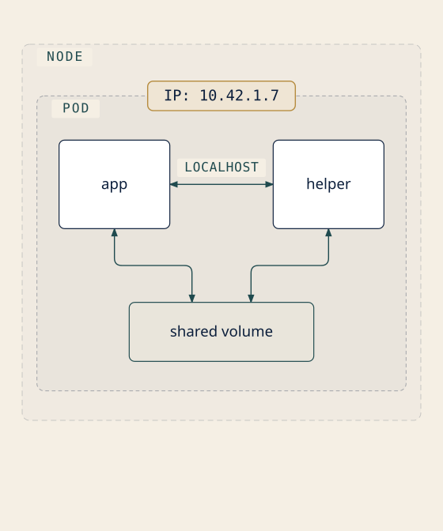
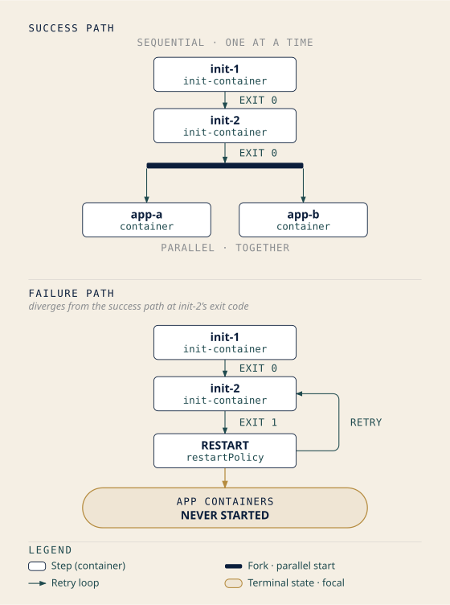

# Chapter 5: The Smallest Vessel
## *"A Pod is not a container, and that distinction is worth points"*

**Exam domain: Kubernetes Fundamentals (44% of the exam) — competency: Kubernetes Core Concepts** [source: cncf-kcna-certification-page-2026-08-23] [source: cncf-kcna-curriculum-pdf-2026-08-23] **| Estimated share of the exam: ~7% (authored allocation — CNCF publishes domain weights, not competency weights** [source: cncf-kcna-curriculum-pdf-2026-08-23]**; see front matter) | Complexity: Mixed | Novelty: Moderate**

---

## Attention Budget

**Total time: ~92 minutes | Recommended: Split across 2 sessions**

| Section | Time | Attention Cost | Best Time to Study |
|---|---|---|---|
| §1 The Pod as the Unit of Scheduling | 10 min | Medium | When alert |
| §2 More Than One Container Aboard | 5 min | Low | Anytime |
| §3 Everything That Must Happen First | 8 min | Medium | When alert |
| ☆ Taking Your Bearings #1 | 6 min | Medium | After a brief pause |
| §4 Scheduled Once, Replaced Never | 5 min | Low | Anytime |
| §5 Pod Phases and Container States | 15 min | **High** | Peak attention |
| §6 A Pod's Identity | 4 min | Low | Anytime |
| §7 Three Probes, Three Jobs | 12 min | Medium-high | When alert |
| §8 What a Pod Is Owed | 12 min | **High** | Peak attention |
| ☆ Taking Your Bearings #2 | 11 min | Medium | After a short break |
| §9 The Smallest Deployable Unit | 4 min | Low | Anytime |

**Attention Cost Key:**
- **Low:** Concrete, familiar concepts — study anytime
- **Medium:** New concepts requiring focus — study when alert
- **High:** Abstract or dense material — study at peak attention

**Recommended split point:** after §5. Sections 1–5 are *what a Pod is and what happens to it*; sections 6–8 are *what the kubelet does for it*. That is the natural seam.

*If you only have 15 minutes: read §5, then answer the first three items of ☆ Taking Your Bearings #2 — they are the §5 items. Phase-versus-state is the highest-leverage distinction in this chapter, and Chapter 13's entire troubleshooting method is built on top of it.*

---

> *"The smallest thing you can name is the smallest thing you can command."*
> — Lodestar Ledgers

---

## 🧭 Soundings

Before reading this chapter, try these questions. Your score determines how to approach the content. No shame in any score; it just points you at a different reading strategy. Six of these test what you already know from outside Kubernetes; two retrieve material from earlier chapters.

1. Two processes need to talk to each other over the network. What does each one minimally need in order to be reachable, and what changes if they happen to be running on the same machine?

2. Two programs must read and write files in the same directory. Outside Kubernetes, how do you arrange that?

3. A service must not begin accepting traffic until a database migration has finished. Using tools you've worked with before — entrypoint scripts, systemd unit ordering, CI job dependencies — how would you enforce that ordering?

4. "The process is running" and "the process can do its job" are not the same claim. Describe a concrete situation where the first is true and the second is false.

5. A load balancer health-checks its backends. One backend stops answering the health check. What does the load balancer do? And, just as importantly, what does it *not* do?

6. In any system you've capacity-planned — a JVM heap, a cgroup, a cloud instance type, a database connection pool — what is the difference between *reserving* capacity and *capping* it?

7. **[retrieval: ch4]** A Kubernetes object has two nested fields that govern its configuration. One you write; one the system maintains. Name both, and say which one reports what is actually true right now.

8. **[retrieval: ch2]** A container will not start because its image could not be pulled. Chapter 2 gave this failure a name. What is that name, and what did Chapter 2 say it would eventually be reported *as*?

<details>
<summary>Click for answers + reading strategy</summary>

1. **An address and a port.** Reachability requires something to send packets *to*. On the same machine, they can skip the network entirely and use `localhost` (the loopback interface), because they share one network stack.

2. **A shared filesystem path:** a bind mount, a shared volume, a directory both have permission to open. Both processes must be able to see the same underlying storage.

3. **Any ordering primitive that blocks the second thing until the first succeeds:** an entrypoint script that runs the migration then execs the server; a systemd `After=` plus `Type=oneshot`; a CI job that depends on a prior stage. The common shape: something must *finish* before something else *starts*.

4. **Many valid answers.** A JVM that's alive but stuck in a full GC pause. A web server that's accepting connections but whose database connection pool is exhausted. A process that started but hasn't finished loading a 4 GB model into memory. The pattern: the process exists; it can't serve.

5. **It stops sending new traffic to that backend. It does not kill the backend.** A load balancer removes an unhealthy member from its rotation; it has no authority to restart the process behind it. Those are two different jobs performed by two different systems.

6. **A reservation guarantees you a floor; a cap defines a ceiling.** A reservation is a claim on capacity made in advance so the planner accounts for you. A cap is enforcement at runtime that stops you exceeding an amount. Systems can have one, both, or neither.

7. **`spec` and `status`.** You write `spec`, the desired state. The system supplies and updates `status`: the current state, what is actually true [source: k8s-docs-objects-2026-08-23]. If you missed this, re-read Chapter 4 §2 before you reach §5 of this chapter.

8. **`ImagePullBackOff`** — and Chapter 2 said it is reported as a container in the **Waiting** state. If you missed this, re-read Chapter 2 §6 before §5.

**If you got 6+ right:** Skim this chapter. Focus on the ★ Fixed Points and the ⚠ Navigational Hazards blocks, then go straight to the ☆ Taking Your Bearings checkpoints. Your instincts about isolation, ordering, and health checks are correct. What this chapter gives you is Kubernetes' specific vocabulary for them, plus the two or three places where Kubernetes' answer is not the one you'd guess.

**If you got 3–5 right:** Read at normal pace. The material is well within reach; this chapter is calibrated for you.

**If you got 0–2 right:** Read carefully, and take the sections in order — several of them depend on the one before. **If questions 7 and 8 were among your misses specifically, go back and re-read Chapter 4 §2 and Chapter 2 §6 before you start §5.** Those two are the published promises this chapter collects, and §5 will read as arbitrary vocabulary without them.

</details>

---

## Why This Chapter Matters

You already know this word. You've seen it since Chapter 2, where it arrived with an IOU attached: *containers are not the unit Kubernetes schedules — something wraps them, and we'll name it in Chapter 5*. In the meantime, most readers form the obvious assumption. **Pod is Kubernetes' word for container.**

It isn't, and the way it isn't matters more than a vocabulary quibble. That assumption is wrong about IP addresses. It's wrong about what a Service selects. It's wrong about what `restartPolicy` applies to. It's wrong about what a phase describes, and it's wrong about what gets replaced when something fails. Each of those is a place where the wrong mental model produces a confidently wrong answer: on the exam, and in a terminal at two in the morning with a pager still buzzing. By the end of this chapter you'll have a list of seven things that would each be wrong under the container-equals-Pod assumption, and you'll see that they all come from one design decision.

Here is the shift this chapter delivers. Chapters 3 and 4 gave you a system to look at and something to write. Chapter 5 gives you the first thing you will ever **read under pressure**. Nobody looks up Pod phases when everything is fine. You look at them at the moment something has stopped working, and the reason experienced practitioners are fast in that moment isn't that they've memorized more commands. It's that they know which of two vocabularies they're looking at, and what each one can and cannot tell them. That's the difference between someone who can describe infrastructure and someone who can read what infrastructure is telling them.

This chapter's material is also the most retrieved in the book. Requests and limits come back in scheduling, in troubleshooting, in autoscaling, and in metrics: four separate chapters, each assuming you already have the model. Phase-versus-container-state *is* Chapter 13's diagnostic method. The shared network namespace is the entire premise of Chapter 9's argument for why Services have to exist. A reader who leaves here able to recite five phase names but unable to say why the Pod has an IP and the container does not will re-learn this chapter four more times, each time under worse conditions. That's not a threat; it's just how the book is built.

> **Dead Reckoning:** A Pod is a Kubernetes object that represents a set of one or more running containers on your cluster [source: k8s-docs-workloads-2026-08-23]. It is the unit Kubernetes schedules: you hand Kubernetes a Pod, not a container [source: k8s-docs-kube-scheduler-2026-08-23]. The containers inside it are co-located and co-scheduled on the same node [source: k8s-docs-containers-2026-08-23]. They share a network namespace [source: k8s-docs-network-model-2026-08-23]. They can share storage [source: k8s-docs-volumes-2026-08-23]. Every other fact in this chapter follows from that.

## What You'll Learn

By the end of this chapter, you'll be able to:

- **Explain** why Kubernetes schedules Pods rather than containers, and name the two things every container in a Pod shares.
- **Distinguish** a Pod's phase from a container's state, and say which one a crash-looping application is reported under.
- **Predict** what happens when each of the three probes fails, and identify which one silently removes a Pod from service without restarting anything.
- **Choose** between a request and a limit for a given requirement, and say which component acts on each.
- **Trace** a Pod from creation through failure to replacement, and explain why "rescheduled" is the wrong word for what happens.
- **Identify** what a Pod is to the API server when it has been given no identity at all (it has one anyway).

*You'll also stop saying "container" when you mean "Pod," which is a smaller change than it sounds and closes off a whole family of mistakes people make on this exam.*

---

## ⚪ §1 — The Pod as the Unit of Scheduling

Chapter 2 left you with a promise: containers are not the unit Kubernetes schedules; something wraps them *[cross-bearing: see Ch 2 §1 — containers are not the schedulable unit]*. Here is the wrapper.

**A Pod represents a set of one or more running containers on your cluster** [source: k8s-docs-workloads-2026-08-23] — the documentation's own superlative is that Pods are *the smallest deployable units of computing that you can create and manage in Kubernetes* [source: k8s-docs-pods-2026-08-24]. It is the thing you hand Kubernetes when you want something run: the scheduler watches for newly created **Pods** with no assigned node and finds a node for each one [source: k8s-docs-kube-scheduler-2026-08-23]. You do not hand Kubernetes a container and ask for it to be placed. Chapter 2 already gave you the phrase that follows from this: containers in a Pod are **co-located and co-scheduled** to run on the same node [source: k8s-docs-containers-2026-08-23]. Every node in a cluster runs the containers that form the Pods assigned to that node. The assignment happens at Pod granularity, and the containers come along.

That costs something. Everything in a Pod lands on one machine, scales as one thing, and dies as one thing. So the interesting question isn't *what* a Pod is. It's *why the wrapper exists at all*.

### What every container in a Pod shares

Here is the answer, and it's worth reading slowly, because it's the load-bearing fact of the whole chapter.

**Each Pod gets its own unique cluster-wide IP address. A Pod has a private network namespace which is shared by all of the containers within it. Processes running in different containers in the same Pod can communicate with each other over `localhost`** [source: k8s-docs-network-model-2026-08-23]. The address itself — where it comes from, and the rules the cluster network must obey to make it reachable — is Chapter 9's *[cross-bearing: see Ch 9 §1 — the Pod IP and the network model]*.

Read that as an explanation rather than a feature list. Suppose you want two containers to behave the way two processes on one host behave: able to reach each other instantly, without service discovery, without a network hop, without either one needing to know the other's address. There is exactly one way to give them that. Put them in the same network namespace. And a network namespace is not something you can hand out per-container-but-shared and still call the container an independent schedulable thing. The moment two containers share a network namespace, they have to be placed together, started together, and torn down together. They have become one unit.

So the Pod is not a container with extra fields. **The Pod is the shared context, and the containers live inside it.** One hull, one address, one berth on the node. Whatever you stow inside travels together or not at all.

<!-- FIGURE: ch05-fig01-pod-shared-network-namespace -->


<!-- ASCII-FALLBACK
```
┌─ Node ──────────────────────────────────────────────────┐
│                                                          │
│   ┌─ Pod ─────────────────────────────────────────┐      │
│   │  IP: 10.42.1.7   ← one address, on the Pod    │      │
│   │                                                │      │
│   │   ┌─ container: app ─┐   ┌─ container: helper┐ │      │
│   │   │                  │◄─►│                   │ │      │
│   │   │                  │   │                   │ │      │
│   │   └────────┬─────────┘   └────────┬──────────┘ │      │
│   │            │   via localhost      │            │      │
│   │            └───────┬──────────────┘            │      │
│   │                    │                            │      │
│   │            ┌───────▼────────┐                   │      │
│   │            │ shared volume  │                   │      │
│   │            └────────────────┘                   │      │
│   └────────────────────────────────────────────────┘      │
│                                                            │
└────────────────────────────────────────────────────────────┘
```
-->

Note where the IP address is attached in that figure. It is bound to the Pod boundary, not to either container. That placement is the pedagogy, not decoration.

The second half of the shared context is **storage**. Containers in a Pod can share volumes, which is how two processes in one Pod read and write the same files. The documentation names this as one of the two problems volumes exist to solve, and says plainly that all containers in a Pod can read and write the same files in a shared `emptyDir` volume [source: k8s-docs-volumes-2026-08-23]. We name it here and leave it: the volume *types*, and what makes a volume outlive the Pod, are Chapter 11's material *[cross-bearing: see Ch 11 §1 — volume types and lifetimes]*.

### The PodSpec, finally

Chapter 3 described the kubelet's job in a sentence that contained an unexplained noun: the kubelet "takes a set of PodSpecs that are provided through various mechanisms and ensures that the containers described in those PodSpecs are running and healthy" [source: k8s-docs-cluster-architecture-2026-08-23]. You were told PodSpecs would get their proper treatment here *[cross-bearing: see Ch 3 §3 — the kubelet and what it ensures]*.

There's less to it than the name suggests, because Chapter 4 already taught it. A Pod is an object like any other: `apiVersion`, `kind`, `metadata`, `spec`, plus a `status` the system maintains [source: k8s-docs-objects-2026-08-23]. Read "PodSpec" as **the `spec` field of a Pod** — the API reference types that field as a `PodSpec`, "a description of a pod," and calls it the "specification of the desired behavior of the pod" [source: k8s-api-ref-pod-v1-2026-09-04]. It's what you write; it lists the containers, their images, and everything else in this chapter. That's the whole connection, and it's worth exactly one sentence. You don't need it developed; you need it *joined up*.

The second half of Chapter 3's sentence — "running **and healthy**" — is a bigger promise, and §7 pays it.

> ★ **Fixed Point:** The **Pod**, not the container, is the unit of scheduling. A Pod gets one IP address, shared by every container inside it, and those containers reach each other over `localhost`.

> 🪝 **Snag:** Each container in a Pod does **not** get its own IP address. The Pod gets one; all its containers share it. This is the easiest carry-over error to make from single-container Docker experience, where "one container, one IP" was a safe assumption. In Kubernetes it is not.

That one fact is the premise of Chapter 9. When you get to Services, the entire argument for why they must exist rests on the Pod having an IP that changes when the Pod is replaced *[cross-bearing: see Ch 9 §2 — why a Service is necessary]*.

---

## 🔵 §2 — More Than One Container Aboard

A Pod can hold more than one container. The question is when it should. Not everything that travels together belongs in the same hold.

Pods are used in two main ways [source: k8s-docs-pods-2026-08-24]. Overwhelmingly the most common is **one container per Pod**: the Pod is a thin wrapper around a single container, and that is what you should reach for by default. The other is **multiple tightly-coupled containers** that need to share resources, meaning a main application container plus one or more helpers that supplement or consume it.

The decision rule is short, and it falls straight out of §1. There are exactly two mechanisms that make containers in one Pod tightly coupled:

1. **They reach each other over `localhost`**, because they share the Pod's network namespace [source: k8s-docs-network-model-2026-08-23].
2. **They read and write the same files**, because they share a volume [source: k8s-docs-volumes-2026-08-23].

> ⚓ **Worth Securing:** If two containers don't need `localhost` or a shared volume, they don't need to be one Pod. That's the whole test. Everything else — "they belong to the same team," "they're part of the same product," "it's simpler to deploy" — is not a coupling requirement, it's a naming convention.

The helper container in a multi-container Pod has a name you'll meet constantly: the **sidecar**. A log-shipping agent that reads files the app writes to a shared volume; the documented cluster-logging pattern is exactly this, "a sidecar container with a logging agent configured to pick up logs from an application container" [source: k8s-docs-logging-architecture-2026-08-23]. A proxy that intercepts the app's network traffic on `localhost`, which is what a service mesh does when it "deploys an Envoy proxy alongside each pod" [source: istio-service-mesh-2026-08-23]. A credential-refreshing helper that rewrites a token file the app reads. In every case the sidecar exists to do something *for* the main container, using one of exactly those two coupling mechanisms.

You'll meet the sidecar again in Chapter 17, where a service mesh deploys a proxy alongside each Pod as its data plane *[cross-bearing: see Ch 17 §5 — the mesh data plane]*. That's Chapter 17's material; here, the word is enough.

Under the hood, modern Kubernetes implements sidecars as a special case of init container — one with `restartPolicy: Always`, which keeps running after Pod startup instead of exiting; the mechanism is on by default since v1.29 [source: k8s-docs-sidecar-containers-2026-08-24]. That sentence will make full sense a section from now; file it for §3.

> 🪝 **Snag:** A Pod is not a small virtual machine. The instinct to put a web server, a database, and a cache into one Pod because "they're one application" is exactly what §1's co-scheduling guarantee makes *possible* — and exactly what makes it a mistake. Everything in a Pod scales together, fails together, and is replaced together, whether or not that's what you wanted. Three components with three different scaling profiles want three Pods.

One practical consequence worth banking: once a Pod holds more than one container, several commands stop being unambiguous. Asking for "the logs" of a two-container Pod is an incomplete request. `kubectl logs <pod>` prints a container's logs, and for a multi-container Pod you have to add `-c <container>` [source: k8s-docs-logging-architecture-2026-08-23]. That's Chapter 13's problem to solve, not this section's *[cross-bearing: see Ch 13 §3 — reading logs from a multi-container Pod]*.

---

## 🔵 §3 — Everything That Must Happen First

Soundings question 3 asked how you'd stop a service from accepting traffic until a migration had finished. Whatever you answered — entrypoint script, systemd ordering, CI stage dependency — you reached for the same shape: *something must finish before something else starts*. Kubernetes has a first-class object for that shape, and it's called an **init container**.

The mechanics are simple. The semantics are what get tested.

**Init containers run before the app containers, in the order they are declared, and each must run to completion successfully before the next one starts** [source: k8s-docs-init-containers-2026-08-24]**.** Only when all of them have succeeded does the kubelet start the Pod's app containers.

<!-- FIGURE: ch05-fig03-init-containers-sequence -->


<!-- ASCII-FALLBACK
```
SUCCESS PATH
  time ──────────────────────────────────────────────────────►

  [ init-1 ]──exit 0──►[ init-2 ]──exit 0──►┌─[ app-a ]────────►
                                             └─[ app-b ]────────►
   (sequential, one at a time)                (parallel, together)

FAILURE PATH
  time ──────────────────────────────────────────────────────►

  [ init-1 ]──exit 0──►[ init-2 ]──exit 1──►(restart per
                                              restartPolicy)
                            │
                            └──► app containers: NEVER STARTED
```
-->

Two things in that figure carry the whole section. The init containers are strictly **sequential**: one at a time, each waiting for the previous one's successful exit. The app containers are **parallel**: they all start together once the init sequence completes. That contrast is the fact. One at a time down the gangway, then everyone aboard at once.

### When an init container fails

This is the part the exam cares about. If an init container fails, the kubelet restarts it, repeatedly, until it succeeds — unless the Pod's `restartPolicy` says otherwise [source: k8s-docs-init-containers-2026-08-24]. Which means:

- With the default policy, a Pod with a broken init container sits there retrying, and **never progresses to its app containers**.
- With a `restartPolicy` of `Never`, Kubernetes treats the whole Pod as failed [source: k8s-docs-init-containers-2026-08-24].

Those two observable outcomes are what matter here. That sentence also leans on a field this chapter hasn't defined yet, and it does so deliberately. `restartPolicy` is §5's material, and stating the dependency plainly beats pretending the sections are independent *[cross-bearing: see Ch 5 §5 — restartPolicy and the restart backoff]*. When you get there, come back and the failure behavior will click into place.

### The one axis that generates the rest

Init containers differ from app containers on a single axis, and everything else follows from it: **init containers are expected to exit; app containers are expected to keep running.**

That's why they run in sequence. A thing that exits can be waited on. It's why "success" means exit status 0. And it's why classic init containers don't carry the probes §7 is about: probes answer questions about a long-running process, and an init container is not one.

> ★ **Fixed Point:** Init containers run **in the order declared**, **to successful completion**, **all of them**, **before any app container starts**. If one fails, the Pod does not proceed.

> 🪢 **Mnemonic:** *In order, to completion, all of them, then the app.* Four beats, one line. Say it once and you have the section.

Working out *why* an init container keeps failing falls under **Debugging**, one of the thirteen named KCNA competencies [source: cncf-kcna-curriculum-pdf-2026-08-23], and the method is Chapter 16's *[cross-bearing: see Ch 16 §2 — debugging init containers]*. What you need here is the model of what *should* happen, so you can recognize when it hasn't.

---

## ☆ Taking Your Bearings #1: What a Pod Is

Five questions covering §1–§3.

1. Two containers are running in the same Pod. How many IP addresses are involved, and how do the two containers reach each other?

2. Someone proposes putting a web server and its database in a single Pod, on the grounds that they are "one application." Give the strongest argument against, in one sentence.

3. An init container exits with status 1. What does the Pod do next, and what has *not* happened yet?

4. A Pod declares three init containers. Under what circumstances does the third one run?

5. 🔵 **[retrieval: ch3]** Chapter 3 said the kubelet ensures that the containers described in PodSpecs are running and healthy. Now that you know what a Pod is: what object is the kubelet reading, and what is it comparing that object against?

---

**Answers with Explanations:**

**1. One IP address, attached to the Pod. The two containers reach each other over `localhost`.**

Every container in a Pod shares the Pod's network namespace, and the Pod gets a single unique cluster-wide IP [source: k8s-docs-network-model-2026-08-23].

*Why the wrong answers are wrong:*
- **"Two IPs, one per container"** is the misconception this chapter exists partly to correct. It comes from single-container Docker, where each container did get its own address, and it survives because nothing in the word "Pod" contradicts it. It will cost you points here and it will make Chapter 9 incomprehensible: the entire reason Services exist is that *the Pod* has an address that changes. If you thought two, stop and re-read §1 before continuing.
- **"They reach each other through a Service"** describes how containers in *different* Pods communicate. Containers in the same Pod need no such thing; a Service in front of your own sidecar is a network hop that buys nothing.

**2. They share fate.** They scale together, fail together, and are replaced together, and a web server and a database almost never want any of those three to be true at once. You cannot scale the web tier to five replicas without also running five databases.

A weaker but still correct answer: they don't need either coupling mechanism. A web server talks to its database over a network address; it doesn't need `localhost` or a shared volume. By §2's rule, that alone settles it.

*Why two tempting answers are wrong:*
- **"They'd collide on ports."** Sometimes true: they share one network namespace, so two processes both wanting port 8080 do conflict. But it's incidental, not structural. Renumber the ports and the objection evaporates while the real problem (shared fate) is untouched. An objection you can configure your way out of is not the strongest one available.
- **"A Pod should only run one process."** This is Docker-era doctrine, and §2 explicitly does not endorse it. Multi-container Pods are a supported, useful pattern. The test isn't *how many* processes; it's whether `localhost` or a shared volume is genuinely *needed*.

**3. The kubelet restarts the init container, subject to the Pod's `restartPolicy`. The app containers have not started, and won't, until every init container has succeeded.**

The second half is the part people drop. A failing init container isn't a partial start; it's a full stop. Nothing downstream has begun.

**4. Only after the first two have each run to completion successfully.**

*Why the wrong answers are wrong:*
- **"They run in parallel"** confuses init containers with app containers. App containers start together; init containers strictly do not.
- **"In any order"** is the one that feels defensible if you think of them as a set of prerequisites rather than a sequence. They are declared as an ordered list and executed as one. Declaration order *is* execution order.

**5. The kubelet is reading the Pod's `spec` — the PodSpec — and comparing it against the actual state of the containers on its node.** [source: k8s-docs-cluster-architecture-2026-08-23] [source: k8s-docs-objects-2026-08-23]

This is Chapter 3's control-loop pattern operating at Pod scope: read the declared desired state, observe reality, act to close the gap *[cross-bearing: see Ch 3 §6 — controllers and control loops]*. Chapter 3's sentence about the kubelet was, all along, a description of a reconciliation loop with a PodSpec as its input.

*Why two likely answers are wrong:*
- **"It reads the Deployment."** Nothing you've read so far rules this out, which is exactly why it needs ruling out now. The kubelet's input is the Pod. A Deployment is a workload resource that *causes Pods to exist*, and Chapter 6 will show you where it sits. The kubelet never sees it.
- **"It compares the spec against etcd."** The kubelet never talks to etcd. Kubernetes has a "hub-and-spoke" API pattern: all API usage from nodes terminates at the API server, and none of the other control plane components are designed to expose remote services [source: k8s-docs-control-plane-node-communication-2026-08-24]. Access to etcd is equivalent to root permission in the cluster, so ideally only the API server has it [source: k8s-docs-etcd-access-control-2026-08-24]. The kubelet compares the spec against *the containers actually running on its own node*.

---

**How'd you do?**

- **5/5, or 4 with a clean miss on item 5.** You own §1–§3. Continue; §4 is short and §5 is where the chapter earns its attention budget.
- **3–4 correct.** Solid. Review the items you missed, then continue. If item 1 was one of them, re-read §1's "What every container in a Pod shares" first. That one fact is load-bearing for §5, §7, §8, and all of Chapter 9.
- **0–2 correct.** Don't push on to §5 yet. Go back to §1's "What every container in a Pod shares" subsection and §3's failure behavior, about fifteen minutes of re-reading, then take this checkpoint again. §5 is the densest section in the chapter and it assumes all of this.

---

**Checkpoint: You've Now Mastered**

✓ Why the Pod, not the container, is the schedulable unit
✓ What every container in a Pod shares — and why that sharing forces co-scheduling
✓ The two-mechanism test for whether containers belong in one Pod
✓ Init container ordering, completion semantics, and failure behavior
☐ What happens to a Pod over its lifetime (next)
☐ How to read what a Pod is telling you (§5 — the chapter's centerpiece)

---

## ⚪ §4 — Scheduled Once, Replaced Never

Chapter 4 closed by telling you what was coming: a Pod's `status` has a phase, and a Pod is never rescheduled but *replaced*, with a different UID. *"Chapter 5 introduces the disposable thing"* *[cross-bearing: see Ch 4 — The Voyage Ahead, which pointed here]*. Here it is.

The lifetime, in order:

- A Pod is **created** and assigned a unique **UID** [source: k8s-docs-pod-lifecycle-2026-08-23].
- It is **scheduled once in its lifetime** to a specific node, where it remains until termination or deletion [source: k8s-docs-pod-lifecycle-2026-08-23].
- It is **never "rescheduled" to a different node**. Instead, it is replaced by a new, near-identical Pod **with a different UID** [source: k8s-docs-pod-lifecycle-2026-08-23].
- If the node dies, the Pods running on it are **marked for deletion after a timeout** [source: k8s-docs-pod-lifecycle-2026-08-23].
- Pods **do not survive** evictions due to lack of resources or node maintenance [source: k8s-docs-pod-lifecycle-2026-08-23]. What an eviction looks like from the outside, and how to tell one from a crash, is Chapter 13's *[cross-bearing: see Ch 13 §4 — Evicted and node-pressure eviction]*.

The documentation's own summary is that Pods are "relatively ephemeral (rather than durable) entities" [source: k8s-docs-pod-lifecycle-2026-08-23]. That's the word to hold onto.

> 🪝 **Snag:** A Pod on a failed node is **not rescheduled onto a healthy node.** It is deleted, and something creates a new one. The word "rescheduled" implies the same object moving, which will lead you to the wrong answer on questions about UIDs, about identity, and about why StatefulSets are different *[cross-bearing: see Ch 6 §6 — StatefulSets]*. Kubernetes does not move Pods. It replaces them.

> ⚓ **Worth Securing:** The replacement Pod can have the same *name* and still be a different object. Chapter 4 taught that a UID is "intended to distinguish between historical occurrences of similar entities" [source: k8s-docs-names-and-uids-2026-08-24] — this is precisely that case. Same name, different UID, different object, and the cluster knows the difference even when the human reading `kubectl get pods` doesn't.

### Why this forces something else to exist

Here's the consequence, and it's the reason this short section exists at all.

If the thing that runs your application is designed to be **replaced rather than repaired**, then something else has to be holding the intent that survives the replacement. The Pod cannot recreate itself; it's gone. Something outside it has to know that three replicas were wanted, notice that only two exist, and create a third.

That something is a **workload resource**. Kubernetes provides several built-in ones, and their job is to manage a set of Pods on your behalf, making sure the right number of the right kind of Pod are running to match the state you specified [source: k8s-docs-workloads-2026-08-23]. Higher-level controllers create the replacement Pods [source: k8s-docs-pod-lifecycle-2026-08-23].

That's Chapter 6, and Chapter 4 already pointed you at it *[cross-bearing: see Ch 6 §1 — the resource that holds the surviving intent]*.

### The same instinct, one level up

You've met this idea before. Chapter 2 taught that containers are intended to be immutable: you don't change the code of a running container, you build a new image with the change and recreate the container from it [source: k8s-docs-containers-2026-08-23].

A Pod is that instinct one level up. You don't repair a failed Pod; you get a new one. Replace, don't repair: at the image layer and at the Pod layer both. A hull that cannot be patched underway has to be a hull you are willing to lose, and the whole design follows from accepting that. Noticing that it's the *same* conviction expressed twice is worth more than memorizing either instance.

That replacement story has a mechanical half, and it is exam-relevant: Pods terminate *gracefully*, not instantly. Because Pods represent processes, the design aim is that they get a chance to shut down cleanly rather than being violently killed with no chance to clean up [source: k8s-docs-pod-termination-2026-08-24]. When you delete a Pod, the kubelet runs any `preStop` hook a container defines, then asks the runtime to stop each container with a TERM signal. A countdown runs alongside: `terminationGracePeriodSeconds`, **30 seconds by default**. If containers are still running when it expires, they get KILL, and only then is the object removed from the API [source: k8s-docs-pod-termination-2026-08-24]. A workload that exits promptly on TERM is what makes replace-don't-repair cheap in practice — Chapter 15 will hand you the methodology's word for it, *disposability* *[cross-bearing: see Ch 15 §1 — the twelve factors]*.

---

## 🔵 §5 — Pod Phases and Container States

This is the densest section in the chapter and the one the rest of the book leans on hardest. It is also where Chapter 2's second promise comes due.

There are **two** vocabularies here, at **two** different scopes. Two instruments, two scales; read one as though it were the other and you will be confidently lost. Almost every mistake people make with Pod status comes from exactly that. So take them one at a time, then look at the relationship.

### Leg one: the Pod's phase

Chapter 4 told you a Pod's `status` carries a `phase`. Here it is, with five possible values [source: k8s-docs-pod-lifecycle-2026-08-23]:

- **Pending** — the Pod has been accepted by the cluster, but one or more of its containers has not been set up and made ready to run. This *includes* time spent waiting to be scheduled **and** time spent downloading container images over the network.
- **Running** — the Pod has been bound to a node, and all of the containers have been created. At least one container is still running, **or is in the process of starting or restarting**.
- **Succeeded** — all containers in the Pod have terminated in success, and will not be restarted.
- **Failed** — all containers have terminated, and at least one terminated in failure: it either exited with non-zero status or was terminated by the system, and is not set for automatic restarting.
- **Unknown** — for some reason the state of the Pod could not be obtained. This typically occurs due to an error communicating with the node where the Pod should be running.

Read the definitions of `Pending` and `Running` again. Both of them are broader than their names suggest, and both of those breadths are tested.

### Leg two: the container's state

Now the second vocabulary. Each **container** in a Pod is in one of three states [source: k8s-docs-pod-lifecycle-2026-08-23]:

- **Waiting** — the container is still running the operations it requires in order to complete start up: pulling the container image, applying Secret data. A **`Reason`** field summarizes *why* it's waiting.
- **Running** — the container is executing without issues. A `startedAt` timestamp is recorded.
- **Terminated** — the container began execution and then either ran to completion or failed. A reason, an exit code, and start and finish times are recorded.

Notice how much more each container state tells you than a phase does. A phase is one word. A container state comes with a `Reason`, or an exit code, or a timestamp: the specifics of *what*, not just *which*.

> **Dead Reckoning:** A Pod has exactly one **phase**, which is one of: Pending, Running, Succeeded, Failed, Unknown. Each container in that Pod separately has a **state**, which is one of: Waiting, Running, Terminated. Phase is a Pod-level field in `status`; state is per-container [source: k8s-docs-pod-lifecycle-2026-08-23] [source: k8s-docs-objects-2026-08-23]. A Pod with three containers has one phase and three states. These are different fields with different vocabularies at different scopes. They are not interchangeable.

<!-- FIGURE: ch05-fig02-pod-phases-and-container-states -->


<!-- ASCII-FALLBACK
```
┌─ POD ──────────────────────────────────────────────────────┐
│  status.phase:  Pending → Running → Succeeded              │
│                                   └→ Failed                │
│                  (any) → Unknown                            │
│                                                             │
│   ┌─ container: app ────────────────────────────────────┐   │
│   │  state:  Waiting → Running → Terminated             │   │
│   │          (+Reason)  (+startedAt)  (+exitCode)        │   │
│   └─────────────────────────────────────────────────────┘   │
│                                                             │
│   ┌─ container: helper ─────────────────────────────────┐   │
│   │  state:  Waiting → Running → Terminated             │   │
│   └─────────────────────────────────────────────────────┘   │
└─────────────────────────────────────────────────────────────┘

WORKED OVERLAY — both readings are legitimate:

┌─ POD  phase: Running ──────────────────────────────────────┐
│   ┌─ app     state: Running                             ┐  │
│   └─────────────────────────────────────────────────────┘  │
│   ┌─ helper  state: Waiting   Reason: CrashLoopBackOff   ┐  │
│   └─────────────────────────────────────────────────────┘  │
└─────────────────────────────────────────────────────────────┘
```
-->

The nesting in that figure is the point. Container states are drawn *inside* the Pod because that is the actual relationship: one contains the other. If you find yourself picturing them side by side, as two alternative ways of saying the same thing, the figure has failed and so has the model.

### Leg three: the distinction, and the two traps that live in it

A Pod can report `Running` while one of its containers sits in `Waiting`, provided that container has already been created and is between runs. That is not a contradiction and it is not a bug. It's two true statements at two scopes.

And it generates the costliest trap in the chapter:

> ⚠ **Navigational Hazards**
>
> Three of the easiest facts to get wrong about Pod status share a single root cause: **reading a Pod-scoped signal as though it were container-scoped.** Fix the root cause and you fix all three.
>
> **1. Phase is not state.** "The Pod is Waiting" is not a sentence Kubernetes can produce — `Waiting` is not a phase. "The container is Pending" is equally impossible — `Pending` is not a container state. If you find yourself unsure which vocabulary a word belongs to, you're reading at the wrong scope.
>
> **2. `Running` does not mean working.** Read the definition again: a Pod is `Running` when it's bound to a node, all containers have been created, and at least one container is running **or is in the process of starting or restarting** [source: k8s-docs-pod-lifecycle-2026-08-23]. A container that starts, crashes every fifteen seconds, and restarts is, at any given moment, in one of those states. **A crash-looping Pod reports the phase `Running`.** This is the costliest misreading in the chapter, and Chapter 13's entire diagnostic method depends on you not making it.
>
> **3. `restartPolicy` is not per-container.** It is a Pod-level field and it applies to every container in the Pod. (More on this in a moment.)

If the exam gives you a Pod whose phase is `Running` and asks whether the application is healthy, the answer is: **the phase cannot tell you that.** Phase tells you where the Pod is in its lifecycle. It does not tell you whether anything inside it is doing useful work. §7's probes exist precisely because phase can't answer that question.

### `restartPolicy`, and what turns Terminated back into Running

A container that reaches `Terminated` doesn't necessarily stay there. What decides is `restartPolicy`.

**The `spec` of a Pod has a `restartPolicy` field with possible values `Always` (the default), `OnFailure`, and `Never`. The `restartPolicy` applies to all containers in the Pod** [source: k8s-docs-pod-lifecycle-2026-08-23]. It is set once, on the Pod, which is trap #3 above stated as a fact rather than a warning. The one container-level `restartPolicy` the documentation describes is the sidecar case from §2: an entry in `initContainers` may carry its own `restartPolicy: Always`, and that is precisely what turns a one-shot init step into a sidecar that runs for the life of the Pod [source: k8s-docs-sidecar-containers-2026-08-24]. App containers are governed by the Pod-level value, full stop [source: k8s-docs-pod-lifecycle-2026-08-23].

When a container does exit and the policy calls for a restart, the kubelet doesn't retry immediately and forever. **After containers in a Pod exit, the kubelet restarts them with an exponential backoff delay — 10s, 20s, 40s, and so on — capped at five minutes. Once a container has executed for 10 minutes without any problems, the kubelet resets the restart backoff timer for that container** [source: k8s-docs-pod-lifecycle-2026-08-23].

### The worked example Chapter 2 promised

Chapter 2 named a failure and deferred it here: `ImagePullBackOff` *[cross-bearing: see Ch 2 §6 — ImagePullBackOff and where its state is defined]*. It's the cleanest possible demonstration of the phase/state split.

When a kubelet starts creating containers for a Pod, a container may be in the **Waiting** state because of `ImagePullBackOff`. That status means a container could not start because Kubernetes could not pull a container image, an invalid image name or a private registry with no `imagePullSecret` being the usual causes. The `BackOff` part indicates that Kubernetes will keep trying, with an increasing back-off delay, up to a compiled-in limit of 300 seconds (five minutes) [source: k8s-docs-images-2026-08-23]. That is a separate backoff from the container-restart backoff above — this one governs image pulls, not restarts.

Line that up against both vocabularies:

| Signal | Value | Scope |
|---|---|---|
| Pod phase | `Pending` — accepted, but a container isn't set up and running yet | Pod |
| Container state | `Waiting` — still doing what it needs in order to start | Container |
| Container state `Reason` | `ImagePullBackOff` — *this specific* reason it can't start | Container |

The phase tells you the Pod hasn't gotten going. The state tells you which container. The `Reason` tells you why. Three fields, three levels of specificity, and only the third one is actionable.

Note carefully that the phase here is `Pending`, not `Running`. `Running` requires that **all** the containers have been created; a container that cannot pull its image has not been created. The *post-creation* counterpart has a name too. A container that has been created, has crashed, and is sitting out the restart backoff between attempts is reported as **`CrashLoopBackOff`** — the state in which "the backoff delay mechanism is currently in effect for a container in a crash loop" [source: k8s-docs-container-restart-backoff-2026-08-31]. That container *has* been created, so a Pod holding it can report `Running` while it waits; an image that never pulled cannot say the same. One caution from the documentation itself: `CrashLoopBackOff` is the word `kubectl` prints in its `Status` column, "a kubectl display field for user intuition," and it is not the Pod's `phase` [source: k8s-docs-pod-failure-signatures-2026-08-31]. What to do when you see it is Chapter 13's *[cross-bearing: see Ch 13 §4 — CrashLoopBackOff]*.

**What this section deliberately does not do** is tell you what to *run*. No `kubectl describe` walkthrough, no event stream, no diagnostic sequence. Chapter 5 owns the vocabulary; Chapter 13 owns the method, and Chapter 2 already published that boundary *[cross-bearing: see Ch 13 §2 — diagnosing a Pod that will not start]*. The reason the boundary is worth holding: Chapter 13's method is *"read the phase before you read the logs."* That instruction is worthless to a reader who doesn't already own the vocabulary. This section is what makes Chapter 13 possible.

Application-scope triage, meaning the app is running but behaving wrongly, is Chapter 16's *[cross-bearing: see Ch 16 §1 — when the Pod is fine and the application isn't]*.

> ★ **Fixed Point:** **Phase is Pod-scoped; state is per-container.** And `Running` does not mean working — a crash-looping Pod reports the phase `Running`, because `Running` includes containers that are starting or restarting.

---

## ⚪ §6 — A Pod's Identity

§5 ended with a Pod being destroyed and replaced by a different object with a different UID. That raises a question worth one section: if the instance is disposable, what, if anything, persists about *who* this Pod is?

**A service account is a type of non-human account that, in Kubernetes, provides a distinct identity in a Kubernetes cluster** [source: k8s-docs-service-accounts-2026-08-23]. Application Pods use one to identify themselves to the API server. Four facts, and then we stop.

**One. ServiceAccounts are namespaced, and every namespace gets one named `default` upon creation** [source: k8s-docs-service-accounts-2026-08-23]. Chapter 4 taught you the namespaced-versus-cluster-scoped boundary; here it is doing work rather than being recited *[cross-bearing: see Ch 4 §3 — namespaced and cluster-scoped objects]*.

**Two. If you deploy a Pod in a namespace and don't manually assign a ServiceAccount to it, Kubernetes assigns the `default` ServiceAccount for that namespace to the Pod** [source: k8s-docs-service-accounts-2026-08-23]. There is no such thing as a Pod without an identity. Every Pod sails under some flag, including the ones you never bothered to name.

**Three. The `default` ServiceAccounts get no permissions by default** other than the default API discovery permissions Kubernetes grants to all authenticated principals when RBAC is enabled [source: k8s-docs-service-accounts-2026-08-23]. Having an identity and being able to *do* anything with it are two separate questions, and the default answer to the second one is "essentially nothing."

**Four. You assign one via `spec.serviceAccountName`** [source: k8s-docs-service-accounts-2026-08-23].

### The credential, in one sentence

Chapter 4 cataloged the built-in Secret types and named `kubernetes.io/service-account-token`, then deferred the identity model it belongs to *[cross-bearing: see Ch 4 §4 — the service-account-token Secret type]*. Here is the deferral honored, at the altitude Chapter 4 promised.

In Kubernetes v1.22 and later, Kubernetes gets a **short-lived, automatically rotating token** using the TokenRequest API and mounts it as a **projected volume** *[cross-bearing: see Ch 11 — projected volumes]*. Long-lived ServiceAccount token Secrets, the type Chapter 4 listed, don't expire or rotate and are not recommended [source: k8s-docs-service-accounts-2026-08-23]. The type still exists; it's the legacy form [source: k8s-docs-secret-2026-08-23].

> ⚓ **Worth Securing:** **Every Pod has an identity whether or not you gave it one.** Practitioners find this genuinely surprising the first time — the mental model of "I didn't configure authentication, so there isn't any" is wrong. There is an identity, it's the namespace's `default`, it can authenticate to the API server, and it can do almost nothing. That last clause is doing a lot of load-bearing work, and Chapter 12 is where it gets examined.

That's the whole section. Everything else about ServiceAccounts — what one can be *granted*, how RBAC binds permissions to it, how to harden its tokens, and the privilege-escalation path that opens up when the wrong principal can create Pods — is Chapter 12's *[cross-bearing: see Ch 12 §2 — ServiceAccounts as RBAC subjects]*. Chapter 4 told you as much in as many words, and there's no advantage in spending that material seven chapters early.

Identity also shows up once more, in a different guise: the agent that delivers your application to the cluster needs one too *[cross-bearing: see Ch 15 §4 — the delivery agent's identity]*.

---

## 🔵 §7 — Three Probes, Three Jobs

Chapter 3 said the kubelet ensures containers are "running and healthy." §1 handled *running*. This section handles *healthy*, and the answer turns out to be that "healthy" is not one question. It's three.

Soundings question 4 asked you to describe a situation where a process is running but can't do its job. Whatever example you gave — the stuck JVM, the exhausted connection pool, the model still loading — you were identifying a gap that "is the process alive?" cannot detect. Kubernetes fills that gap with probes, and it uses three of them because the gap has three different shapes.

**A probe is a diagnostic performed periodically by the kubelet on a container** [source: k8s-docs-pod-lifecycle-2026-08-23].

### The four mechanisms (how a probe asks)

Take these first, separately, because they're orthogonal to the three types and tangle badly if you learn them together. There are four check mechanisms [source: k8s-docs-pod-lifecycle-2026-08-23] [source: k8s-docs-pod-probes-2026-09-04]:

| Mechanism | What it does | Success means |
|---|---|---|
| `exec` | Executes a command in the container | Exit status 0 |
| `httpGet` | HTTP GET against the Pod's IP, port, and path | Status code ≥ 200 and < 400 |
| `tcpSocket` | TCP check against a port | The port is open |
| `grpc` | A gRPC health check | The response status is `SERVING` |

**Any probe type can use any mechanism.** The documentation's rule is that "each probe must define exactly one of these four mechanisms," and it says so for every probe, whatever its type [source: k8s-docs-pod-probes-2026-09-04]. The mechanism is *how the question is asked*; the type is *what the answer is used for*. Keep them in separate compartments and this section is easy. Merge them and you'll be trying to memorize twelve things instead of seven.

Note that `httpGet` goes to *the Pod's* IP, not the container's: §1's fact turning up somewhere you might not have expected it.

### The three types (what the answer is used for)

For each type, the definition matters less than the **consequence of failure**. That's what gets tested, and that's what matters at three in the morning too.

**`livenessProbe` — is the container running?** If it fails, **the kubelet kills the container**, and the container is then subject to its restart policy [source: k8s-docs-pod-lifecycle-2026-08-23]. This is §5's `restartPolicy` doing visible work, which is exactly why §5 came first: a liveness probe failure hands the container to the restart machinery you already understand.

**`readinessProbe` — is the container ready to respond to requests?** If it fails, **the endpoints controller removes the Pod's IP address from the endpoints of all Services that match the Pod** [source: k8s-docs-pod-lifecycle-2026-08-23]. The container keeps running. Nothing is killed. Nothing is restarted. The Pod is simply taken out of service until it says it's ready again.

Readiness stands a container down from the watch. Liveness relieves it of duty altogether. That behavior is the one Soundings question 5 primed: a load balancer removes an unhealthy backend from rotation; it doesn't kill it. Readiness is Kubernetes' version of exactly that, and it's the probe people most often reverse, because "readiness failed" *sounds* more severe than it is.

**`startupProbe` — has the application within the container started?** While a startup probe is configured and has not yet succeeded, **all other probes are disabled** [source: k8s-docs-pod-lifecycle-2026-08-23]. If the startup probe itself fails, the kubelet kills the container and applies the restart policy [source: k8s-docs-pod-lifecycle-2026-08-23].

<!-- FIGURE: ch05-fig04-three-probes-compared -->


<!-- ASCII-FALLBACK
```
             │ ASKS                    │ ON FAILURE           │ DOES *NOT*
─────────────┼─────────────────────────┼──────────────────────┼──────────────────────
 liveness    │ Is the container        │ kubelet KILLS the    │ remove it from
             │ running?                │ container → restart  │ Service endpoints
             │                         │ policy applies       │
─────────────┼─────────────────────────┼──────────────────────┼──────────────────────
 readiness   │ Can the container       │ Pod IP REMOVED from  │ kill or restart
             │ respond to requests?    │ endpoints of all     │ anything — the
             │                         │ matching Services    │ container keeps running
─────────────┼─────────────────────────┼──────────────────────┼──────────────────────
 startup     │ Has the application     │ kubelet KILLS the    │ run alongside the
             │ started?                │ container → restart  │ others — it SUPPRESSES
             │                         │ policy applies       │ them until it succeeds
```
-->

The third column is the one doing the teaching. Two probes kill and don't de-register; one de-registers and doesn't kill. Get that asymmetry and the rest is detail.

> 🪝 **Snag:** Configuring a startup probe **disables** the liveness and readiness probes until the startup probe succeeds [source: k8s-docs-pod-lifecycle-2026-08-23]. Readers consistently assume all three run in parallel from the moment the container starts. They don't — and that suppression is the startup probe's entire reason for existing. Without it, a liveness probe would kill a slow-starting application before it ever finished starting, forever.

### The parameters

Probes are tuned with five parameters: `initialDelaySeconds`, `periodSeconds`, `timeoutSeconds`, `successThreshold`, and `failureThreshold` [source: k8s-docs-pod-lifecycle-2026-08-23]. Know that they exist and roughly what each governs — how long to wait before the first check, how often to check, how long to wait for an answer, and how many consecutive results it takes to flip the verdict in each direction. Choosing good values is a real engineering skill and it isn't what this exam is asking.

### The discrimination this section exists for

Liveness and readiness look almost identical on paper. Both are periodic checks. Both use the same four mechanisms. Both can fail. And they do **opposite** things:

- **Liveness restarts, and does not remove from service.**
- **Readiness removes from service, and does not restart.**

If you remember one sentence from §7, that's the one. Read it as a statement about what each probe *does*: the documentation's liveness definition says nothing about endpoints, and only the readiness definition does [source: k8s-docs-pod-lifecycle-2026-08-23]. It is not a promise about who receives traffic during a restart — a container that has just been killed is not ready either, and that is readiness's machinery answering for it, not liveness's.

> ★ **Fixed Point:** **Liveness failure → the kubelet kills the container** (restart policy then applies). **Readiness failure → the Pod's IP is removed from the endpoints of all matching Services; nothing is restarted.** **Startup probe configured → all other probes are disabled until it succeeds.**

The readiness behavior is a forward plant. When Chapter 9 explains how a Service knows which Pods to send traffic to, this is the mechanism doing the removing *[cross-bearing: see Ch 9 §4 — readiness and Service endpoint membership]*. And probes are what make a rolling update safe: a new Pod that never reports ready is a new Pod that never receives traffic, which is how Chapter 6 stops a bad release from taking down the service *[cross-bearing: see Ch 6 §4 — what makes a rolling update safe]*.

One thing probes are **not**: observability. A probe answers a yes/no question for the kubelet's benefit and produces no history, no trend, and no measurement. That distinction gets its proper treatment in Chapter 18 *[cross-bearing: see Ch 18 §1 — health checking is not observability]*.

---

## 🟡 §8 — What a Pod Is Owed

Soundings question 6 asked you to distinguish reserving capacity from capping it. Kubernetes uses both, calls them by different names, has different components enforce them, and — this is the part that surprises people — enforces the two kinds of cap by completely different mechanisms.

This section has the longest forward reach in the book. Four later chapters retrieve it by name.

### Leg one: two words, two components

**When you specify the resource request for containers in a Pod, the kube-scheduler uses this information to decide which node to place the Pod on. When you specify a resource limit for a container, the kubelet enforces those limits so that the running container is not allowed to use more of that resource than the limit you set. The kubelet also reserves at least the request amount of that system resource specifically for that container to use** [source: k8s-docs-resource-management-2026-08-23].

Two words, two jobs, two components:

| | **Request** | **Limit** |
|---|---|---|
| Who reads it | **kube-scheduler** — to choose a node | **kubelet** (with the kernel) — to enforce at runtime |
| What it means | *Reserve at least this much for me* | *Never let me exceed this* |
| When it acts | At placement time, once | Continuously, while the container runs |

And the rule that connects them: **if the node where a Pod is running has enough of a resource available, it's possible — and allowed — for a container to use more of that resource than its request specifies. However, a container is not allowed to use more than its resource limit** [source: k8s-docs-resource-management-2026-08-23].

So a request is a floor, not a ceiling. Exceeding your request on a node with spare capacity is normal, expected behavior, not a violation of anything. One number gets you a berth. The other keeps you inside it.

> 🪢 **Mnemonic:** **Requests are about placement. Limits are about containment.** Scheduler places; kubelet contains.

### Leg two: the two enforcement mechanisms are not the same

Here is the part that explains a large fraction of real production behavior, and it's the part most people don't know.

**CPU limits are enforced by CPU throttling. When a container approaches its cpu limit, the kernel will restrict access to the CPU corresponding to the container's limit. Thus, a cpu limit is a hard limit the kernel enforces** [source: k8s-docs-resource-management-2026-08-23].

**Memory limits are enforced by the kernel with out of memory (OOM) kills. When a container uses more than its memory limit, the kernel may terminate it. However, terminations only happen when the kernel detects memory pressure. Thus, a container that over allocates memory may not be immediately killed; memory limits are enforced reactively** [source: k8s-docs-resource-management-2026-08-23].

Sit with the asymmetry:

- **Exceed your CPU limit and you get slow.** The container keeps running. It's throttled, held to its allocation, and the effect is latency, not death. Neither of §5's two vocabularies reports it: the phase doesn't change and the container state doesn't change.
- **Exceed your memory limit and you eventually get killed.** But not necessarily *when* you exceed it, only when the kernel detects memory pressure. Which means an over-allocating container can run fine for hours and then die at an apparently unrelated moment, when something else on the node needed memory.

That "reactively" is the word to hold onto. It's why memory problems in Kubernetes have a reputation for being hard to reproduce: the trigger for the kill isn't your container's behavior alone, it's the node's aggregate pressure.

### Leg three: resource types and units

The two you will specify constantly [source: k8s-docs-resource-management-2026-08-23]:

| Type | What it measures | Base unit |
|---|---|---|
| `cpu` | Compute processing | cpu (core) |
| `memory` | RAM | bytes |

Two more exist and are specified the same way — `ephemeral-storage` (local ephemeral storage, in bytes) and `hugepages-<size>` (Linux only, in bytes) — and clusters can additionally provide **extended resources**, custom-named resources typically exposed by device plugins [source: k8s-docs-resource-management-2026-08-23]. Know that they exist; you will not be asked to reason about them.

**CPU units.** In Kubernetes, **1 CPU unit is equivalent to 1 physical CPU core, or 1 virtual core**, depending on whether the node is a physical host or a VM. Fractional requests are allowed: `0.5` requests half as much CPU time as `1.0`, and the quantity expression `0.1` is equivalent to `100m`, "one hundred millicpu" [source: k8s-docs-resource-management-2026-08-23].

**Memory units.** Measured in bytes. You can express memory as a plain integer or with quantity suffixes, in either decimal form (`k`, `M`, `G`, and up) or the power-of-two equivalents (`Ki`, `Mi`, `Gi`, and up) [source: k8s-docs-resource-management-2026-08-23]. In practice you will write `Mi` and `Gi` most of the time.

> ⚠ **Navigational Hazards**
>
> **`M` means megabytes. `m` means millibytes.** The documentation calls this out explicitly, and for good reason: **a request of `400m` of memory is a request for 0.4 bytes** [source: k8s-docs-resource-management-2026-08-23].
>
> This is the most mechanically checkable gotcha in the chapter, which is exactly what makes it so easy to write a question around. `400M` and `400m` differ by nine orders of magnitude and by one keystroke. When you see a memory quantity on an exam question, read the case of the suffix before you read anything else.
>
> Note that `m` is perfectly correct — and extremely common — for CPU, where `100m` means one tenth of a core. The suffix isn't wrong; it's wrong *for memory*. Habit carries it across, and nothing in the manifest will stop you.

There is a fourth movement to this arithmetic, and it is the one the exam names. **Kubernetes classifies every Pod you run into a *quality of service (QoS) class* and uses that classification to influence how the Pod is treated when a node comes under resource pressure** [source: k8s-docs-pod-qos-2026-08-24]. You never set the class directly. It is derived entirely from the shape of the requests and limits you just learned to write:

- **`Guaranteed`** — every container in the Pod has a memory limit and a memory request set equal to each other, and a CPU limit and CPU request set equal to each other. These Pods have the strictest resource bounds and are the least likely to face eviction: guaranteed not to be killed until they exceed their own limits, or until the node has nothing lower-priority left to take first [source: k8s-docs-pod-qos-2026-08-24].
- **`Burstable`** — the Pod does not meet the `Guaranteed` criteria, but at least one container has a memory or CPU request or limit. There is a lower-bound guarantee based on the request, with room to use more when the node has spare capacity [source: k8s-docs-pod-qos-2026-08-24].
- **`BestEffort`** — no container in the Pod has any memory or CPU request or limit at all. These Pods may use whatever node resources are not spoken for by the other classes — and when the node runs short, they are the first over the side [source: k8s-docs-pod-qos-2026-08-24].

Keep the mechanisms separate in your head, because a distractor will happily blur them: CPU overuse is throttled and memory overuse is OOM-killed, per container, as above — while the QoS class governs *eviction under node pressure*, a Pod-level decision — `BestEffort` Pods go first, then `Burstable`, then `Guaranteed` [source: k8s-docs-pod-qos-2026-08-24], and reading an eviction after the fact is Chapter 13's *[cross-bearing: see Ch 13 §4 — eviction order by QoS class]*. Same inputs, different machinery.

<!-- FIGURE: ch05-fig05-requests-limits-qos-classes -->
![A vertical scale for one container's use of one resource, marked at zero, at the request, and at the limit; the zone up to the request is reserved for this container and is what the kube-scheduler reads to choose the node, the zone between request and limit is allowed if the node has spare capacity, and the zone past the limit is not allowed and is enforced by the kubelet with the kernel; a note beneath states that CPU is throttled at the limit while memory is OOM-killed reactively under node memory pressure](figures/ch05-fig05-requests-limits-qos-classes.svg)

<!-- ASCII-FALLBACK
```
A SINGLE CONTAINER'S RESOURCE BAND

  0                request                    limit
  ├──────────────────┤═══════════════════════════┤ ─ ─ ─ ─ ─ ─►
  │                  │                           │
  │   reserved for   │   allowed IF the node     │  NOT ALLOWED
  │   this container │   has spare capacity      │
  │                  │                           │
  └── read by ───────┘                           └── enforced by
      kube-SCHEDULER                                 the KUBELET
      (chooses the node)                             (+ the kernel)

  ENFORCEMENT DIFFERS BY RESOURCE:
     cpu    → THROTTLED at the limit  (hard, immediate, you get slow)
     memory → OOM-KILLED past it      (reactive, under node memory
                                        pressure — you get slow, then dead)

  QoS CLASS: [ derived from how request and limit were filled in ]
  QoS CLASS      DERIVED FROM THE SHAPE ABOVE
  Guaranteed     every container: limits = requests (CPU and memory)
  Burstable      not Guaranteed, but at least one request or limit set
  BestEffort     no requests and no limits anywhere in the Pod
```
-->

> ★ **Fixed Point:** **Requests are what the scheduler reads** to place the Pod. **Limits are what the kubelet enforces** on the running container. **CPU limits throttle; memory limits kill** — and the memory kill is reactive, arriving when the kernel detects pressure rather than the instant you cross the line.

### Where these two numbers come back

Briefly, because you'll see all of this again: requests are the input to the scheduler's filtering step *[cross-bearing: see Ch 7 §2 — resource requests as a scheduling filter]*. They're what the system is reporting on when a Pod is killed for using too much *[cross-bearing: see Ch 13 §4 — OOMKilled and Evicted]*. They're the baseline autoscalers compare observed usage against *[cross-bearing: see Ch 17 §7 — autoscaling targets]*, and they're the denominator when monitoring reports "utilization" *[cross-bearing: see Ch 18 §3 — utilization relative to requests]*.

Two numbers in a Pod spec; four later chapters. It's worth getting right the first time.

---

## ☆ Taking Your Bearings #2 — Lifetime, Identity, and Health

Eight questions on §4 through §8. Two reach back into earlier chapters; the last one folds §5 back in for a harder synthesis.

1. **[retrieval: ch2]** A Pod's only container cannot pull its image. Give the Pod's phase, the container's state, and the field on the container status that names the specific failure.

2. A colleague sets `restartPolicy` on one container of a two-container Pod, meaning only that container to restart on failure. What actually happens?

3. **[retrieval: ch4]** Which of `spec` and `status` carries `phase`? Who writes it, and what would it mean to set it yourself?

4. A Pod is created with no ServiceAccount specified. What identity does it have, and what can it do with that identity?

5. A liveness probe and a readiness probe both fail on the same container. Describe both consequences.

6. A container takes four minutes to start. Which probe solves this, and what does configuring it do to the other two?

7. A container has a memory request of `256Mi` and a memory limit of `512Mi`. The node has spare memory, and the container is using `400Mi`. Is anything wrong?

8. 🟡 Two containers run identical images and identical code. One is exceeding its CPU limit; the other is exceeding its memory limit. Describe what an operator observes in each case, and name the Pod phase and container state each ends up in.

---

**Answers with Explanations:**

**1. Phase: `Pending`. State: `Waiting`. Field: `Reason`, carrying `ImagePullBackOff`.**

A Pod is `Pending` until every container has been created; one that can't pull its image never gets that far [source: k8s-docs-pod-lifecycle-2026-08-23]. The container sits `Waiting`, and `Waiting` carries a `Reason` naming the specific cause [source: k8s-docs-pod-lifecycle-2026-08-23]; here that's `ImagePullBackOff` [source: k8s-docs-images-2026-08-23]. Three fields, three scopes, increasing specificity.

The trap: writing `ImagePullBackOff` as the *state* rather than the *reason* is the most self-concealing miss in the chapter — the string is right, the slot is wrong. The three container states are only ever `Waiting`, `Running`, or `Terminated`.

Contrast a Pod that's `Running` with one container `Waiting` in `CrashLoopBackOff`, sitting out the restart backoff between crash-loop attempts: same state name, but that container has already been created once, so the Pod reports `Running`, not `Pending`. Same word, different reason, different phase.

Two more answers are tempting here, for different reasons. "A Pod can't be `Running` if a container is `Waiting`" treats phase and state as one vocabulary that must agree — they're two vocabularies at two scopes, and post-creation waits are exactly the case where they needn't. "`Running` means the app is healthy" reaches the right verdict for the wrong reason: `Running` explicitly includes containers that are starting or restarting, so this belief will look at a crash-looping Pod, see `Running`, and call it fine.

**2. Not on an app container. `restartPolicy` lives on the Pod's `spec` and governs every container in it** [source: k8s-docs-pod-lifecycle-2026-08-23].

If two workloads genuinely need different restart behavior, that's a sign they belong in two Pods, not one. The single exception is the one §5 named: an entry in `initContainers` may carry `restartPolicy: Always`, which makes it a sidecar [source: k8s-docs-sidecar-containers-2026-08-24] — a different mechanism from what the colleague intended, not a per-container override of the Pod's policy.

**3. `status` carries `phase`, and the Kubernetes system writes it.** You declare desired state in `spec`; `status` is what gets reported back [source: k8s-docs-objects-2026-08-23]. `phase` is an observation, not an instruction — asking for a particular phase is a category error. A phase is a report on what's true, not a request. Chapter 4's spec/status split was abstract when you learned it; this is the first place in the book with a concrete field to hang it on.

**4. It has the namespace's `default` ServiceAccount, and can do almost nothing with it.**

Kubernetes assigns the `default` ServiceAccount automatically when none is specified [source: k8s-docs-service-accounts-2026-08-23]. That account grants no permissions beyond the API-discovery access every authenticated principal gets under RBAC. There is no such thing as an anonymous Pod in a namespace — but "has an identity" and "can do something with it" are independent facts, and the second is deliberately false by default.

Two wrong answers show up often: "None — it has no identity" assumes anonymity is possible, and it isn't. "`cluster-admin`" or any broad-permission guess confuses "assigned automatically" with "powerful" — the default assignment is deliberately inert.

**5. The container is killed and restarted per `restartPolicy`, and the Pod's IP is pulled from every matching Service's endpoints — simultaneously**, because the two probes are independent diagnostics with independent consequences [source: k8s-docs-pod-lifecycle-2026-08-23]. Liveness kills; readiness de-registers. Treat them as one "health check" with one outcome and you'll miss that both fire together here.

**6. A `startupProbe`. Configuring one disables liveness and readiness until it succeeds** [source: k8s-docs-pod-lifecycle-2026-08-23].

Without that suppression, a slow-starting container gets killed by a liveness probe correctly reporting that nothing is answering yet. The startup probe isn't checking anything new — it silences the other two during the window when their answers would mislead.

**7. No. Nothing is wrong.**

Exceeding a *request* is fine when the node has spare capacity — a container may use more of a resource than its request specifies if the node can spare it. Only the *limit* is a hard boundary a container isn't allowed to cross [source: k8s-docs-resource-management-2026-08-23]. `400Mi` sits between the two, which is the intended operating range, not a problem to fix. The request is a floor for the scheduler's benefit, not a promise the container made.

**8. The CPU container is throttled and stays `Running`. The memory container is eventually killed and its container state becomes `Terminated`.**

Approaching a CPU limit, the kernel restricts the container's access to CPU [source: k8s-docs-resource-management-2026-08-23]. The operator sees latency — nothing else. Phase and container state don't move at all, which is exactly why this failure mode hides from every §5 signal you've been trained to trust.

Over a memory limit, the kernel *may* kill the container, but only once it detects memory pressure on the node — so the kill can land long after the over-allocation started [source: k8s-docs-resource-management-2026-08-23]. The container reaches `Terminated`, with a reason and exit code recorded [source: k8s-docs-pod-lifecycle-2026-08-23]; the Pod's phase then depends on `restartPolicy` and its other containers.

Naming the mechanism is this chapter's job — it's the direct precursor to Chapter 13's material on diagnosing killed and evicted Pods. Which command to run and which events to read is Chapter 13's — *[cross-bearing: see Ch 13 §4 — OOMKilled and Evicted]*.

---

**How'd you do?**

- **7–8 correct.** You have the chapter's spine: phase and state at their correct scopes, `restartPolicy`'s reach, default identity, requests versus limits, and the probe and resource mechanics Chapter 13 spends a whole section diagnosing. Move on.
- **5–6 correct.** Solid. Review the misses. If one was Q1 or Q8, that's the phase/state-versus-reason split and the CPU-throttle/memory-OOM split specifically — neither is optional going into Chapter 13.
- **0–4 correct.** Stop here. Re-read §5's phases, states, and hazards block, then §7's probe comparison and §8's requests-versus-limits material, before retaking this checkpoint. Chapter 13's entire diagnostic method starts with this vocabulary, and its readiness behavior is the mechanism Chapter 9's Services are built on.

---

**Checkpoint: You've Now Mastered**

✓ The Pod lifetime — created once, scheduled once, replaced never
✓ Why disposability forces a workload resource to exist (Chapter 6's premise)
✓ Five Pod phases and three container states, at their correct scopes
✓ `restartPolicy` scope, values, and the backoff schedule
✓ The chapter's three highest-value traps, and their shared root cause
✓ What identity a Pod has by default, and what it can do with it
✓ Three probes, four mechanisms, and — most importantly — three distinct failure behaviors
✓ Requests versus limits, and which component acts on each
✓ Why exceeding CPU makes you slow and exceeding memory makes you dead
✓ The `m`-versus-`M` memory suffix trap

One section left, and it contains no new facts at all.

## ☀️ §9 — The Smallest Deployable Unit

> ☀️ **Zenith**

Everything in this chapter is a consequence of one decision: **the unit of scheduling wraps containers instead of being one.**

A hull is not cargo. The vessel is the thing that gets a berth, an address, and a name on the manifest; the crates in the hold get none of those, and they go wherever the hull goes. That's it. That's the whole design. Walk back through what you've just learned and watch each fact turn into a consequence of that single choice:

<!-- FIGURE: ch05-zenith-smallest-deployable-unit -->


<!-- ASCII-FALLBACK
```
                    ┌───────────────────────────┐
                    │   THE UNIT OF SCHEDULING  │
                    │    WRAPS CONTAINERS —     │
                    │    IT IS NOT ONE OF THEM  │
                    └─────────────┬─────────────┘
                                  │
      ┌───────────┬───────────┬───┴───┬───────────┬───────────┐
      │           │           │       │           │           │
  ┌───▼────┐ ┌────▼─────┐ ┌───▼───┐ ┌─▼──────┐ ┌──▼─────┐ ┌───▼────┐
  │ THE POD│ │CONTAINERS│ │restart│ │ PHASE  │ │IDENTITY│ │SCHEDULE│
  │ HAS THE│ │  REACH   │ │Policy │ │is Pod- │ │is per- │ │ is per-│
  │   IP   │ │EACH OTHER│ │is Pod-│ │ level; │ │  Pod   │ │  Pod   │
  │        │ │ON local- │ │ level │ │STATE is│ │        │ │        │
  │        │ │   host   │ │       │ │per-ctr │ │        │ │        │
  └───┬────┘ └────┬─────┘ └───┬───┘ └───┬────┘ └───┬────┘ └───┬────┘
      §1          §1,§2       §5        §5         §6         §8
      │
      └──────────────► SERVICES WILL SELECT PODS, NOT CONTAINERS  (→ Ch 9)
```
-->

- **The Pod has an IP, not the container** — because a shared network namespace is what the wrapper exists to provide (§1).
- **Containers reach each other on `localhost`** — same reason, same namespace (§1, §2).
- **`restartPolicy` is Pod-level and applies to every container** — because the Pod is the unit (§5).
- **The phase is Pod-level while the state is per-container** — because the Pod is the unit, but the containers are what actually run (§5).
- **Identity attaches to the Pod** — one ServiceAccount for the whole thing, not one per container (§6).
- **Requests are declared per container, but the scheduler places the Pod** — because the thing being placed is the wrapper, not any single container inside it, and the request it weighs is the sum of the containers' requests [source: k8s-docs-pod-qos-2026-08-24] (§8).
- **Services will select Pods, not containers** — which is what Chapter 9 is built on (§1, forward).

Now go back to where you started this chapter. If "Pod is Kubernetes' word for container" had been true, **every single one of those seven statements would be wrong.** Not subtly wrong. Wrong in ways that produce confidently incorrect answers about IP addressing, about restart behavior, about what a status field is describing, and about what a Service is pointed at.

That's why the subtitle says the distinction is worth points. It isn't pedantry, and it was never about vocabulary. It's the load-bearing wall. Seven facts you'd otherwise have to memorize separately turn out to be one fact you already understand, applied seven times.

There's a smaller synthesis hiding inside the larger one, too. §4 noted that a Pod is disposable the same way an image is immutable: replace, don't repair. Now add §5's phase-and-state split and §8's request-and-limit split, and a pattern emerges across all three. **Kubernetes consistently separates the thing you declare from the thing that's observed, and separates the scope you're declaring at from the scope where the work happens.** Spec and status. Request and limit. Pod and container. Same instinct, three expressions.

---

## Exam Alert! 🚨

**High-priority topics** — the seven this chapter treats as load-bearing, in the order we'd study them:

1. **Pod phase versus container state**, with the scopes named correctly. Five phase values at Pod scope; three state values at container scope.
2. **The three probes and their failure behaviors** — specifically that readiness de-registers without restarting, and liveness restarts without de-registering.
3. **`restartPolicy` is a Pod-level field** with three values (`Always`, `OnFailure`, `Never`) that applies to every container in the Pod.
4. **One IP per Pod**, shared by all its containers, which communicate over `localhost`.
5. **Requests versus limits** — which component reads which, and that CPU limits throttle while memory limits kill.
6. **A Pod is scheduled once and never rescheduled** — it is replaced, with a new UID.
7. **Every Pod has a ServiceAccount**, defaulting to the namespace's `default`, which carries no meaningful permissions.

**From the documentation's own warning:** the memory suffix `m` versus `M`. `400M` is four hundred megabytes; `400m` is four tenths of a byte [source: k8s-docs-resource-management-2026-08-23]. One keystroke, nine orders of magnitude, and a question type that writes itself.

---

## Practice Questions

Twenty-three questions. Five of them retrieve material from Chapters 2–4; the last two require two sections of this chapter at once. Answers and full explanations follow the last question.

---

**§1–§3 — the Pod, multi-container Pods, init containers**

**1.** A Pod contains three containers. How many cluster-wide IP addresses does Kubernetes assign to it?

A) Three — one per container
B) One, assigned to the Pod
C) Four — one per container plus one for the Pod
D) None; Pods are addressed through Services

**2.** A team wants to add a helper container — a **sidecar** — alongside an existing application container in the same Pod. Which two mechanisms does the Pod's shared context make available for the two of them to exchange data? (Choose the pair.)

A) A Service and a ConfigMap
B) `localhost` networking and a shared volume
C) A shared IP and a shared process namespace
D) Environment variables and a NetworkPolicy

**3.** A team proposes a Pod containing an API server, a Redis cache, and a PostgreSQL database, reasoning that they form a single application. What is the strongest technical objection?

A) Kubernetes would schedule each of the three containers separately, which defeats the purpose of grouping them
B) The three would need three separate IP addresses
C) They would scale, fail, and be replaced as a single unit
D) Each would need its own readiness probe, and a Pod can only have one

**4.** A Pod declares two init containers and two app containers. Which statement correctly describes the startup order?

A) All four start in parallel
B) The two init containers start in parallel; when both exit successfully, the app containers start in parallel
C) The first init container runs to successful completion, then the second; when both have succeeded, both app containers start
D) The init containers run in parallel with the app containers, and the Pod is Ready once all four are running

**5.** **[retrieval: ch4]** A Pod is created with the label `app: checkout`. Which statement about that label is correct?

A) It uniquely identifies the Pod, replacing the need for a name
B) It is stored in the Pod's `status` and maintained by the system
C) It is an identifying attribute in `metadata` that other objects can select on
D) It restricts the Pod to nodes carrying the same label

---

**§4–§5 — lifetime, phase, container state, `restartPolicy`**

**6.** A node fails while running a Pod. What happens to that Pod?

A) The scheduler moves it to a healthy node, preserving its UID
B) It is marked for deletion after a timeout and replaced by a new Pod with a different UID
C) It remains in phase `Running` until the node returns
D) It is recreated on the same node once the node recovers, carrying the same UID

**7.** Which Pod phase describes a Pod that has been accepted by the cluster but whose container image is still downloading?

A) `Waiting`
B) `Unknown`
C) `Pending`
D) `Running`

**8.** A container in a Pod reports the state `Waiting`. Which field tells you specifically why?

A) `phase`
B) `Reason`
C) `exitCode`
D) `startedAt`

**9.** A Pod's single container crashes and restarts every twenty seconds. What phase does the Pod report?

A) `Failed`
B) `Pending`
C) `Unknown`
D) `Running`

**10.** Which statement about `restartPolicy` is correct?

A) It is set per container and defaults to `OnFailure`
B) It is set on the Pod and applies to all its containers; it defaults to `Always`
C) It is set on the Pod and applies only to app containers, never to init containers
D) It is set per container and can be omitted only if a liveness probe is defined

**11.** A container has been failing continuously for half an hour. Which statement about the kubelet's restart behavior is correct?

A) The kubelet stops retrying after ten failures
B) The delay grows without bound
C) The delay is capped at five minutes, and resets after the container runs 10 minutes without a problem
D) The delay is fixed at 30 seconds regardless of failure count

---

**§6 — identity**

**12.** A Pod is created in the namespace `payments` with no `serviceAccountName` set. Which statement is correct?

A) The Pod has no identity and cannot authenticate to the API server
B) The Pod is assigned the `default` ServiceAccount of the `payments` namespace
C) The Pod is assigned a cluster-wide ServiceAccount shared by all namespaces
D) Pod creation fails validation until a ServiceAccount is specified

**13.** **[retrieval: ch4]** Chapter 4 listed `kubernetes.io/service-account-token` among the built-in Secret types. Which statement about it is correct today?

A) It is the current, recommended way to deliver a ServiceAccount credential to a Pod
B) It is the legacy long-lived form; the recommended approach now uses short-lived, automatically rotating tokens obtained through the TokenRequest API
C) It is a cluster-scoped object, unlike other Secret types
D) It has been removed from Kubernetes and is no longer a valid Secret type

---

**§7 — probes**

**14.** A readiness probe fails on a container that is otherwise running normally. What happens?

A) The kubelet kills the container and applies the restart policy
B) The Pod's IP is removed from the endpoints of all matching Services; the container keeps running
C) The Pod's phase changes to `Failed`
D) Both: the container is killed and the Pod is removed from Service endpoints

**15.** A liveness probe fails. What happens?

A) The Pod's IP is removed from Service endpoints; the container keeps running
B) The kubelet kills the container, which is then subject to its restart policy
C) The Pod's phase changes to `Unknown`
D) The kubelet logs a warning but takes no action until the probe fails ten times

**16.** A container's startup probe is configured and has not yet succeeded. What is true of its liveness and readiness probes during that window?

A) They run normally alongside the startup probe
B) They run, but their failures are logged rather than acted on
C) They are disabled until the startup probe succeeds
D) They are disabled, and remain disabled for the rest of the container's lifetime

**17.** Which statement about probe mechanisms is correct?

A) Liveness probes must use `httpGet`; readiness probes must use `exec`
B) Any probe type can use `exec`, `httpGet`, `tcpSocket`, or `grpc`
C) Only startup probes support `tcpSocket`
D) An `exec` probe runs its command in a separate helper container, not in the container being probed

**18.** An `httpGet` probe returns HTTP 404. Is this a success or a failure, and why?

A) Success — the server responded
B) Failure — success requires a status code ≥ 200 and < 400
C) Success — only 5xx responses are treated as failures
D) It depends on the value of `successThreshold`

---

**§8 — requests, limits, resource units**

**19.** A container's manifest requests `memory: 400m`. What has actually been requested?

A) 400 megabytes
B) 400 mebibytes
C) 0.4 bytes
D) 400 millicores of memory bandwidth

**20.** **[retrieval: ch2]** Chapter 2 established that containers are immutable — you don't modify a running container, you build a new image and recreate the container. Which statement in this chapter follows the same pattern one level up?

A) A Pod's `spec` can be edited freely while it runs
B) A failed Pod is not repaired; it is replaced by a new Pod with a different UID
C) A Pod's phase can be reset by the operator
D) Container images are re-pulled on every restart

**21.** **[retrieval: ch3]** Chapter 3 introduced the control loop: read desired state, observe current state, act to close the gap. How does the kubelet's handling of a Pod exemplify this pattern?

A) It queries etcd directly for the cluster's desired state
B) It runs a reconciliation loop that keeps the containers described in the Pod's `spec` running, restarting them per the restart policy when they exit
C) It schedules Pods onto nodes based on resource requests
D) It rewrites the Pod's `spec` when the containers' actual state diverges from it

---

**Two sections at once**

**22.** **[retrieval: ch2]** A Pod declares three init containers and two app containers. The second init container cannot pull its image and has been retrying for ten minutes. What phase does the Pod report?

A) `Running` — the init container is starting and restarting, and both count toward `Running`
B) `Pending`
C) `Failed` — the image pull has failed repeatedly
D) `Succeeded` — the first init container completed successfully

**23.** A Pod has three containers. One has terminated successfully; the other two are still running normally. What phase does the Pod report?

A) `Succeeded` — a container terminated in success
B) `Running`
C) `Failed` — a container is no longer running
D) `Unknown` — the containers are in disagreeing states

---

**Answers with Explanations**

**1. B — One, assigned to the Pod.**
Each Pod gets its own unique cluster-wide IP address, and the Pod's network namespace is shared by all containers within it [source: k8s-docs-network-model-2026-08-23].
*A* is the Docker-carry-over misconception, the easiest error to make on this topic. *C* invents a hybrid that doesn't exist. *D* confuses addressing with discovery: Pods do have IPs, and Services exist because those IPs are unstable, not because they're absent.

**2. B — `localhost` networking and a shared volume.**
These are the two coupling mechanisms the Pod's shared context provides [source: k8s-docs-network-model-2026-08-23] [source: k8s-docs-volumes-2026-08-23]. They are also the two-part test from §2: if a sidecar needs neither, it doesn't need to be in the same Pod.
*A* names two objects that work between *any* Pods, requiring no co-location. *C* is half right, since the IP is shared, but process-namespace sharing is not the default coupling mechanism the Pod provides. *D* mixes a configuration mechanism with a network-policy object; neither is Pod-internal.

**3. C — They would scale, fail, and be replaced as a single unit.**
Everything in a Pod shares fate. Three components with three different scaling profiles want three Pods.
*A* inverts the chapter's central fact: Kubernetes does **not** schedule containers separately. The Pod is what gets placed [source: k8s-docs-kube-scheduler-2026-08-23], and grouping them guarantees co-location. If this looked right, re-read §1; it's the misconception the whole chapter is built to correct. *B* is a non-objection stated as one; they'd share one IP, and that's fine if they were genuinely coupled. *D* is wrong in its second clause: probes are configured per container, not per Pod. It's a scope error in the opposite direction from the ones §5 warns about, over-generalizing "everything in a Pod is Pod-level" from `restartPolicy` and `phase` to fields that genuinely are per-container.

**4. C — Init containers run in sequence, each to successful completion; then the app containers start together.**
Init containers run before the app containers, in declaration order, each completing successfully before the next begins. App containers then start in parallel.
*A* and *B* both get the init containers' parallelism wrong: they are strictly sequential, and that ordering guarantee is their entire purpose. *D* is wrong twice over. It inverts the sequence *and* confuses "running" with "Ready." Readiness is a probe verdict (§7), not a consequence of the container having started.

**5. C — It is an identifying attribute in `metadata` that other objects can select on.**
Labels are key/value pairs attached to objects, intended to specify identifying attributes, and used to organize and select subsets of objects [source: k8s-docs-labels-selectors-2026-08-23].
*A* confuses labels with names: a Pod's name is unique within a namespace; labels are deliberately non-unique. *B* confuses labels with `status`; labels live in `metadata` and you write them. *D* describes `nodeSelector`, which is about *node* labels constraining placement — Kubernetes only schedules the Pod onto nodes that have each of the labels you specify [source: k8s-docs-assign-pod-node-2026-08-23] — not about Pod labels. Hold onto the correct answer: it's the mechanism ReplicaSets use to know which Pods are theirs *[cross-bearing: see Ch 6 §1 — Deployments, ReplicaSets, and the Pod template]*, and the mechanism a Service uses to know which Pods to route to *[cross-bearing: see Ch 9 §4 — the Service selector]*.

**6. B — Marked for deletion after a timeout, and replaced by a new Pod with a different UID.**
If a node dies, the Pods running on it are marked for deletion after a timeout; a Pod is never rescheduled to a different node but is replaced by a new, near-identical Pod with a different UID [source: k8s-docs-pod-lifecycle-2026-08-23].
*A* is the "rescheduled" misconception; Kubernetes never moves a Pod. *C* misreads phase as a live measurement. A Pod on an unreachable node typically reports `Unknown`, and in any case the control plane acts rather than waiting indefinitely. *D* is the residual half of the same misconception as *A*: it accepts that the Pod doesn't move but still assumes the *object* survives. It doesn't. The UID is what tells you so. A UID distinguishes between historical occurrences of similar entities [source: k8s-docs-names-and-uids-2026-08-24], and the replacement is a different occurrence.

**7. C — `Pending`.**
`Pending` explicitly includes the time a Pod spends waiting to be scheduled *and* the time spent downloading container images over the network [source: k8s-docs-pod-lifecycle-2026-08-23].
*A* is the trap: `Waiting` is a **container state**, not a Pod phase. The container in this scenario *is* `Waiting`, but the question asked for the phase, and mixing the vocabularies is exactly the error this chapter warns about. *B* applies when the state can't be obtained at all. *D* requires all containers created and at least one running.

**8. B — `Reason`.**
The `Waiting` state carries a `Reason` field that summarizes why the container is in that state [source: k8s-docs-pod-lifecycle-2026-08-23].
*A* is Pod-scoped and one word; it can't distinguish an image-pull failure from a missing Secret. *C* and *D* are fields recorded on `Terminated` and `Running` respectively; a `Waiting` container has neither, because it hasn't started.

**9. D — `Running`.**
A Pod is `Running` when it's bound to a node, all containers have been created, and at least one container is running **or is in the process of starting or restarting** [source: k8s-docs-pod-lifecycle-2026-08-23]. A crash-looping container is always in one of those states.
*A* — `Failed` requires that **all** containers have terminated, with at least one having terminated in failure and **not** set for automatic restarting. A crash-looping container is being restarted, so the Pod hasn't reached a terminal phase at all.
*B* — `Pending` ends once the Pod is bound to a node and all of its containers have been **created**. This container has been created repeatedly; the Pod left `Pending` on the very first attempt and never returns to it.
*C* — `Unknown` reports the control plane's inability to *obtain* the Pod's state, typically because it can't communicate with the node [source: k8s-docs-pod-lifecycle-2026-08-23]. Here the node is reporting fine, and what it is reporting is a crash loop. "The cluster can't see it" and "the app can't stay up" are different failures.
This is the costliest trap in the chapter: the phase is genuinely, correctly `Running`, and it tells you nothing about whether the application works.

**10. B — Pod-level, applies to all containers, defaults to `Always`.**
The Pod's `spec` has a `restartPolicy` field with values `Always` (default), `OnFailure`, and `Never`, and it applies to all containers in the Pod [source: k8s-docs-pod-lifecycle-2026-08-23].
*A* and *D* both place the field at container scope, which is the documented misconception; *D* additionally invents a dependency on liveness probes that doesn't exist. *C* claims a **total exemption** for init containers, and there is none. A Pod-level `Never` policy is precisely what makes a failing init container fatal to the whole Pod, which is §3's failure case [source: k8s-docs-init-containers-2026-08-24]. Init containers do get one adjustment, which is not the same as an exemption: when the Pod's policy is `Always`, a failing init container is retried as though the policy were `OnFailure` [source: k8s-docs-init-containers-2026-08-24] — special handling *within* the Pod's policy, not independence from it.

**11. C — Capped at five minutes; resets after 10 minutes of trouble-free execution.**
The kubelet restarts with exponential backoff (10s, 20s, 40s, …) capped at five minutes, and resets the backoff timer once a container has executed for 10 minutes without any problems [source: k8s-docs-pod-lifecycle-2026-08-23].
*A* invents a retry ceiling; the kubelet keeps trying. *B* misses the cap, which is the whole point of having one. *D* describes a fixed-interval retry, which is what exponential backoff exists to avoid.

**12. B — The `default` ServiceAccount of the `payments` namespace.**
If you deploy a Pod in a namespace and don't manually assign a ServiceAccount, Kubernetes assigns that namespace's `default` [source: k8s-docs-service-accounts-2026-08-23].
*A* is the intuitive answer and it's wrong; every Pod gets an identity. *C* misses the namespaced scope: every namespace gets its *own* `default` ServiceAccount on creation, and they are distinct objects. *D* invents a validation requirement.

**13. B — The legacy long-lived form; short-lived, automatically rotating tokens via the TokenRequest API are what the documentation recommends.**
In Kubernetes v1.22 and later, Kubernetes gets a short-lived, automatically rotating token using the TokenRequest API and mounts it as a projected volume; long-lived ServiceAccount token Secrets are not recommended [source: k8s-docs-service-accounts-2026-08-23] [source: k8s-docs-secret-2026-08-23].
*A* inverts current guidance. *C* is false; Secrets are namespaced like other Secret types. *D* overstates it: the type still exists and is still valid; it's discouraged, not removed.

**14. B — The Pod's IP is removed from the endpoints of all matching Services; the container keeps running.**
If a readiness probe fails, the endpoints controller removes the Pod's IP address from the endpoints of all Services that match the Pod [source: k8s-docs-pod-lifecycle-2026-08-23]. Nothing is killed.
*A* describes liveness. *C* invents a phase transition that doesn't occur; readiness has no effect on phase. *D* is the "they do the same thing" error, combining both probes' consequences into one.

**15. B — The kubelet kills the container, which is then subject to its restart policy.**
That is the documented liveness behavior [source: k8s-docs-pod-lifecycle-2026-08-23].
*A* describes readiness. This and question 14 are deliberately mirrored, because reversing them is the easiest probe error to make. *C* misuses `Unknown`, which is about the control plane's inability to obtain state. *D* invents a fixed threshold; the number of consecutive failures required is `failureThreshold`, which is configurable.

**16. C — They are disabled until the startup probe succeeds.**
All other probes are disabled if a startup probe is provided, until it succeeds [source: k8s-docs-pod-lifecycle-2026-08-23].
*A* is the intuitive default and it's the trap. *B* invents a softened behavior; the suppression is complete, not partial, and that completeness is the point: a slow-starting application must not be killed by a liveness probe before it has started. *D* over-corrects in the other direction. The suppression **lifts** the moment the startup probe succeeds, at which point liveness and readiness take over for the rest of the container's life. A startup probe that permanently disabled the other two would leave you with no health checking at all.

**17. B — Any probe type can use any of the four mechanisms.**
The documentation's rule is that each probe — whatever its type — must define exactly one of the four check mechanisms, `exec`, `grpc`, `httpGet`, or `tcpSocket` [source: k8s-docs-pod-probes-2026-09-04]; the mechanisms are defined independently of the three probe types [source: k8s-docs-pod-lifecycle-2026-08-23].
*A* and *C* each invent a constraint pairing a type to a mechanism; keeping "how it asks" and "what the answer does" in separate compartments is what makes §7 manageable. *D* is a different error, a scope error rather than a pairing error: an `exec` probe executes its command **in the container being probed**, which is the only way it could tell you anything about that container's health.

**18. B — Failure. Success requires a status code ≥ 200 and < 400.**
An `httpGet` probe is considered successful if the response has a status code greater than or equal to 200 and less than 400 [source: k8s-docs-pod-lifecycle-2026-08-23]. 404 falls outside that range.
*A* confuses "the server is reachable" with "the probe passed"; reachability is what `tcpSocket` tests. *C* invents a 5xx-only rule. *D* misapplies `successThreshold`, which governs how many consecutive *successes* are needed to flip a verdict, not what counts as a success.

**19. C — 0.4 bytes.**
`M` means megabytes while `m` means millibytes; a request of `400m` of memory is a request for 0.4 bytes [source: k8s-docs-resource-management-2026-08-23].
*A* would require `400M`. *B* would require `400Mi`; note that the power-of-two suffixes are the ones you actually want most of the time. *D* imports the CPU meaning of `m` into a memory field, which is exactly how this mistake gets made in the wild: for CPU, `m` is correct and idiomatic, `0.1` is equivalent to `100m`, and `1m` is as fine-grained as the vocabulary goes [source: k8s-docs-resource-management-2026-08-23]. The habit carries across, and the field doesn't stop you.

**20. B — A failed Pod is not repaired; it is replaced by a new Pod with a different UID.**
Containers are intended to be immutable — build a new image and recreate the container rather than changing a running one [source: k8s-docs-containers-2026-08-23] — and Pods follow the same rule at their own level: never rescheduled, always replaced, with a different UID [source: k8s-docs-pod-lifecycle-2026-08-23].
*A* contradicts the pattern rather than extending it. *C* misunderstands `status` as writable. *D* describes an `imagePullPolicy` behavior and has nothing to do with immutability as a design principle.

**21. B — The kubelet runs a reconciliation loop that keeps the containers described in the Pod's `spec` running, restarting them per the restart policy when they exit.**
The kubelet runs a reconciliation loop that keeps the containers described in the Pod spec running [source: k8s-docs-pod-lifecycle-2026-08-23]; controllers are control loops that watch state and act to move current state toward desired state [source: k8s-docs-controllers-2026-08-23].
*A* is wrong on the architecture: nodes reach the control plane only through the API server, in a hub-and-spoke pattern [source: k8s-docs-control-plane-node-communication-2026-08-24], and the kubelet never talks to etcd. *C* describes the kube-scheduler, not the kubelet [source: k8s-docs-kube-scheduler-2026-08-23]. *D* inverts the direction of the loop: controllers change reality to match `spec`, never `spec` to match reality. That inversion is the single most important thing to *not* believe about how Kubernetes works.

**22. B — `Pending`.**
This one needs §3 and §5 together. `Pending` means the Pod has been accepted by the cluster but one or more of its containers has not been set up and made ready to run, and it explicitly includes time spent downloading container images over the network [source: k8s-docs-pod-lifecycle-2026-08-23]. A container that cannot pull its image is in the `Waiting` state with the `Reason` `ImagePullBackOff` [source: k8s-docs-images-2026-08-23], and the app containers behind it have never been created at all.
*A* is the trap, and it's a good one: it borrows the reasoning from question 9, which is correct there and wrong here. `Running` requires that **all** of the Pod's containers have been created. Question 9's crash-looping container had been created (repeatedly); these app containers never have, because the init sequence hasn't completed. Same rule, opposite outcome, and the difference is the word "created."
*C* — `Failed` requires all containers terminated with at least one having failed and no automatic restarting. This one is still retrying.
*D* — nothing has succeeded; the first init container completing is not the Pod completing, and `Succeeded` requires **all** containers to have terminated in success.

**23. B — `Running`.**
A Pod is `Running` when it has been bound to a node, all of its containers have been created, and **at least one** container is still running, starting, or restarting [source: k8s-docs-pod-lifecycle-2026-08-23]. Two of three are running; that satisfies "at least one" comfortably.
*A* is the quantifier trap and the reason this question exists. `Succeeded` requires that **all** containers in the Pod have terminated in success [source: k8s-docs-pod-lifecycle-2026-08-23]. One is not all. Readers who drop the "all" from phase definitions get both this and *C* wrong for the same reason.
*C* — `Failed` also requires **all** containers terminated, with at least one having terminated in failure. Neither half holds: two are still running, and nothing failed.
*D* — `Unknown` is about the control plane being unable to *obtain* the Pod's state, not about its containers being in different states. Containers in one Pod sitting in different states is the normal case, not an anomaly. It's the whole reason phase and state are separate vocabularies.

---

## Chapter Summary

| Concept | Remember This |
|---|---|
| **Pod** | The unit Kubernetes actually schedules. A set of one or more containers, co-located and co-scheduled on one node. |
| **Shared context** | One IP per Pod, shared by every container; containers talk over `localhost`; volumes can be shared. This is *why* the wrapper exists. |
| **PodSpec** | Just the `spec` field of a Pod. The thing the kubelet reads and reconciles against. |
| **Multi-container Pod** | Justified only by `localhost` or a shared volume. Sidecar is the name for the helper. If neither mechanism is needed, use two Pods. |
| **Init containers** | Run in declared order, to successful completion, all of them, before any app container starts. A failure stops the Pod cold. |
| **Pod lifetime** | Created, assigned a UID, scheduled once. Never rescheduled — replaced, with a new UID. |
| **Pod phase** | `Pending`, `Running`, `Succeeded`, `Failed`, `Unknown`. One per Pod, in `status`. |
| **Container state** | `Waiting` (+ `Reason`), `Running` (+ `startedAt`), `Terminated` (+ exit code). One per container. |
| **The critical distinction** | Phase is Pod-scoped; state is per-container. `Running` includes starting and restarting, so a crash-looping Pod reports `Running`. |
| **The quantifiers** | `Running` needs **all** containers created and **at least one** running. `Succeeded` and `Failed` both need **all** containers terminated. Drop an "all" and you get the phase wrong. |
| **`restartPolicy`** | Pod-level, applies to all containers. `Always` (default), `OnFailure`, `Never`. Backoff 10s/20s/40s…, capped at 5 min, resets after 10 trouble-free minutes. |
| **ServiceAccount** | Every Pod has one. Unset means the namespace's `default`, which has essentially no permissions. Set via `spec.serviceAccountName`. |
| **Liveness probe** | Fails → kubelet kills the container → restart policy applies. |
| **Readiness probe** | Fails → Pod IP removed from matching Services' endpoints. Nothing is killed. |
| **Startup probe** | While configured and not yet succeeded, **disables** the other two. Fails → kill + restart policy. Succeeds → the other two resume. |
| **Probe mechanisms** | `exec`, `httpGet`, `tcpSocket`, `grpc`. Independent of the types — any type, any mechanism. |
| **Request** | What the **kube-scheduler** reads to place the Pod. A reserved floor. Exceeding it is allowed if the node has room. |
| **Limit** | What the **kubelet** enforces on the running container. A hard ceiling. |
| **CPU vs memory enforcement** | CPU limits **throttle** (you get slow). Memory limits **OOM-kill** (you get dead — reactively, under node pressure). |
| **Units** | 1 cpu = 1 core; `0.1` = `100m`, no finer than `1m`; CPU is absolute across node sizes. Memory in bytes with `M`/`Mi`-style suffixes — and `m` means *millibytes*. |
| **The whole chapter, in one line** | The unit of scheduling wraps containers instead of being one. Everything else follows. |

---

## The Voyage Ahead

You now know what the disposable thing is. You know it gets one IP, one identity, one phase, and one restart policy; that its containers each get their own state; that it is scheduled once and then, when something goes wrong, thrown away rather than fixed.

Which leaves the obvious problem hanging. **If Pods are designed to be replaced, who does the replacing?**

Not the Pod; it's gone. Not you, unless you plan to sit watching a terminal forever. Something has to hold the intent that outlives any individual Pod: the knowledge that three replicas were wanted, the template describing what a replacement should look like, and the loop that notices when reality has fallen short.

Chapter 5 introduced the disposable thing. Chapter 6 introduces what holds the intent *[cross-bearing: see Ch 6 §1 — Deployments, ReplicaSets, and the Pod template]*. It's where the shape of every real Kubernetes workload finally appears, and where you'll find out that the Pod you spent this chapter learning is something you will almost never create directly.

You'll also start seeing this chapter's material used rather than taught. Probes are what make a rolling update safe. Labels are how a controller finds the Pods it owns. And the requests and limits from §8 will come back in Chapter 7 as the thing the scheduler actually filters on.

> *"A vessel that cannot be repaired at sea must be a vessel you are willing to lose. Build accordingly — and keep the plans."*

---

🏆 **Safe Harbor** — Chapter 5 complete.

You can now read a Pod's status and know what it's telling you, which is the first genuinely diagnostic skill in this book. Nine sections, six figures, and one design decision that turned out to explain all of it.

🗺️ Chart → **🌊 Passage** → 🌅 Dawn
