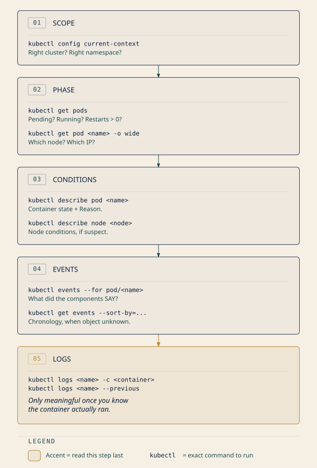

# Chapter 13: When the Cluster Won't Answer
## *"Read the phase before you read the logs"*

**Domain: Container Orchestration (Troubleshooting) | Published domain weight: 28% [source: cncf-kcna-curriculum-pdf-2026-08-23]**
**Complexity: Mixed | Novelty: Moderate | Prerequisites: Heavy**

<!-- AUTHOR-REVIEW: The 28% figure above is the published weight for the whole Container Orchestration domain, which spans Networking, Security, Troubleshooting and Storage. CNCF publishes no sub-competency weights (B1 gap G33, B2 disclosure #1), so this chapter's share of that 28% is an authored allocation, not a published one. The metadata line states the published number with its tag; the disclaimer below is the house form. Verify it matches the shipped Ch 9-12 wording before materialisation. -->

*Container Orchestration is 28% of the exam. How that 28% divides among its four competencies is not published — the allocation of chapters across this Part is the author's, derived from the competency list, not from CNCF data.*

---

## Attention Budget

**Total time: ~95 minutes | Recommended: Split across 2 sessions**

| Section | Time | Attention Cost | Best Time to Study |
|---|---|---|---|
| §1 Whose Problem Is This | 8 min | Low | Anytime |
| §2 Pods That Never Start | 18 min | High | Peak attention |
| §3 Looking Inside | 12 min | Medium | Mid-session |
| ☆ Taking Your Bearings 1 | 8 min | Medium | After a brief break |
| §4 Pods That Start and Don't Stay | 15 min | High | Peak attention |
| §5 When the Node Is the Problem | 10 min | Medium | Mid-session |
| ☆ Taking Your Bearings 2 | 8 min | Medium | After a brief break |
| §6 Versions That Don't Agree | 7 min | Medium | Anytime |
| §7 Numbers Nobody Collects | 8 min | Low | Anytime |
| ☆ Taking Your Bearings 3 | 7 min | Medium | After a brief break |
| ☀️ §8 Read the Phase First | 5 min | Low | End of session |

**Attention Cost Key:**
- **Low:** Concrete, familiar concepts — study anytime
- **Medium:** New concepts requiring focus — study when alert
- **High:** Abstract or complex material — study at peak attention

*If you only have 15 minutes: read §1 and §2, then take the first checkpoint. Those two sections carry the chapter's method and its highest-value material.*

**Natural split point:** after ☆ Taking Your Bearings 1. §1–§3 teach the method and the never-started family; §4–§8 apply it to everything else.

---

> *"Ninety percent of debugging is figuring out where to look. The other ten percent is realizing you were looking at the wrong thing."*
> — Lodestar Ledgers

---

## 🧭 Soundings

Before reading this chapter, try these eight questions. Every one is answerable from Chapters 1–12 or from ordinary professional experience; none requires anything this chapter teaches. Your score tells you how to read.

Two of them deliberately probe material you met a while ago and may have let slip. Missing those two is information, not failure: it tells you which sections of this chapter are doing the most work for you.

1. A Pod's `status` reports a `Reason` string of `ContainerCreating`. Does that string belong to the Pod's **phase** taxonomy or the **container state** taxonomy?

2. A Pod has been sitting in `Pending` for ten minutes. Is some component of the cluster periodically retrying it with relaxed constraints, hoping to eventually place it?

3. A Pod spec names the image `myapp` with no tag at all. What `imagePullPolicy` does Kubernetes apply by default, and when does the kubelet consult the registry?

4. A Pod has two containers. Container A requests 100m CPU and 128Mi memory, with limits of 200m and 256Mi. Container B requests 50m CPU and 64Mi memory, with no limits at all. What QoS class does this Pod receive?

5. A node reports `Ready=False`. What is that condition actually telling you?

6. Your control plane runs Kubernetes 1.37. What is the oldest kubelet minor version that is supported against it?

7. A Pod runs three containers: `app`, `cache`, and `log-shipper`. How do you ask for the logs of `cache` specifically?

8. Someone creates an Ingress object on a cluster where no Ingress controller has ever been installed. Does the object get created? Does anything route traffic?

<details>
<summary>Answers + reading strategy</summary>

**1.** Container state. `Reason` is a field on the container state, not on the Pod phase. The five Pod phases are `Pending`, `Running`, `Succeeded`, `Failed`, and `Unknown`, and none of them is called `ContainerCreating`. [source: k8s-docs-pod-failure-signatures-2026-08-31] *[cross-bearing: see Ch 5 §5 — Pod phases and container states]*

**2.** No. Nothing is retrying it with looser constraints. `Pending` is a stable report that no feasible node was found. The scheduler will place the Pod the moment a node becomes feasible, but it will not relax the Pod's own requirements to make that happen. *[cross-bearing: see Ch 7 §2 — feasible nodes]*

**3.** With no tag, Kubernetes assumes `:latest`, and the default `imagePullPolicy` for `:latest` is `Always`. The kubelet queries the registry every time it launches a container. [source: k8s-docs-images-2026-08-23] *[cross-bearing: see Ch 2 §6 — imagePullPolicy]*

**4.** `Burstable`. It is not `Guaranteed`, because container B has no limits and container A's limits do not equal its requests. It is not `BestEffort`, because at least one container has requests. [source: k8s-docs-pod-qos-2026-08-24] *[cross-bearing: see Ch 5 §8 — QoS classes]*

**5.** `Ready=False` means the node is not healthy and is not accepting Pods. [source: k8s-docs-node-status-2026-08-24] The kubelet is what reports a node's status, in the form of updates to the Node's `.status`. [source: k8s-docs-node-controller-heartbeats-2026-08-31] *[cross-bearing: see Ch 8 §4 — node conditions]*

**6.** 1.34. The kubelet may be up to three minor versions older than the API server, and must never be newer. [source: k8s-version-skew-policy-2026-08-31] *[cross-bearing: see Ch 8 §6 — the version-skew window]*

**7.** `kubectl logs <pod> -c cache`. For a multi-container Pod, `-c <container>` is how you name the one you mean. [source: k8s-docs-logging-architecture-2026-08-23] *[cross-bearing: see Ch 5 §2 — multi-container Pods]*

**8.** The object is created and nothing routes traffic. This is exactly the pattern Chapter 10 named: the API server accepts and stores the object, and no controller is watching for it, so it is a record of intent with nobody to honor it. *[cross-bearing: see Ch 10 §3 — an object without its component does nothing]*

---

**If you got 6+ right:** Skim §1 through §4 for the signature names and the method, but read **§6 and §7 properly**. Those two sections are where earlier chapters deliberately left debts for this one to pay, and a high Soundings score does not mean you have already collected them.

**If you got 3–5 right:** Read at normal pace. This chapter is calibrated for you, and it applies rather than introduces, so the reading will feel faster than its length suggests.

**If you got 0–2 right:** Before you start §1, **re-read Chapter 5 §5**, on Pod phases and container states. Not alongside this chapter; before it. Every section here is a lookup keyed on the phase, and if that taxonomy has faded, the material degrades into a list of strings to memorize, which is precisely the failure this chapter exists to prevent.

</details>

---

## Why This Chapter Matters

A Pod is broken. What do you do first?

Almost everyone reaches for the same thing: `kubectl logs`. It is the obvious move. The application is misbehaving, applications write logs, so read the logs. Sometimes that instinct is right. In the three most common failure shapes, it is wrong, and it costs you the first ten minutes of the investigation before handing you a confident wrong answer.

A Pod stuck in `Pending` has no logs, because it has no container. There is nothing running anywhere for a log to come out of. `kubectl logs` will tell you so, and if you read that message as "the application isn't logging anything," you have just started debugging the wrong thing.

A Pod in `CrashLoopBackOff` does have logs, but the container `kubectl logs` reads by default is the *current* one, which has not started yet, because the kubelet is waiting out a backoff delay before trying again. So the command returns nothing. Meanwhile the application has already started and died five times, and every one of those deaths wrote a stack trace to a log you did not ask for.

A Pod that was `Evicted` is gone from the node entirely. Its containers were terminated to reclaim resources. Whatever it wrote is subject to the node's log rotation and the kubelet's cleanup, and by the time you go looking, the thing you want may not be there.

Three of the most common failure shapes, and in all three the first thing everyone reaches for is the wrong thing. Reading the logs first is like opening a ship's log to find out whether the ship ever left harbor: the book will be silent, and the silence will tell you nothing, because a vessel still at the quay writes no entries either.

So here is the question this chapter opens and does not answer until the end: **what do you read first, and why is it always the same thing?**

You are not going to learn nine error strings. You could get nine error strings from a blog post, and you would forget them within a week, because a list of strings has no structure to hang on. What you are going to learn is a method, the same one practitioners actually use, which is not recognition but narrowing. When an experienced operator meets a Pod they have never seen fail in this particular way, they do not consult a mental glossary. They take a bearing, then another, and read the answer off the intersection — each question they ask the cluster eliminates a whole category of cause, and they arrive at the diagnosis without ever having seen this exact failure before.

That is transferable. Error-string recall is not. Kubernetes will ship a failure signature next year that nobody has written a blog post about yet, and the method will find it anyway.

> **Dead Reckoning:** A Pod's phase tells you which stage of the platform's own start-up sequence stopped. Each stage is owned by a different component. Knowing the stage tells you which component to interrogate, and interrogating the right component is the whole of diagnosis. `kubectl logs` interrogates the application, which is the last component in the sequence and therefore the last one worth asking.

A word about how this chapter treats the exam. CNCF publishes four domain weights and a list of competency names — no sub-competency weights, no item counts, no published statement of which question shapes it favors. So when this chapter calls something high-value, that is the author's judgement from the competency list and the material's own structure, not a published figure, and it is stated as judgement everywhere it appears.

On that judgement: failure signatures are the material most study guides reduce to a two-column glossary — signature on the left, one-line cause on the right. A glossary will get you through a question that names a string. It will not get you through a question that describes a symptom and asks what you would check, and the second shape is the one this chapter is built for, because it is the one the method survives.

---

## What You'll Learn

By the end of this chapter, you'll be able to:

- **Separate** a platform-scope failure from an application-scope one before you spend time on either
- **Read** a Pod's phase and its container-state `Reason` as the first two coordinates of a diagnosis, rather than as error messages to be recognized
- **Distinguish** the failure signatures that mean *never started* from those that mean *started, and did not stay*
- **Run** `kubectl describe`, `kubectl events`, and `kubectl logs --previous` in the order that actually narrows the problem
- **Recognize** when the node, not the workload, is the broken thing, and when to drop below the Kubernetes API to `crictl`
- **Explain** why `kubectl top` returns an error on a cluster that nobody finished building

*You'll also stop reading logs first, which is the single habit that most reliably separates a practitioner from someone who has read about Kubernetes.*

---

## ⚪ §1 — Whose Problem Is This, and What to Read First

Before you diagnose anything, decide whose problem it is.

The Kubernetes documentation splits its own troubleshooting material along exactly this line. The debugging guide for applications opens by saying it "is to help users debug applications that are deployed into Kubernetes and not behaving correctly. This is *not* a guide for people who want to debug their cluster." [source: k8s-docs-debug-pods-2026-08-31] The cluster guide opens with the mirror image: "This doc is about cluster troubleshooting; we assume you have already ruled out your application as the root cause of the problem you are experiencing." [source: k8s-docs-debug-cluster-2026-08-31]

Each guide assumes you have already done the other one's work. That is not an oversight; it is the split made explicit. There are two audiences, and the first move in any investigation is deciding which one you are.

<!-- FIGURE: ch13-fig01-two-audience-split -->
```
        PLATFORM SCOPE                    APPLICATION SCOPE
        (this chapter)                    (Chapter 16)

   Did the Pod get scheduled?        Is the process doing the right thing?
   Did the image pull?               Is it reading the right config?
   Did the container start?          Is it reaching its dependencies?
   Is the node healthy?              Is it returning correct results?
   Did something kill it?            Is it selected by its Service?

        │                                         ▲
        │      "the Pod is Running and Ready,     │
        └──────  and the behavior is still  ──────┘
                       wrong"
```

*The handoff runs one way. Platform scope asks whether Kubernetes did its job; application scope asks whether your code is doing its job. You cross the line exactly once per investigation, and only in that direction.*

The boundary is sharper than it sounds, and it has a mechanical test. **If the Pod is `Running` and `Ready`, the failure is confined to that one workload, and the behavior is still wrong, you have crossed into application scope.** Everything before that (scheduling, pulling, configuring, starting, staying alive, being killed) is the platform doing or failing to do its job, and that is this chapter.

That middle clause is load-bearing, and it is the one people drop. A cluster-wide network fault — DNS not resolving, the CNI plugin not wiring Pods up, the service proxy not programming its rules — produces Pods that are `Running` and `Ready` and behave wrongly, and it is unambiguously the platform's problem, not your code's. The tell is that it is not confined to one workload. If several unrelated applications go wrong at once, do not cross the line; go to the network. *[cross-bearing: see Ch 9 §1 — CNI and pod networking]*

*[cross-bearing: see Ch 16 §1 — when the Pod is fine and the application isn't]*

That is also why you will not find `kubectl exec`, `kubectl debug`, or `kubectl port-forward` taught here. They are real tools, they are on the KCNA competency list, and they belong to the other chapter. They exist to get you inside a container that is already running, which is a question you only ask once the platform has succeeded. *[cross-bearing: see Ch 16 §3 — getting inside a container]* and *[cross-bearing: see Ch 16 §5 — bypassing the Service on purpose]*

<!-- AUTHOR-REVIEW: book-level objective tagging, not a change to this chapter's text. `kubectl exec`, `kubectl debug` / ephemeral containers, `kubectl port-forward`, and Service/EndpointSlice debugging are all on the authored D2.3 Troubleshooting list and are all deferred to Ch 16, which is filed under D3.2 Debugging. Unless Ch 16's frontmatter carries `objectives: ["D3.2", "D2.3"]`, the book's objective index will show a substantial slice of D2.3 with no owning chapter. The deferrals here are correct and explicitly signposted; the fix belongs in Ch 16's frontmatter. -->

### The order, and why it is that order

Once you know you are in platform scope, the sequence is fixed:

**Scope → phase → conditions → events → logs.**

Logs come last. That is the part everyone resists, so it gets an argument rather than an assertion.

Go back to the three failures from the chapter opening. A `Pending` Pod has no container, so a log read returns nothing, and "nothing" is indistinguishable from "the app is quiet." A `CrashLoopBackOff` Pod has a container that has not started yet, so a log read returns nothing, and again "nothing" looks like silence rather than a container that has died five times. An `Evicted` Pod is not on the node at all, so a log read may find nothing. Once more: "nothing."

Three completely different causes. One identical output. **The logs cannot distinguish between them, and the phase distinguishes between them instantly.**

That is the whole argument. Logs are not useless; logs are the *last* signal to become trustworthy, because they only mean what you think they mean once you already know the container ran. The phase tells you whether the container ran. So the phase goes first.

The order is not arbitrary and it is not a ritual. Each reading narrows the water the next one has to search. Scope tells you which cluster you are looking at; the phase tells you which shore; the conditions tell you which rock; the events tell you what the lookout actually called. By the time you reach the logs, there is very little water left, which is exactly why the logs can finally be read for what they say rather than for what you hope they say.

> 🪢 **Mnemonic:** **S-P-C-E-L** — Scope, Phase, Conditions, Events, Logs. If you find yourself typing `kubectl logs` and you cannot say out loud what phase the Pod is in, you have skipped four steps.

The phase, meanwhile, is not an error message. It is a position in the platform's own start-up sequence, and each position has a component that owns it: the scheduler owns placement, the kubelet owns pulling and starting, the container runtime owns running, and the node controller owns whether the node is answering at all. Reading the phase is not recognizing a string. It is taking your first bearing, and it is the bearing that tells you which coast the rest of the fix is measured against.

*[cross-bearing: see Ch 5 §5 — Pod phase and container state]*

---

## 🔵 §2 — Pods That Never Start

This is the largest failure family, and the one where the method pays off hardest. Almost every signature in it produces the same visible symptom, a Pod that is not running, from a completely different cause.

Every failure in this section shares one property: **no container ever executed.** Nothing ran, so nothing logged, so no amount of log-reading will help you. What separates them is *how far into the start-up sequence the platform got before it stopped*.

<!-- FIGURE: ch13-fig02-pod-failure-signature-map -->


<!-- ASCII-FALLBACK
```
                    Does the Pod object exist?
                              │
              ┌───────────────┴───────────────┐
              NO                              YES
              │                                │
    Admission refused it.                 What's the phase?
    Read the CREATE error,                     │
    not the Pod.                    ┌──────────┴──────────┐
    (Ch 12 §6)                   Pending                Running
                                    │                  (containers Waiting)
                          Not scheduled yet.                 │
                          Read: describe → Events    Scheduled; can't start.
                          from the scheduler.        Read: container Reason
                                                            │
                              ┌─────────────────────────────┼────────────────────┐
                     ErrImagePull /                CreateContainerConfigError    ImageInspectError /
                     ImagePullBackOff                        │                   ErrImageNeverPull
                              │                    Named ConfigMap or Secret            │
                    Registry said no, or               doesn't exist.            Image is broken, or
                    was never asked properly.          (Ch 4 §4)                 policy Never with no
                    (Ch 2 §3, §6)                                                local image. (Ch 2 §6)
```
-->

*The first question is not "what's the error" — it is "is there a Pod at all." That branch alone eliminates an entire category of confusion.*

### The case where there is no Pod

Start at the top of the tree, because this is the branch people skip.

If a Pod was rejected at admission — by Pod Security Admission [source: k8s-docs-pod-security-admission-2026-08-31], by a validating webhook, by a quota — **there is no Pod object to describe.** The refusal happened at the harbor entrance, and there is no vessel inside to inspect. Chapter 12 already flagged this to you and said it "shows up at a different point in the triage flow"; here is that point.

<!-- AUTHOR-REVIEW: RESEARCH GAP. The claim that an admission refusal leaves no Pod object, and that a controller's failed create is recorded on the ReplicaSet rather than on any Pod, is not supported by any snapshot in this chapter's corpus. `k8s-docs-pod-security-admission-2026-08-31` documents the enforce/audit/warn modes but not the "no object is created" consequence; validating webhooks and ResourceQuota have no snapshot at all. This is the top branch of the §2 signature map and the keyed answer to a graded item (TYB 1 Q4, Practice Q9 distractor D), so it cannot be cut. Route a Stage 2 fetch for (a) PSA enforcement outcomes and (b) ReplicaSet status conditions / the `FailedCreate` event, then tag every occurrence. -->

The consequence is practical. `kubectl get pod myapp` returns `NotFound`, and the natural reading of `NotFound` is "something deleted it" or "I'm in the wrong namespace." Neither is true. The object never existed, because the request to create it was rejected, and the rejection message went to whoever issued the create: your terminal, if you ran `kubectl apply`; the Deployment's ReplicaSet status, if a controller was creating it on your behalf.

> 🪝 **Snag:** When a Deployment's Pods are refused at admission, the Deployment does not fail loudly. It sits at zero available replicas, and the reason is on the **ReplicaSet**, not on any Pod. `kubectl describe replicaset <name>` is where the refusal message is. Chasing the missing Pod will find you nothing, because there is nothing to find.

*[cross-bearing: see Ch 12 §6 — Pod Security Admission]*

### `Pending`: scheduled nowhere

If the Pod exists and its phase is `Pending`, the platform has accepted it and not placed it. The documentation is direct: "If a Pod is stuck in Pending it means that it can not be scheduled onto a node. Generally this is because there are insufficient resources of one type or another that prevent scheduling." [source: k8s-docs-debug-pods-2026-08-23]

The instruction that follows is the important one: "Look at the output of the kubectl describe command; there should be messages from the scheduler about why it can not schedule your pod." [source: k8s-docs-debug-pods-2026-08-23]

Note what that sentence assumes. The scheduler *tells you*. It writes an event explaining which nodes it considered and why each one failed. You do not have to deduce anything. You have to go and read it.

This is the point Chapter 7 made and this chapter now cashes in. A Pod in `Pending` is not drifting and it is not broken. It is riding at anchor, waiting for a berth that has not opened, and nothing in the cluster is quietly slackening the lines to make it fit. If the Pod requests 8 CPUs and no node has 8 CPUs free, it will sit there indefinitely, and it will sit there just as patiently if the reason is a taint it does not tolerate.

> ⚠ **Navigational Hazards**
>
> **A capacity shortage and a taint look identical from the outside.** Both produce a Pod in `Pending`, indefinitely, with no containers. `kubectl get pods` shows you exactly the same line for both.
>
> They are completely different problems. A capacity shortage means the cluster is full and you need to reduce requests, delete Pods, or add nodes. A taint means the nodes have capacity and are refusing this particular Pod on purpose; you need a toleration, or you need to accept that the refusal is correct.
>
> The only thing that distinguishes them is the scheduler's own event text, which reports how many nodes failed and on what grounds. This is why "read the events" is not a formality. It is the single step that separates two problems with opposite fixes.

*[cross-bearing: see Ch 7 §2 — feasible nodes, and why a Pod stays Pending]* and *[cross-bearing: see Ch 7 §4 — taints and tolerations]*

Two other `Pending` causes surprise people often enough to name. Exhausting CPU or memory across the cluster is the obvious one: "you may have exhausted the supply of CPU or Memory in your cluster, in this case you need to delete Pods, adjust resource requests, or add new nodes to your cluster." [source: k8s-docs-debug-pods-2026-08-23] The less obvious one is `hostPort`: "when you bind a Pod to a hostPort there are a limited number of places that pod can be scheduled; in most cases hostPort is unnecessary, try using a Service object to expose your Pod." [source: k8s-docs-debug-pods-2026-08-23] A `hostPort` silently reduces your feasible-node count to "nodes where that port is free," which on a small cluster can be one node, or zero.

An unbound PersistentVolumeClaim belongs in this family too: a storage problem can arrive disguised as a scheduling problem, with a Pod sitting in `Pending` for reasons that have nothing to do with CPU, memory, or taints *[cross-bearing: see Ch 11 §2 — PV and PVC binding]*. Chapter 11 promised you would be able to tell the two apart from the symptoms, so here is how — and the answer is that you have to look at the claim, because the Pod cannot tell you.

Run `kubectl get pvc` beside `kubectl get pods`. A claim reading `Pending` means it has not found a volume, and **claims remain unbound indefinitely if a matching volume does not exist** [source: k8s-docs-persistent-volumes-depth-2026-08-25] — there is no timeout and no eventual failure, which is why this looks so much like a Pod that simply will not schedule.

Then read the claim's StorageClass, because **the binding mode inverts the direction of cause**:

- Under **`Immediate`**, binding happens as soon as the claim is created, without knowledge of any Pod's scheduling requirements — which the documentation notes "may result in unschedulable Pods" [source: k8s-docs-storage-classes-2026-08-25]. A `Pending` claim here is a genuine storage problem, and it is upstream of the Pod. Fix the storage and the Pod schedules.
- Under **`WaitForFirstConsumer`**, binding is *deliberately* delayed until a Pod using the claim is created, so that the volume can be provisioned to match that Pod's scheduling constraints [source: k8s-docs-storage-classes-2026-08-25]. A `Pending` claim here may be entirely normal — it is waiting on the scheduler. The Pod is not blocked by the claim; the claim is waiting for the Pod. Diagnose the Pod's scheduling constraints, not the storage.

★ **Fixed Point:** A `Pending` Pod with a `Pending` claim is a **storage** problem under `Immediate` binding and a **scheduling** problem under `WaitForFirstConsumer`. Same two symptoms, opposite direction of cause, and the StorageClass is the only thing that tells you which.

<!-- RESOLVED 2026-08-31 (integration gate): written from the book's corpus --
     sources/k8s-docs-persistent-volumes-depth-2026-08-25.md for the indefinite-unbound rule and
     sources/k8s-docs-storage-classes-2026-08-25.md for both binding modes. The direction this note
     flagged as needing verification is correct and is now the point of the passage:
     WaitForFirstConsumer inverts which object is waiting on which. This discharges the
     promise shipped Ch 11 line 588 makes by name. -->

### `Waiting`: scheduled, and unable to start

If the Pod has been placed on a node but its containers are not running, the containers are in the `Waiting` state, and `Waiting` carries a `Reason` field that names the specific problem. The documentation frames the whole category: "If a Pod is stuck in the Waiting state, then it has been scheduled to a worker node, but it can't run on that machine. The most common cause of Waiting pods is a failure to pull the image." [source: k8s-docs-debug-pods-2026-08-23]

This is where the phase-versus-state distinction earns its keep. The *phase* may still read `Pending`, because the containers have not been made ready to run, or the Pod may show `Running` with containers not yet up. Either way, the string that tells you what is actually wrong lives on the **container state**, not the phase. You get it from `kubectl describe pod`, which "shows the state for each container within that Pod." [source: k8s-docs-pod-failure-signatures-2026-08-31]

Here are the `Waiting` reasons that matter for the never-started family, from the documented reason table [source: k8s-docs-pod-failure-signatures-2026-08-31]:

| `Reason` | What it means | Where the cause lives |
|---|---|---|
| `ContainerCreating` | The container is being created. | Nowhere — this is normal, briefly. |
| `ErrImagePull` | "There was a general error pulling the image." | Image name, registry, or credentials |
| `ImagePullBackOff` | "The container image pull has failed, and kubelet will keep trying." | Same as above — this is `ErrImagePull` after retries began |
| `ImageInspectError` | "There was an error inspecting the container image." | The image itself, or the runtime's view of it |
| `ErrImageNeverPull` | "The image pull policy is set to `Never`, but the image is not present locally." | The Pod spec's `imagePullPolicy` |
| `PodInitializing` | The Pod is being initialized. | An init container that has not finished |

One more reason belongs to this family and is **not** in that table: `CreateContainerConfigError`, covered below.

### The image-pull family

`ErrImagePull` and `ImagePullBackOff` are the same problem at two moments in time. The first pull attempt fails and you get `ErrImagePull`. The kubelet then starts retrying with an increasing delay, and the signature becomes `ImagePullBackOff`: "The BackOff part indicates that Kubernetes will keep trying to pull the image, with an increasing back-off delay, up to a compiled-in limit of 300 seconds (5 minutes)." [source: k8s-docs-images-2026-08-23]

So `ImagePullBackOff` is not a different diagnosis from `ErrImagePull`. It is the *same* diagnosis, observed a little later. If you see `ErrImagePull` and refresh, you will usually watch it become `ImagePullBackOff`, and nothing has changed except the elapsed time.

The documented cause list is short: "invalid image name, or pulling from a private registry without an imagePullSecret." [source: k8s-docs-images-2026-08-23] The debugging guide gives you three checks in order: "make sure that you have the name of the image correct; have you pushed the image to the registry?; try to manually pull the image to see if the image can be pulled." [source: k8s-docs-debug-pods-2026-08-23]

That third check is underrated. Pulling the image by hand from a shell on the node, or from your laptop if the registry is reachable from there, collapses the question "is this a Kubernetes problem or a registry problem?" in about five seconds.

The subtle version of this failure involves the pull policy. Recall that if you specify no tag, or the tag `:latest`, the default policy is `Always`, and the kubelet "queries the container image registry to resolve the name to an image digest" on every container launch. [source: k8s-docs-images-2026-08-23] A cached image is provisions already aboard, but with `Always` the kubelet still has to hail the registry before it will use them. That means a Pod which has been running happily for weeks on a cached image will fail to restart the moment the registry becomes unreachable. A Pod pinned to a specific tag other than `:latest` gets `IfNotPresent` by default and rides out the same registry outage without noticing.

> 🔭 **Closer Look:** `Always` does not mean "download the layers every time." The kubelet resolves the tag to a digest, and "if the kubelet has a container image with that exact digest cached locally, it uses its cached image." [source: k8s-docs-images-2026-08-23] The bandwidth cost is small. The *availability* cost is not: the registry has to answer, and if it doesn't, the container doesn't start.

*[cross-bearing: see Ch 2 §3 — tags and digests]* and *[cross-bearing: see Ch 2 §6 — imagePullPolicy and image pull secrets]*

`ErrImageNeverPull` is the mirror-image mistake. Somebody set `imagePullPolicy: Never`, usually to force use of an image they built locally on the node, a common pattern in `minikube` and `kind` development, and the image is not actually there. Kubernetes does exactly what it was told: it does not fetch, so the container cannot start. The signature is unambiguous and the fix is either "put the image on that node" or "stop saying `Never`."

`ImageInspectError` is the odd sibling, and it is the one every treatment of this family skips. Here the fetch is not the problem — the runtime has the image and cannot read it. "There was an error inspecting the container image." [source: k8s-docs-pod-failure-signatures-2026-08-31] Diagnostically, that points you at the image itself or at the runtime's view of it — a corrupt or truncated layer, a manifest the runtime cannot parse, a partly-populated image cache — and *away* from the registry, the image name, and the pull credentials, which are the first three things anyone checks. It is rare. It is also unmistakable once you know what it rules out.

### `CreateContainerConfigError`: the configuration cannot be assembled

<!-- AUTHOR-REVIEW: RESEARCH GAP, highest severity in this chapter. `CreateContainerConfigError` appears in no cached snapshot in this corpus. The `Waiting` reason table in k8s-docs-pod-failure-signatures-2026-08-31 lists fourteen reasons and this is not one of them, so it has been lifted out of that table above rather than presented as sourced from it. The signature cannot be cut: it is one of the nine the ☀️ Zenith is built on, it carries a ★ Fixed Point, and it is the keyed correct answer to TYB 1 Q1 and Practice Q5, and the diagnosis in Practice Q9. Route a Stage 2 fetch for a page that documents it — the ConfigMap and Secret consumption docs ("the kubelet reports an error if the ConfigMap doesn't exist") are the most likely home, since the rendered reason table does not carry it. The same gap covers the related claim in Practice Q9's answer key that Kubernetes does not validate a referenced Secret's existence at admission time. -->

This one is worth dwelling on because the symptom is so far from the cause.

A container's configuration includes everything the kubelet has to gather before it can hand a container definition to the runtime: environment variables, mounted volumes, and, crucially, the contents of any ConfigMap or Secret the Pod references. If a referenced ConfigMap does not exist, or a referenced Secret does not exist, or a named key inside one of them is missing, the kubelet cannot finish assembling the container. It stops, and reports `CreateContainerConfigError`.

Notice what has *not* gone wrong. The Pod scheduled successfully; the node was feasible. The image pulled successfully; the registry answered. Every earlier stage worked. The failure is at the last step before the container runs, and it is caused by an object in a completely different part of your manifests.

Chapter 12 pointed a reader here for exactly this case: a Pod that references a Secret which does not exist. It will not start, it will never start, and nothing about the message mentions Secrets unless you read the events.

> 🪝 **Snag:** A missing ConfigMap and a *misspelled key inside an existing* ConfigMap produce the same reason string. `describe` will name which one it could not resolve. Read the message, not just the reason.

*[cross-bearing: see Ch 4 §4 — ConfigMaps and Secrets]*

### Init containers, from the platform side

If a Pod's containers show `PodInitializing`, an init container is still running, or is failing. [source: k8s-docs-pod-failure-signatures-2026-08-31] Because init containers run before the app containers do, a single init container that keeps failing will hold the entire Pod at the gate indefinitely. *[cross-bearing: see Ch 5 §3 — init containers]*

From platform scope, the diagnosis is: identify *which* init container is stuck, and confirm whether it is running or looping. That is a `describe` question. What the init container is actually doing wrong — the logic inside it, the dependency it is waiting on that never appears — is application scope.

*[cross-bearing: see Ch 16 §2 — debugging init containers]*

> ★ **Fixed Point**
>
> **Every failure in this section means no container ever executed.** `Pending`, the image-pull family, `CreateContainerConfigError`, `ErrImageNeverPull` — in each case the platform stopped before running your code. Reading application logs cannot help, because there are no application logs. The diagnosis lives in `kubectl describe` and in the events, always.

---

## ⚪ §3 — Looking Inside

You have now seen the method twice and been told twice to "read the events." Here is what that actually means, and what the three commands genuinely do.

<!-- AUTHOR-REVIEW: RESEARCH GAP, kubectl command surface. Four command forms in this section carry no source tag, and the corpus does not hold their syntax: `kubectl events --for pod/<name>`, `kubectl get events --sort-by=.metadata.creationTimestamp`, `kubectl logs --all-containers`, and `kubectl config current-context`. The bundled snapshot k8s-docs-kubectl-cheatsheet-troubleshooting-2026-08-31 claims in its frontmatter to close this gap but is transcribed only as far as its first heading and contains no command lines at all; its own note already concedes that `kubectl events` is NOT covered. The same gap covers the semantics of the `RESTARTS`, `READY` and `STATUS` columns of `kubectl get pods`, which this section and two graded items rely on. Two fixes, in order of leverage: (1) re-transcribe the cheatsheet snapshot past its first heading — that alone closes most of this; (2) fetch kubernetes.io/docs/reference/kubectl/generated/kubectl_events/ for the `--for` selector syntax specifically. Until then, none of the four is tagged, deliberately. -->

### First: confirm you are talking to the cluster you think you are

Before you trust a single line of output, confirm which cluster answered. The official troubleshooting guide for `kubectl` itself opens on this: it exists for people who "encounter issues accessing `kubectl` or connecting to your cluster," and its first instruction is to "make sure you have installed and configured `kubectl` correctly on your local machine. Check the `kubectl` version to ensure it is up-to-date and compatible with your cluster." [source: k8s-docs-troubleshoot-kubectl-2026-08-31]

The failure this prevents is not exotic. You are looking at a staging cluster while debugging a production incident; you are in the `default` namespace while your workload lives in `payments`; the Pod "does not exist" because you are asking the wrong API server. Every one of those produces confident, well-formatted, entirely irrelevant output.

`kubectl config current-context` costs you one second and eliminates the whole category.

*[cross-bearing: see Ch 8 §1 — kubeconfig and contexts]*

### `kubectl describe`: the first real question

"The first step in debugging a Pod is taking a look at it. Check the current state of the Pod and recent events." [source: k8s-docs-debug-pods-2026-08-31]

```
kubectl describe pod <pod-name>
```

`describe` gives you, in one screen, the phase, every container's state and `Reason`, the node it landed on (or the absence of one), the volumes it wants, and, at the bottom, a list of recent events concerning this object.

The guidance on reading it is deliberately unglamorous: "Look at the state of the containers in the pod. Are they all Running? Have there been recent restarts? Continue debugging depending on the state of the pods." [source: k8s-docs-debug-pods-2026-08-23]

Two of those three questions are the ones this chapter is organized around. *Are they all running* separates §2 from §4. *Have there been recent restarts* is the tell for §4's entire family: a restart count above zero means the container ran, which rules out everything in §2 instantly.

> ⚓ **Worth Securing:** The restart count in `kubectl get pods` output is a diagnosis all by itself. Zero restarts and not running means never started; you are in §2. Non-zero restarts means it started and something ended it; you are in §4. One column, and it halves your search space before you have described anything.

### Events: a first-class surface, not a footer

Most people meet events as the bottom third of `describe` output and treat them as supplementary detail. They are not. Events are how the components of the cluster tell you what they did and why, and for several failure modes they are the *only* place the reason is written.

The scheduler's explanation of why no node was feasible: an event. The kubelet's report that the image pull failed and what the registry said: an event. The Deployment controller's report that a rollout exceeded its progress deadline: an event.

```
kubectl events --for pod/<pod-name>
kubectl get events --sort-by=.metadata.creationTimestamp
```

The second form is the one to reach for when you do not yet know which object is at fault. Events are not sorted usefully by default, and a namespace's event stream read in creation order is a chronology of everything the cluster tried to do recently.

Chapter 6 left you a specific promise here. A Deployment that stalls reports `ProgressDeadlineExceeded`, a condition which says the rollout did not finish in time and says nothing at all about *why*. Several quite different underlying causes produce that identical condition, and Chapter 6 told you there were six of them. Here they are, from the same page Chapter 6 drew on: **insufficient quota, readiness probe failures, image pull errors, insufficient permissions, limit ranges, and application runtime misconfiguration** [source: k8s-docs-deployment-spec-fields-2026-08-24]. Notice how little they have in common. Two are about permission, one is about the registry, one is about the application's own health reporting, and one is about a quota you may not have known existed. A single condition string covers all six, which is exactly why the condition is a starting point and not a diagnosis. The events on the ReplicaSet and on its Pods are where the actual reason lives.

<!-- RESOLVED 2026-08-31 (integration gate): the six causes are sourced after all, from
     sources/k8s-docs-deployment-spec-fields-2026-08-24.md -- Chapter 6's own snapshot, which
     was outside this chapter's corpus slice but inside the book's. Listing them here
     discharges the promise shipped Ch 6 makes twice (§4 line 663, and TYB #2 line 778 in a
     graded answer key). `progressDeadlineSeconds` itself remains uncached; Practice Q8's key
     should not assert a default value for it. -->

Worked through: a Deployment shows `ProgressDeadlineExceeded`. You describe the Deployment and learn only that it gave up waiting. You then find the new ReplicaSet it created (`kubectl describe deployment` names it), describe that, and find it created three Pods. You describe one of those Pods and find its container `Waiting` with `Reason: ImagePullBackOff`, and its events carry the registry's actual refusal: an authentication failure. The rollout stalled because the new image tag was pushed to a registry the cluster has no pull secret for.

`ProgressDeadlineExceeded` never mentioned images, registries, or credentials. Three `describe` calls down the ownership chain did.

*[cross-bearing: see Ch 6 §4 — rolling updates and progress deadlines]*

### Events expire, and this matters more than it sounds

An `Event` is a Kubernetes object like any other. It lives in etcd, it appears in the API, and, unlike most objects, **it is deleted automatically after a retention window.** The API server's `--event-ttl` flag sets that window. [source: k8s-apiserver-event-ttl-and-toleration-defaults-2026-08-31]

<!-- AUTHOR-REVIEW: the k8s-apiserver-event-ttl snapshot is transcribed only as far as the `--event-ttl` heading; the default duration value is NOT in the cached text, despite the snapshot's own frontmatter claiming the retention default is "NOW PINNED." Two corrections needed: (1) amend that snapshot's frontmatter so a later chapter reading only the header does not cite a number the corpus does not hold; (2) if a later fetch pins the default, it may be added here as a dated illustration, never as the examinable fact. The prose below deliberately states no duration — an earlier draft wrote "on the order of an hour," which was memory, not source. -->

The window is bounded and it is short — short enough that a failure investigated the next working day will have no events left. Read the flag on your own cluster rather than assuming a figure. That has a consequence people learn the hard way:

> ⚠ **Navigational Hazards**
>
> **The absence of an event is not evidence.** If a Pod failed overnight and you investigate in the morning, its events are gone. `kubectl describe` will show `Events: <none>`, which reads exactly like "nothing happened."
>
> Something happened. The record of it expired. A log that nobody keeps is a passage nobody can reconstruct.
>
> The practical rule: an empty event list on an object that is currently healthy tells you nothing at all, and an empty event list on an object that failed some time ago tells you only that you are too late. Never conclude "there was no error" from an absent event. Conclude "I need a different source": a monitoring system, a log aggregator, or a reproduction.

*[cross-bearing: see Ch 8 §2 — auditing]* — the audit log answers a different question (who called the API, and what did they change) and has its own retention, but when events have expired it is sometimes the only surviving record that a change was made at all.

### `kubectl logs`, and the three flags that matter

Now, finally, logs.

```
kubectl logs <pod-name>
kubectl logs <pod-name> -c <container-name>
kubectl logs <pod-name> --all-containers
kubectl logs <pod-name> --previous
```

Kubernetes "captures logs from each container in a running Pod" [source: k8s-docs-logging-architecture-2026-08-31], and by default `kubectl logs` reads the current instantiation of the container in a single-container Pod.

**`-c` names one container.** For a multi-container Pod, `-c <container>` is how you say which one you mean. [source: k8s-docs-logging-architecture-2026-08-23] Chapter 5 handed this case to this section by name. On a Pod with `app`, `cache`, and `log-shipper`, a bare `kubectl logs` cannot know which you intended, and reading the wrong container's silence and concluding the application is broken is a real and common misdiagnosis that costs people entire afternoons.

**`--all-containers`** returns all of them at once, which is what you usually want when you do not yet know which container is at fault.

**`--previous`** is the one that matters most in this chapter. It "retrieves logs from a previous instantiation of a container." [source: k8s-docs-logging-architecture-2026-08-23] This is the flag that reads the container that *died*, and it is the answer to the second of the three failures from this chapter's opening.

> ★ **Fixed Point**
>
> **On a crash-looping Pod, `kubectl logs` reads the container that has not started yet, and returns nothing. `kubectl logs --previous` reads the container that died, and returns the reason.**
>
> If a Pod is restarting and its logs are empty, you have used the wrong command, not discovered a silent application.

One constraint on all of this: the kubelet keeps a bounded amount. "By default, if a container restarts, the kubelet keeps one terminated container with its logs." [source: k8s-docs-logging-architecture-2026-08-23] One. Not a history. `--previous` gets you the most recent death, and the one before that is gone.

*[cross-bearing: see Ch 5 §2 — multi-container Pods]*

<!-- FIGURE: ch13-fig03-phase-before-logs-flow -->


<!-- ASCII-FALLBACK
```
  SCOPE      kubectl config current-context      Right cluster? Right namespace?
    │
    ▼
  PHASE      kubectl get pods                    Pending? Running? Restarts > 0?
    │        kubectl get pod <name> -o wide      Which node? Which IP?
    ▼
CONDITIONS   kubectl describe pod <name>         Container state + Reason.
    │        kubectl describe node <node>        Node conditions, if suspect.
    ▼
  EVENTS     kubectl events --for pod/<name>     What did the components SAY?
    │        kubectl get events --sort-by=...    Chronology, when object unknown.
    ▼
   LOGS      kubectl logs <name> -c <container>  Only meaningful once you know
             kubectl logs <name> --previous      the container actually ran.
```
-->

*Each step narrows the next one. Skipping to the bottom does not save time — it produces output you cannot interpret, because interpretation depends on everything above it.*

---

## ☆ Taking Your Bearings: Pods That Never Start, and the Commands That Tell You Why

Six questions. Take them before reading on.

**1.** A Pod's containers show `Reason: CreateContainerConfigError`. Which of the following is definitely true?

A) The image could not be pulled from the registry
B) The Pod could not be scheduled to any node
C) The Pod was scheduled and the image is available, but a referenced object could not be resolved
D) The container started and then exited with a configuration error

**2.** You run `kubectl get pods` and see a Pod with `STATUS: ImagePullBackOff` and `RESTARTS: 0`. What does the restart count of zero tell you?

A) The container is being created and the count has not incremented yet
B) The container has never executed, which is consistent with a pull failure
C) The container ran once and was not restarted
D) `restartPolicy` must be set to `Never`

**3.** A Pod has been in `Pending` for twenty minutes. Which single command output most directly tells you why?

A) `kubectl logs <pod>`
B) `kubectl describe pod <pod>` — specifically the events from the scheduler
C) `kubectl get pod <pod> -o yaml` — specifically the `.spec` section
D) `kubectl top pod <pod>`

**4.** Your `kubectl apply` of a Deployment succeeded, but no Pods exist and the Deployment shows zero available replicas. Where is the explanation most likely to be?

A) In the Pods' events — you need to find the Pod name first
B) In the kubelet's logs on the target node
C) On the ReplicaSet, because the Pod creation was refused before any Pod object existed
D) In the scheduler's logs

**5.** A Pod spec sets `imagePullPolicy: Never` and names an image that exists in your registry but not on the node. What happens?

A) The kubelet pulls the image anyway, because the image exists
B) The container starts using a cached copy from another node
C) `ErrImageNeverPull` — the kubelet does not fetch, and the image is not local
D) The Pod stays in `Pending` until the image is manually pushed to the node

**6.** *[retrieval: ch2]* You want a Pod to run one exact, unchangeable build of an image, with no possibility that a moved pointer silently gives you different content. Do you reference the image by tag or by digest, and why?

A) By tag, because tags are validated by the registry on every pull
B) By digest, because a digest is a hash of the image's content and is immutable, while a tag can be moved to point at a different image
C) Either — tags and digests are two spellings of the same identifier
D) By tag with `imagePullPolicy: Always`, which makes tags immutable

---

<details>
<summary>Answers with explanations</summary>

**1. C.**

`CreateContainerConfigError` occurs at the last step before the container runs. The kubelet is assembling the container's configuration and cannot resolve something the Pod references, typically a missing ConfigMap or Secret, or a missing key inside one.

- **A is wrong** because a pull failure produces `ErrImagePull` or `ImagePullBackOff`. If you are seeing `CreateContainerConfigError`, the image pull already succeeded.
- **B is wrong** for the same shape of reason: an unscheduled Pod is `Pending` with no container state at all. Container state exists only for Pods that have been placed on a node.
- **D is wrong**, and it is the most instructive distractor. Nothing executed. "Started and then exited" is the §4 family, and it always shows a non-zero restart count. This one has zero.

**2. B.**

Restart counts are the cheapest signal in the whole chapter. A restart implies a container ran and ended. Zero restarts alongside a `Waiting` reason means the container has not run even once, which is exactly what a pull failure means.

- **A is wrong**, and it targets a genuine confusion between two `Waiting` reasons. `ContainerCreating` is the normal, brief state of a container being created; `ImagePullBackOff` is a container that cannot be created because the image has not arrived. The stem names the second, not the first, and there is no pending increment to wait for.
- **C is wrong** because a container that ran once and was not restarted would be `Terminated`, not `Waiting` with a pull-failure reason.
- **D is wrong.** `restartPolicy` governs what happens *after* a container exits, and nothing has exited here. `Always` is the default and would be equally consistent with this output.

**3. B.**

The scheduler writes an event explaining why it could not place the Pod, reporting how many nodes failed and on what grounds. That event is at the bottom of `describe` output.

- **A is wrong**, and it is the chapter's opening mistake. A `Pending` Pod has no container, therefore no logs.
- **C is wrong.** `.spec` tells you what you asked for, which you already know. The scheduler's explanation of why the request could not be satisfied is not in `.spec`.
- **D is wrong** on two counts: `kubectl top` reports usage for running workloads, and on most clusters it fails outright for the reason §7 covers.

**4. C.**

If Pod creation was refused at admission, there is no Pod object to describe, and the refusal message goes to the controller that attempted the create: the ReplicaSet.

- **A is wrong** because there is no Pod name to find. This is precisely the trap: the reflex to hunt for the Pod produces `NotFound` and a false conclusion.
- **B is wrong** because the kubelet was never involved. The request never got past the API server.
- **D is wrong** for the same reason. The scheduler only sees Pods that exist.

**5. C.**

`ErrImageNeverPull` is documented as exactly this case: "The image pull policy is set to `Never`, but the image is not present locally." [source: k8s-docs-pod-failure-signatures-2026-08-31]

- **A is wrong.** `Never` means never. The kubelet "does not try fetching the image." [source: k8s-docs-images-2026-08-23]
- **B is wrong.** There is no cross-node image sharing. Each node's image cache is its own.
- **D is wrong.** The Pod is not `Pending`; it has already been scheduled to a node. The failure is at the container-start stage, not the scheduling stage. This distractor tests whether you can place the failure in the sequence.

**6. B.** *[retrieval: ch2]*

Digests are "a unique identifier for a specific version of an image — a hash of the image's content — and are immutable; tags can be moved to point to different images." [source: k8s-docs-images-2026-08-23]

- **A is wrong.** Registries do not validate that a tag still points where it once did, because moving tags is a supported operation.
- **C is wrong**, and this is the confusion the question exists to catch. They are different kinds of identifier: one is a mutable pointer, one is content-derived and fixed.
- **D is wrong.** `Always` changes *when* the kubelet resolves the tag, not whether the tag can move. It resolves more often, to whatever the tag currently names.

---

**If you got 5–6:** You have the never-started family. §4 is the other half of the split, and it is easier once this half is solid.

**If you got 3–4:** Solid. Re-read the signature map figure in §2 and check which branch you lost.

**If you got 0–2:** Go back to **§2** before continuing, specifically the distinction between "there is no Pod object" and "there is a Pod that has not started." Everything in §4 assumes you can tell never-started from started-and-gone, and that judgment is built in §2.

**Checkpoint: You've Now Mastered**

✓ The never-started signature family and what separates its members
✓ Why `Pending` is a report rather than an error
✓ The triage order, and the argument for why logs come last
✓ Reading `describe`, events, and logs in a sequence that narrows

*Next: the failures where the container definitely ran — and something ended it.*

---

</details>

---

## 🔵 §4 — Pods That Start and Then Don't Stay

Every signature in §2 meant no container executed. Every signature here means one did.

That single distinction is the most valuable thing in this chapter, and the restart count gives it to you for free. A container that ran left evidence: an exit code, a termination reason, and logs you can read with `--previous`. The diagnostic problem is no longer "why won't it start" but "what ended it, and what triggered the ending."

### `CrashLoopBackOff`: the most misread string in Kubernetes

Say what it means out loud, because the name works against you:

**The container started. It ran. It exited. Kubernetes restarted it. It exited again. Kubernetes is now waiting before trying a third time.**

Every one of those steps is a success from the platform's point of view. The image pulled. The config resolved. The process launched. The platform did its entire job correctly, and your process ended.

The documented sequence is precise [source: k8s-docs-container-restart-backoff-2026-08-31]:

> 1. **Initial crash**: Kubernetes attempts an immediate restart based on the Pod `restartPolicy`.
> 2. **Repeated crashes**: After the initial crash Kubernetes applies an exponential backoff delay for subsequent restarts. This prevents rapid, repeated restart attempts from overloading the system.
> 3. **CrashLoopBackOff state**: This indicates that the backoff delay mechanism is currently in effect for a container in a crash loop.
> 4. **Backoff reset**: If a container runs successfully for a certain duration, Kubernetes resets the backoff delay.

Point three is the one to internalize. `CrashLoopBackOff` does not name the crash. It names **the waiting between crashes**. When you see it, the container is not running and is not failing either; it is sitting out a delay.

The curve is documented: "After containers exit, the kubelet restarts them with an exponential backoff delay: 10s, 20s, 40s, …, capped at 300 seconds (5 minutes). Once a container executes successfully for 10 minutes without problems, the kubelet resets the restart backoff timer." [source: k8s-docs-container-restart-backoff-2026-08-31]

Two practical consequences. First, a Pod that has been crash-looping for a while will appear to do nothing for up to five minutes at a stretch. That is the cap, not a hang. Second, the reset requires **ten minutes of successful running**, which means a container that dies every eight minutes never resets its backoff and will keep escalating to the cap forever, even though it is technically "working" most of the time.

The documented causes are broad: "application errors, configuration errors, resource constraints, failing health checks, or probe failures." [source: k8s-docs-container-restart-backoff-2026-08-31] That breadth is the point. `CrashLoopBackOff` tells you the container is dying, not why. The why is in `kubectl logs --previous`, in the container's exit code, and in the events.

> ⚠ **Navigational Hazards**
>
> **`CrashLoopBackOff` is not an image problem.** It is the strongest available evidence that the image is *fine*: the pull succeeded, the config resolved, and the process started. The word "Loop" is the tell. You cannot loop something that never ran once.
>
> This trap catches people because "BackOff" also appears in `ImagePullBackOff`, and the two strings look like siblings. They are opposites. `ImagePullBackOff` means the kubelet is retrying a *pull*. `CrashLoopBackOff` means the kubelet is retrying a *start*, having already pulled successfully.

Also recall that `restartPolicy` is what makes a loop possible at all. The default is `Always`, and with `Always` a container that exits, even with code 0, even successfully, is restarted. [source: k8s-docs-container-restart-backoff-2026-08-31] A container that runs a task and exits cleanly, deployed under the default policy, will loop forever. That is not a bug; it is a Deployment being used where a Job belonged.

*[cross-bearing: see Ch 5 §4 — restartPolicy and restart backoff]*

### `OOMKilled` versus `Evicted`: the chapter's most confusable pair

Both mean "something ended your workload over memory." Everything else about them is different, and this is the discrimination most worth being able to make cold.

<!-- FIGURE: ch13-fig05-oomkilled-vs-evicted -->


<!-- ASCII-FALLBACK
```
        OOMKilled                              Evicted
        ─────────                              ───────

  Container exceeds ITS OWN limit        NODE runs low on a resource
              │                                    │
              ▼                                    ▼
  kubelet kills and restarts             kubelet chooses victims by
  that ONE container                     QoS class and terminates PODS
              │                                    │
              ▼                                    ▼
  Reason: OOMKilled,                     Pod phase: Failed.
  on the container                       The Pod is finished.
              │                                    │
              ▼                                    ▼
  Restarted IN PLACE on the              Pod is GONE from this node.
  same node, per restartPolicy.          A controller creates a
  Restart count increments.              REPLACEMENT elsewhere.
              │                                    │
              ▼                                    ▼
  Scope: ONE container                   Scope: THE WHOLE POD
  Trigger: this Pod's own limit          Trigger: the node's pressure
```
-->

*Different trigger, different scope, different outcome. Three axes, and they disagree on all three.*

<!-- AUTHOR-REVIEW: this figure and the prose below have been rebuilt on the three axes the corpus supports — trigger, scope, outcome. An earlier draft ran a fourth axis, "different killer," attributing the OOM kill to kernel cgroup enforcement as against the kubelet. The words "kernel" and "cgroup" appear in NONE of the 26 snapshots, and the one sourced statement of agency says the opposite: k8s-docs-pod-qos-2026-08-24 states that a container exceeding a limit is "killed and restarted by the kubelet." The kernel framing is defensible in practice but is currently unsourced and contradicted, so it has been removed from the figure, the ⚠ Hazards below, the Exam Alert, the Chapter Summary, and Practice Q6's key. To restore it, fetch kubernetes.io/docs/concepts/configuration/manage-resources-containers/ (or the OOM-kill behavior docs) and re-source the whole discrimination. NOTE: this figure's ASCII has changed, so ch13-fig05's entry in image-specs.md needs regenerating — the "Kernel cgroup enforcement" node and the "four axes" caption no longer exist. -->

**`OOMKilled`** is the container exceeding its own memory limit. The container is ended and the reason is recorded as `OOMKilled` — documented as "The container ran out of memory." [source: k8s-docs-pod-failure-signatures-2026-08-31] The Pod survives. The other containers in it survive. The killed container is restarted in place per its `restartPolicy`, and the restart count goes up.

This is scoped tightly: "Any Container exceeding a resource limit will be killed and restarted by the kubelet without affecting other Containers in that Pod." [source: k8s-docs-pod-qos-2026-08-24]

Chapter 5 put the same event a layer lower, saying that when a container exceeds its memory limit **the kernel** may terminate it [source: k8s-docs-resource-management-2026-08-23]. Both are true and they are not in competition: the kernel does the killing, and the kubelet observes the dead container and applies the Pod's `restartPolicy`. When a question asks who *restarts* the container, the answer is the kubelet. When it asks what *killed* it, the answer is the kernel enforcing a limit the kubelet set for it.

<!-- RESOLVED 2026-08-31 (integration gate): shipped Ch 5 §8 line 1025 already places this
     on the Terminated state, sourced to k8s-docs-pod-lifecycle-2026-08-23: "The container
     reaches the `Terminated` state, with a reason and an exit code recorded." The framing
     here and in TYB 2 Q1's stem is established canon. No softening needed. -->

If a container is OOM-killed repeatedly, the visible signature in `kubectl get pods` becomes `CrashLoopBackOff` — that follows from two sourced facts (a container exceeding its limit is killed and restarted; repeated restarts enter backoff) rather than from a source that states it outright. The layering trips people up: `CrashLoopBackOff` and `OOMKilled` are not alternatives, they are two altitudes of the same event, and `describe` shows you the lower one under the container's last state.

> 🪢 **Mnemonic:** **OOM** is **O**ne container, **O**ver its own limit, **O**n the same node afterward. Eviction is the node's decision about the whole Pod, and the Pod does not come back to that node.

**Out Of Memory**, since the acronym has now appeared twice without being spelled out.

**`Evicted`** is the kubelet reclaiming resources on a node under pressure. "Node-pressure eviction is the process by which the kubelet proactively terminates pods to reclaim resource on nodes." [source: k8s-docs-node-pressure-eviction-2026-08-31]

The kubelet is watching more than memory: it "monitors resources like memory, disk space, and filesystem inodes on your cluster's nodes. When one or more of these resources reach specific consumption levels, the kubelet can proactively fail one or more pods on the node to reclaim resources and prevent starvation." [source: k8s-docs-node-pressure-eviction-2026-08-31]

The outcome is at Pod scope: "During a node-pressure eviction, the kubelet sets the phase for the selected pods to `Failed`, and terminates the Pod." [source: k8s-docs-node-pressure-eviction-2026-08-31] The Pod is finished. It does not restart in place. If it belongs to a controller, that controller notices and creates a replacement: "If the pods are managed by a workload management object (such as StatefulSet or Deployment) that replaces failed pods, the control plane (`kube-controller-manager`) creates new pods in place of the evicted pods." [source: k8s-docs-node-pressure-eviction-2026-08-31] A bare Pod with no controller is simply gone.

<!-- AUTHOR-REVIEW: the figure above and Practice Q6's distractor A both print `Reason: Evicted` as a literal API string. The node-pressure snapshot documents the *phase* transition to `Failed` but states no accompanying `Reason` string, and `Evicted` is absent from the container-state reason table. Low risk, but it is printed as literal product output; source it or paraphrase. -->

Before the kubelet touches your workloads it tries to help itself: "The kubelet attempts to reclaim node-level resources before it terminates end-user pods. For example, it removes unused container images when disk resources are starved." [source: k8s-docs-node-pressure-eviction-2026-08-31] So an eviction wave usually means the node has already exhausted its own cheap options.

> 🔭 **Closer Look:** Node-pressure eviction and API-initiated eviction are explicitly different things. "Node-pressure eviction is not the same as API-initiated eviction." [source: k8s-docs-node-pressure-eviction-2026-08-31] One is the kubelet acting on local pressure; the other is a request through the API server. It matters here because they behave differently under disruption constraints: the kubelet under pressure "does not respect your configured PodDisruptionBudget or the pod's `terminationGracePeriodSeconds`." [source: k8s-docs-node-pressure-eviction-2026-08-31] A node in trouble stops negotiating.

*[cross-bearing: see Ch 8 §4 — cordon, drain, and taking a node out of service]*

### Eviction order, and the trap in it

When the kubelet has to choose victims, it chooses by QoS class. "When a Node runs out of resources, Kubernetes will first evict `BestEffort` Pods running on that Node, followed by `Burstable` and finally `Guaranteed` Pods." [source: k8s-docs-pod-qos-2026-08-24]

`BestEffort` first. `Burstable` second. `Guaranteed` last.

There is a refinement worth carrying: "When this eviction is due to resource pressure, only Pods exceeding resource requests are candidates for eviction." [source: k8s-docs-pod-qos-2026-08-24] A Pod living within its requests is not a candidate at all. That is what a request buys you: standing, when the kubelet is choosing.

> ⚠ **Navigational Hazards**
>
> **The request and the limit answer two different questions, and confusing them is the easiest error to make in this material.**
>
> The **limit** is what gets your container OOM-killed. Exceed it and the container is ended. Your requests are irrelevant to that event.
>
> The **request**, via the QoS class it helps determine and via the "exceeding requests" rule above, is what determines your standing when the *node* is under pressure and something has to go. Your limits are largely irrelevant to that decision.
>
> Two triggers — your own limit, and the node's pressure. Two scopes — one container, and the whole Pod. An exam question that hands you a Pod spec and asks "what protects this from eviction" is testing whether you reach for the limit when you should reach for the request.

And the trap under the trap:

> 🪝 **Snag:** "BestEffort asks for nothing, so it's the humblest and therefore the safest" is exactly backwards. **BestEffort is evicted first.** Specifying no requests does not make you a good citizen; it makes you the first thing thrown overboard, because the kubelet has no reason to believe you need anything.

*[cross-bearing: see Ch 5 §8 — requests, limits, and QoS classes]*

### Probe failures: two shapes, and one of them is silent

Probes are a deliberate source of the failures in this section, and the two probe types fail in visibly different ways.

**A failing liveness probe produces a restart loop.** The kubelet kills the container and applies the restart policy. [source: k8s-docs-pod-lifecycle-2026-08-23] From the outside this is indistinguishable from an application that crashes on its own: restart count climbing, eventually `CrashLoopBackOff`. The distinguishing evidence is in the events, where the kubelet records the probe failure, and in the logs, where a self-crashing application usually leaves a stack trace and a probe-killed one usually does not.

That distinction matters because the fixes are opposite. If the application is crashing, fix the application. If the probe is wrong (too short a timeout, too aggressive an `initialDelaySeconds`, a health endpoint that is slow under load) then the application is *fine* and the probe is manufacturing an outage.

**A failing readiness probe produces something much quieter.** The Pod stays `Running`. It does not restart. It reports `0/1 Ready`. And "the endpoints controller removes the Pod's IP address from the endpoints of all Services that match the Pod." [source: k8s-docs-pod-lifecycle-2026-08-23]

Read that consequence carefully. The Pod is alive, it is consuming its node's resources, `kubectl get pods` shows it as `Running`, and it is receiving **no traffic at all**, because it has been silently removed from its Service's endpoints.

> ★ **Fixed Point**
>
> **A liveness probe failure restarts the container. A readiness probe failure removes the Pod from Service endpoints and changes nothing else.**
>
> The second is the chapter's quietest failure: `Running`, `0/1 Ready`, zero restarts, no events after the first few, and no traffic. Anyone who reads only the `STATUS` column will conclude the Pod is healthy.

The `READY` column in `kubectl get pods` is the tell. `1/1` and `0/1` both print `Running` next to them.

*[cross-bearing: see Ch 5 §7 — liveness, readiness, and startup probes]* and *[cross-bearing: see Ch 9 §4 — readiness and Service endpoint membership]*. From the application side, "is anything even selected" is *[cross-bearing: see Ch 16 §4 — is anything even selected]*.

> **Logbook Entry:** A team once spent most of a day on an intermittent 502 that appeared under load and vanished when they went looking for it. Every Pod was `Running`. The Deployment showed the expected replica count. Nothing had restarted.
>
> What was happening: under load, one replica's health endpoint took longer than its readiness timeout, failed, and was pulled from the Service. Load redistributed to the remaining replicas, which made *them* slower, so a second one failed readiness, and so on. As soon as the load dropped, every replica recovered, readiness passed again, and all of them rejoined the Service, leaving a system that looked completely healthy by the time anyone finished typing `kubectl get pods`.
>
> The `READY` column had been telling the story the whole time. Nobody was reading that column, because `STATUS` said `Running` and `Running` reads like *fine*.
>
> The lesson is small and repeats constantly: on a Pod that is running, `READY` is the more informative column, and a readiness failure leaves no restart count and no crash to find.

<!-- AUTHOR-REVIEW: PodDisruptionBudget is deliberately absent from this section. Per the term ledger, PDB is unowned book-wide (B6 assigned it to Ch 8 §4; shipped Ch 8 contains zero occurrences) and is barred from graded and explanatory text until that one-clause retrofit lands. The Closer Look above quotes the source's own mention of PDB inside a verbatim quotation about what the kubelet does NOT respect, which is the minimum needed for accuracy and does not teach the term. -->

---

## 🟡 §5 — When the Node Is the Problem

Everything so far has assumed the node was working and the workload was not. Sometimes it is the other way around, and the symptoms mislead, because a broken node makes its Pods look broken.

"The first thing to debug in your cluster is if your nodes are all registered correctly." [source: k8s-docs-debug-cluster-2026-08-31]

```
kubectl get nodes
kubectl describe node <node-name>
```

### Node conditions, as a diagnostic

You met the node conditions in Chapter 8 — `Ready`, `MemoryPressure`, `DiskPressure`, `PIDPressure`, `NetworkUnavailable` — as part of what a node reports about itself. This section does not restate that table *[cross-bearing: see Ch 8 §4 — node conditions, and what each one means]*. It asks a different question: **given a condition, what do you do next?** The middle column below is a reminder, not a definition; Chapter 8 owns those.

| Condition seen | What it is telling you | Your next move |
|---|---|---|
| `Ready=True` | Healthy, accepting Pods | The node is not your problem. Return to the workload. |
| `Ready=False` | Unhealthy, and saying so | The kubelet is reporting `.status` and reporting a problem [source: k8s-docs-node-controller-heartbeats-2026-08-31]. Go to the node and read the kubelet's own logs. |
| `Ready=Unknown` | Not saying anything at all | Nobody is reporting at all. Suspect the kubelet process, the machine, or the network to the control plane. |
| `MemoryPressure=True` | Memory low | Expect evictions. Your Pod's failure is probably §4's `Evicted`, not its own fault. |
| `DiskPressure=True` | Disk low | Expect image-garbage-collection and evictions. Also a plausible cause of pull failures. |
| `PIDPressure=True` | Too many processes | Container starts will fail in confusing ways. Look for a process-leaking workload. |

The distinction between `False` and `Unknown` is the one to take to the exam. `False` means somebody is talking to you and telling you they are unwell. `Unknown` means nobody is talking to you at all. Those lead to completely different investigations.

> ⚓ **Worth Securing:** When several unrelated Pods across the same node fail in different ways at the same time, stop diagnosing the Pods. Describe the node. Correlated, heterogeneous failures on one node are almost never a coincidence of workloads.

*[cross-bearing: see Ch 8 §4 — node conditions, cordon and drain]*

### Heartbeats, and what happens when they stop

A node proves it is alive through two channels. "For nodes there are two forms of heartbeats: Updates to the `.status` of a Node. Lease objects within the `kube-node-lease` namespace. Each Node has an associated Lease object." [source: k8s-docs-node-controller-heartbeats-2026-08-31]

Watching those heartbeats is the node controller's job. One of its roles is "monitoring the nodes' health," and specifically: "In the case that a node becomes unreachable, updating the `Ready` condition in the Node's `.status` field. In this case the node controller sets the `Ready` condition to `Unknown`." [source: k8s-docs-node-controller-heartbeats-2026-08-31]

That answers a question people ask about `Ready=Unknown`: who wrote it, if the node is not talking? The node controller did, on the node's behalf, because the node stopped.

What follows is deliberately unhurried. "If a node remains unreachable: triggering API-initiated eviction for all of the Pods on the unreachable node. **By default, the node controller waits 5 minutes between marking the node as `Unknown` and submitting the first eviction request.**" [source: k8s-docs-node-controller-heartbeats-2026-08-31]

Five minutes of apparent inaction, on purpose. A node that vanishes for ninety seconds because of a network blip should not have its entire workload torn down and rescheduled. The delay buys time for a transient problem to resolve itself.

The mechanism is taint-based rather than a dedicated timer. "The node controller is also responsible for evicting pods running on nodes with `NoExecute` taints, unless those pods tolerate that taint. The node controller also adds taints corresponding to node problems like node unreachable or not ready. This means that the scheduler won't place Pods onto unhealthy nodes." [source: k8s-docs-node-controller-heartbeats-2026-08-31] And Pods carry a default toleration for exactly these: "Kubernetes automatically adds a toleration for `node.kubernetes.io/not-ready` and `node.kubernetes.io/unreachable` with `tolerationSeconds=300`, unless you, or a controller, set those tolerations explicitly." [source: k8s-docs-taints-tolerations-depth-2026-08-24]

So the five-minute wait is not a special case bolted on for node failure. It is the same machinery from Chapter 7, doing a job you would not have guessed it was doing.

The node controller also declines to act at scale. If a large share of a zone's nodes go unhealthy at once, "the eviction rate is reduced," and on small clusters "evictions are stopped" entirely; and in the worst case, "when all zones are completely unhealthy (none of the nodes in the cluster are healthy)... the node controller assumes that there is some problem with connectivity between the control plane and the nodes, and doesn't perform any evictions." [source: k8s-docs-node-controller-heartbeats-2026-08-31]

That last one is a piece of engineering humility worth noticing. A compass that reads north in every direction is telling you about the compass. When every node looks dead, the most likely explanation is that the observer is wrong, not that every machine died simultaneously. So the controller stops acting.

Finally, the Pod-level consequence: "If a Node dies, the Pods running on (or scheduled to run on) that node are marked for deletion. The control plane marks the Pods for removal after a timeout period." [source: k8s-docs-pod-failure-signatures-2026-08-31] And they do not come back as themselves: "A given Pod (as defined by a UID) is never 'rescheduled' to a different node; instead, that Pod can be replaced by a new, near-identical Pod." [source: k8s-docs-pod-failure-signatures-2026-08-31]

### `crictl`, and why a tool below the API exists

Chapter 3 promised you this framing, so here it is.

Every command in this chapter so far has gone through the API server. That is by design: the API server is the only door in, and everything you have read has been the cluster's own recorded view of itself. *[cross-bearing: see Ch 3 §5 — the only door in]*

Which raises a question. What do you do when the failure is *in* that path? If the kubelet cannot register a container with the API server, then from `kubectl`'s point of view the container does not exist. You will look at an empty result and conclude nothing is running, while a container may be running perfectly well on the node in front of you.

<!-- FIGURE: ch13-fig06-diagnostic-layer-stack -->


<!-- ASCII-FALLBACK
```
   ┌──────────────────────────────────────────────┐
   │  kubectl                          [terminal] │   Everything above this
   ├──────────────────────────────────────────────┤   line is the cluster's
   │  kube-apiserver                     [server] │   RECORDED view of itself.
   ├──────────────────────────────────────────────┤
   │  kubelet                             [agent] │
   ═══════════════════════════════════════════════   ◄── the API boundary
   │  CRI                              [contract] │
   ├──────────────────────────────────────────────┤   crictl attaches HERE,
   │  containerd / CRI-O               [runtime]  │ ◄── to the runtime directly,
   └──────────────────────────────────────────────┘   bypassing everything above.
```
-->

*`crictl` is not a better `kubectl`. It answers a different question: "what does the runtime on this machine think is happening," as opposed to "what does the cluster believe."*

`crictl` "is a command-line interface for CRI-compatible container runtimes. You can use it to inspect and debug container runtimes and applications on a Kubernetes node." [source: k8s-docs-crictl-2026-08-31] It has been stable since Kubernetes v1.11 [source: k8s-docs-crictl-2026-08-31], and it runs on the node, not from your laptop; it "requires a Linux operating system with a CRI runtime." [source: k8s-docs-crictl-2026-08-31]

For KCNA purposes, two commands and one argument are what matter.

```
crictl ps        # containers the runtime is actually running, on this node
crictl logs <id> # that container's logs, read from the runtime directly
```

<!-- AUTHOR-REVIEW: the k8s-docs-crictl-2026-08-31 snapshot declares `crictl-ps` and `crictl-logs` in its frontmatter `concepts_covered`, but its transcription stops at the `/etc/crictl.yaml` configuration section and neither command form appears in the verbatim body. Every other crictl claim in this section is verbatim-clean; these two command lines and the gloss beside them are not verifiable from the cached text. Re-transcribe the snapshot's "General usage" command examples to close it. -->

The argument is the whole point: **when the cluster's view and the node's view disagree, `crictl` is how you see the node's view.** A container that `kubectl` cannot account for but `crictl ps` lists is a container the kubelet failed to register, which localizes your problem to the kubelet, not to the workload. A container that neither can see was never started, which is a different problem entirely.

> 🔭 **Closer Look:** `crictl` connects to the runtime through an endpoint, configurable via `--runtime-endpoint`, the `CONTAINER_RUNTIME_ENDPOINT` environment variable, or `/etc/crictl.yaml`. [source: k8s-docs-crictl-2026-08-31] If you skip that configuration, "`crictl` attempts to connect to a list of known endpoints, which might result in an impact to performance." [source: k8s-docs-crictl-2026-08-31]

*[cross-bearing: see Ch 2 §4 — the Container Runtime Interface]* and *[cross-bearing: see Ch 3 §3 — the kubelet]*

One step further down, and then we stop. If the kubelet itself is the suspect, either not reporting or reporting `Ready=False` with no useful detail, the next honest move is to read the kubelet's own service logs on that machine (`journalctl -u kubelet` on a systemd host). That is a Linux administration step rather than a Kubernetes one, and it is past what KCNA asks of you. It is named here because pretending the trail ends at `crictl` would be dishonest, and because knowing where the trail *goes* is part of knowing where your own scope ends.

> **Extended Analogy:** Think of the three layers as three accounts of the same night.
>
> `kubectl` is the harbormaster's ledger: authoritative, complete, and assembled from what each vessel reported. It is the right book to consult, and almost always sufficient.
>
> `crictl` is the individual ship's own log, kept aboard, written by the crew. It agrees with the harbormaster's ledger except when the ship's report never arrived, and *those* are exactly the nights you need it.
>
> The kubelet's service logs are the account of the officer who was supposed to send the report and did not. You go to that account only when the first two disagree, and what you are looking for is not what the ship did, but why nobody heard about it.
>
> You do not read all three every time. You read down the stack only as far as the disagreement takes you.

<!-- AUTHOR-REVIEW: register-consistency question for the author, not a defect. This Extended Analogy is the only place in the chapter that commits to an era, and it commits to age-of-sail (harbormaster, vessel, crew, ship's log). Per style-decisions.md 2026-04-20, per-book era placement varies, and the Communications Officer family's other book (CKA) is placed in the early-interstellar register. Confirm KCNA's placement in illustrator-brief.md before materialisation. If KCNA sits with CKA, the same analogy works verbatim with "the dockmaster's manifest / the ship's own log / the signals officer." -->

---

## ☆ Taking Your Bearings: Started, Then Gone — and the Node Beneath

Six questions.

**1.** A container's last state shows `Terminated` with `Reason: OOMKilled`, and the Pod is `Running` with a restart count of 4. What happened, and where is the Pod now?

A) The node ran out of memory; the Pod has been rescheduled to a different node
B) The container exceeded its own memory limit; it was killed and restarted in place on the same node
C) The kubelet evicted the Pod under memory pressure and a controller recreated it
D) The Pod was refused at admission for requesting too much memory

**2.** A Pod shows `CrashLoopBackOff`. Which of the following has *already succeeded*?

A) Nothing — `CrashLoopBackOff` means the container could not be created
B) Scheduling only; the image pull is still being retried
C) Scheduling, the image pull, the configuration assembly, and at least one container start
D) Scheduling and the image pull, but not the configuration assembly

**3.** A Pod shows `Running`, `0/1` in the `READY` column, zero restarts, and receives no traffic. What is the most likely cause?

A) The container is crash-looping
B) The Service selector does not match the Pod's labels
C) The readiness probe is failing, so the Pod has been removed from its Service's endpoints
D) The node is `NotReady`

**4.** A node has shown `Ready=Unknown` for the last two minutes. Its Pods are still listed as `Running`. Why has nothing been rescheduled yet?

A) `Unknown` is not a failure state, so no action is ever taken
B) The node controller waits a period after marking a node `Unknown` before submitting eviction requests, so that a transient problem can resolve
C) Pods on an `Unknown` node cannot be evicted at all without manual intervention
D) The scheduler has not yet run its next scheduling cycle

**5.** You suspect a node's kubelet is faulty. You run `kubectl get pods -o wide --all-namespaces` and confirm that no Pod in the cluster is recorded as running on that node. You then run `crictl ps` on the node itself and find a running container whose Pod appears nowhere in the API. What does this tell you?

A) `crictl` is showing stale data and should be ignored
B) The container is registered with the API server but hidden by a namespace filter
C) The runtime is running a container the cluster has no record of — which points at the kubelet's reporting path, not at the workload
D) The Pod exists but is in `Pending`, so `kubectl get pods` did not list it

**6.** *[retrieval: ch5]* A Pod has one container that requests 500m CPU and 512Mi memory, with limits of 500m CPU and 512Mi memory. What QoS class is it, and why?

A) `Burstable`, because the Pod declares no Pod-level request
B) `Guaranteed`, because every container has both a request and a limit for CPU and for memory, and in each case the limit equals the request
C) `BestEffort`, because no other Pod on the node has declared anything
D) `Burstable`, because a single-container Pod cannot reach `Guaranteed`

---

<details>
<summary>Answers with explanations</summary>

**1. B.**

`OOMKilled` is container-scoped: the container exceeded its own limit, and "Any Container exceeding a resource limit will be killed and restarted by the kubelet without affecting other Containers in that Pod." [source: k8s-docs-pod-qos-2026-08-24] The Pod stays where it is; the restart count is the evidence.

- **A is wrong.** That describes eviction, which sets the Pod phase to `Failed` and results in a replacement Pod elsewhere, not a restart in place.
- **C is wrong** for the same reason. An evicted Pod is not `Running` with a restart count; it is `Failed`, and a *different* Pod exists elsewhere.
- **D is wrong.** Admission refusal means no Pod object at all. This Pod exists and has run four times.

**2. C.**

`CrashLoopBackOff` names the backoff delay in effect for a container in a crash loop [source: k8s-docs-container-restart-backoff-2026-08-31], and a loop requires at least one completed run. Everything upstream of that run therefore worked: the Pod scheduled, the image pulled, the configuration assembled, and the process launched.

- **A is wrong**, and it is the inversion the chapter's ⚠ Navigational Hazard warns about. You cannot loop something that never ran once.
- **B is wrong.** A pull still being retried is `ImagePullBackOff`. The shared "BackOff" is exactly what makes these two look like siblings; one retries a *pull*, the other retries a *start*.
- **D is wrong.** A container whose configuration could not be assembled reports `CreateContainerConfigError` and never starts, so it has nothing to loop.

**3. C.**

A readiness failure is defined by this exact outcome: the Pod keeps running and "the endpoints controller removes the Pod's IP address from the endpoints of all Services that match the Pod." [source: k8s-docs-pod-lifecycle-2026-08-23]

- **A is wrong.** A crash loop shows a climbing restart count. This one is zero.
- **B** is a genuinely plausible cause of "no traffic," which is why it is here. But a selector mismatch does not produce `0/1` in the `READY` column. `READY` reports probe status, not Service membership. The `0/1` is what makes readiness the better answer.
- **D is wrong.** A `NotReady` node would affect all Pods on it and would show in `kubectl get nodes`, and it would not selectively produce `0/1` readiness on one Pod.

**4. B.**

"By default, the node controller waits 5 minutes between marking the node as `Unknown` and submitting the first eviction request." [source: k8s-docs-node-controller-heartbeats-2026-08-31] Two minutes in, the wait has not expired.

- **A is wrong.** Action is taken, just not yet. `Unknown` absolutely leads to eviction if it persists.
- **C is wrong.** No manual intervention is required; the mechanism is automatic once the delay elapses.
- **D is wrong.** The scheduler places new Pods and has no role in removing Pods from a failed node. That is the node controller's work.

**5. C.**

This is exactly the case `crictl` exists for. The stem does the comparison correctly — matching Pod identities across all namespaces rather than counting rows — so the runtime's view and the cluster's view have genuinely diverged, which localizes the fault to the layer between them: the kubelet's registration and reporting path.

- **A is wrong.** `crictl` queries the runtime live. If anything, it is the *more* immediate of the two views.
- **B is wrong** given the stem, though it is always the first thing to rule out in practice — which is why the stem specifies `--all-namespaces`. A namespace filter would hide a container the API server knows about; here, the API server does not know about it.
- **D is wrong**, and it is the sharpest distractor. `kubectl get pods` absolutely lists `Pending` Pods — that is how every failure in §2 is observed — and in any case a `Pending` Pod has no running container for `crictl ps` to show.

**6. B.** *[retrieval: ch5]*

The `Guaranteed` criteria are stated per container: every container must have a memory limit and request, both greater than zero and equal to each other, and likewise for CPU. [source: k8s-docs-pod-qos-2026-08-24] This Pod's single container meets all four.

- **A is wrong.** The criteria are evaluated container by container; a Pod-level request is not required to reach `Guaranteed`.
- **C is wrong.** `BestEffort` requires that no container declare any request or limit at all, and it has nothing to do with what other Pods on the node declared.
- **D is wrong.** Nothing in the criteria refers to how many containers a Pod has.

---

**If you got 5–6:** Strong. You can separate the two families by trigger and scope, which is the hardest discrimination in the chapter.

**If you got 3–4:** Re-read the `OOMKilled` versus `Evicted` figure in §4 and say the three axes out loud: trigger, scope, outcome.

**If you got 0–2:** Go back to **§4**, specifically the ⚠ Navigational Hazards on requests versus limits. That single distinction accounts for most errors in this material.

**Checkpoint: You've Now Mastered**

✓ `CrashLoopBackOff` as a restart-throttling state, not a start failure
✓ `OOMKilled` and `Evicted` as three-way-different events
✓ Which of requests and limits answers which question
✓ The two probe-failure shapes, including the silent one
✓ Node conditions as instructions, and when to drop below the API to `crictl`

</details>

---

## 🟡 §6 — Versions That Don't Agree

Chapter 8 taught you the version-skew rules and told you they would come back "in a form where you have to use it rather than recite it." This is that form. This section will not restate the skew table; go and re-read it if you need it *[cross-bearing: see Ch 8 §6 — the version-skew window and the three-minor rule]*. What it does is show you what skew *looks like* when you meet it as a symptom, and how you would rule it out.

Skew is a diagnosis of last resort, and it is on the list precisely because nobody thinks of it. The symptoms it produces impersonate other problems convincingly.

### The shape of a skewed client

**Symptom:** `kubectl` reports that a resource type does not exist, or a field you are certain is valid is rejected, or output is missing columns another engineer sees.

**Why skew explains it:** "`kubectl` is supported within one minor version (older or newer) of `kube-apiserver`." [source: k8s-version-skew-policy-2026-08-31] A client too far behind does not know about API groups the cluster has since added; a client too far ahead sends fields the server does not understand. Neither produces an error saying "your client is old." It produces an error about your *resource*, which sends you to your YAML.

**How to rule it out:** run `kubectl version`. Compare client and server minor versions. If they are more than one apart, stop investigating your manifest. You are debugging your instrument, not the water.

This is worth a specific warning because of who it happens to. An engineer with several clusters, one at 1.35 and one at 1.37, has one `kubectl` binary. It is inside the window for one cluster and outside it for the other, and the same command produces different results depending on which context is active.

> 🪝 **Snag:** When a manifest applies cleanly against one cluster and is rejected by another, check `kubectl version` against both before you change a single line of YAML. The manifest is usually innocent.

### The shape of a skewed kubelet

**Symptom:** one node behaves differently from the others. A feature works everywhere except there. Pods scheduled to it fail in ways that make no sense against Pods with identical specs elsewhere.

**Why skew explains it:** "`kubelet` may be up to three minor versions older than `kube-apiserver`" and "must not be newer than `kube-apiserver`." [source: k8s-version-skew-policy-2026-08-31] An old kubelet is *supported*; it is not an error state. But it does not implement API fields that were added after its release. It will accept a Pod spec containing a field it has never heard of and simply not act on it. No error. No event. The field is silently ignored on that one node.

That silence is the whole danger. A misconfiguration produces a message; an unimplemented field produces nothing, which reads as "it worked."

**How to rule it out:** `kubectl get nodes -o wide` prints each node's kubelet version. One node out of line with the others, on a cluster where a feature works inconsistently, is a strong lead. The general instruction from the project supports this as routine practice: when reporting a problem, include the "Kubernetes version: `kubectl version`" and the "container runtime version." [source: k8s-docs-troubleshooting-overview-2026-08-31] It is the first thing the maintainers ask for, which tells you how often it is the answer.

There is a forward risk too. "Running a cluster with `kubelet` instances that are persistently three minor versions behind `kube-apiserver` means they must be upgraded before the control plane can be upgraded." [source: k8s-version-skew-policy-2026-08-31] A node at the far edge of the window is not merely a diagnostic curiosity; it is blocking the next control-plane upgrade.

### Known issues as a triage step

There is a step most people skip, and the same troubleshooting page that lists the four debugging guides closes by adding it: **"You should also check the known issues for the release you're using."** [source: k8s-docs-troubleshooting-overview-2026-08-31], pointing at the release notes on GitHub.

That step feels like an admission of defeat, and it should not. The Kubernetes project "maintains release branches for the most recent three minor releases," with each getting "approximately 1 year of patch support." [source: k8s-version-skew-policy-2026-08-31] Fixes land in those branches continuously. A behavior that is genuinely a bug, and genuinely already known, will be described in the release notes of the version you are running, and hours of careful, correct investigation will arrive at a conclusion someone already wrote down.

Reading the known issues first is not giving up. It is the cheapest step available and it is on the official list.

> ⚓ **Worth Securing:** When a failure survives the whole triage flow (phase, conditions, events, logs, node) and still makes no sense, your next two moves are `kubectl version` across every component you can reach, and the release notes for the version you are on. Both are five-minute checks. Both are on the official troubleshooting path. Neither is where anyone thinks to look on the second hour of an incident.

<!-- AUTHOR-REVIEW: an earlier draft asserted that "Kubernetes ships roughly three minor releases a year." That cadence claim is in no snapshot in this corpus — the version-skew page states the three-release support window and the ~1 year of patch support, and nothing about releases per year — so the clause has been removed rather than shipped from memory beside a tag that does not cover it. If the cadence is wanted, fetch kubernetes.io/releases/ and restore it with its own tag. Note also that Ch 17 §8 owns the release cadence per the term ledger, so a pointer may be the better answer than a fact. -->

<!-- AUTHOR-REVIEW: Outline Open Question 3 (the LTS hazard) is unresolved. Per the term ledger, the fact that Kubernetes has no long-term-support release belongs to Ch 8 §6, and shipped Ch 8 does not state it. This section therefore does NOT raise the question, and no graded item in this chapter hinges on it. The 08-31 skew snapshot confirms the page contains no use of the term "LTS" at all. If the author retrofits a Navigational Hazards line into Ch 8 §6, this section can then retrieve it. -->

*[cross-bearing: see Ch 17 §8 — SIG Release and the release cadence]*

---

## 🔵 §7 — Numbers Nobody Collects by Default

You have a Pod you suspect is memory-hungry. You type the obvious command:

```
kubectl top pod myapp
```

And you get an error.

Not a Pod-specific error, but an error saying the metrics API is unavailable, or the server could not find the requested resource. The same command fails identically for every Pod, every node, and every namespace on the cluster.

Nothing is broken. **A stock Kubernetes cluster publishes no usage metrics at all** — not because nobody is measuring, but because nobody installed the component that would gather the measurements into an API you can query. The soundings are being taken on every node. There is simply nobody amidships writing them into a book you can read.

### The pattern you already own

You have met this exact shape before. Chapter 3 gave you the sentence and Chapter 10 §3 named it as a pattern: **an object without its component does nothing.** An Ingress object on a cluster with no Ingress controller is accepted by the API server, stored in etcd, retrievable with `kubectl get`, and completely inert. The API is the contract. The controller is the implementation. Kubernetes ships the contract; somebody has to install the implementation.

*[cross-bearing: see Ch 10 §3 — an object without its component does nothing]*

`kubectl top` is the same pattern with one twist: here it is not even the object that is missing, it is the **API itself**. The Metrics API is not part of the core API server. It is served by an extension, and if nobody deployed that extension, the API server has no such endpoint to route your request to. Hence the shape of the error: not "no data," but "no such resource."

### What the pipeline actually is

<!-- FIGURE: ch13-fig04-metrics-pipeline-and-metrics-server -->


<!-- ASCII-FALLBACK
```
  ┌───────────┐   ┌──────────┐   ┌─────────┐
  │ container │──▶│ cAdvisor │──▶│ kubelet │   in the kubelet binary,
  │  runtime  │   │          │   │         │   on EVERY node, always present
  └───────────┘   └──────────┘   └────┬────┘
                                      │  /metrics/resource
                                      ▼
                         ┌ ─ ─ ─ ─ ─ ─ ─ ─ ─ ─ ┐
                            metrics-server        ◄── NOT INSTALLED BY DEFAULT.
                         │  (cluster addon)     │      This gap is the whole
                         └ ─ ─ ─ ─ ─ ─ ─ ─ ─ ─ ┘      reason `kubectl top` fails.
                                      │  metrics.k8s.io
                                      ▼
                              ┌───────────────┐
                              │  API server   │
                              └───┬───────┬───┘
                                  │       │
                          ┌───────▼──┐  ┌─▼──────────┐
                          │   HPA    │  │kubectl top │
                          └──────────┘  └────────────┘
```
-->

*The dashed box is the whole lesson. Everything solid is already running on your cluster right now. The measurements exist; nothing is publishing them.*

Working from the bottom of the stack up [source: k8s-docs-resource-metrics-pipeline-2026-08-31]:

**cAdvisor** is a "Daemon for collecting, aggregating and exposing container metrics included in Kubelet." Note *included in*: it is part of the kubelet binary, on every node, always. Nobody installs it.

**The kubelet** exposes what cAdvisor gathered: "Resource metrics are accessible using the `/metrics/resource` and `/stats` kubelet API endpoints."

**metrics-server** is the missing piece: a "Cluster addon component that collects and aggregates resource metrics pulled from each kubelet. The API server serves Metrics API for use by HPA, VPA, and by the `kubectl top` command. Metrics Server is a reference implementation of the Metrics API."

**The Metrics API** is what consumers actually query: a "Kubernetes API supporting access to CPU and memory used for workload autoscaling. To make this work in your cluster, you need an API extension server that provides the Metrics API."

That last sentence is the fact. The API exists as a specification; it does not exist on your cluster until something serves it.

The 2026-08-23 snapshot is blunter still: metrics-server "is a cluster addon component (not deployed by default in all distributions)." [source: k8s-docs-resource-metrics-pipeline-2026-08-23] Some distributions install it for you; many do not. Which is why "does `kubectl top` work?" is a genuinely useful first question about an unfamiliar cluster. It tells you something about how thoroughly the cluster was built.

<!-- AUTHOR-REVIEW: an earlier draft named `kubeadm`, `kind`, and bare self-hosted clusters as ones that do NOT install metrics-server, and asserted that managed platforms often do. Neither claim is in any snapshot — the corpus goes exactly as far as "not deployed by default in all distributions" and no further — so the per-distribution breakdown has been cut to the sourced formulation. To restore it, fetch the metrics-server project README, which states the installation requirement directly. -->

> ★ **Fixed Point**
>
> **`kubectl top` requires metrics-server, and many distributions do not install it.** An error from `kubectl top` is a statement about what is installed on the cluster, not about the workload you asked about.

The same absence has a second consequence people meet separately and never connect: **a HorizontalPodAutoscaler reads the same Metrics API.** [source: k8s-docs-resource-metrics-pipeline-2026-08-31] An HPA created on a cluster without metrics-server is accepted like any other object, has no metric source to read, and never scales anything: the same pattern, one layer up. *[cross-bearing: see Ch 6 §2 — the HPA in one sentence]* and *[cross-bearing: see Ch 17 §7 — the autoscaling landscape]*

<!-- AUTHOR-REVIEW: the HPA's *dependency* on the Metrics API is fully sourced. What an HPA object visibly *reports* on a cluster without metrics-server (an earlier draft said "unknown metrics") is not in any snapshot, so the prose above and TYB 3 Q3's key now state only the sourced consequence: created, no metric source, never scales. Fetch the HorizontalPodAutoscaler docs if the specific status text is wanted. -->

One scope note worth carrying: metrics-server "is meant only for autoscaling purposes — for example, don't use it to forward metrics to monitoring solutions, or as a source of monitoring solution metrics." [source: k8s-docs-resource-metrics-pipeline-2026-08-23] It holds current values for autoscaling decisions. It is not a monitoring system, it keeps no history, and you cannot query it for what happened an hour ago. *[cross-bearing: see Ch 18 §3 — metrics-server versus a monitoring system]*

*[cross-bearing: see Ch 3 §4 — addons, and what else is optional]*

### Where logs actually live, and why `kubectl logs` is not an archive

The same "nobody built this for you" argument applies to logs, and it is the one that costs people evidence.

When you run `kubectl logs`, the request goes to the API server, which routes it to the kubelet on the node, and "the kubelet on that node handles the request and reads directly from the log file; the kubelet returns the content of the log file; only the latest log file's contents are available." [source: k8s-docs-logging-architecture-2026-08-23]

There is no log database. There is a file on a node's disk, and a kubelet willing to read it to you.

That file is rotated: the kubelet "is responsible for rotating container logs and managing the logging directory structure, configured via containerLogMaxSize (default 10Mi) and containerLogMaxFiles (default 5)." [source: k8s-docs-logging-architecture-2026-08-23] And it is not durable against the events this chapter is about: "if a container restarts, the kubelet keeps one terminated container with its logs. If a pod is evicted from the node, all corresponding containers are also evicted, along with their logs." [source: k8s-docs-logging-architecture-2026-08-23]

Read that last clause against §4. **An evicted Pod takes its logs with it.** The failure you most want to investigate is the one whose evidence is most likely gone.

The Kubernetes project states the gap plainly: "In a cluster, logs should have a separate storage and lifecycle independent of nodes, pods, or containers. This concept is called cluster-level logging." And: **"Cluster-level logging architectures require a separate backend to store, analyze, and query logs. Kubernetes does not provide a native storage solution for log data. Instead, there are many logging solutions that integrate with Kubernetes."** [source: k8s-docs-logging-architecture-2026-08-31]

The most common answer is to "use a node-level logging agent that runs on every node (typically a DaemonSet) and pushes logs to a backend." [source: k8s-docs-logging-architecture-2026-08-23] That is the whole gloss you need here; the agents themselves, and the architecture around them, are Chapter 18's. *[cross-bearing: see Ch 18 §6 — node-level logging agents]* and *[cross-bearing: see Ch 6 §7 — DaemonSets]*

> ⚠ **Navigational Hazards**
>
> **`kubectl logs` is a live read, not an archive.** It reads a file on a node, and that file is rotated, capped, and destroyed along with the Pod.
>
> The reader most likely to be caught by this is the one investigating the most interesting failure: an eviction, a node that died, a Pod deleted and recreated by a controller. In every one of those cases the evidence is gone by definition, and the absence of logs means nothing about what the application did.
>
> This is the same lesson as the event retention window in §3, arriving from a second direction. Two of the platform's diagnostic surfaces are ephemeral by design. Neither one's silence is evidence.

---

## ☆ Taking Your Bearings: Skew, Metrics, and What Isn't There

Five questions. Two of them reach back to earlier chapters, because §6 and §7 are where two earlier chapters' debts come due.

**1.** `kubectl top nodes` returns an error on a cluster where every node is `Ready` and every workload is healthy. What is the most likely explanation?

A) The nodes have insufficient permissions to report metrics
B) metrics-server is not installed, so the Metrics API is not served
C) metrics-server is installed but has not completed its first scrape, so the API is not answering yet
D) The cluster has no HorizontalPodAutoscaler, so the Metrics API is not activated

**2.** *[retrieval: ch8]* Your control plane is at 1.37. You are asked whether a node running kubelet 1.33 is supported. What is the answer, and what is the rule?

A) Supported — the kubelet may be any version older than the API server
B) Not supported — the kubelet may be at most three minor versions older, and 1.33 is four behind 1.37
C) Supported — 1.33 is within the three-version window
D) Not supported — the kubelet must exactly match the API server's minor version

**3.** *[retrieval: ch10]* Which of the following best describes what an HPA does on a cluster with no metrics-server installed?

A) The HPA object is rejected at creation, because its dependency is missing
B) The HPA is created and scales using each kubelet's metrics endpoint directly
C) The HPA is created and never scales — the object exists, but the component it depends on does not
D) The HPA falls back to scaling on a fixed schedule

**4.** A container was evicted from a node four hours ago. You want to read what it logged just before it went. What should you expect?

A) `kubectl logs --previous` will return them, because the kubelet keeps one terminated container
B) The logs went with the Pod when it was evicted from the node; without a cluster-level logging backend they are gone
C) The API server retains Pod logs independently of the node
D) The logs are available for the duration of the event retention window

**5.** A manifest applies cleanly against your development cluster and is rejected against production with an error about an unrecognized field. Both clusters run the same workload. What should you check before editing the manifest?

A) The namespace's ResourceQuota
B) The `kubectl` client version against each cluster's API server version
C) The node count on each cluster
D) Whether the production cluster has metrics-server installed

---

<details>
<summary>Answers with explanations</summary>

**1. B.**

metrics-server is a "Cluster addon component" and the Metrics API requires "an API extension server that provides the Metrics API." [source: k8s-docs-resource-metrics-pipeline-2026-08-31] Without it, there is no endpoint to answer the request, which is why the error is about the resource, not about any particular node.

- **A is wrong.** This is not a permissions problem, and healthy nodes reporting normally would not produce it.
- **C is wrong**, and it targets the natural hope that the error is transient. A metrics-server that was installed but had not finished a scrape would return empty or partial *data*; the failure here is that the API resource does not exist at all. Those are different errors, and the difference is the diagnosis.
- **D is wrong**, and it inverts the dependency. The HPA is a *consumer* of the Metrics API — it "use[s] data from the metrics API" [source: k8s-docs-resource-metrics-pipeline-2026-08-31] — so its presence or absence cannot activate anything.

**2. B.** *[retrieval: ch8]*

The rule is that "`kubelet` may be up to three minor versions older than `kube-apiserver`," and the documented example for this exact control-plane version is explicit: "`kube-apiserver` is at **1.37**; `kubelet` is supported at **1.37**, **1.36**, **1.35**, and **1.34**." [source: k8s-version-skew-policy-2026-08-31] Three minors below 1.37 is 1.34, which is the floor. 1.33 is four behind and falls outside the window.

- **A is wrong.** The window is bounded, and the bound is three.
- **C is wrong**, and it is the trap the question exists for. It states the conclusion without doing the arithmetic, and the arithmetic is where people slip: it is tempting to count 1.36, 1.35, 1.34, 1.33 as "three older" when that is four. The off-by-one is the single most common error in applying this rule.
- **D is wrong.** Exact matching is not required — the skew window exists precisely so that a cluster can be upgraded one component at a time.

**3. C.** *[retrieval: ch10]*

The HPA "use[s] data from the metrics API" [source: k8s-docs-resource-metrics-pipeline-2026-08-31], and the Metrics API requires an extension server to provide it. This is Chapter 10's named pattern applied one layer up: the object exists, the API server accepts it, and nothing happens because the component that would act is absent.

- **A is wrong**, and it is the informative distractor. Kubernetes does not validate that a controller or a dependency exists before accepting an object. That is precisely what makes this failure mode quiet.
- **B is wrong.** The HPA reads the aggregated Metrics API through the API server, not each kubelet directly. That aggregation is exactly what metrics-server does.
- **D is wrong.** No such fallback exists.

**4. B.**

"If a pod is evicted from the node, all corresponding containers are also evicted, along with their logs." [source: k8s-docs-logging-architecture-2026-08-23] Without a cluster-level logging backend, which "Kubernetes does not provide" [source: k8s-docs-logging-architecture-2026-08-31], there is nowhere else for them to be.

- **A is wrong.** The "one terminated container" retention applies to a container that *restarted* within a surviving Pod. The Pod here is gone from the node.
- **C is wrong.** The API server stores no logs. It proxies the request to a kubelet that reads a file.
- **D is wrong.** The event retention window governs `Event` objects, not logs. Two different ephemeral surfaces with two different lifetimes; conflating them is the trap.

**5. B.**

"`kubectl` is supported within one minor version (older or newer) of `kube-apiserver`." [source: k8s-version-skew-policy-2026-08-31] One client binary against two clusters at different versions can be inside the window for one and outside it for the other, producing exactly this asymmetry.

- **A is wrong.** A quota rejection names quota, not an unrecognized field.
- **C is wrong.** Node count has no bearing on API field validation.
- **D is wrong.** metrics-server has nothing to do with validating a manifest.

---

**If you got 4–5:** Both debts collected. The skew rule and the named-component pattern are the two pieces of this chapter that came from elsewhere, and you have them.

**If you got 2–3:** Look specifically at which one you lost. If it was skew, re-read Chapter 8 §6's table; this chapter deliberately did not restate it. If it was the component pattern, re-read §7's opening.

**If you got 0–1:** Re-read **§7** first, then Chapter 8 §6. §7 is short and its argument is a pattern you already own from Chapter 10; getting it back is quick.

**Checkpoint: You've Now Mastered**

✓ Version skew as a symptom shape, not just a policy table
✓ Known issues as a legitimate, cheap triage step
✓ The resource metrics pipeline, and why `kubectl top` fails on a stock cluster
✓ Why `kubectl logs` is not an archive, and which failures destroy their own evidence

</details>

---

## ☀️ §8 — Read the Phase First

Look back at what you have actually learned.

`Pending`. `ErrImagePull`. `ImagePullBackOff`. `ImageInspectError`. `ErrImageNeverPull`. `CreateContainerConfigError`. `CrashLoopBackOff`. `OOMKilled`. `Evicted`.

Nine strings. That is what a glossary would have given you, and if that is what you had come away with, you would forget six of them within a month, because nine unrelated facts have nothing to hold on to.

But that is not the shape of what you learned.

<!-- FIGURE: ch13-zenith-read-the-phase-first -->


<!-- ASCII-FALLBACK
```
                      ONE KEY:  the phase
                            │
    ┌───────────────────────┼───────────────────────────────┐
    │                       │                               │
 no Pod object          Pending                    scheduled to a node
    │                       │                               │
    ▼                       ▼                   ┌───────────┴───────────┐
 the ADMISSION         the SCHEDULER        containers            containers
 gate stopped it       never placed it      never ran             ran, then ended
    │                       │                   │                       │
    ▼                       ▼                   ▼                       ▼
 read the CREATE       read the             the KUBELET           the KUBELET
 response              SCHEDULER's          couldn't start it     ended it
 (Ch 12 §6)            events                  │                       │
                       (Ch 7 §2, §4)           ▼                       ▼
                                          ErrImagePull            CrashLoopBackOff
                                          ImagePullBackOff        OOMKilled
                                          ImageInspectError       Evicted
                                          ErrImageNeverPull       probe failures
                                          CreateContainerConfigError

              Nine signatures. One lookup. The key is always the phase.
```
-->

*Not nine facts on a flat list. One axis, and a position on it.*

Every signature in this chapter is a **position in the platform's start-up sequence**. The sequence is the same every time: admitted, scheduled, pulled, configured, started, running, killed. The phase tells you which of those steps stopped. The step tells you which component owned it. And the component tells you what to read, because each component has a place where it writes down what it did.

The scheduler writes events. The kubelet writes container states, reasons, and events. The node controller writes conditions. The admission gate writes a response to whoever called it.

That is the whole method: **the phase names a stage, the stage names a component, and the component names a source.** Three steps from symptom to the right place to look, and none of them requires you to have seen this particular failure before.

Which is why it survives contact with the unfamiliar. When Kubernetes adds a signature next year that no study guide has covered, you will not recognize it, and you will not need to. You will read the phase, identify the stage, ask the component, and it will tell you. Instruments change; the way you fix a position does not. The method is older than any particular string and will outlive all of them.

And now the turn.

This chapter opened by asking what you read first. It has been answering a second question the entire time without saying so. Because the phase does not only tell you *what happened*. It tells you *whose problem this is*. A Pod that never started is not your application's failure; your application has not run. A Pod that started and was killed by the node is not your application's failure either; it did nothing wrong except exist somewhere that ran out of memory.

Only when the Pod is `Running` and `Ready`, the trouble is confined to that one workload, and the behavior is still wrong, has the platform finished its work and handed the problem to you. When several unrelated workloads go wrong at once with every Pod healthy, the platform has not finished — it has failed somewhere the phase cannot see, and the network is the first place to look. *[cross-bearing: see Ch 9 §1 — CNI and pod networking]*

So §1's question and §8's answer are the same question. *What do you read first* and *whose problem is this* have one answer, and it is the phase. That is why the order is what it is, and why it is not arbitrary: the first thing you read is the thing that tells you whether to keep reading at all.

> ★ **Fixed Point**
>
> **Read the phase before you read the logs.**
>
> The phase tells you which stage of the platform's sequence stopped, which component owns that stage, and where that component writes down what it did. The logs tell you what your application said — which only means anything once you know your application ran.

There is a familiar shape underneath this, if you want it. A Pod sitting in `Pending` is not a broken thing. It is a control loop that has not converged: a declaration of intent that no node has yet been able to satisfy, being patiently re-evaluated by a component that will act the instant it can. It is not an error. It is the system telling you, accurately, that the world has not yet caught up with what you asked for. *[cross-bearing: see Ch 3 §6 — the control loop]*

Diagnosis, in this system, is mostly reading a loop's report and believing it.

---

## Exam Alert! 🚨

**High-Priority Topics:**

1. **The never-started / started-then-died split, and which signature belongs to which.** This is the chapter in one line. `Pending`, the image-pull family, and `CreateContainerConfigError` are never-started. `CrashLoopBackOff`, `OOMKilled`, and `Evicted` are started-then-died. The restart count tells you which side you are on.

2. **`CrashLoopBackOff` means the container ran.** The image pulled, the config resolved, the process started, and exited. It is a restart-throttling state, not a start failure.

3. **`OOMKilled` versus `Evicted`.** Different trigger (this container's own limit versus the node's pressure), different scope (one container versus the whole Pod), different outcome (restarted in place on the same node versus replaced elsewhere).

4. **`kubectl top` requires metrics-server, which many distributions do not install.** The error is about the cluster's build, not about the workload.

**Common Traps** — ⚠ Navigational Hazards, with what each one costs you:

| Trap | The correct understanding |
|---|---|
| Reading `CrashLoopBackOff` as an image problem | It is the opposite signal. The image was fine — that is what "Loop" implies. |
| `kubectl logs` on a crash-looping Pod returns nothing, so the app is silent | You are reading a container that has not started. `--previous` reads the one that died. |
| Treating the absence of an event as evidence | Events expire. An empty event list on a Pod that failed hours ago means nothing. |
| Assuming a *request* protects a container from being killed | The **limit** is what gets you OOM-killed. The **QoS class** — which requests help determine — is what orders eviction. Two different questions. |
| "BestEffort is safest, because it asks for nothing" | BestEffort is evicted **first**. |
| `Pending` means something is retrying with looser constraints | Nothing is. `Pending` is a stable, honest report. Go and read the scheduler's events. |
| Diagnosing an omitted `-c` as an application failure on a multi-container Pod | Confirm which container you read before concluding anything about the application. |
| Expecting `kubectl` to account for a container the kubelet never registered | That is precisely the case `crictl` exists for. |
| Assuming a Pod that "won't start" always exists as an object | An admission refusal means there is no Pod at all — the reason is on whatever tried to create it. |
| Expecting `kubectl logs` to be an archive | It is a live read of a rotating file on a node. An evicted Pod takes its logs with it. |

---

## Practice Questions

Sixteen questions, weighted toward the two signature families. Several present a symptom and ask what you would *do*, rather than naming a string — the shape a glossary cannot answer.

**1.** A Pod is `Running` with `1/1` in the `READY` column and a restart count of 0, on a node reporting `Ready=True`. Users report that it returns the wrong data. No other workload on the cluster is affected. What is your next move?

A) `kubectl describe pod` and read the events for a platform fault
B) `kubectl describe node` and check for pressure conditions
C) Stop investigating the platform — every platform signal is good and the trouble is confined to this workload, so this is application scope
D) `kubectl logs --previous`, to read the container that died

**2.** *[interleaved: D1.3 scheduling]* A Pod has been in `Pending` for fifteen minutes. `kubectl describe pod` shows a scheduler event reporting that all six nodes in the cluster were rejected because each carried a taint the Pod does not tolerate. What is the correct interpretation?

A) The cluster is out of capacity and needs more nodes
B) Six nodes have capacity but are refusing this Pod on purpose; the Pod needs a matching toleration, or it needs to not want those nodes
C) The Pod's resource requests exceed every node's allocatable capacity
D) The Pod will be scheduled once the scheduler retries it with the taint ignored

<!-- AUTHOR-REVIEW: this stem previously quoted a literal scheduler event string (`0/6 nodes are available: 6 node(s) had untolerated taint {workload: gpu}`), and Q2's answer key quoted `Insufficient cpu` / `Insufficient memory` as the contrasting predicate messages. No snapshot in this corpus contains any scheduler event text — k8s-docs-debug-pods-2026-08-23 establishes that the scheduler writes such messages but never quotes one — so both have been paraphrased rather than shipped as verbatim product output. The graded discrimination survives the paraphrase. To restore the literal strings, fetch a page documenting scheduler event message formats. -->

**3.** Which single column of `kubectl get pods` output most quickly separates a never-started failure from a started-then-died failure?

A) `STATUS`
B) `READY`
C) `RESTARTS`
D) `AGE`

**4.** A Pod's container shows `Waiting` with `Reason: ImagePullBackOff`. Which of the following is *not* a plausible cause?

A) The image name is misspelled
B) The image is in a private registry and no image pull secret is configured
C) The image has not been pushed to the registry
D) The application inside the image exits immediately on startup

**5.** A Deployment's Pods all show `CreateContainerConfigError`. The image is correct and pullable, and the nodes have ample capacity. What should you look for?

A) A missing or misnamed ConfigMap or Secret referenced by the Pod spec
B) A taint on every node
C) An `imagePullPolicy` of `Never` on a node without the image
D) A `restartPolicy` set to `Never`

**6.** A Pod runs a container whose memory limit is 256Mi. Under load, the process allocates 300Mi. What happens, and what is the resulting signature?

A) The whole Pod is evicted; the phase becomes `Failed` and a replacement appears elsewhere
B) The container is killed for exceeding its own limit, its reason is recorded as `OOMKilled`, and it is restarted in place
C) The scheduler moves the Pod to a node with more memory
D) The container is throttled to 256Mi and continues running

**7.** A node reports `MemoryPressure=True`. Three Pods on it are terminated. Which is terminated first, and what happens to it afterwards?

A) The Pod with the highest memory limit; it is restarted in place
B) The oldest Pod; it is restarted in place
C) The `BestEffort` Pod; its phase becomes `Failed` and a controller creates a replacement elsewhere
D) The `Guaranteed` Pod, because it is holding the most reserved memory

**8.** *[interleaved: D1.1 workloads]* A Deployment shows `ProgressDeadlineExceeded` and has zero available replicas. `kubectl describe deployment` gives you the condition but no cause. What is the correct next step?

A) Increase `progressDeadlineSeconds` until the rollout completes
B) Delete and recreate the Deployment
C) Describe the Deployment's new ReplicaSet and then its Pods, reading the events at each level
D) Read the Deployment's logs with `kubectl logs deployment/<name>`

**9.** *[interleaved: D2.2 security]* A Pod will not start. Its container reports `CreateContainerConfigError`, and the Pod spec mounts a Secret named `db-credentials` as a volume. `kubectl get secret db-credentials` returns `NotFound`. What is the diagnosis, and at what stage did it fail?

A) The Pod failed at scheduling; no node could satisfy the volume request
B) The Pod failed at image pull; Secrets are needed to authenticate to the registry
C) The Pod scheduled and pulled successfully, and failed at container configuration because the kubelet could not resolve a referenced object
D) The Pod was refused at admission because the Secret did not exist

**10.** A Pod shows `Running` with `1/1` in the `READY` column, and its restart count is 7. What can you conclude?

A) The Pod is currently unhealthy and receiving no traffic
B) The container has died and been restarted seven times, but is currently running and passing its readiness probe
C) The Pod has been evicted seven times
D) The Pod is `Ready` now, so the seven restarts must have been caused by the platform rather than by the application

**11.** You want to read the logs of the container instance that died, not the one currently starting. Which command?

A) `kubectl logs <pod> --all-containers`
B) `kubectl logs <pod> --previous`
C) `kubectl logs <pod> --tail=100`
D) `kubectl describe pod <pod>`

**12.** A node has shown `Ready=Unknown` for the last ten minutes. What has the node controller done, and what has happened to the Pods?

A) Nothing — `Unknown` is informational only
B) The node controller set the condition and, after its wait period elapsed, began evicting the Pods; controllers will create replacements elsewhere
C) The kubelet on that node evicted its own Pods under pressure
D) The scheduler has marked the node unschedulable but left the Pods alone permanently

**13.** On a node you suspect of a kubelet fault, `kubectl get pods -o wide` shows two Pods on that node. `crictl ps` on the node shows four running containers belonging to Kubernetes workloads. What does the discrepancy indicate?

A) `crictl` is counting containers, and each Pod has multiple containers, so the numbers may be entirely consistent
B) The runtime is definitively running workloads the cluster does not know about
C) `kubectl` output is stale and should be refreshed
D) Some of those containers belong to the node's static Pods, which `kubectl` never displays

**14.** A cluster-wide feature works on every node except one. That node's kubelet is four minor versions behind the API server. Which statement is correct?

A) This is supported; the kubelet may be any number of minor versions behind
B) This is outside the supported skew window, and the old kubelet may silently ignore API fields it does not implement
C) The API server will refuse to schedule any Pod to that node
D) The kubelet will report an error event for each unimplemented field

**15.** `kubectl top pod` fails on a cluster. Every workload is healthy. Which of the following would resolve it?

A) Restarting the kubelet on each node
B) Installing metrics-server, which aggregates the kubelets' metrics into the Metrics API that `kubectl top` queries
C) Increasing the API server's `--event-ttl`
D) Enabling the kubelet's `/metrics/resource` endpoint, which is off by default

**16.** An engineer says: "The Pod failed overnight and `kubectl describe` shows `Events: <none>`, so nothing went wrong with the platform — it must be an application bug." What is the flaw in that reasoning?

A) There is no flaw; an empty event list is conclusive
B) Events expire after a retention window, so their absence hours later is not evidence of anything
C) `describe` never shows events for failed Pods
D) The Pod's events were deleted along with the Pod, so a surviving Pod always retains all of its events

---

<details>
<summary>Answers with explanations</summary>

**1. C.** Every platform signal in the stem is good: the Pod scheduled, pulled, configured, started, is passing its readiness probe, and sits on a healthy node. And the trouble is confined to one workload, which rules out the cluster-wide network faults that also present as `Running` and `Ready`. The platform has finished its work.

- **A is wrong.** `describe` reports platform state, and the stem has already given you every platform signal in good order. The events will be empty or uninformative, and reading them is the habit of continuing to interrogate a component that has already answered.
- **B is wrong** for the same reason, with the node's own condition already stated as `Ready=True`. Node conditions earn attention when *several* Pods on one node fail together, not when one workload returns wrong results on a healthy node.
- **D is wrong.** Nothing died — the restart count is zero, so there is no previous instantiation for `--previous` to read.

**2. B.** The event names the reason: an untolerated taint. Six nodes were considered and all six refused this Pod because it does not tolerate what they carry. Capacity is not the issue.

- **A is wrong**, and it is the trap. A Pod stuck in `Pending` reads like "the cluster is full" if you do not read the event text. It is not.
- **C is wrong.** A request-versus-capacity failure produces a different predicate in the scheduler's message — a shortfall of a named resource, not a refusal by a taint.
- **D is wrong**, and it is the Chapter 7 misconception this chapter exists to close. Nothing retries with relaxed constraints. `Pending` is a stable report, and the scheduler will not ignore a taint to satisfy it.

**3. C.** A non-zero restart count means a container ran and ended. Zero means it has not run yet. One column, and it halves the search space.

- **A is wrong.** `STATUS` is informative but it is a display field that mixes phase and container reason, and it does not by itself distinguish "never ran" from "ran and stopped." `CrashLoopBackOff` and `ImagePullBackOff` both print in this column.
- **B is wrong.** `READY` reports probe status on a running Pod. It is the right column for §4's silent readiness failure, but it does not separate the two families.
- **D is wrong.** `AGE` tells you how long the object has existed, not what happened to it.

**4. D.** An application that exits immediately would produce `CrashLoopBackOff`; the image pulled and the container ran. `ImagePullBackOff` means the image never arrived, so nothing inside it has executed and its behavior is irrelevant.

- **A is plausible**, and therefore wrong as the answer to a NOT-question: "invalid image name" is a documented cause. [source: k8s-docs-images-2026-08-23]
- **B is plausible**: "pulling from a private registry without an imagePullSecret" is the other documented cause. [source: k8s-docs-images-2026-08-23]
- **C is plausible**: the debugging guide's own checklist asks "have you pushed the image to the registry?" [source: k8s-docs-debug-pods-2026-08-23]

**5. A.** `CreateContainerConfigError` means the kubelet could not assemble the container's configuration, typically because a referenced ConfigMap or Secret, or a key inside one, does not exist.

- **B is wrong.** A universal taint produces `Pending` with no container state at all.
- **C is wrong**, and it targets a real conflation of policy problems with configuration problems. `imagePullPolicy: Never` with no local image produces its own reason string, `ErrImageNeverPull` [source: k8s-docs-pod-failure-signatures-2026-08-31], and in any case the stem stipulates the image is correct and pullable.
- **D is wrong.** `restartPolicy` governs behavior after a container exits. Nothing has exited.

**6. B.** Exceeding a memory *limit* is scoped to the container: "Any Container exceeding a resource limit will be killed and restarted by the kubelet without affecting other Containers in that Pod." [source: k8s-docs-pod-qos-2026-08-24] The reason recorded is `OOMKilled` — "The container ran out of memory." [source: k8s-docs-pod-failure-signatures-2026-08-31]

- **A is wrong.** Eviction is triggered by *node* pressure, not by one container exceeding its own limit. Different trigger, different scope.
- **C is wrong.** Pods are never moved. "A given Pod (as defined by a UID) is never 'rescheduled' to a different node." [source: k8s-docs-pod-failure-signatures-2026-08-31]
- **D is wrong.** Exceeding a memory limit ends the container; it is not capped and allowed to continue. *[cross-bearing: see Ch 5 §8 — requests, limits, and CPU throttling]*, where the contrasting behavior of the two resource types is covered.

**7. C.** "Kubernetes will first evict `BestEffort` Pods running on that Node, followed by `Burstable` and finally `Guaranteed` Pods." [source: k8s-docs-pod-qos-2026-08-24] And an eviction is Pod-scoped, not container-scoped: "the kubelet sets the phase for the selected pods to `Failed`, and terminates the Pod," after which a controller "creates new pods in place of the evicted pods." [source: k8s-docs-node-pressure-eviction-2026-08-31]

- **A is wrong** twice over: the limit does not determine eviction order, and an evicted Pod is not restarted in place.
- **B is wrong** on both counts as well. Age is not a factor, and the outcome is a replacement elsewhere, not a restart.
- **D is wrong**, and inverted: `Guaranteed` is evicted *last*, not first.

**8. C.** `ProgressDeadlineExceeded` says the rollout did not finish in time and nothing about why. The cause is one level down, on the new ReplicaSet's Pods, in their events.

- **A is wrong.** Extending the deadline does not fix a rollout that is genuinely blocked; it just makes you wait longer for the same failure.
- **B is wrong.** Recreating discards the evidence and, if the cause is unchanged, reproduces the failure.
- **D is wrong.** A Deployment has no logs. `kubectl logs deployment/<name>` proxies to a Pod, and here the new Pods are the thing that is failing.

**9. C.** Scheduling succeeded (a node was chosen), the image pulled (or the Pod would show a pull reason), and the failure is at the last step before the container runs: the kubelet cannot resolve the referenced Secret.

- **A is wrong.** A Secret volume does not affect scheduling. The Pod is on a node.
- **B is wrong.** Image pull secrets are a different mechanism, and a pull failure produces a pull reason.
- **D is wrong**, and it is the important distractor. Admission refusal means **no Pod object exists**. Here the Pod exists and is describable, which rules admission out entirely — a referenced Secret's absence is discovered by the kubelet at container-configuration time, not at the admission gate.

**10. B.** A restart count of 7 means the container has died and been restarted seven times. `1/1 Ready` means it is currently passing its readiness probe and is in its Service's endpoints. Both facts are true at once.

- **A is wrong.** `1/1` means it *is* ready and *is* receiving traffic.
- **C is wrong.** Eviction terminates a Pod and produces a replacement elsewhere; it does not increment a restart count on a surviving Pod.
- **D is wrong**, and it is a real inversion. `READY` reports the probe's *current* verdict and says nothing about what caused earlier terminations. The restart count alone attributes no cause — the causes documented for repeated restarts include "application errors, configuration errors, resource constraints, failing health checks, or probe failures." [source: k8s-docs-container-restart-backoff-2026-08-31]

**11. B.** `--previous` "retrieves logs from a previous instantiation of a container." [source: k8s-docs-logging-architecture-2026-08-23]

- **A is wrong.** `--all-containers` selects across containers in the Pod, not across instantiations in time.
- **C is wrong.** `--tail` limits how many lines you get from the current container.
- **D is wrong.** `describe` shows state and events, not log content.

**12. B.** The node controller "sets the `Ready` condition to `Unknown`" when a node becomes unreachable, and after its wait — "By default, the node controller waits 5 minutes between marking the node as `Unknown` and submitting the first eviction request" — evictions begin. [source: k8s-docs-node-controller-heartbeats-2026-08-31] Ten minutes is past that. Controller-managed Pods get replacements elsewhere.

- **A is wrong.** Action follows, just not immediately.
- **C is wrong.** The kubelet is not answering; that is what `Unknown` means. It cannot be the one acting.
- **D is wrong.** The scheduler does not evict, and the outcome is not permanent inaction.

**13. A.** This is a counting question disguised as a diagnostic one. `crictl ps` lists **containers**; `kubectl get pods` lists **Pods**. Two Pods with two containers each is four containers, and everything is consistent.

- **B is wrong** without further checking. You must compare like with like before concluding there is a discrepancy at all. The genuine `crictl` signal is a container the cluster has *no record of*, which requires matching Pod and container identities, not counting rows.
- **C is wrong.** There is no reason to believe the output is stale.
- **D is wrong**, and it targets a real belief. Static Pods are "managed directly by the kubelet and represented by mirror Pods" in the API [source: k8s-docs-pod-failure-signatures-2026-08-31] — so `kubectl` does show them, and they are not a source of hidden containers.

**14. B.** "`kubelet` may be up to three minor versions older than `kube-apiserver`." [source: k8s-version-skew-policy-2026-08-31] Four is outside that window. The characteristic symptom is silence: an old kubelet accepts a spec containing fields it does not implement and does not act on them.

- **A is wrong.** The window is bounded at three.
- **C is wrong.** The scheduler will happily place Pods on it. The node is `Ready` and looks normal, which is what makes this hard to diagnose.
- **D is wrong**, and this is the danger. It does *not* error on unimplemented fields. If it did, you would have found the problem in five minutes.

**15. B.** metrics-server is the "Cluster addon component that collects and aggregates resource metrics pulled from each kubelet," and the API server then "serves Metrics API for use by HPA, VPA, and by the `kubectl top` command." [source: k8s-docs-resource-metrics-pipeline-2026-08-31] It is not installed by default in all distributions.

- **A is wrong.** The kubelets are already exposing metrics. Nothing is aggregating them.
- **C is wrong.** `--event-ttl` governs event retention and has nothing to do with metrics.
- **D is wrong**, and it is the misreading of §7's figure that the question exists to catch. Nothing needs enabling: "Resource metrics are accessible using the `/metrics/resource` and `/stats` kubelet API endpoints." [source: k8s-docs-resource-metrics-pipeline-2026-08-31] The measurements are already being published by every kubelet; the gap is one layer up.

**16. B.** Events are objects with a retention window governed by the API server's `--event-ttl`. [source: k8s-apiserver-event-ttl-and-toleration-defaults-2026-08-31] Hours after a failure, their absence tells you only that you are too late.

- **A is wrong.** That is precisely the flawed reasoning the question asks you to identify.
- **C is wrong.** `describe` shows events for any object that has current ones.
- **D is wrong**, and it conflates two lifetimes. Events have their own retention window and expire independently of the object they describe — which is exactly why a Pod that is still present can show `Events: <none>`.

</details>

---

## Chapter Summary

| Concept | Remember This |
|---|---|
| **Triage order** | Scope → phase → conditions → events → logs. Logs last, because they only mean something once you know the container ran. |
| **The two-audience split** | Platform scope asks whether Kubernetes did its job. Application scope asks whether your code did. `Running` + `Ready` + confined to one workload + still wrong = you have crossed the line. Several workloads wrong at once = look at the network, not the phase. |
| **`Pending`** | No feasible node. A stable, honest report, not a transient error. The scheduler's event names the reason — capacity and taints look identical without it. |
| **No Pod object at all** | An admission refusal leaves nothing to describe. The reason is on whoever tried to create it — your terminal, or the ReplicaSet. |
| **`ErrImagePull` / `ImagePullBackOff`** | The same problem at two moments. Bad name, missing image, or missing pull credentials. The container has never run. |
| **`ImageInspectError`** | The image arrived and the runtime cannot read it. Points at the image or the runtime, not at the registry or the credentials. |
| **`CreateContainerConfigError`** | Scheduled and pulled fine; a referenced ConfigMap or Secret could not be resolved. The cause lives in a different manifest. |
| **`ErrImageNeverPull`** | `imagePullPolicy: Never`, and the image is not on the node. Kubernetes did exactly what it was told. |
| **`CrashLoopBackOff`** | The container **ran**. Image fine, config fine, process started and exited. This names the wait between restarts: 10s, 20s, 40s, capped at 5 minutes, reset after 10 minutes of success. |
| **`OOMKilled`** | One container exceeded **its own limit**. Restarted in place, same node, restart count up. |
| **`Evicted`** | The **node** ran out of something. The kubelet ended the whole Pod (phase `Failed`), and a controller creates a replacement elsewhere. |
| **Eviction order** | `BestEffort` first, `Burstable` second, `Guaranteed` last. Asking for nothing does not make you safe — it makes you first. |
| **Requests vs limits** | The **limit** is the threshold that gets your container OOM-killed. The **request** and its QoS class govern your standing when the node is under pressure and something has to go. |
| **Probe failures** | Liveness fails → restart loop. Readiness fails → `Running`, `0/1 Ready`, silently dropped from Service endpoints, no restarts. The quiet one. |
| **`--previous`** | Reads the container that died. On a crash-looping Pod, the default log read returns nothing because it reads the one that has not started. |
| **Events expire** | Retention is bounded and short — read `--event-ttl` on your own cluster. An absent event is never evidence that nothing happened. |
| **Node conditions** | `False` = somebody is reporting a problem. `Unknown` = nobody is reporting at all. Two different investigations. |
| **Node death** | The node controller waits 5 minutes after `Unknown` before submitting the first eviction request, and Pods carry a default 300-second toleration for the `not-ready` and `unreachable` taints. |
| **`crictl`** | Below the API, on the node, talking to the runtime. Use it when the cluster's view and the node's view disagree. |
| **Version skew** | kubelet up to three minors behind the API server, never ahead; `kubectl` within one either way. An out-of-window kubelet ignores unknown fields **silently**. |
| **`kubectl top`** | Requires metrics-server, an addon many distributions do not install. The error is about the cluster's build, not the workload. |
| **`kubectl logs` is not an archive** | A live read of a rotating file on a node. An evicted Pod takes its logs with it. |

🏆 **Safe Harbor** — you have finished the platform half of troubleshooting. Nine signatures, one lookup, one key.

---

## The Voyage Ahead

You can now tell whether Kubernetes did its job.

That is a genuinely bounded skill, and its boundary is the interesting part. Everything in this chapter answered a question about the platform: did it schedule, pull, configure, start, keep alive. When the answer to all of those is yes, when the Pod is `Running`, it is `Ready`, its restart count is stable, its node is healthy, and no other workload is in trouble, the platform has finished and it hands you back your own problem.

That is where the next troubleshooting chapter picks up. The Pod is fine and the application is not. The request goes in and the wrong thing comes out; the Service exists and selects nothing; the config was mounted exactly as written and the value in it is wrong. None of those are visible from the phase, because the phase has stopped having anything to say.

The tools change too, and now you know why they were withheld. `kubectl exec` to get inside a container that is already running. Ephemeral containers and `kubectl debug` for images too minimal to contain a shell. `kubectl port-forward` to bypass the Service on purpose and prove where the break is. Every one of those requires a running container, which is why none of them belonged here.

*[cross-bearing: see Ch 16 §1 — when the Pod is fine and the application isn't]*

Before that, though, there is a different kind of question waiting. This chapter kept saying "somebody has to install that": metrics-server, a logging backend, an Ingress controller. The next chapters are about how anything gets installed on a cluster at all, and about the moment a folder full of YAML stops being a workable answer.

> *"The phase is the cluster telling you where it stopped. Every diagnosis you will ever make starts by believing it."*

<!-- AUTHOR-REVIEW: two housekeeping items for the author, neither a change to reader-facing text.
(1) The outline's kb_tags.commands lists `crictl-pods` and `crictl-inspect`; neither appears in this draft, correctly — the outline's own §5 depth ruling authorizes `crictl ps` and `crictl logs` only. Remove the two entries so the concept index does not claim coverage the chapter deliberately declined to give.
(2) The Zenith figure anchor is `ch13-zenith-read-the-phase-first`, which conforms to structural-contract.yaml's `anchor_id_pattern` (the contract explicitly permits `zenith` in place of `figNN`) and passes the linter. The image-specs stage flagged it as non-conforming against a stricter house rule and proposed `ch13-fig07-zenith-...`. No change made here: renaming the anchor would break the join key with image-specs.md and with the diagram pipeline's figures-metadata.yaml. If the stricter rule is the real one, change the contract and sweep all books, not this one chapter. Note separately that `ch13-fig04` is the sixth figure in reading order — figure number does not imply position in this chapter. -->
