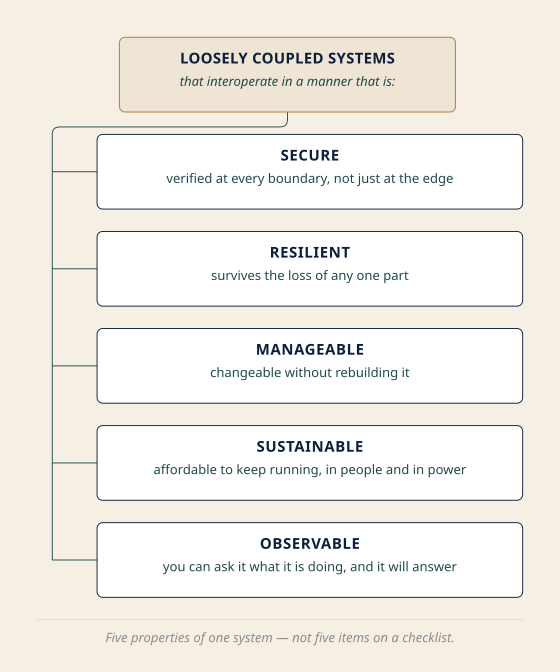
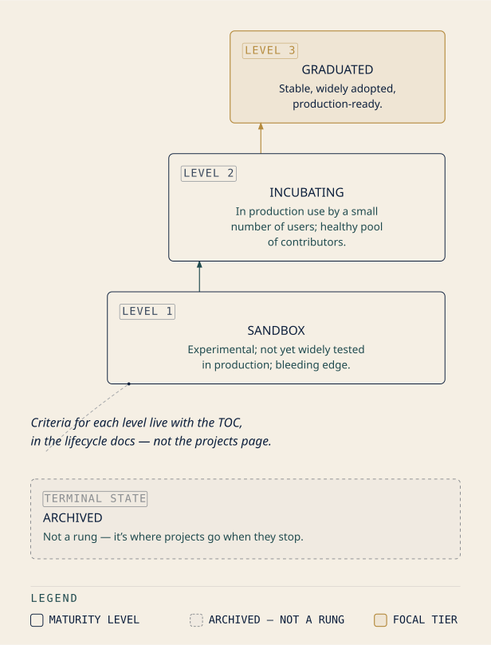

# Chapter 17: The Fleet and Its Charts

## *"Meshes, functions, autoscalers, and the foundation that keeps the map"*

**Domain Weight: 12% | Complexity: Mixed | Novelty: Moderate**

<!-- AUTHOR-REVIEW: The 12% above is the published weight of Domain 4, Cloud Native Architecture [source: cncf-kcna-certification-page-2026-08-23]. This chapter carries roughly 7 of those 12 points and Chapter 18 carries the rest; that 7/5 split is this book's authored allocation, not a CNCF figure. CNCF publishes four domain weights and no sub-competency weights. Per outline Open Question 12 and B1 gap G33, the metadata line above must show 12%, and the allocation disclosure must appear in prose — it does, in Why This Chapter Matters.

SECOND, ADDED AT REVISION: the Dead Reckoning block below states that Domain 4 has three competencies and names them (Cloud Native Ecosystem and Principles; Cloud Native Community and Collaboration; Cloud Native Observability). No cached snapshot supports the count or the names — cncf-kcna-certification-page-2026-08-23 publishes the four domain names and weights and nothing below that level, and the KCNA curriculum document (github.com/cncf/curriculum) is still an open research gap, tracked as G33. The competency names are how this book organizes the domain; if the curriculum repo is later cached, tag them or restate them to match. -->

---

## Attention Budget

**Total time: ~155 minutes | Recommended: Split across 2 or 3 sessions**

| Section | Time | Attention Cost | Best Time to Study |
|---|---|---|---|
| 🧭 Soundings | 10 min | Medium | Before you start reading properly |
| Why This Chapter Matters + What You'll Learn | 6 min | Low | Anytime |
| §1 What "Cloud Native" Actually Names | 8 min | Low | Anytime |
| §2 Sandbox, Incubating, Graduated, and Who Decides | 12 min | Medium | Mid-session |
| §3 Small Pieces, Replaced Whole | 6 min | Low | Anytime |
| ☆ Taking Your Bearings (1) | 8 min | Medium | After a short break |
| §4 Every Place Kubernetes Lets You In | 12 min | High | Peak attention |
| §5 A Network That Knows What It's Carrying | 14 min | High | Peak attention |
| ☆ Taking Your Bearings (2) | 7 min | Medium | After a short break |
| §6 Code Without a Server to Put It On | 8 min | Medium | Mid-session |
| §7 Four Things That Scale | 10 min | Medium | Mid-session |
| §8 How the Project Actually Runs, and How You'd Join | 12 min | Low | Anytime — but do not skip |
| ☆ Taking Your Bearings (3) | 7 min | Medium | After a short break |
| §9 One Pluggability Story | 4 min | Low | Read it awake |
| Exam Alert, Practice Questions, Chapter Summary | 30 min | High | A separate sitting |

**Attention Cost Key:**
- **Low:** Concrete, familiar concepts — study anytime
- **Medium:** New concepts requiring focus — study when alert
- **High:** Abstract or complex material — study at peak attention

*If you only have 15 minutes: read §4, then §9. Together they are the chapter's spine.*

*The natural split point is after Taking Your Bearings 2. §1 through §5 are the ecosystem's vocabulary; §6 through §9 are its shape. If you want a third session, take the Practice Questions on their own. Twenty-one items after two hours of reading is not a fair test of anything.*

---

> *"We democratize state-of-the-art patterns to make these innovations accessible for everyone."*
> — CNCF Cloud Native Definition v1.1 [source: cncf-cloud-native-definition-2026-08-23]

---

## 🧭 Soundings

Before reading this chapter, try these questions. Your score determines how to approach the content — no shame in any score, just different reading strategies.

1. For each of CRI, CNI, and CSI: which layer of the cluster does it serve?

2. Chapter 1 said that the common reading of *cloud native* — "it runs in a public cloud" — is not what the term means. In one sentence, and without looking it up: what do you think the published definition is actually about?

3. How many minor releases does the Kubernetes project support at any one time?

4. What makes a container a *sidecar*, and what does it share with the container beside it?

5. A HorizontalPodAutoscaler is created on a cluster where metrics-server was never installed. What happens?

6. A Pod that no node can satisfy: what phase is it in, and what does its continued existence state about the cluster?

7. Kubernetes organizes its contributors into named groups. What would you guess the primary, durable, topic-focused unit is called — and what would you call a group formed to work *across* several of them?

8. TLS terminates at the Ingress. What protects the leg from there to the Pod?

<details>
<summary>Click for answers + reading strategy</summary>

**1.**

| Acronym | Layer |
|---|---|
| CRI | The container runtime on the node |
| CNI | Pod networking |
| CSI | Storage |

*[cross-bearing: see Ch 2 §4 — the container runtime interface]*, *[cross-bearing: see Ch 9 §1 — four rules and a plugin]*, *[cross-bearing: see Ch 11 §5 — who actually provides the storage]*.

**2.** Open-ended, and almost everyone gets this partly wrong, which is the point. Hold whatever sentence you wrote. §1 opens with the published definition verbatim, and you will be able to measure your answer against it word for word.

**3.** Three. The project maintains release branches for the most recent three minor releases [source: k8s-release-cycle-and-cadence-2026-08-31]. If you had this cold, Chapter 8 §6 stuck. If you did not, §8 repairs it, and pairs it with the fact that explains it.

**4.** A sidecar is a second container in the same Pod, running alongside the main application container. It shares the Pod's network namespace, meaning it reaches the main container on `localhost`, and it can share the Pod's volumes. *[cross-bearing: see Ch 5 §2 — more than one container aboard]*.

**5.** The HorizontalPodAutoscaler object is created successfully. Nothing scales. The HPA needs the Metrics API to read utilization from, and on a cluster with no metrics-server, or any equivalent implementation, nothing is serving it. The object exists; the component that would act on it does not. *[cross-bearing: see Ch 13 §7 — numbers nobody collects by default]*.

**6.** `Pending`. And its continued existence is a standing, machine-readable statement that the cluster is short of somewhere to put work. *[cross-bearing: see Ch 7 §2 — what makes a node feasible]*.

**7.** The primary durable unit is a **SIG**, a Special Interest Group. A group formed to work across several of them is a **Working Group**. If you got the first and guessed at the second, you scored exactly what most readers score here, and §8 is where the guess becomes knowledge.

**8.** Nothing, by default. TLS terminates at the Ingress and the traffic continues to the Pod in the clear. NetworkPolicy can say who may talk to whom, but it cannot encrypt anything. *[cross-bearing: see Ch 10 §7 — what NetworkPolicy cannot do]*. Hold onto this one; §5 is about the layer that closes that gap.

---

**If you got 6+ right:** Skim the technical sections. But read §2 and §8 properly, at normal pace. They are the two sections a strong technical score predicts nothing at all about, and they are where this chapter's points are most often left on the table.

**If you got 3–5 right:** Read at normal pace. This chapter is calibrated for you.

**If you got 0–2 right:** Read carefully, and before you start, go back and re-read **Chapter 2 §8** and **Chapter 11 §5**. Not alongside this chapter; before it. Those two sections are where the four-interface thread was last picked up, and §4 of this chapter is close to unreadable without them.

</details>

---

## Why This Chapter Matters

Two chapters have just handed you a boundary and a method: whose problem a failure is, and how to work out what broke. This chapter does not change the subject. It changes altitude.

Everything from Chapter 2 forward has been *inside* one cluster: its components, its objects, its traffic, its storage, its failures. This chapter is about the thing that cluster is an instance of. And it opens by paying a debt that has been outstanding since page one.

Chapter 1 named the phrase *cloud native*. It said the near-universal reading, "it runs in a public cloud," is not what the term means. Then it declined to define it, and pointed here. That is the longest-running open loop in this book, and §1 closes it with the actual published document rather than a paraphrase.

But the chapter's real withheld question is larger and quieter, and it was planted back in Chapter 2. **Why does Kubernetes keep doing the same thing?**

Four times now you have watched Kubernetes define an interface and hand the implementation to somebody else. Runtimes, in Chapter 2. Networking, in Chapter 9. Storage, in Chapter 11. Object types themselves, in Chapter 6. Each time it looked like a local design decision about that one problem: a sensible way to handle runtimes, a sensible way to handle storage. §4 puts all four side by side. §9 says what they are evidence of.

Chapter 2 §8 promised you this would feel like recognition rather than a fourth list. Keeping that promise is this chapter's job, and there is only one way to keep it: you have to arrive already holding all four. If Soundings question 1 was uncomfortable, that is worth ten minutes of back-reading before you continue.

> **Dead Reckoning:** This chapter covers Domain 4 of the KCNA curriculum, Cloud Native Architecture, which is 12% of the exam [source: cncf-kcna-certification-page-2026-08-23]. Domain 4 has three competencies. Observability belongs to Chapter 18. This chapter carries the other two: Cloud Native Ecosystem and Principles, and Cloud Native Community and Collaboration. It is the only chapter in this book that carries two whole competencies, which is why it is also the longest. CNCF publishes weights for the four domains and does not publish weights for the competencies inside them. The split of Domain 4's points between this chapter and the next is this book's judgment, not a published figure.

There is an identity shift buried in that dry paragraph, and it deserves naming. Up to here you have been a competent user of somebody else's software. This chapter puts you inside the community that produces it: a community with a published definition of its own terms, a graduation ladder its projects climb, a technical committee that decides what belongs, a contributor ladder that anyone reading this could start climbing on a Tuesday afternoon, and a release train that explains why the version numbers behave the way Chapter 8 said they do.

That last connection is the chapter's quietest payoff. Three minor releases a year, and three supported minor versions, are not two facts you have to remember separately. They are one fact stated twice. A reader who sees that will never lose either half again.

Now, the stakes, stated plainly rather than dramatized. Domain 4 is the smallest domain on the exam. It also has the highest ratio of names to mechanics: the most things to recognize, the fewest things to reason through. That combination makes it simultaneously the cheapest available points and the most commonly forfeited ones. Chapter 1 already said this to one class of reader's face: *Chapter 17's community and collaboration material is, in my experience, what technically strong candidates skip most often. It looks like soft content next to the technical chapters.*

§2 and §8 exist because of that sentence. They carry ⚪ Foundation difficulty markers for the same reason: not because the material is easy, but because the signal you need when scanning the left margin is *everyone needs this*, not *optional depth*.

## What You'll Learn

By the end of this chapter, you'll be able to:

- **Quote** the CNCF's published definition of *cloud native*, and name the five characteristics it attaches to loosely coupled systems
- **Place** any CNCF project on the maturity ladder — and, more usefully, say who decides and where the criteria live
- **State** the shape that CRI, CNI, CSI and CRDs have in common, without being handed the four names first
- **Distinguish** a service mesh's data plane from its control plane, and both of those from the control plane you have been reading about since Chapter 3
- **Say** which axis each autoscaler moves — replicas, resources, or nodes — and which of them the cluster does not ship
- **Name** the difference between a SIG, a Working Group and a Committee, and explain why three releases a year and three supported versions are the same fact

*You'll also stop treating the ecosystem as trivia around the edges of the technology, which is the habit that costs well-prepared candidates the most points on the smallest domain.*

---

## ⚪ §1 — What "Cloud Native" Actually Names

Chapter 1 used a phrase and refused to define it. Here is the document it was refusing to paraphrase.

> Cloud native practices empower organizations to develop, build, and deploy workloads in computing environments (public, private, hybrid cloud) to meet their organizational needs at scale in a programmatic and repeatable manner. It is characterized by loosely coupled systems that interoperate in a manner that is secure, resilient, manageable, sustainable, and observable.
>
> Cloud native technologies and architectures typically consist of some combination of containers, service meshes, multi-tenancy, microservices, immutable infrastructure, serverless, and declarative APIs — this list is non-exhaustive.
>
> These techniques enable loosely coupled systems that are resilient, manageable, and observable. Combined with robust automation, they allow engineers to make high-impact changes frequently and predictably with minimal toil and clear separation of concerns.
>
> The Cloud Native Computing Foundation seeks to drive adoption of this paradigm by fostering and sustaining an ecosystem of open source, vendor-neutral projects. We democratize state-of-the-art patterns to make these innovations accessible for everyone.

[source: cncf-cloud-native-definition-2026-08-23]

That is CNCF Cloud Native Definition v1.1. It is short enough to read twice, and you should.

Now notice what is in the first sentence, and what your Soundings answer to question 2 probably said instead.

**"public, private, hybrid cloud."**

Before the first sentence is half over, the definition rules out the most common reading of the term it defines. *Cloud native* does not mean *runs in a public cloud*. A workload running on three servers in a closet in your own building can be cloud native. A workload running on the largest public cloud on earth can fail to be. The phrase is about *how you build and operate*, not *where the machines are*.

That is the whole misconception, retired in one clause, and you have now met it directly rather than being lectured about it.

### The clauses, one at a time

The definition does four distinct things, and pulling them apart makes it far easier to hold.

**The practices clause.** *Develop, build, and deploy workloads in computing environments to meet organizational needs at scale in a programmatic and repeatable manner.* Every load-bearing word here is about method. *Programmatic:* machines do it, not people typing. *Repeatable:* doing it again produces the same result. *At scale:* the method does not fall apart when there are a thousand of the thing instead of three. If you have ever wondered why this book has spent so much of its length on declarative objects and controllers that reconcile, that clause is why. *[cross-bearing: see Ch 4 §1 — you file a declaration]*.

**The characteristics clause.** This is the part the exam can quote at you, so it is the part to know verbatim.

> **★ Fixed Point**
>
> Cloud native is characterized by **loosely coupled systems** that interoperate in a manner that is **secure, resilient, manageable, sustainable, and observable**.

Five characteristics, attached to loosely coupled systems. Not five characteristics floating free. The loose coupling is the spine, and the five are what a loosely coupled system has to manage to be worth having. Each one is a real requirement with teeth:

<!-- FIGURE: ch17-fig01-cloud-native-definition-characteristics -->


<!-- ASCII-FALLBACK
```
                  LOOSELY COUPLED SYSTEMS
                  that interoperate in a manner that is:
                              |
    +---------+---------+-----+-----+---------+-----------+
    |         |         |           |         |           |
 SECURE   RESILIENT  MANAGEABLE  SUSTAINABLE      OBSERVABLE

 verified   survives   changeable   affordable    you can ask
 at every   the loss   without       to keep      it what it
 boundary,  of any     rebuilding    running,     is doing,
 not just   one part   it            in people    and it will
 at the                              and in       answer
 edge                                power
```
-->

*The five characteristics of a cloud native system, hung on the loose coupling that makes them necessary. The list is short enough to memorize and worth memorizing; the annotations are what each one costs you if you skip it.*

**The technology clause.** *Containers, service meshes, multi-tenancy, microservices, immutable infrastructure, serverless, and declarative APIs.* Seven items, and then, in the same sentence, **"this list is non-exhaustive."**

> 🪝 **Snag:** Do not treat those seven as a closed set. The definition says outright that they are not one. It is a natural reader error, since a list of exactly seven things printed in an authoritative document looks like a complete enumeration, and it is a natural exam trap for exactly the same reason. What makes it worth flagging here specifically is that §4 of this chapter *does* teach a set that genuinely is closed. Two lists, three sections apart, and only one of them is finite.

**The payoff clause.** *High-impact changes made frequently and predictably with minimal toil and clear separation of concerns.* This is what all of it is for. Not elegance, not modernity: the ability to change important things often, without drama, without a person staying up all night to do it. If a practice does not move you toward that, it is cargo cult.

### The institution behind the document

You met the CNCF in Chapter 1 as the body that issues this credential and publishes the exam blueprint. That is one true thing about it and not the interesting one.

The Cloud Native Computing Foundation is part of the nonprofit Linux Foundation [source: cncf-who-we-are-2026-08-23], and its mission is stated in one line: **to make cloud native computing ubiquitous** [source: cncf-charter-governance-bodies-2026-08-31]. It hosts critical components of global technology infrastructure, Kubernetes and Prometheus and Envoy among them: 227 projects at the time of this book's research, across four categories, with 715 member organizations and over 329,000 project contributors [source: cncf-who-we-are-2026-08-23].

The operative word in the definition's last paragraph is **vendor-neutral**. The CNCF does not sell you anything. It holds projects that no single company owns, so that a company adopting Kubernetes is not making a bet on one vendor's continued goodwill. That is not a marketing claim; it is a structural one, and §2 is about the structure that makes it true.

*[cross-bearing: see Ch 2 §1 — what a container actually is]*, if you want to see the definition's first technology land on something concrete. And *[cross-bearing: see Ch 17 §3 — small pieces, replaced whole]* is where three more of them get their own treatment.

---

## ⚪ §2 — Sandbox, Incubating, Graduated, and Who Decides

The CNCF hosts hundreds of projects. Some of them are running production traffic for banks. Some of them are three people and a good idea. The foundation's answer to *how would a stranger tell which is which* is a maturity ladder, and the ladder is the durable, examinable fact of this section.

### The three rungs

> **★ Fixed Point**
>
> **Sandbox → Incubating → Graduated**, in that order.
>
> - **Sandbox** — experimental projects, not yet widely tested in production, on the bleeding edge of technology.
> - **Incubating** — used successfully in production by a small number of users, with a healthy pool of contributors.
> - **Graduated** — stable, widely adopted, production ready, attracting thousands of contributors.
>
> [source: cncf-project-maturity-levels-2026-08-23]

Read those three descriptions as claims about *evidence*, not about quality. A Sandbox project is not bad; it is unproven. An Incubating project is not half-finished; somebody is running it in production and there are enough hands on it to keep it alive. A Graduated project is one where the evidence is overwhelming enough that the foundation is willing to point at it and say: this is safe to build on.

There is a fourth word you will meet if you browse cncf.io, and it is not a rung. **Archived**, "inactive or low activity projects that are no longer supported" [source: cncf-toc-project-lifecycle-process-2026-08-31], is where projects land when nobody is maintaining them any more. Projects do not climb to it. The three-rung progression is correct as a progression, and Archived is the exit.

<!-- FIGURE: ch17-fig05-cncf-maturity-levels -->


<!-- ASCII-FALLBACK
```
                                    +--------------------+
                                    |     GRADUATED      |
                                    |  stable, widely    |
                                    |  adopted,          |
                                    |  production ready  |
                    +---------------+--------------------+
                    |    INCUBATING                      |
                    |  in production use by a small       |
                    |  number of users; healthy pool      |
                    |  of contributors                    |
    +---------------+-------------------------------------+
    |    SANDBOX                                          |
    |  experimental; not yet widely tested in             |
    |  production; bleeding edge                          |
    +-----------------------------------------------------+

    ^ the criteria for each step live with the TOC, in the
      project lifecycle documentation -- NOT on the projects page

    ( ARCHIVED is not a rung. It is where projects go when
      they stop. See below. )
```
-->

*The ladder, annotated with what each level asserts. No project names appear on this figure deliberately — the roster changes, and a figure is the hardest thing in a book to update.*

> ⚓ **Worth Securing:** Learn the *levels*, not the roster. Which specific projects are Graduated on the day you sit the exam is a moving target, and no responsible study guide should ask you to memorize a list that changes faster than it prints. What does not move is what each level *asserts*, and that is what a well-built question tests.

That said, a ladder with nothing standing on it is hard to remember. Here are six Graduated projects you have already met by name in this book, as of the 2026-08-23 snapshot of the CNCF projects page [source: cncf-project-maturity-levels-2026-08-23]: **containerd**, **CoreDNS**, **etcd**, **Helm**, **Prometheus**, and **Argo**. Kubernetes itself is Graduated too, which is worth a moment's thought: it climbed the same ladder as everything else. Two or three more projects will have their level named later in this chapter, where the level does specific work in the argument. The instruction above still stands. Do not memorize the roster.

*[cross-bearing: see Ch 3 §1 — how the cluster got the shape it has]*, if you want the history of how the foundation's first project got there.

### Where the criteria actually live

> 🪝 **Snag:** The projects page tells you what the levels *mean*. It does not tell you what a project must *do* to move between them. The criteria live in the **CNCF TOC's project lifecycle documentation**, in the TOC's own repository [source: cncf-project-maturity-levels-2026-08-23]: the due diligence, the adopter interviews, the governance and security requirements. A question that asks where graduation criteria are defined is testing whether you know these are two different documents.

The process itself is more concrete than most people expect. A project applies by opening an application issue on the TOC repository and completes an adopter interview form, naming real adopters willing to be interviewed. A TOC sponsor is assigned. There is a kickoff meeting, a due diligence document, actual interviews with those adopters, an internal TOC comment period, and then a public comment period. Finally the TOC votes [source: cncf-toc-project-lifecycle-process-2026-08-31].

That is not a rubber stamp. It is a months-long evidence-gathering exercise in which strangers are asked, on the record, whether they actually run the thing.

> 🔭 **Closer Look:** The exact numbers, for the curious, and not exam material: the adopter interview form asks for **five to seven adopters**, the internal TOC comment period runs about **one week**, the public comment period **two weeks**, and the vote requires a **two-thirds supermajority** of the TOC [source: cncf-toc-project-lifecycle-process-2026-08-31]. Learn the shape of the process; the numerals are the TOC's operating detail, not the blueprint's.

> 🔭 **Closer Look:** The lifecycle document says "Incubation" where the projects page says "Incubating": one names the process, the other names the level. This book uses **Incubating** throughout, matching the projects page and the level name. If you see both forms in the wild, they refer to the same rung.

### Who decides what, and why the split matters

The CNCF has more than one governing body, and the exam cares about which does what. The clean version comes straight from the foundation's charter.

**The Governing Board** is "responsible for marketing and other business oversight and budget decisions for the CNCF" [source: cncf-charter-governance-bodies-2026-08-31]. Money, marketing, and the boundaries of what the foundation is for.

**The Technical Oversight Committee, the TOC,** is the technical governing body. The charter says the TOC facilitates "driving neutral consensus for: defining and maintaining the technical vision for the Cloud Native Computing Foundation" [source: cncf-charter-governance-bodies-2026-08-31]. Its own README expands the list: approving new projects **within the scope of the CNCF set by the Governing Board**; creating a conceptual architecture for the projects; aligning projects; removing or archiving them; accepting feedback from the end user technical advisory board and mapping it to projects [source: cncf-toc-and-tags-2026-08-23].

> 🪢 **Mnemonic:** **The Board draws the fence. The TOC decides what lives inside it.** The Board sets the scope and holds the budget; the TOC approves projects within that scope and owns the technical vision. That one sentence covers the most commonly confused pair in this section.

**Technical Advisory Groups, TAGs,** are the TOC's technical arms. They are "the primary organizational units within the CNCF that oversee and coordinate interests across projects, working groups, and the broader cloud native community," and they "serve as bridges between CNCF projects, end users, and the Technical Oversight Committee" [source: cncf-tags-current-structure-2026-08-31].

> ⚠ **Navigational Hazards**
>
> **The TAG list was restructured in 2025, and older study material has the old one.**
>
> The five current TAGs [source: cncf-tags-current-structure-2026-08-31]:
>
> | TAG | Scope, in the source's own words |
> |---|---|
> | **Developer Experience** | Databases, Microservices, Streaming, Messaging, API Management, Developer Frameworks |
> | **Infrastructure** | Data, Storage, Network, DNS, Compute, Service Mesh, Infrastructure-as-Code, Edge, Sovereignty, Load Balancing |
> | **Operational Resilience** | Observability, Management, Business Continuity, Resource Optimization, Cost Efficiency, Energy, Performance, Troubleshooting, Reliability, Day 2 Operations |
> | **Security and Compliance** | Security Hygiene, Policy-as-Code, Compliance, Auditing, Threat Modeling, Secure Software Supply Chain |
> | **Workloads Foundation** | Fundamental cloud native workload execution environments and lifecycle management |
>
> The **pre-2025** list — App Delivery, Contributor Strategy, Environmental Sustainability, Network, Observability, Runtime, Security, Storage [source: cncf-toc-and-tags-2026-08-23] — appears throughout older guides, blog posts and courses, which means you may well arrive holding it. The restructuring was approved by the TOC and announced in May 2025 [source: cncf-tags-current-structure-2026-08-31]. If a question offers you "TAG Observability," it is offering you the old map.

**The End User Technical Advisory Board, the End User TAB,** is the last piece, and it closes a loop. The charter says the TAB "will serve as the voice of End Users in the CNCF community, advance topics of concern to End Users, and raise awareness about the needs and perspectives of end users" [source: cncf-charter-governance-bodies-2026-08-31]. And the TOC's own list of responsibilities includes "accepting feedback from the end user technical advisory board and mapping it to projects" [source: cncf-toc-and-tags-2026-08-23]. The TAB collects what the people running this software actually need; the TOC turns that into project direction. It is a designed feedback path, not a suggestion box.

*[cross-bearing: see Ch 17 §8 — how the project actually runs]* for the Kubernetes-internal governance that sits inside all this, and which is a genuinely different structure with confusingly similar vocabulary.

### The map of the terrain

The **CNCF Landscape** is the foundation's attempt to chart the whole space, not just its own projects. Its own repository describes it as "a map through the previously uncharted terrain of cloud native technologies," attempting to categorize most of the projects and product offerings in the space, "of which CNCF-hosted projects are a particularly well-traveled path" [source: cncf-landscape-and-community-2026-08-23].

The interactive version at landscape.cncf.io is generated from the repository's data files. Entries must represent cloud native technologies with meaningful community adoption, fit an existing category, and appear in the single category where they best fit. The categories group by layer [source: cncf-landscape-and-community-2026-08-23]:

- **Provisioning** — automation and configuration, container registries, security and compliance, key management
- **Runtime** — cloud native storage, container runtime, cloud native network
- **Orchestration and Management** — scheduling and orchestration, coordination and service discovery, service proxy, API gateway, service mesh
- **App Definition and Development** — databases, streaming and messaging, application definition and image build, continuous integration and delivery
- **Observability and Analysis** — monitoring, logging, tracing, chaos engineering
- **Platforms and Special** — Kubernetes distributions, hosted and installable platforms, PaaS and container services, serverless

Read that list slowly and you will notice something: it is roughly the table of contents of this book, in a different order. Runtime is Chapter 2. Cloud native network is Chapters 9 and 10. Cloud native storage is Chapter 11. Scheduling and orchestration is Chapters 3 through 8. CI/CD is Chapters 14 and 15. Service mesh and serverless are two sections from now. Observability is Chapter 18.

Entries are also tagged by the TAG that owns them, which is the connective tissue between the two halves of this section: the governance structure and the map are the same structure, seen from different sides.

<!-- AUTHOR-REVIEW: cost management — FinOps, OpenCost, Kubecost — is deliberately omitted from this chapter. The Landscape's own categories do not name a cost layer, `opencost-overview-2026-08-23.md` sits unused in the corpus, and the KCNA curriculum's D4 sub-objectives are not enumerated in any cached source (gap G33), so this is a judgment call rather than a sourced exclusion. If reversed, the minimal home is one ungraded clause beside the Landscape's Observability and Analysis category above. Recorded so the decision is visible rather than silent. -->

*[cross-bearing: see Ch 2 §5 — the Open Container Initiative]*, which is a different standards body with an overlapping mission and is worth keeping distinct in your head. And *[cross-bearing: see Ch 15 §6 — the other agent]*, where you last met a Graduated project being named as such.

---

## 🔵 §3 — Small Pieces, Replaced Whole

Three of the definition's technologies deserve their own treatment, and they deserve it *together*, because separately they are three definitions and together they are one argument.

### Microservices

> A microservices architecture is an architectural approach that breaks applications into individual independent (micro)services, with each service focused on a specific functionality.

[source: cncf-glossary-microservices-monoliths-coupling-2026-08-31]

The problem it addresses is stated most sharply as a scaling complaint. In a monolith, if one function of the application gets hammered, "the entire app would have to be scaled to accommodate the increase — a very inefficient use of resources" [source: cncf-glossary-microservices-monoliths-coupling-2026-08-31]. Everything ships together, so everything scales together.

Breaking the app apart lets "different teams to work simultaneously on a small part of a bigger application without inadvertently negatively impacting the rest of the app" [source: cncf-glossary-microservices-monoliths-coupling-2026-08-31].

But the glossary is unusually honest about the bill: "it also creates operational overhead — the things you need to deploy and keep track of increase by order of magnitude" [source: cncf-glossary-microservices-monoliths-coupling-2026-08-31]. And the entry on **monolithic apps** goes further, arguing the other side outright: early in a product's lifecycle it may be advantageous to defer the complexity and build a monolith until the product is determined successful. "Crafting a microservices-based app before it has proven valuable may be premature spending of engineering effort. If the application yields no value, that effort becomes wasted" [source: cncf-glossary-microservices-monoliths-coupling-2026-08-31].

> ⚓ **Worth Securing:** The CNCF's own glossary says a well-designed monolith "can uphold lean principles by being the simplest way to get an application up and running." That is the foundation for cloud native computing saying, in writing, that microservices are not always the right answer. Take it as a license to think rather than a license to argue: the exam tests what microservices *are* and what they trade away, not which you should pick.

### Loose coupling

**Loosely coupled architecture** is the property that makes any of it work: an architectural style where individual components are built independently of one another, each performing a specific function in a way that can be used by any number of other services. It is "generally slower to implement than tightly coupled architecture but has a number of benefits, particularly as applications scale," chiefly that teams can "develop features, deploy, and scale independently" [source: cncf-glossary-microservices-monoliths-coupling-2026-08-31].

This is the same loose coupling the definition in §1 hung its five characteristics on. It is not a separate concept that happens to share a name.

### Immutable infrastructure

> **Immutable Infrastructure refers to computer infrastructure (virtual machines, containers, network appliances) that cannot be changed once deployed.**

[source: cncf-glossary-immutable-infrastructure-2026-08-31]

You do not patch a running thing. You build a new thing and replace the old one. Enforcement comes either from automation that overwrites unauthorized modifications, or from systems that prevent changes altogether.

The benefit the glossary emphasizes is not security. Notice which one it reaches for first: "Operating such a system becomes a lot more straightforward because administrators can make assumptions about it" [source: cncf-glossary-immutable-infrastructure-2026-08-31]. When nothing drifts, what you deployed is what is running, and you can reason about it. Combined with version control, "there is a durable audit log of every authorized change to a system" [source: cncf-glossary-immutable-infrastructure-2026-08-31].

> 🪝 **Snag:** This is the book's *second* immutability and it is not the same as the first. Chapter 2 §2 taught **image immutability**: an image, once built, has fixed content addressed by digest. **Immutable infrastructure** is the operational discipline of replacing rather than modifying deployed things. The image being immutable is what makes the infrastructure discipline possible; they are not the same claim. Always write the full two-word phrase. *[cross-bearing: see Ch 2 §2 — what's inside an image]*.

### Declarative APIs

You have known this one since Chapter 4 and it does not need re-teaching. What it needs is placement: **declarative APIs are named in the CNCF definition as a cloud native technology**, alongside containers and microservices [source: cncf-cloud-native-definition-2026-08-23]. The thing you have been doing since Chapter 4, describing desired state and letting a controller reconcile, is not a Kubernetes quirk. It is a named characteristic of the whole paradigm. *[cross-bearing: see Ch 4 §1 — you file a declaration]*.

### Why these three are one argument

Here is the connection, and it is the only thing in this section that is not available elsewhere in the book.

You can only replace a piece *whole* if the piece is small and independently deployable. That is microservices. You can only make replacement the default operation if the thing being replaced was never meant to be edited in the first place. That is immutable infrastructure. And you can only do that safely, repeatedly, at scale, if what you replace it with is *described* rather than *commanded*, if you can say "there should be five of these, at this version" and have something else work out the difference. That is declarative APIs.

Take any one away and the other two get much harder. Small pieces you have to patch in place are just a distributed monolith with extra network hops. Immutable replacement of a monolith means redeploying everything to change one line. Declarative desired state over components you edit by hand is a description that is constantly wrong.

That is what §1's "loosely coupled systems… combined with robust automation" is actually made of.

> 🔭 **Closer Look:** If several of these feel familiar from Chapter 15, that is not a coincidence: several of the twelve factors are these same principles under older names, written for a platform that did not exist yet. *[cross-bearing: see Ch 15 §1 — twelve factors]*. Also relevant: *[cross-bearing: see Ch 5 §4 — scheduled once, replaced never]*, which is immutable infrastructure enacted at the Pod level, and where you first met the replacement discipline as a concrete behavior rather than a principle.

---

## ☆ Taking Your Bearings: The Definition, the Ladder, and Who Decides

Six questions. One of them reaches back fifteen chapters.

**1.** Which of the following is stated *in* the CNCF Cloud Native Definition v1.1?

A) Cloud native architecture requires a service mesh, a container runtime, and declarative APIs at minimum
B) Cloud native workloads are those that run in public cloud environments rather than on-premises
C) Cloud native systems are characterized by loosely coupled systems that interoperate securely, resiliently, manageably, sustainably, and observably
D) Cloud native applications must be decomposed into microservices before they qualify as cloud native

**2.** A colleague tells you a project is "CNCF Incubating." What has that project demonstrated?

A) Production use by a small number of users, with a healthy pool of contributors
B) That it is experimental and not yet widely tested in production
C) That it is stable, widely adopted, and production ready
D) That it has been inactive long enough to lose support

**3.** Where are the criteria a project must meet to graduate defined?

A) On the cncf.io projects page, beside each maturity level
B) In the CNCF Landscape repository's data files
C) In the CNCF charter, alongside the responsibilities of the governing bodies
D) In the CNCF TOC's project lifecycle documentation

**4.** Which body approves new CNCF projects, and within what constraint?

A) The Governing Board, within the technical vision set by the TOC
B) The TOC, within the scope of the CNCF set by the Governing Board
C) The End User TAB, within the categories defined by the Landscape
D) Any Technical Advisory Group, within its own technical area

**5.** The CNCF Cloud Native Definition lists containers, service meshes, multi-tenancy, microservices, immutable infrastructure, serverless, and declarative APIs. What does the definition say about this list?

A) These seven are the complete set of cloud native technologies
B) That every cloud native system uses containers, and the other six are optional
C) That the list is ordered by importance, containers first
D) That the list is non-exhaustive

**6.** `[retrieval: ch2]` A container image, once built, cannot be altered — a change produces a new image with a new digest. A production environment practicing *immutable infrastructure* never patches a running server; it replaces it. What is the relationship between these two ideas?

A) They are the same principle, described at two different scales
B) Immutable infrastructure is the CNCF's term for image immutability
C) The first is a property of a build artifact; the second is an operational discipline for deployed systems, and the first makes the second practical
D) Image immutability applies to containers; immutable infrastructure applies only to virtual machines

---

**Answers with Explanations:**

**1. C.**

- **A is wrong.** No specific technology is required. Service meshes and declarative APIs appear in the technology list, which the definition explicitly calls non-exhaustive.
- **B is wrong**, and it is wrong in the most instructive possible way. The definition's very first sentence names "public, private, hybrid cloud." Reading *cloud native* as *public cloud* is the single most common misconception about the term, and the definition rules it out in its opening sentence.
- **C is correct** — verbatim from the definition's second sentence [source: cncf-cloud-native-definition-2026-08-23].
- **D is wrong** for the same reason as A. Microservices are listed as a typical component, not a requirement, and the glossary elsewhere argues that a monolith can be the right choice.

**2. A.** Straight from the projects page: Incubating projects are "used successfully in production by a small number of users with a healthy pool of contributors" [source: cncf-project-maturity-levels-2026-08-23]. **B** is Sandbox: experimental, bleeding edge, not widely tested. **C** is Graduated: stable, widely adopted, production ready. **D** is Archived, which is not a rung on the ladder at all but the terminal state for projects that are no longer maintained.

**3. D.** The projects page describes what the *levels* mean; the criteria for moving between them, due diligence and adopters and governance and security practices, are in the TOC's project lifecycle documentation in the TOC repository [source: cncf-project-maturity-levels-2026-08-23]. **A** is the trap, and it is a reasonable-sounding one: the levels and the criteria feel like they should live together, and they do not. **B** is the Landscape, which catalogs the terrain and has nothing to do with graduation. **C** is the charter, which establishes the bodies and their responsibilities, not the project criteria.

**4. B.** The TOC approves "new projects within the scope of the CNCF set by the Governing Board" [source: cncf-toc-and-tags-2026-08-23]. **A** inverts the relationship: the Board does not work within the TOC's vision; the TOC works within the Board's scope. **C** misassigns the End User TAB, which is the voice of end users in community decisions and feeds requirements to the TOC; it does not approve projects. **D** misassigns TAGs, which coordinate across projects and bridge to the TOC; project approval is the TOC's own vote.

**5. D.** "This list is non-exhaustive" appears in the definition itself, in the same sentence as the list [source: cncf-cloud-native-definition-2026-08-23].

- **A is wrong**, and it is the misreading the definition preemptively refutes. Seven items in an authoritative document read like an enumeration; the document says otherwise in the same breath.
- **B is wrong**, and it is the most widely held belief in this space. Containers are the first-named technology, not a requirement. The definition names no mandatory member of the list.
- **C is wrong.** No ordering claim appears anywhere in the document.

**6. C.** Two different immutabilities. Image immutability *(Ch 2 §2)* is a property of a build artifact: fixed content, addressed by digest. Immutable infrastructure is an operational discipline for deployed systems, infrastructure "that cannot be changed once deployed" [source: cncf-glossary-immutable-infrastructure-2026-08-31], and the reason it is practical at all is that the artifacts you replace things with are themselves fixed and identifiable.

- **A is wrong** because they are not the same principle; one is a property, the other is a practice, and you can have the first without adopting the second.
- **B is wrong** — the CNCF glossary carries both concepts under different entries.
- **D is wrong.** The glossary's own definition names "virtual machines, containers, network appliances" together. Neither concept is confined to one substrate.

---

**How'd You Do?**

**5–6 correct:** You have the ecosystem's vocabulary. §4 is the chapter's spine; go there rested.

**3–4 correct:** Solid. Review the ones you missed and continue. §4 does not depend on this section, so nothing is blocked.

**0–2 correct:** Stop before §4. Re-read **§1's characteristics clause** and **§2's three rungs**. Those are the two blocks the Exam Alert and the Chapter Summary will both come back to, and they are ten minutes of re-reading rather than a re-read of the section. If it was specifically question 6 you missed, the fastest repair is **Chapter 2 §2**.

---

**Checkpoint: You've Now Mastered**

✓ The published definition of *cloud native*, its five characteristics, and what it explicitly does not mean
✓ The maturity ladder, what each rung asserts, and where the criteria live
✓ The CNCF's governing bodies and which one does what
✓ Microservices, loose coupling, and immutable infrastructure as one mutually reinforcing argument

That is the ecosystem's vocabulary. The next two sections are the ones with teeth, and the first of them is the section more of this book points at than any other.

---

## 🔵 §4 — Every Place Kubernetes Lets You In

Four times in this book you have watched the same thing happen.

Chapter 2: Kubernetes needs to run containers. It does not implement a container runtime. It publishes the **Container Runtime Interface**, and containerd or CRI-O implements it. *[cross-bearing: see Ch 2 §4 — the container runtime interface]*.

Chapter 9: Kubernetes needs pod networking. It does not implement it. It requires a plugin that satisfies the **Container Network Interface**, and Calico or Cilium or Flannel implements it. *[cross-bearing: see Ch 9 §1 — four rules and a plugin]*.

Chapter 11: Kubernetes needs to attach storage. It does not implement storage. It publishes — well, it *adopts* — the **Container Storage Interface**, and a driver from a storage vendor implements it. *[cross-bearing: see Ch 11 §5 — who actually provides the storage]*.

Chapter 6: Kubernetes needs object types it did not anticipate. It does not add them. It provides **CustomResourceDefinitions**, and you or a vendor define the kinds you need, with controllers to act on them. *[cross-bearing: see Ch 6 §8 — the control loop, extended]*.

This section puts those four side by side. It does not redefine any of them; each was taught in full where you met it, and if any of the four is fuzzy, the pointer above is where to go rather than the paragraph below.

<!-- FIGURE: ch17-fig02-extension-points-map -->


<!-- ASCII-FALLBACK
```
            +==================================================+
            |          THE KUBERNETES API SURFACE              |
            |                                                  |
    (o)-----|  CRDs                     ..... new object kinds |
   Ch 6 §8  |                                                  |
            +==================================================+
            |               CONTROL PLANE                      |
            +==================================================+
            |               THE NODE                           |
            |                                                  |
    (o)-----|  CRI          ............. running containers   |
   Ch 2 §4  |                                                  |
            |                                                  |
    (o)-----|  CNI          ............. pod networking       |
   Ch 9 §1  |                                                  |
            |                                                  |
    (o)-----|  CSI          ............. attaching storage    |
   Ch 11 §5 |                                                  |
            +==================================================+

            (o) = a socket. Kubernetes defines the shape.
                  Somebody else supplies the plug.
```
-->

*The book's four pluggable interfaces, each marked at the layer it serves and the chapter that taught it. Four sockets, four chapters, one shape.*

### The judgment, stated as a judgment

> **★ Fixed Point**
>
> At every one of the four pluggable interfaces — **CRI, CNI, CSI, and CRDs** — Kubernetes defines an interface and hands the implementation to somebody else.

That grouping is *this book's*, and honesty requires saying so. Kubernetes does not publish a document titled "the four pluggable interfaces." What Kubernetes publishes is a longer, differently-cut list, and Chapter 10 promised you would see both maps side by side. Here is the other one.

The documentation's own extension points [source: k8s-docs-extending-kubernetes-2026-08-23]:

| # | Extension point | What it lets you replace or add |
|---|---|---|
| 1 | kubectl plugins and client credential providers | Client-side behavior |
| 2 | API access extensions | Authentication, authorization, dynamic admission control via webhooks *(Ch 8 §2)* |
| 3 | API extensions | CustomResourceDefinitions **and** the API aggregation layer |
| 4 | Scheduling extensions | Scheduler plugins, profiles, and custom schedulers *(Ch 7 §6)* |
| 5 | Controllers | Custom controllers over custom or built-in resources; the operator pattern |
| 6 | Infrastructure extensions | Device plugins; storage plugins (**CSI**); network plugins (**CNI**); container runtime (**CRI**); kubelet image credential providers |

Six extension points, with five plugin types crammed into the sixth, and custom resources filed under a completely different heading from the storage and network plugins they sit beside in our four.

Both maps are correct. They are answering different questions. The documentation is answering *where can I hook in?*, and the honest answer is "in a great many places, at very different levels of the stack." This book is answering *what is the pattern?*, and the four we picked are the four where the same thing happens: Kubernetes writes down what a thing must do, and then declines to be the thing.

> ⚓ **Worth Securing:** When two authoritative-looking lists of the same subject have different lengths, the useful question is almost never "which is right." It is "what is each one for." Hold both. The exam can ask you either.

### The extension surface beyond the four

Two members of the documentation's list deserve a sentence each, because you have not met them and they are in scope.

**The API aggregation layer** is the *other* way to add APIs. "The aggregation layer allows Kubernetes to be extended with additional APIs, beyond what is offered by the core Kubernetes APIs" [source: k8s-docs-api-aggregation-and-device-plugins-2026-08-31]. It runs in-process with the kube-apiserver and does nothing until you register an `APIService` object, which "claims" a URL path in the Kubernetes API. From then on, the aggregation layer proxies anything sent to that path to the registered service.

And the documentation adds a sentence that settles a question this section would otherwise have to argue: "The aggregation layer is different from Custom Resource Definitions, which are a way to make the kube-apiserver recognize new kinds of object" [source: k8s-docs-api-aggregation-and-device-plugins-2026-08-31].

With a CRD, the API server stores and serves your objects for you. With aggregation, you run your own API server and Kubernetes routes to it. More work, more flexibility. You have already met one in the wild: metrics-server registers itself through the aggregation layer, and its own installation notes say the "kube-apiserver must enable an aggregation layer" [source: metrics-server-install-2026-08-31]. *[cross-bearing: see Ch 13 §7 — numbers nobody collects by default]*.

**Device plugins** "let you configure your cluster with support for devices or resources that require vendor-specific setup, such as GPUs, NICs, FPGAs, or non-volatile main memory" [source: k8s-docs-api-aggregation-and-device-plugins-2026-08-31]. A device plugin registers with the kubelet, "sends the kubelet the list of devices it manages, and the kubelet is then in charge of advertising those resources to the API server as part of the kubelet node status update" [source: k8s-docs-api-aggregation-and-device-plugins-2026-08-31].

If that shape looks familiar, it should. Kubernetes does not know what a GPU is. It knows how to advertise a resource somebody else told it about.

### A note on the fourth interface's two names

Chapter 2 §4 called the set "CRI, CNI, CSI, and API extensions." This chapter, Chapter 6, Chapter 10 and Chapter 11 all call the fourth one **CRDs**.

Both are defensible, and the documentation is the reason: "API extensions" is the documentation's own heading for a category that contains *two* things, CRDs and the aggregation layer. When this book counts four interfaces, the fourth is specifically **CRDs**, because CRDs are the one where the interface-and-implementation shape is cleanest. The wider surface that Chapter 2 gestured at is the whole right-hand column above.

> 🪢 **Mnemonic:** **Run it, wire it, store it, name it.** CRI runs your containers. CNI wires them up. CSI stores their data. CRDs name things Kubernetes had never heard of. Four verbs, four sockets, in the order you met them if you read the book front to back.

*[cross-bearing: see Ch 8 §2 — three gates and a logbook]* for admission webhooks, *[cross-bearing: see Ch 7 §6 — overruling the scheduler, and replacing it]* for scheduler plugins, and *[cross-bearing: see Ch 12 §8 — rules that watch]* for the policy engines that live on the admission hook. Each of those is a place Kubernetes lets somebody else in.

One more, which is a genuinely useful detail rather than a completeness note: Helm charts have a `crds/` directory precisely because a chart that ships custom resources has to install the definitions before the objects that use them [source: helm-crd-best-practices-2026-08-31]. The packaging format had to grow a special case for the extension mechanism. *[cross-bearing: see Ch 14 §6 — which one, when]*.

<!-- AUTHOR-REVIEW: the Helm `crds/` claim in the paragraph above, and the Practice question built on it, are carried by cross-bearing to Ch 14 §6 rather than by a source tag — no Helm snapshot exists in this chapter's cached corpus. Ch 14 §6 owns the fact per the section skeleton, so the pointer is correct in kind, but a graded question is thinner support than a cross-reference usually has to bear. Either tag it to whatever helm.sh snapshot Ch 14 uses (cheapest, if that snapshot is in the full sources/ tree), or open a research gap for the Helm chart-structure documentation. -->

That is the map. §9 says what it means.

---

## 🟡 §5 — A Network That Knows What It's Carrying

Soundings question 8 asked what protects the leg from the Ingress to the Pod once TLS has terminated at the edge. The answer was *nothing, by default*, and Chapter 10 said so twice while pointedly declining to name a remedy.

This is the remedy.

### What a service mesh is

Start with the vendor-neutral definition, because it frames the problem before it sells the solution.

> In a microservices world, apps are broken down into multiple smaller services that communicate over a network. Just like your wifi network, computer networks are intrinsically unreliable, hackable, and often slow. Service meshes address this new set of challenges by managing traffic (i.e., communication) between services and adding reliability, observability, and security features uniformly across all services.

[source: cncf-glossary-service-mesh-2026-08-31]

The glossary is specific about what makes this hard without a mesh. Once you have hundreds or thousands of services all talking over the network, individual applications "may need to encrypt communications to support regulatory requirements, provide common metrics to operations teams, or provide detailed insight into traffic to help diagnose issues. If built into the individual applications, each one of these features will cause friction between teams and slow down development of new features" [source: cncf-glossary-service-mesh-2026-08-31].

And then the payoff sentence, which contains the whole point:

> **★ Fixed Point**
>
> Service meshes add reliability, observability, and security features uniformly across all services across a cluster **without requiring code changes**. Before service meshes, that functionality had to be encoded into every single service, becoming a potential source of bugs and technical debt.
>
> [source: cncf-glossary-service-mesh-2026-08-31]

Istio, the mesh this section teaches, states its own version in almost the same words: a service mesh "gives applications capabilities like zero-trust security, observability, and advanced traffic management, without code changes" [source: istio-service-mesh-2026-08-23].

> 🪝 **Snag:** *Without code changes* is not a marketing flourish. It is the defining property, and it is what a well-written exam question tests. If an answer option says a mesh requires the application to be modified, instrumented, or recompiled, that option is describing something else. The whole value proposition is that the application does not know the mesh is there.

Istio names three reasons you would want one [source: istio-service-mesh-2026-08-23]:

- **Security** — "a market-leading zero-trust solution based on workload identity, mutual TLS, and strong policy controls"
- **Observability** — telemetry generated within the mesh, integrating with tools such as Grafana and Prometheus
- **Traffic management** — service-level routing control, for use cases like A/B testing and canary deployments *(the strategy vocabulary is [cross-bearing: see Ch 15 §2 — ways to replace what's running])*

### The two planes — and the third one you already know

This is the most dangerous piece of vocabulary in the chapter, and it is dangerous for an honest reason: the two things share a name because they genuinely do the same *kind* of job, at different layers.

> **★ Fixed Point**
>
> A mesh's **data plane** is the set of proxies that mediate and control all network communication between services. A mesh's **control plane** is what manages and configures those proxies.
>
> Neither of them is the cluster's control plane from Chapter 3.
>
> [source: istio-service-mesh-2026-08-23]

<!-- FIGURE: ch17-fig03-mesh-data-vs-control-plane -->


<!-- ASCII-FALLBACK
```
   ############################################################
   #  THE CLUSTER'S CONTROL PLANE            ( Ch 3 §2 )      #
   #  kube-apiserver . etcd . scheduler . controller-manager  #
   #  Manages: Kubernetes OBJECTS                             #
   ############################################################
                    (a different thing entirely)


   +----------------------------------------------------------+
   |  THE MESH'S CONTROL PLANE                                |
   |  Distributes policy + certificates to the proxies        |
   |  Manages: PROXIES                                        |
   +----------------------------------------------------------+
              |                 |                 |
              v                 v                 v
   ------------------------------------------------------------
     THE MESH'S DATA PLANE  -- the proxies themselves
     Every byte between services passes through here

     SIDECAR MODE                 |  AMBIENT MODE
                                  |
     +--------------+             |  +--------------+
     | Pod          |             |  | Pod          |
     |  app <-> [E] |             |  |  app         |
     +--------------+             |  +--------------+
     +--------------+             |  +--------------+
     | Pod          |             |  | Pod          |
     |  app <-> [E] |             |  |  app         |
     +--------------+             |  +--------------+
                                  |         |
     one Envoy per Pod            |    [ztunnel]  per-NODE L4
                                  |    [waypoint] per-NS  L7 (Envoy)
   ------------------------------------------------------------

     [E] = Envoy.  Both columns are the SAME data plane,
           arranged two ways -- not two products.
```
-->

*The separation is the argument. Two mesh planes, and the cluster's control plane drawn deliberately apart from both.*

The mesh's control plane is doing a recognizable job. Istio's security documentation describes it plainly: "The configuration API server distributes to the proxies: authentication policies, authorization policies, secure naming information" [source: istio-security-mtls-identity-2026-08-31]. It takes policy you wrote and pushes it out to the things that enforce it.

Compare that with the cluster's control plane, which takes objects you declared and drives the cluster toward them. Same *shape*, a central thing configuring distributed things, and completely different subject matter. One manages Kubernetes objects. The other manages proxies.

> 🪢 **Mnemonic:** **The cluster's control plane manages objects. The mesh's control plane manages proxies.** When you see "control plane" bare in a question stem, it means the cluster's. When a question means the mesh's, a well-written one will say so.

*[cross-bearing: see Ch 3 §2 — the control plane]*, for the one you have known since Chapter 3.

### Sidecar and ambient: two arrangements, one data plane

Soundings question 4 asked what a sidecar shares with the container beside it. The answer, the Pod's network namespace and therefore `localhost`, is exactly what makes the sidecar mesh model work.

Envoy, the proxy at the heart of Istio's data plane, describes itself as "an L7 proxy and communication bus designed for large modern service oriented architectures" [source: envoy-what-is-envoy-2026-08-31]. And it describes its own deployment shape in a sentence that repays reading twice:

> Envoy is a self contained process that is designed to run alongside every application server. All of the Envoys form a transparent communication mesh in which each application sends and receives messages to and from localhost and is unaware of the network topology.

[source: envoy-what-is-envoy-2026-08-31]

*Unaware of the network topology.* That is "without code changes," told from the proxy's side. The application talks to `localhost`. Something else worries about TLS, retries, routing, and telemetry.

> ⚠ **Navigational Hazards**
>
> **"A service mesh means sidecars" is out of date, and the exam knows it.**
>
> Istio supports two data plane modes. In **sidecar mode**, an Envoy proxy is deployed alongside each Pod. In **ambient mode**, "Istio implements its features using a per-node Layer 4 (L4) proxy, and optionally a per-namespace Layer 7 (L7) proxy" [source: istio-ambient-mode-2026-08-31]. In ambient mode, "workload pods no longer require proxies running in sidecars in order to participate in the mesh."
>
> The per-node L4 component is called **ztunnel**, "a purpose-built, per-node proxy that powers Istio's ambient data plane mode" [source: istio-ambient-mode-2026-08-31], and the set of L4 functions it implements is described as a **secure overlay**. The optional per-namespace L7 component is called a **waypoint proxy**, and here is the sentence that ties the two modes together: "The waypoint proxy is a deployment of the Envoy proxy; the same engine that Istio uses for its sidecar data plane mode" [source: istio-ambient-mode-2026-08-31].
>
> **Both modes use Envoy.** They are two arrangements of the same data plane, not two competing products, and Pods in both modes can coexist in the same mesh [source: istio-ambient-mode-2026-08-31].

Chapter 5 promised you would meet the sidecar again in Chapter 17 *[cross-bearing: see Ch 5 §2 — more than one container aboard]*. Here it is, and here is the complication: the sidecar was the mesh's original answer, and it is now one of two.

### mTLS, zero trust, and the leg that was unprotected

Zero trust is the security model a mesh is built to deliver, and the CNCF glossary states its core principle in four words: **never trust, always verify** [source: cncf-glossary-zero-trust-architecture-2026-08-31].

The glossary's framing of *why* is the part to internalize:

> In many networks today, within the corporate network, systems and devices inside may freely communicate with each other as they are within the trusted boundary of the corporate network perimeter. Zero trust architecture takes the opposite approach where although inside the network perimeter, components within the system first have to pass verification before any communication is made.

[source: cncf-glossary-zero-trust-architecture-2026-08-31]

And in its account of the problem this addresses, the same entry puts the reasoning in a single sentence:

> Zero trust architecture however, recognizes that **trust is a vulnerability**.

[source: cncf-glossary-zero-trust-architecture-2026-08-31]

The consequence it names is lateral movement: if an attacker takes one trusted device inside the perimeter, they can move sideways through everything else that trusts it.

Now go back to Soundings question 8. TLS terminates at the Ingress. The traffic continues to the Pod unencrypted. NetworkPolicy can say *who may reach whom*, and cannot encrypt a single byte *[cross-bearing: see Ch 10 §7 — what NetworkPolicy cannot do]*. That unprotected leg, inside the perimeter, between components that trust each other because they are both inside, is precisely the vulnerability the glossary is describing.

**Mutual TLS** is the mesh's answer. Istio's stated security goals are three, and they read as a direct response to that gap: "Security by default: no changes needed to application code and infrastructure; Defense in depth: integrate with existing security systems to provide multiple layers of defense; Zero-trust network: build security solutions on distrusted networks" [source: istio-security-mtls-identity-2026-08-31].

The mechanism has three named components: a **Certificate Authority** for key and certificate management; a **configuration API server** that distributes authentication policies, authorization policies, and secure naming information to the proxies; and **sidecar and perimeter proxies** acting as Policy Enforcement Points [source: istio-security-mtls-identity-2026-08-31].

And there is an identity model underneath it. "The Istio identity model uses the first-class `service identity` to determine the identity of a request's origin," flexible enough to represent "a human user, an individual workload, or a group of workloads" [source: istio-security-mtls-identity-2026-08-31]. That is what *mutual* means here: not just the client verifying the server, but the server verifying the client's workload identity too.

The handshake, in Istio's own summary: outbound traffic from a client is re-routed to the client's local sidecar Envoy; the client-side Envoy starts a mutual TLS handshake with the server-side Envoy; they establish the connection; the server-side Envoy authorizes the request [source: istio-security-mtls-identity-2026-08-31].

Four steps, and the application was not consulted at any of them.

> 🔭 **Closer Look:** Meshes also support a **permissive mode**, where "the server accepts both plaintext and mutual TLS traffic," which exists "to provide greater flexibility for the on-boarding process" [source: istio-security-mtls-identity-2026-08-31]. You cannot switch a hundred services to mandatory mTLS on a Tuesday afternoon; permissive mode is how a real migration happens. Worth knowing the concept exists; the configuration is well past associate tier.

### What a mesh adds over what you already have

This is the boundary question, and you have been walking toward it since Chapter 9.

| You already have | It gives you | It cannot give you |
|---|---|---|
| **Service** *(Ch 9 §2)* | A stable virtual address and load balancing across healthy backends | Encryption, retries, per-request routing, telemetry |
| **Ingress / Gateway API** *(Ch 10 §2, §5)* | L7 routing for north-south traffic; TLS termination at the edge | Anything about the leg from edge to Pod |
| **NetworkPolicy** *(Ch 10 §6)* | Allow-listed connectivity — who may talk to whom | Encryption, identity, observability, traffic shaping |
| **A service mesh** | mTLS between every pair of workloads; per-service telemetry; L7 traffic control east-west | It is not free — it is more moving parts, more resource use, and another control plane to run |

The honest summary: Service gives you a name, NetworkPolicy gives you a fence, and a mesh gives you a *conversation you can inspect and trust*. The glossary is candid that the sidecar model "uses more computing resources and becomes more complex to manage as your system grows" [source: cncf-glossary-service-mesh-2026-08-31], which is the pressure ambient mode is responding to.

> 🔭 **Closer Look:** **Istio** and **Linkerd** are the two most widely deployed meshes in the CNCF ecosystem. This section teaches Istio's model because it is the most widely documented, and because the sidecar/ambient split is the fact most likely to be tested. At associate tier, know what a mesh *is* and what it *buys*, not how to configure one. If you find yourself learning the names of a mesh's own custom resources, you have gone past the exam.

*[cross-bearing: see Ch 9 §6 — the component that makes it real]* and *[cross-bearing: see Ch 12 §4 — secrets are not encrypted]*, both of which are the same lesson in different clothes: the object is not the mechanism, and encoding is not encryption.

---

## ☆ Taking Your Bearings #2 — Extension Points, Service Meshes, and How the Project Scales and Runs Itself

Eight questions on §4 through §8. Three of them reach back into earlier chapters.

**1.** `[retrieval: ch2, ch6, ch9, ch11]` An organization runs Kubernetes on hardware with a proprietary storage array, a network fabric that requires a vendor's own routing agent, a container runtime hardened for their compliance regime, and an in-house database platform they want their developers to manage with `kubectl` the same way they manage Deployments.

Kubernetes ships an implementation for none of these four things. What does it ship instead, and what is the single sentence that covers all four cases?

A) Configuration flags for each, with no common pattern across the four cases
B) Reference implementations that each vendor forks and modifies for their own hardware
C) Admission webhooks for each, with all four implemented as webhook backends
D) A published interface for each — in all four cases Kubernetes defines what the thing must do and hands the implementation to somebody else

**2.** A team already runs their own API server for an internal platform, with its own storage and its own request handling. They want `kubectl` to reach it through the standard Kubernetes API path, without giving up their existing server. Which extension mechanism fits?

A) The API aggregation layer, registered with an `APIService` object that claims a URL path
B) A CustomResourceDefinition
C) A device plugin registered with the kubelet
D) A mutating admission webhook

**3.** `[retrieval: ch10]` A cluster has NetworkPolicy enforced by a capable CNI plugin, with a strict default-deny posture and explicit allow rules. TLS terminates at the Ingress. A security review asks whether traffic between two Pods inside the cluster is encrypted. What is the accurate answer?

A) Yes — NetworkPolicy encrypts the traffic on the connections it allows
B) No — NetworkPolicy controls which connections are permitted, not whether they are encrypted, and nothing else described provides encryption on that leg
C) Yes — the connection originated over TLS at the Ingress, so it stays encrypted to the Pod
D) No — but the Kubernetes network model requires every CNI plugin to encrypt pod-to-pod traffic anyway

**4.** In a service mesh, what is the relationship between the data plane and the control plane?

A) The data plane configures the proxies; the control plane carries the application traffic
B) The data plane is the kube-apiserver and etcd; the control plane is the set of Envoy proxies
C) The data plane is the proxies that mediate service-to-service communication; the control plane manages and configures those proxies
D) They are two names for the same component, used in different documentation

**5.** A team runs a workload whose load is driven by messages arriving in a queue, not by CPU utilization. They also have a nightly batch window where they want capacity increased on a schedule regardless of current load. Which autoscaler addresses both needs, and what axis does it move?

A) The VerticalPodAutoscaler, moving per-replica CPU and memory in response to observed usage
B) Cluster Autoscaler, moving the node pool in response to the queue
C) KEDA, moving the replica count on external events and on schedules via its Cron scaler
D) The HorizontalPodAutoscaler, moving the replica count natively on queue depth

**6.** What distinguishes a Kubernetes **Committee** from a SIG and a Working Group?

A) It does not have open membership and does not always operate in the open; Steering forms it for topics requiring discretion
B) It is scoped to a single technical topic, where SIGs deliberately span several
C) It is longer-lived than a SIG and outlasts any individual Working Group
D) It is a CNCF body, where SIGs and Working Groups are Kubernetes bodies

**7.** `[retrieval: ch8]` A cluster runs Kubernetes 1.35. Two newer minor versions have since been released. Using the project's release cadence and support policy, what can you say about 1.35's patch support?

A) Three years of support remain, since the project maintains three years of release branches
B) It is at or very near the end of its window — three branches are maintained, releases come about three times a year, and 1.19 and newer get about a year of patch support
C) It is already out of support, because only the current release is maintained
D) It depends entirely on the cloud provider; the upstream project makes no commitment

**8.** A developer says: "We moved to serverless, so we're not running containers any more." Correct them, with reference to how Knative works.

A) They are right — serverless workloads run as functions outside the container model
B) They are right about Knative Functions but wrong about Knative Serving
C) They are wrong — Knative replaces Kubernetes with its own runtime, which is not container-based
D) They are wrong — Knative builds on the Pod abstraction and ships as CRDs, so the workloads are still containers in Pods

---

**Answers with Explanations:**

**1. D.** CRI, CNI, CSI, and CRDs are one architectural decision applied four times: Kubernetes defines what the thing must do and hands the implementation to a vendor or your own controller. *(CRI — Ch 2 §4; CNI — Ch 9 §1; CSI — Ch 11 §5; CRDs — Ch 6 §8.)* A misses the point — these aren't unrelated configuration surfaces. B is wrong: no forking is involved, which is precisely what a published interface exists to avoid. C is wrong: admission webhooks *(Ch 8 §2)* intercept API requests; they don't run containers, wire networks, or mount volumes.

**2. A.** The aggregation layer registers an `APIService` object that claims a URL path and proxies requests sent there [source: k8s-docs-api-aggregation-and-device-plugins-2026-08-31] — exactly what a team with an existing server needs. B is the trap: a CRD also adds an API, but by having the apiserver store and serve the objects itself, which would strand the server this team already runs. C and D solve different problems — hardware advertisement and object mutation, not API serving.

**3. B.** NetworkPolicy is an allow-list: it decides which connections are permitted, not whether they're encrypted, and nothing described here encrypts the pod-to-pod leg. A misreads NetworkPolicy's job entirely. C is the misconception this question targets: TLS terminated at the Ingress means that connection ended there — what continues to the Pod is new, and by default plaintext. D invents a requirement the Kubernetes network model doesn't make. Closing this gap is exactly what a service mesh's mTLS is for.

**4. C.** Istio's own framing: the data plane is the proxies that mediate service-to-service traffic; the control plane manages and configures those proxies [source: istio-service-mesh-2026-08-23]. B is the vocabulary collision worth flagging — kube-apiserver and etcd are the *cluster's* control plane, a different structure at a different layer. A mesh's control plane distributes policy to proxies; the cluster's reconciles objects.

**5. C.** KEDA scales on external events — queue depth among them — and its `Cron` scaler covers scheduled capacity changes: one tool, both requirements, moving the replica count [source: k8s-docs-autoscaling-and-vpa-2026-08-31]. A is wrong on both halves: VPA moves resources per replica, not replica count, and reacts to observed usage, not queue depth or schedule. B is wrong — Cluster Autoscaler reacts to unschedulable Pods, with no view of a queue. D is the near-miss: the HPA scales natively on CPU/memory or custom metrics, but queue-driven scaling isn't native, and schedules aren't its concern at all.

**6. A.** Committees "do not have open membership and do not always operate in the open" — Steering forms them for topics requiring discretion, such as Security or Code of Conduct [source: k8s-community-governance-2026-08-23]. B inverts the relationship: SIGs are the topic-scoped unit, and Working Groups are the ones that cross SIG lines. D confuses organizations — SIGs, Working Groups, and Committees are all Kubernetes bodies; CNCF's equivalent units are TAGs.

**7. B.** The project maintains release branches for the most recent three minor versions, ships roughly three releases a year, and gives 1.19+ about a year of patch support [source: k8s-release-cycle-and-cadence-2026-08-31]. Two versions behind puts 1.35 at the end of its window. A misreads "three releases" as "three years" — the three attaches to minor versions, not years. C understates it: three branches are maintained, not one. D is wrong about the upstream project, which publishes explicit end-of-life dates regardless of what a managed provider layers on top.

**8. D.** Knative builds on the Pod abstraction, and Serving and Eventing ship as Kubernetes CRDs [source: knative-overview-2026-08-23] — the workloads are still containers in Pods. "Serverless" abstracts servers away from the user; it doesn't eliminate them [source: cncf-glossary-serverless-2026-08-31]. C reaches the right verdict for the wrong reason: Knative doesn't replace Kubernetes, it's built from Kubernetes' own extension mechanism. B is wrong too — Knative Functions is built on Serving and Eventing, so it inherits the same substrate.

---

**Checkpoint: You've Now Mastered**

✓ The four pluggable interfaces as one shape, and the documentation's wider extension map beside it
✓ CRDs versus API aggregation — two routes to a new API, with different costs
✓ What a service mesh is, and the property that defines it
✓ Data plane, mesh control plane, cluster control plane — three things, two names
✓ Four autoscalers across three axes, and the two questions to ask of each
✓ Serverless as a lifecycle claim, not a claim about the absence of containers
✓ SIG, Working Group, Committee, Steering — and which one is deliberately closed
✓ Why three releases a year and three supported versions are one fact
✓ The contributor ladder, its actual entry requirements, and the certification ladder above this exam


## ☀️ §9 — One Pluggability Story

Go back to §4 and look at the figure again. Four sockets, at four layers, taught in four chapters, hundreds of pages apart.

Here is what you were actually looking at.

Kubernetes is not a system that happens to be extensible in four places. It is a system built on the premise that **it should not be the one implementing the parts that vary**.

<!-- FIGURE: ch17-zenith-one-pluggability-story -->


<!-- ASCII-FALLBACK
```
              THE SHAPE                    THE EVIDENCE
              ---------                    ------------

     +-------------------------+           CRI    ( Ch 2 §4 )
     |   Kubernetes defines    |           CNI    ( Ch 9 §1 )
     |   WHAT MUST BE TRUE     |           CSI    ( Ch 11 §5 )
     +-----------+-------------+           CRDs   ( Ch 6 §8 )
                 |
            (the socket)                   Four instances.
                 |                         Not four decisions.
     +-----------v-------------+
     |   Somebody else         |           One decision,
     |   SUPPLIES THE THING    |           made four times
     +-------------------------+           because it was
                                           right four times.

     ^ the four sockets of ch17-fig02, collapsed into
       the single relation they were always instances of
```
-->

*The same vocabulary as the extension-points map, one altitude higher — and altitude, to a navigator, is not a metaphor for importance. It is the angle you take on a fixed body to learn where you actually are.*

<!-- AUTHOR-REVIEW: two figure-anchor notes forwarded from the image-spec stage, neither of them blocking.

(1) This anchor is `ch17-zenith-one-pluggability-story`, with no `figMM` segment. The image-spec stage flagged it as non-conforming to `ch{NN}-fig{MM}-{slug}`. It is in fact valid: structural-contract.yaml's `anchor_id_pattern` is `^ch\d{2}-(fig\d{2}|zenith)-[a-z0-9-]+$`, which explicitly sanctions the zenith form, and structural lint passes on it. Left as written — the anchor is the join key into image-specs.md and renaming it would have to happen in both files in one commit for no gain.

(2) The chapter's figure numbers are contiguous (fig01-fig07, no gaps, no duplicates) but appear out of reading order: 01, 05, 02, 03, 07, 04, 06, zenith. Any reader-facing numbering derived from document position will disagree with the anchor IDs. Author's call: renumber the anchors to match reading order (touching draftand image-specs together), or suppress printed figure numbers for this chapter. -->

Consider what it would have taken to do this the other way. Kubernetes ships a container runtime, and then every hardening requirement, every compliance regime, every sandboxed-isolation need becomes a feature request against the Kubernetes codebase. Kubernetes ships a network implementation, and every network fabric on earth becomes a patch somebody has to get merged. Kubernetes ships storage drivers, and the project maintains code for every array, appliance and cloud volume service in existence. Kubernetes ships a fixed set of object kinds, and the only way to model your database is to convince the API reviewers your database belongs in Kubernetes.

None of that scales. Not technically, and not organizationally, which §8 just made concrete, because now you know how a change becomes a change here. Every one of those hypothetical features would be a KEP, argued in a SIG, competing for review time against everything else.

The interface is how a project of this size stays a project rather than becoming a marketplace of forks.

And notice the second-order effect, which is the part that took four chapters to earn. Because the parts that vary are behind interfaces, they can vary *without permission*. A storage vendor writes a CSI driver on their own schedule. A network project ships a CNI plugin without asking. You define a CRD on a Tuesday afternoon and your cluster gains a new kind of object that upstream Kubernetes has never heard of and never needs to.

Chapter 2 §8 told you this would feel like recognition rather than a fourth list. If it did, that is because you were not learning four things. You were learning one thing, four times, in the four places it happened to show up.

*[cross-bearing: see Ch 2 §8 — the crate, not the cargo]*, *[cross-bearing: see Ch 6 §9 — nobody sails one pod]*, *[cross-bearing: see Ch 9 §8 — a query with a name]*, *[cross-bearing: see Ch 11 §7 — outliving the pod that asked]*.

That is the pluggability story, and it is one story.

---

## Exam Alert! 🚨

**High-Priority Topics:**

1. **The four pluggable interfaces as one shape.** CRI, CNI, CSI, CRDs — and the ability to state what they have in common without being handed the list first. The most reused idea in this book.
2. **The maturity ladder in order, and where the criteria live.** Sandbox → Incubating → Graduated. Criteria in the TOC's project lifecycle documentation, not the projects page. The *levels* are examinable; the *roster* is dated data.
3. **Data plane versus control plane, twice.** A mesh's data plane is the proxies; its control plane configures them; neither is the cluster's control plane. Same vocabulary, different layer.
4. **Which autoscaler moves which axis, and which ones ship.** Replicas (HPA, KEDA), resources (VPA), nodes (Cluster Autoscaler, Karpenter). HPA is built in; VPA is an add-on.
5. **SIG, Working Group, Committee, Steering — and TAG is none of them.** Durable and topic-scoped; cross-SIG and time-bounded; closed-membership; overall governance. TAGs are CNCF-wide; SIGs are Kubernetes-internal.

**Common Traps:**

| The trap | The correct understanding |
|---|---|
| Reading *cloud native* as "runs in a public cloud" | The definition's first sentence says public, private **and** hybrid. The term is about how you build and operate, not where it runs. |
| Treating the CNCF technology list as exhaustive | The definition says outright that the list is non-exhaustive. |
| Ordering the maturity levels wrong | Sandbox → Incubating → Graduated. Sandbox is bleeding edge; Incubating is production use by a small number of users; Graduated is stable and widely adopted. |
| Looking for graduation criteria on the projects page | They live in the TOC's project lifecycle documentation. |
| Memorizing which projects are Graduated | The roster changes. Learn the levels and what each one asserts. |
| Confusing the TOC with the Governing Board | The Board handles business oversight and budget and sets the scope; the TOC owns technical vision and approves projects **within** that scope. |
| Using the pre-2025 TAG list | TAGs were restructured in 2025. The old list is all over older study material. |
| Treating CNCF TAGs and Kubernetes SIGs as the same thing | Different organizations at different scopes. *(Easy to confuse — they shared a name historically, which is exactly why.)* |
| Confusing a SIG with a Working Group | SIGs are the primary, durable unit for a topic. Working Groups cross SIG lines and are time-bounded. |
| Assuming every community group is open | Committees are not. They are formed by Steering for topics requiring discretion, and do not always operate in the open. |
| "A service mesh needs application code changes" | The defining property is delivering security, observability and traffic management **without** them. |
| Confusing the mesh's data plane with its control plane — or with the cluster's | Data plane = the proxies mediating service-to-service traffic. Control plane = what configures them. Neither is Chapter 3's control plane. |
| "Service mesh means sidecars" | Sidecar mode puts an Envoy proxy beside each Pod; ambient mode uses per-node L4 proxies plus optional per-namespace Envoy waypoints. Both use Envoy. |
| "Knative replaces Kubernetes" | Knative is Kubernetes-based, builds on the Pod abstraction, and is implemented as CRDs. |
| Confusing Knative Serving with Eventing | Serving: HTTP-triggered autoscaling container runtime with scale to zero. Eventing: CloudEvents-over-HTTP asynchronous routing. |
| "Serverless means no containers" | The workloads are still containers in Pods. Serverless describes the lifecycle. *(Easy to confuse — the name actively misleads.)* |
| Confusing horizontal with vertical scaling | Horizontal changes the **number** of replicas. Vertical changes the **resources** available to each. |
| "VPA ships with Kubernetes" | VPA is an add-on. The object can exist while nothing acts on it — the same pattern as `kubectl top` without metrics-server. |
| "In-place vertical resize means VPA now works in place" | In-place Pod vertical resize is a stable Kubernetes feature; full VPA support for it is not a settled story. Do not state it as fact. |
| Confusing Pod autoscaling with node autoscaling | HPA, VPA and KEDA scale **workloads**. Cluster Autoscaler and Karpenter scale the **node pool**. |
| "KEDA is a CPU autoscaler" | KEDA is event-driven — queue depth and similar external signals — plus schedule-based scaling through its Cron scaler. |
| Giving Karpenter a CNCF maturity level | No official source assigns it one. It is sponsored by Kubernetes SIG Autoscaling. |
| Expecting Observability as its own domain | The current blueprint has four domains — Kubernetes Fundamentals 44%, Container Orchestration 28%, Cloud Native Application Delivery 16%, Cloud Native Architecture 12% [source: cncf-kcna-certification-page-2026-08-23]. Observability is not one of them; it is competency material inside Cloud Native Architecture. Much third-party prep still targets an older, five-domain split. |

<!-- AUTHOR-REVIEW: the trap row above previously read "Container Orchestration rose to 28%, and Application Delivery doubled to 16%," and The Voyage Ahead previously asserted that Observability was a standalone domain "with its own weight" under the old blueprint. Both are comparative claims resting on the PRE-CHANGE five-domain weights (46/22/16/8/8), and the only file in this corpus carrying those numbers is provenance-kcna-60-questions-2026-08-23.md — a syndicated community post whose own header reads "DO NOT CITE THE CONTENTS OF THIS FILE AS FACT" and which records the old blueprint as "NOT independently sourced." Both passages are now narrowed to what cncf-kcna-certification-page-2026-08-23 supports: the four current domains and their weights, and Observability's absence from that list. Chapter 1 § "The Curriculum That Moved Under Everyone's Feet" carries the blueprint-change narrative for the reader; this chapter points there rather than restating figures it cannot source. To restore the comparative framing, close research gap G33 by caching github.com/cncf/curriculum's KCNA version history. -->

---

## Practice Questions

Twenty-one questions. Several deliberately cross domain boundaries. That is how the exam behaves, and it is how you find out whether a concept is anchored or merely adjacent to one you know.

---

**Q1.** The CNCF Cloud Native Definition v1.1 states that cloud native is characterized by loosely coupled systems that interoperate in a manner that is:

A) Scalable, portable, automated, distributed, and containerized
B) Declarative, immutable, ephemeral, elastic, and stateless
C) Secure, resilient, manageable, sustainable, and observable
D) Reliable, available, performant, secure, and cost-effective

**Q2.** An engineering director claims their on-premises platform "cannot be cloud native, because it isn't in a cloud." What does the published definition say?

A) The definition's first sentence names "public, private, hybrid cloud," so an on-premises platform can absolutely be cloud native
B) The director is right — cloud native by definition requires a public cloud provider
C) The definition is silent on where workloads run, so the question cannot be settled from the document
D) On-premises platforms can be cloud native only if they run a conformant Kubernetes distribution

**Q3.** According to the CNCF definition, what do cloud native techniques allow engineers to do when combined with robust automation?

A) Eliminate the need for operations staff
B) Guarantee zero downtime during deployments
C) Reduce infrastructure cost by a measurable percentage
D) Make high-impact changes frequently and predictably with minimal toil and clear separation of concerns

**Q4.** A project is described as CNCF Sandbox. Which statement is supported?

A) It is stable, widely adopted, and production ready
B) It is experimental, not yet widely tested in production, and on the bleeding edge
C) It is used successfully in production by a small number of users
D) It has completed the TOC's due diligence and adopter interviews

**Q5.** Which describes the relationship between the CNCF Governing Board and the Technical Oversight Committee?

A) The TOC sets the CNCF's scope; the Governing Board approves projects within it
B) Both bodies vote jointly on every project application before it is accepted
C) The Governing Board is elected by the TOC and reports to it on technical matters
D) The Governing Board handles business oversight and budget and sets the CNCF's scope; the TOC defines the technical vision and approves projects within that scope

**Q6.** A candidate studying from a 2023 guide memorizes the CNCF TAGs as: App Delivery, Contributor Strategy, Environmental Sustainability, Network, Observability, Runtime, Security, and Storage. What is the problem?

A) TAGs were restructured in 2025; the current five are Developer Experience, Infrastructure, Operational Resilience, Security and Compliance, and Workloads Foundation
B) Nothing — that is the current list
C) Those are Kubernetes SIGs, not CNCF TAGs
D) TAGs were abolished and their functions moved to the End User TAB

**Q7.** The CNCF glossary argues that a well-designed monolith "can uphold lean principles by being the simplest way to get an application up and running." What is the reasoning?

A) Monoliths outperform microservices once a system reaches production scale
B) Microservices reduce total system complexity, so they only pay off on very large teams
C) Microservices increase operational overhead, and building a microservices-based app before it has proven valuable may be premature spending of engineering effort
D) Monoliths are easier to make immutable, since there is only one artifact to replace

**Q8.** A cluster needs support for a storage array whose vendor Kubernetes has never heard of. What does Kubernetes provide, and what does the vendor provide?

A) Kubernetes provides a volume plugin compiled into the Kubernetes codebase, which the vendor configures
B) The vendor submits a patch to the Kubernetes codebase for each release
C) Kubernetes provides a device plugin framework the vendor registers against
D) Kubernetes provides the Container Storage Interface — a published specification — and the vendor writes a CSI driver implementing it

**Q9.** `[retrieval: ch6]` A team needs the kube-apiserver to recognize and store a new object kind, served through the standard API so `kubectl get` works, without running any additional API server process. Which mechanism, and which of the four pluggable interfaces does it represent?

A) The API aggregation layer; it is the fourth pluggable interface
B) A CustomResourceDefinition; it is the fourth pluggable interface
C) A mutating admission webhook; it is not one of the four
D) A scheduler plugin; it is the fourth pluggable interface

**Q10.** `[retrieval: ch14]` Why do Helm charts have a dedicated `crds/` directory rather than placing CustomResourceDefinitions in `templates/` with everything else?

A) CRDs cannot be templated, for security reasons
B) CRDs are cluster-scoped, and Helm cannot manage cluster-scoped objects from templates
C) A chart that ships custom resources must install their definitions before the objects that use them, which is an ordering problem the packaging format had to solve explicitly
D) The directory is deprecated and exists only for backwards compatibility with Helm 2

**Q11.** The defining property of a service mesh, per both the CNCF glossary and Istio's own documentation, is that it adds reliability, observability and security features uniformly across services:

A) Without requiring code changes
B) With a small, well-documented set of application code changes and a mesh-aware client library
C) Only for services written in languages the mesh supplies an SDK for
D) Only for north-south traffic entering the cluster from outside

**Q12.** `[retrieval: ch10]` A cluster enforces strict default-deny NetworkPolicy and terminates TLS at the Ingress. Which security gap does adding a service mesh with mTLS close?

A) It prevents unauthorized Pods from opening connections to a backend Service
B) It encrypts the contents of Secrets as stored in etcd, closing the at-rest gap
C) It replaces NetworkPolicy, which becomes unnecessary once identity is verified per request
D) It encrypts and mutually authenticates service-to-service traffic inside the cluster — including the previously plaintext leg from the Ingress to the Pod, which is exactly the trusted-interior weakness zero trust names when it says trust is a vulnerability

**Q13.** Which statement about Istio's ambient mode is correct?

A) It removes Envoy from the architecture entirely, replacing it with ztunnel at every layer
B) It uses a per-node L4 proxy called ztunnel, with optional per-namespace L7 waypoint proxies that are deployments of Envoy
C) It is a competing product to Istio from a different project
D) It requires every Pod in the cluster to migrate away from sidecars simultaneously

**Q14.** Knative Serving and Knative Eventing answer different questions. Which pairing is correct?

A) Serving handles asynchronous events; Eventing handles synchronous HTTP
B) Serving runs the workload; Eventing is the autoscaler that scales it to and from zero
C) Serving is an HTTP-triggered autoscaling container runtime including scale to zero; Eventing is a CloudEvents-over-HTTP asynchronous routing layer
D) Serving is for stateful workloads; Eventing is for stateless ones

**Q15.** How does Knative relate to Kubernetes?

A) Knative is Kubernetes-based, builds on the Pod abstraction, and Serving and Eventing are implemented as CustomResourceDefinitions
B) Knative replaces the Kubernetes control plane with its own scheduler and API server
C) Knative runs containers outside of Pods, which is what makes scale to zero possible
D) Knative is a fork of Kubernetes maintained separately by the CNCF

**Q16.** `[retrieval: ch13]` A HorizontalPodAutoscaler is created targeting a Deployment. The object is accepted, but the replica count never changes regardless of load. `kubectl top pods` returns an error. What is the most likely cause?

A) The Deployment's selector is misconfigured, so the HPA cannot find its Pods
B) The HPA requires a VerticalPodAutoscaler to be installed alongside it
C) The HPA control loop runs only once, at object creation
D) Nothing is serving the Metrics API the HPA reads from — metrics-server is not installed

**Q17.** `[retrieval: ch7]` Pods are stuck in `Pending` because no existing node can satisfy their resource requests. Which component addresses this, and what does it do?

A) The HorizontalPodAutoscaler, by reducing the replica count until the remaining Pods fit
B) The VerticalPodAutoscaler, by lowering the Pods' resource requests until they are schedulable
C) A node autoscaler — Cluster Autoscaler or Karpenter — by provisioning new nodes to accommodate unschedulable Pods
D) The scheduler, by preempting lower-priority Pods until room appears

**Q18.** Which correctly pairs each autoscaler with the axis it moves?

A) HPA → replica count; KEDA → replica count; VPA → resources per replica; Cluster Autoscaler → node pool
B) HPA → resources per replica; VPA → replica count; KEDA → node pool; Cluster Autoscaler → node pool
C) HPA → replica count; VPA → resources per replica; KEDA → node pool; Cluster Autoscaler → node pool
D) All four move the replica count, differing only in what triggers them

**Q19.** `[retrieval: ch8]` The Kubernetes project ships approximately three minor releases per year and maintains release branches for the most recent three minor releases. What follows, and which group runs it?

A) Each release is supported for approximately three years; SIG Architecture runs the process
B) Each release receives approximately one year of patch support — the two facts are the same fact — and SIG Release runs the process
C) Each release is supported only until the next one ships; the Steering Committee runs the process
D) Support duration varies by release and no single group is responsible for it

**Q20.** An engineer has six merged pull requests to the Kubernetes project, two-factor authentication enabled on their GitHub account, and a subscription to the dev mailing list. Two reviewers, both employed by the same company as the engineer, offer to sponsor their membership. What still stands between them and Member status?

A) Nothing — they meet every stated requirement, and the membership request issue is a formality
B) Having reviewed or merged at least twenty substantial pull requests
C) A nomination from a subproject owner
D) Sponsorship by two reviewers **from different companies**

**Q21.** A candidate who passes the KCNA plans to continue with CKA, CKAD, and CKS. What changes about the exams as they move up that ladder?

A) The domain weights shift toward administration, but the format stays online multiple-choice throughout
B) Each later exam adds a short hands-on section alongside a longer multiple-choice section
C) KCNA is online and multiple-choice; CKA, CKAD, and CKS are performance-based, solved at a command line against a live environment
D) The later exams remain multiple-choice but are proctored in person at a testing center

---

### Answers and Explanations

**Q1 — C.** Verbatim from the definition [source: cncf-cloud-native-definition-2026-08-23]. **A** is a plausible-sounding list of cloud native buzzwords, none of which appear in the characteristics clause. **B** mixes real cloud native concepts, declarative and immutable are both in the *technology* list, with ones the definition does not name as characteristics at all. **D** is a list of general software quality attributes; "sustainable" and "observable" are the two that distinguish the real answer, and they are the two people most often drop.

**Q2 — A.** "public, private, hybrid cloud" appears in the definition's first sentence [source: cncf-cloud-native-definition-2026-08-23]. **B** is the misconception the definition preemptively rules out. **C** is wrong — the definition is explicit, not silent. **D** invents a requirement the definition does not make; a platform's conformance to a Kubernetes distribution standard has nothing to do with whether it meets this definition.

**Q3 — D.** The definition's closing clause: techniques combined with robust automation "allow engineers to make high-impact changes frequently and predictably with minimal toil and clear separation of concerns" [source: cncf-cloud-native-definition-2026-08-23]. **A** overclaims: "minimal toil" is not "no operations staff." **B** promises a guarantee no architecture provides. **C** invents a cost claim the definition does not make.

**Q4 — B.** Sandbox projects are "experimental projects not yet widely tested in production, on the bleeding edge of technology" [source: cncf-project-maturity-levels-2026-08-23]. **A** is Graduated. **C** is Incubating. **D** is the trap worth understanding: the due-diligence and adopter-interview process is what a project completes to *leave* Sandbox [source: cncf-toc-project-lifecycle-process-2026-08-31]. A Sandbox project has not been through it.

**Q5 — D.** The Board is "responsible for marketing and other business oversight and budget decisions" [source: cncf-charter-governance-bodies-2026-08-31]; the TOC defines "the technical vision" and approves "new projects within the scope of the CNCF set by the Governing Board" [source: cncf-toc-and-tags-2026-08-23]. **A** inverts the relationship exactly, a common error because "Technical Oversight Committee" sounds more senior than "Board." **B** invents a joint process; project votes are the TOC's. **C** invents a reporting line that runs backwards.

**Q6 — A.** The restructuring was approved by the TOC and announced in May 2025 [source: cncf-tags-current-structure-2026-08-31]. **B** is the trap for anyone studying from pre-2025 material, and the old list is still all over blog posts and courses. **C** confuses the two organizations, though the confusion has a real historical root, since CNCF's groups were originally called SIGs before being renamed TAGs. **D** is fabricated; the End User TAB is a distinct body with a distinct role.

**Q7 — C.** The glossary states that devolving an application into microservices "increases its operational overhead," and that "crafting a microservices-based app before it has proven valuable may be premature spending of engineering effort. If the application yields no value, that effort becomes wasted" [source: cncf-glossary-microservices-monoliths-coupling-2026-08-31].

- **A is wrong.** The argument is about *timing and cost*, not raw performance at scale, and the microservices entry's own scaling complaint runs the other way.
- **B is the misconception worth catching.** Microservices do not reduce total complexity; the glossary says the operational surface "increase[s] by order of magnitude." What they redistribute is *who* carries which complexity.
- **D invents a connection** between monoliths and immutability that the glossary does not make; immutable infrastructure is orthogonal to how many services you have.

**Q8 — D.** CSI is a published interface; storage vendors implement drivers against it *(Ch 11 §5)*. The specification's own stated objective is to "enable storage vendors (SP) to develop a plugin once and have it work across a number of container orchestration (CO) systems" [source: csi-spec-objective-2026-08-25], which is worth noticing: CSI is not a Kubernetes feature vendors happen to use, it is a cross-orchestrator standard Kubernetes implements.

- **A describes storage code living inside the Kubernetes codebase**, which is exactly what a published interface exists to avoid.
- **B is the same error, stated more explicitly.** The whole benefit is that vendors ship on their own schedule without touching Kubernetes.
- **C is a real mechanism for a different problem:** device plugins advertise hardware resources to the kubelet [source: k8s-docs-api-aggregation-and-device-plugins-2026-08-31], not storage volumes.

**Q9 — B.** A CustomResourceDefinition makes the kube-apiserver recognize new kinds of object, with the API server handling storage and serving [source: k8s-docs-api-aggregation-and-device-plugins-2026-08-31], and CRDs are the fourth of this book's four pluggable interfaces *(Ch 6 §8)*.

- **A names a real mechanism that fails the stated constraint.** The aggregation layer proxies to a service you run, so you would be running an additional API server, precisely what the question rules out. Taking Your Bearings 2 asked this same distinction from the other direction, where aggregation was the right answer; the constraint in the stem is what separates them.
- **C is not an API-creation mechanism at all.** A mutating webhook modifies objects that already have a kind.
- **D is a scheduling extension**, at a different layer entirely.

**Q10 — C.** A chart shipping custom resources must install the CRDs before the objects using them; `crds/` exists to solve that ordering *[cross-bearing: see Ch 14 §6 — which one, when]*. **A** is wrong: the constraint is ordering, not security. **B** is wrong; Helm manages cluster-scoped objects routinely. **D** is fabricated.

**Q11 — A.** The CNCF glossary: mesh features are added "uniformly across all services across a cluster without requiring code changes" [source: cncf-glossary-service-mesh-2026-08-31]. Istio: "without code changes" [source: istio-service-mesh-2026-08-23]. **B** negates the defining property, and it is the option a reader who has only met SDK-based tracing will reach for. **C** is wrong, and is why the proxy model exists at all — Envoy's own documentation says it "works with any application language" [source: envoy-what-is-envoy-2026-08-31]. **D** inverts the traffic direction; a mesh's distinctive contribution is east-west, service-to-service.

**Q12 — D.** NetworkPolicy permits and denies connections; it cannot encrypt *(Ch 10 §7)*. TLS terminated at the Ingress ends there. mTLS between workloads closes exactly that gap, with mutual authentication of workload identity [source: istio-security-mtls-identity-2026-08-31], and the reason it matters is the zero-trust principle that "trust is a vulnerability," where an attacker inside a trusted perimeter can move laterally through everything that trusts it [source: cncf-glossary-zero-trust-architecture-2026-08-31].

- **A is what NetworkPolicy already does**; the question asks what the mesh *adds*.
- **B confuses transit with rest.** Encryption at rest is a separate control on etcd *(Ch 12 §4)*, and data does not stay encrypted because it was encrypted somewhere else. Each hop and each resting place needs its own control.
- **C overclaims.** Mesh and NetworkPolicy are complementary, and many clusters run both — Istio names defense in depth among its own security goals [source: istio-security-mtls-identity-2026-08-31].

**Q13 — B.** Ambient mode "implements its features using a per-node Layer 4 (L4) proxy, and optionally a per-namespace Layer 7 (L7) proxy"; ztunnel is "a purpose-built, per-node proxy"; and the waypoint proxy "is a deployment of the Envoy proxy; the same engine that Istio uses for its sidecar data plane mode" [source: istio-ambient-mode-2026-08-31]. **A** is the trap, and it is half-right in a way that makes it tempting: ambient removes *sidecars* and does introduce a purpose-built proxy, but only at L4. The L7 waypoint is Envoy. **C** is wrong; ambient is an Istio mode, documented by the Istio project. **D** is contradicted directly: sidecar and ambient Pods "can co-exist within the same mesh."

**Q14 — C.** Serving is "an HTTP-triggered autoscaling container runtime… including scale to zero"; Eventing is "a CloudEvents-over-HTTP asynchronous routing layer" [source: knative-overview-2026-08-23].

- **A swaps them**, which is the error a reader who knows both names but not their jobs will make.
- **B is the near-miss.** Serving *is* the thing that autoscales — the Knative Pod Autoscaler is part of Serving [source: knative-serving-autoscaling-2026-08-31] — so this option splits one component into two. Eventing is not an autoscaler; it routes events.
- **D inverts a stated property.** Knative Serving manages "the complete lifecycle of stateless HTTP services" [source: knative-overview-2026-08-23]; *stateless* is Serving's own description of its workloads, not Eventing's. Neither component is distinguished by statefulness.

**Q15 — A.** Knative "builds on the Kubernetes Pod abstraction," and Serving and Eventing "are implemented as Kubernetes Custom Resource Definitions (CRDs)" [source: knative-overview-2026-08-23]. **B** and **D** both assert replacement or forking; Knative does neither, and is built out of Kubernetes' own extension mechanism. **C** is the "serverless means no containers" misconception in mechanical dress: the containers are in Pods at every populated step of the cycle, which is exactly what makes scale-to-zero a lifecycle property rather than an architectural one.

**Q16 — D.** The HPA reads from the Metrics API, which metrics-server serves as a cluster addon and reference implementation [source: k8s-docs-resource-metrics-pipeline-2026-08-31]. The failing `kubectl top` is the giveaway; it consumes the same API *(Ch 13 §7)*. **A** would cause different symptoms: the Deployment itself would fail to manage its Pods, not merely fail to scale, and `kubectl top` would still work. **B** is fabricated; the two autoscalers are independent, though both need the Metrics API. **C** contradicts the documented behavior — the HPA runs "as a control loop that runs intermittently (it is not a continuous process)" [source: k8s-docs-hpa-2026-08-24], which means periodically, not once.

**Q17 — C.** "If there are Pods in a cluster that can't be scheduled on existing Nodes, new Nodes can be automatically added to the cluster — *provisioned* — to accommodate the Pods" [source: k8s-docs-node-autoscaling-2026-08-31]. **A** is backwards; shrinking the workload to fit the cluster is not scaling to meet demand. **B** describes something the VPA does not do: it adjusts resources based on observed usage, not to satisfy the scheduler, and it is an add-on besides. **D** misuses preemption: preemption evicts lower-priority Pods to make room *(Ch 7 §2)*, which relocates the shortage rather than resolving it, and does nothing when there is no lower-priority work to evict.

**Q18 — A.** HPA and KEDA move the replica count on different triggers, observed utilization versus external events. VPA moves per-replica resources. Cluster Autoscaler moves the node pool [source: k8s-docs-autoscaling-and-vpa-2026-08-31], [source: k8s-docs-node-autoscaling-2026-08-31]. **B** swaps horizontal and vertical, the most common error in this material, and misfiles KEDA on top of it. **C** is the trap for a reader who has learned that KEDA is "the external one" and filed it with the cloud-provider autoscalers; KEDA scales workloads, not machines. **D** collapses a genuine distinction: the KEDA/HPA axis overlap is real, but VPA and the node autoscalers move genuinely different things.

**Q19 — B.** "Kubernetes releases currently happen approximately three times per year"; the project "maintains release branches for the most recent three minor releases"; and "Kubernetes 1.19 and newer receive approximately 1 year of patch support" [source: k8s-release-cycle-and-cadence-2026-08-31]. Three per year, three maintained, roughly a year: one fact, three ways. SIG Release owns "production of Kubernetes releases on a reliable schedule" [source: k8s-release-cycle-and-cadence-2026-08-31]. **A** misreads three versions as three years and misassigns the SIG. **C** understates the window badly; that would be about four months. **D** is wrong on both halves — the project publishes explicit end-of-life dates and a named group runs the process.

**Q20 — D.** The Member requirements include being "sponsored by 2 reviewers (from different companies)" [source: k8s-community-membership-ladder-2026-08-23]. Two sponsors from the same employer as the candidate satisfies the count and fails the constraint, and the constraint is deliberate, a structural check against any single company manufacturing members.

- **A is wrong** on the requirement, and also skips a step: the candidate must open a membership request issue in kubernetes/org. That is a real action, not a formality.
- **B is the Reviewer rung.** Twenty substantial reviewed or merged PRs, plus primary reviewer on at least five, plus three months as a Member.
- **C is the Approver rung.** Nomination by a subproject owner comes two rungs above Member.

**Q21 — C.** KCNA is described as "online and multiple-choice"; CKA is "a performance-based exam where candidates interact with the command line to solve real-world challenges"; CKAD is "a hands-on, command-line environment"; CKS is "performance-based" [source: cncf-kcna-certification-page-2026-08-23]. The format is what changes.

- **A gets it exactly backwards.** Domain weights differ per exam, but the format change is the headline: everything above KCNA on this ladder is performance-based.
- **B invents a hybrid** that none of the three exams uses.
- **D changes the wrong variable.** Proctoring is not the distinction, and none of the cached sources describes in-person testing centers for these credentials.

---

## Chapter Summary

| Concept | Remember This |
|---|---|
| **Cloud native (v1.1)** | Loosely coupled systems that interoperate **securely, resiliently, manageably, sustainably, observably**. Public, private, **and hybrid** — the term is about method, not location. |
| **The technology list** | Containers, service meshes, multi-tenancy, microservices, immutable infrastructure, serverless, declarative APIs — and explicitly **non-exhaustive**. |
| **Maturity levels** | **Sandbox** (bleeding edge) → **Incubating** (production use by a few, healthy contributors) → **Graduated** (stable, widely adopted). Archived is the exit, not a rung. |
| **Where criteria live** | The TOC's project lifecycle documentation — not the projects page. Application, adopter interviews, due diligence, public comment, TOC vote. |
| **CNCF bodies** | **Board**: business, budget, scope. **TOC**: technical vision, approves projects within that scope. **TAGs**: five, restructured 2025. **End User TAB**: voice of end users, feeds the TOC. |
| **The three-in-one** | Microservices + immutable infrastructure + declarative APIs. Small pieces, replaced whole, described rather than commanded. Remove one and the other two get much harder. |
| **The four interfaces** | **CRI** runs it, **CNI** wires it, **CSI** stores it, **CRDs** name it. Kubernetes defines the interface; somebody else implements it. |
| **The wider surface** | Six documented extension points; API aggregation is the *other* route to a new API — you run the server, Kubernetes proxies to it. |
| **Service mesh** | Security, observability, traffic management **without code changes**. Data plane = the proxies. Mesh control plane = what configures them. Neither is the cluster's. |
| **Sidecar vs ambient** | Sidecar: an Envoy per Pod. Ambient: per-node ztunnel at L4, optional per-namespace Envoy waypoints at L7. **Both use Envoy.** They coexist. |
| **mTLS / zero trust** | Never trust, always verify — because trust is a vulnerability and lateral movement is the consequence. mTLS closes the plaintext leg NetworkPolicy cannot touch. |
| **Serverless** | Abstracts servers away from the **user**. Knative builds on Pods and ships as CRDs. Serving = sync HTTP + scale to zero. Eventing = async CloudEvents routing. |
| **Autoscaling** | Two questions, always: **what moves, what triggers it.** HPA → replicas/utilization. KEDA → replicas/events. VPA → resources (**add-on**). Cluster Autoscaler & Karpenter → nodes/unschedulable Pods. |
| **Kubernetes groups** | **SIG**: durable, topic-scoped. **Working Group**: time-bounded, cross-SIG. **Committee**: closed membership, chartered by Steering. Three of them, Steering included. |
| **The release fact** | Three releases a year **and** three supported minors **and** ~one year of patch support are one fact stated three ways. SIG Release runs it. |
| **Joining** | Member → Reviewer → Approver → Subproject Owner. Member needs contributions and **two sponsors from different companies**. No employer, seniority, or credential gate. |
| **The ladder above** | KCNA is pre-professional and multiple-choice; CKA, CKAD, CKS are performance-based. This is the only one you pass by knowing things. |

---

## 🏆 Safe Harbor

You have finished the largest chapter in this book, and the one that reaches furthest back. Every thread earlier chapters left hanging here has now been answered.

More concretely: the phrase Chapter 1 refused to define is defined. The pattern Chapter 2 promised would feel like recognition has been collected and named. The unschedulable Pod Chapter 7 left sitting in `Pending` has something watching it. The unencrypted leg Chapter 10 identified and declined to fix has a fix. The version numbers Chapter 8 warned were forgettable are now one relationship instead of three integers. And the material Chapter 1 said technically strong candidates skip — you did not skip it.

---

## The Voyage Ahead

Domain 4 has one competency left, and it is the one people are most surprised to find there.

Observability is not one of the four domains on the current blueprint — Kubernetes Fundamentals, Container Orchestration, Cloud Native Application Delivery, and Cloud Native Architecture [source: cncf-kcna-certification-page-2026-08-23]. It is competency material inside Cloud Native Architecture, which is where Chapter 18 will take it up. *[cross-bearing: see Ch 1 — The Curriculum That Moved Under Everyone's Feet]* for what changed and when, and for why so much third-party prep still teaches a different split.

That placement sounds like a demotion and is not, because the question observability answers has only got harder as systems have got more loosely coupled.

Which is the connection worth holding as you turn the page. Every architectural choice in this chapter made systems easier to change and harder to see. Break a monolith into microservices and one request becomes twenty. Replace machines instead of patching them and the machine you want to inspect is gone. Scale to zero and the thing you want to ask a question about is not running.

Chapter 18 is about asking anyway. Four signals, one collector, a database that pulls instead of being pushed to, and a distinction — *observability versus monitoring* — that turns out to be about what you knew to ask in advance.

You have spent this chapter learning the shape of the fleet. Next you learn to read its instruments.

> *"Trust is a vulnerability."*
> — CNCF Cloud Native Glossary, on zero trust architecture [source: cncf-glossary-zero-trust-architecture-2026-08-31]. It is a fine principle for a network, and not a bad one for a study plan.
