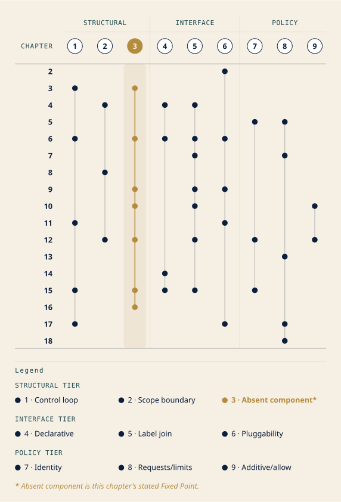
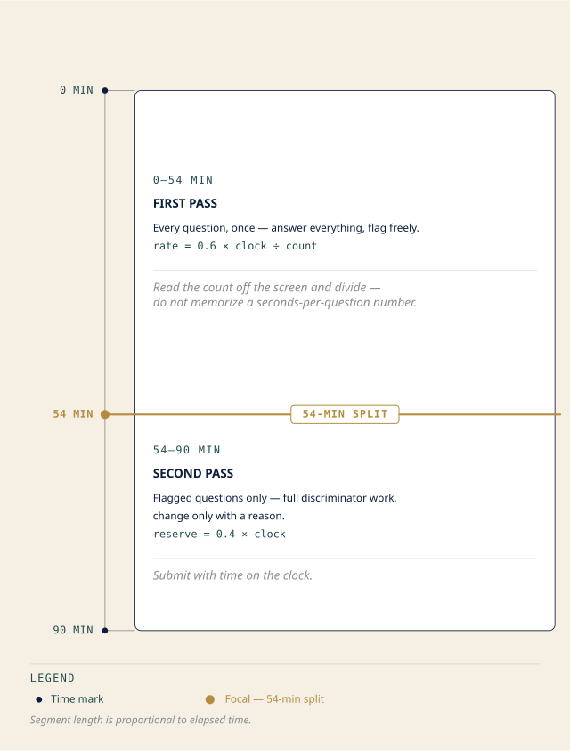

# Chapter 19: Bearings Before Landfall
## *"Everything that connects, and the traps that don't"*

**Domain Weight: — (synthesis; no new objectives) | Complexity: Mixed | Novelty: Familiar**

<!-- AUTHOR-REVIEW: The chapter title reuses "Landfall," retired as a branded marker name in style-decisions.md [LOCKED 2026-04-20] with the note "any future 'Landfall' in drafts is drift." The body uses ☀️ Zenith correctly at §1, so the title revives a name the chapter itself has retired. The structural linter has no rule for retired marker names, so this stage is the only gate that sees it. Title is fixed by the section skeleton and by pipeline convention, so it is not changed here. Retitling is the author's call — options that keep the sense without reusing marker vocabulary: "The Second Passage" (which the closing quote already sets up) or "Two Landmarks" (which pays off the epigraph and §2's opening line). -->

---

## Attention Budget

**Total time: ~135 minutes | Recommended: Split across 2 sessions — §1–§2 in one, §3–§6 in another**

| Section | Time | Attention Cost | Best Time to Study |
|---------|------|----------------|-------------------|
| 🧭 Soundings | 10 min | Low | Anytime — but answer honestly |
| §1 Nine Threads Through Eighteen Chapters | 25 min | High | Peak attention |
| ☆ Taking Your Bearings: The Threads | 8 min | Medium | Immediately after §1 |
| §2 The Pairs That Cost Points | 35 min | High | Peak attention, fresh session |
| ☆ Taking Your Bearings: The Pairs | 7 min | Medium | Immediately after §2 |
| §3 Ninety Minutes | 10 min | Low | Anytime |
| §4 Where the Weight Actually Is | 10 min | Medium | With your checkpoint scores in front of you |
| §5 Using The Lodestar | 5 min | Low | Anytime |
| §6 The Week Before | 8 min | Low | Anytime |
| Practice Questions | 17 min | Medium | After a break |

**Attention Cost Key:**
- **Low:** Concrete, familiar concepts — study anytime
- **Medium:** New concepts requiring focus — study when alert
- **High:** Abstract or complex material — study at peak attention

*If you only have 15 minutes: read §2's pair tables and the ⚠ Navigational Hazards block. That is where the points are.*

---

> *"The chart does not tell you where you are. Two bearings on two landmarks tell you where you are. The chart only tells you what you are looking at."*
> — Lodestar Ledgers

---

## 🧭 Soundings

This is a synthesis chapter, so the Soundings changes shape. You are not measuring what you know about a new topic. You are measuring whether you are ready to sit the exam. Five questions, none of them multiple choice. Answer them out loud or in writing. Vague answers count as "no."

1. **Have you sat one full-length attempt under a clock — start to finish, no pauses, no looking anything up?** If yes: what was your score, and did you finish with time left or run out?

2. **Which of the four domains is your weakest, and what specifically will you do about it this week?** Naming the domain is the easy half. The readiness signal is the plan.

3. **Without looking anything up:** a PersistentVolumeClaim requests `ReadWriteOnce`. State in one sentence what that constrains, and what it does *not* constrain.

4. **Name the recurring patterns this book has been building across all eighteen chapters.** Not the chapter titles. The patterns that showed up in four or five different chapters wearing different names. How many can you list from memory?

5. **When you get a practice question wrong, what is your most common failure mode?** Misreading the stem? Coin-flipping between two survivors? Running out of clock and guessing? If you don't know, you have not been reviewing your wrong answers, only counting them.

<details>
<summary>Answers + readiness rubric</summary>

**1.** No answer key; this is self-report. Note the trap: an *untimed* full-length attempt tells you almost nothing about pacing, and pacing is a distinct failure mode from knowledge. The Linux Foundation publishes 90 minutes for its multiple-choice exams [source: lf-mc-exam-faq-2026-08-31], and the timer cannot be paused, even through a connection fault [source: lf-handbook2-taking-the-exam-2026-08-31].

**2.** No answer key. If you named a domain but not a plan, count this as half. §4 turns the plan half into something concrete.

**3.** No full derivation here; that is §2's work, and handing it over now would spend the discrimination before you have drilled it. Note only this much: access modes are node-count semantics, not permission semantics, and one of the four ⚠ Navigational Hazards in §2 exists precisely because the English misleads. If you hesitated on this one, §2's storage rows and the hazard block are your center of gravity. The underlying mechanism is at *[cross-bearing: see Ch 11 §4 — access modes and reclaim policies]*.

**4.** No answer key here either. §1 supplies the list, and the point of asking first is that you try to generate it before you see it.

**5.** No answer key. If you cannot name your failure mode, that is itself the finding.

---

**Readiness tiers — this rubric reads differently from every other chapter's.** You are not choosing a reading pace. You are estimating a date.

**5 of 5 — sit it.** You have timed data, a named weakness with a plan, cold retrieval on a discriminator, the thematic map, and self-knowledge about your errors. Use §5 and §6 as your schedule and stop adding material. Adding new sources at this stage costs you consolidation and buys you nothing.

**3–4 — one to two more weeks.** You are close. §4 tells you where those weeks go: not "review everything," but the specific chapters your own checkpoint history flags.

**0–2 — four or more weeks, and not a re-read.** Rereading the book front to back is the least efficient thing you could do with four weeks. §4 plus your own Bearings scores will name five or six chapters. Work those, then re-run this Soundings.

</details>

---

## Why This Chapter Matters

You have read eighteen chapters organized by domain, because that is how the exam is organized. It is not how the material is *shaped*.

The control loop is not a Chapter 3 fact. It is the thing Chapter 6 instantiates in a named controller, Chapter 11 re-uses for volume binding, Chapter 15 points at a Git repository, and Chapter 17 collects as an extension story. A reader who filed it under "Chapter 3" will not recognize it when it walks into a Chapter 15 question wearing different clothes. That reader has one fact. The reader who filed it as a *pattern* has a derivation, and derivations survive time pressure in a way that memorized rows do not.

This is the shift from *having studied* to *being ready*. Practitioners do not hold nine hundred facts. They hold a small number of patterns and derive the facts on demand. The RBAC four-way binding matrix is the clearest case in this book: candidates memorize four rows and hope; practitioners derive all four from a distinction the book settled back in Chapter 4, in about six seconds, under pressure, every time.

Here is what this chapter is honestly worth, stated plainly so you can decide how much time to give it: **it contains nothing new.** Every fact in it was taught somewhere in Chapters 2 through 18. Its entire value is the second pass: seeing the same material cut along a different axis, and converting recognition into discrimination. Recognizing that "ReadWriteOnce" is a term you have met is worth zero points. Being able to say what it constrains, and what its neighbor constrains, with ninety seconds on the clock, is worth all of them.

> **Dead Reckoning:** This is a review chapter. Sections 1 and 2 re-present taught material in a new organization. Sections 3 through 6 are exam strategy and study scheduling, not technical content. There are two ★ Fixed Points and both restate things you already learned. If you are short on time, §2 is the section that moves your score.

## What You'll Learn

By the end of this chapter, you'll be able to:

- **Trace** each of the book's nine cross-cutting themes through the chapters that build it, and name the pattern rather than reciting the instances
- **Discriminate** between every confusion pair this book has flagged, using a one-line test rather than two competing definitions held side by side
- **Pace** a ninety-minute multiple-choice exam, including what to do with a question you cannot answer on first read
- **Allocate** your remaining study time against published domain weights and your own checkpoint history, rather than against whatever currently feels least comfortable
- **Use** `the-lodestar.md` in the last hour before the exam, and know what it deliberately leaves out
- **Plan** the final week — including the parts of it that consist of not studying

*You'll also stop thinking of this material as eighteen chapters and start thinking of it as nine patterns with instances, which is how practitioners hold it.*

---

## ☀️ §1 — Nine Threads Through Eighteen Chapters

<!-- AUTHOR-REVIEW: The B6 section skeleton titles this section "Nine Threads Through Twenty Chapters." That count is wrong on both readings — the threads trace Chapters 2 through 18 (seventeen chapters), and the book has eighteen content chapters before this one. The body prose says "eighteen chapters" consistently. Retitled here to match the body. Recommend the skeleton entry be corrected rather than the prose. -->

A book organized by exam domain serves the exam, not the material. Kubernetes did not grow four domains. It grew a handful of ideas that got applied over and over, in different subsystems, by different SIGs, across a decade. The exam blueprint cuts across those ideas at right angles.

So we cut the other way now. A coastline surveyed on a north–south run and the same coastline surveyed east–west produce two charts that do not look much alike, and a navigator wants both. Nine threads, each one named, then traced through the chapters that build it. Nothing here is new. Everything here you have read. What is new is the *axis*.

Read this section with one question running: **when I meet this pattern in a question stem, will I recognize it?**

<!-- FIGURE: ch19-fig01-cross-domain-integration-map -->


<!-- ASCII-FALLBACK
```
              Ch:   2  3  4  5  6  7  8  9 10 11 12 13 14 15 16 17 18

  STRUCTURAL TIER
1 control loop      ·  ●  ●  ·  ●  ·  ·  ·  ·  ●  ·  ·  ·  ●  ·  ●  ·
2 scope boundary    ·  ·  ●  ·  ·  ·  ●  ·  ·  ·  ●  ·  ·  ·  ·  ·  ·
3 absent component  ·  ●  ·  ·  ·  ·  ·  ·  ●  ●  ·  ●  ·  ·  ·  ●  ●

  INTERFACE TIER
4 declarative       ·  ·  ●  ·  ●  ·  ·  ·  ·  ·  ·  ·  ●  ●  ·  ·  ·
5 label join        ·  ·  ●  ·  ●  ●  ·  ●  ●  ·  ●  ·  ·  ·  ●  ·  ·
6 pluggability      ●  ·  ·  ·  ●  ·  ·  ●  ·  ●  ·  ·  ·  ·  ·  ●  ·

  POLICY TIER
7 identity          ·  ·  ·  ●  ·  ·  ·  ·  ·  ·  ●  ·  ·  ●  ·  ·  ·
8 requests/limits   ·  ·  ·  ●  ·  ●  ·  ·  ·  ·  ·  ●  ·  ·  ·  ●  ●
9 additive/allow    ·  ·  ·  ·  ·  ·  ·  ·  ●  ·  ●  ·  ·  ·  ·  ·  ·
```
-->

The three tiers are a reading aid, not doctrine. **Structural** threads describe how the cluster is built. **Interface** threads describe how its parts are joined and extended. **Policy** threads describe what is permitted. Density is the thing to notice: threads 1, 3 and 5 touch the most chapters, and they are correspondingly the most likely to appear in a question whose stem never names them.

<!-- AUTHOR-REVIEW: This grid was rebuilt from the nine thread paths in the prose below, not traced from the draft-v1 ASCII, which was not column-aligned (two rows were a column short) and disagreed with the prose in four places. Two consequences the figure spec `ch19-fig01-cross-domain-integration-map` must absorb before render: (1) the density sentence now names threads 1, 3 and 5, which tie at six or more chapters — the spec's AUTHOR-REVIEW item 1 flagged the old sentence as contradicting the data, and this is the resolution; (2) thread 5 now includes Ch 16 §4, which the section skeleton assigns "application-side Service debugging: selector/label mismatch." That addition is substantively correct and it closes the spec's AUTHOR-REVIEW item 2 — Ch 16 no longer renders as an empty row. Total marks are now 41, not the 40 the spec records. The spec needs a re-sync pass. -->

### Thread 1 — The control loop

**Desired state, current state, reconciliation.** A controller reads what you asked for, observes what exists, and acts to close the gap. Forever. That is the whole architecture, and it is the single most reused idea in the system.

Path: **Ch 3 §6** defines it *[cross-bearing: see Ch 3 §6 — controllers and the control loop]* → **Ch 4 §1** supplies the artifact the loop reads, the declared object → **Ch 6 §2** shows it instantiated in a controller you can watch working, with `.spec.replicas` as the desired state → **Ch 11 §2** applies it to storage, where a claim is a desired state and binding is the reconciliation → **Ch 15 §7** points the loop at a Git repository instead of etcd → **Ch 17 §4** collects it as the thing every extension point extends.

What makes Ch 15 §7 the payoff is that nothing changes except *where the desired state lives*. The loop is identical. Substituting Git for etcd is not a new mechanism; it is the same mechanism with a different store, which is precisely why the GitOps section could re-present Chapter 3's figure and expect it to land.

> 🪢 **Mnemonic:** Desired, observed, act. If you can say those three words about any Kubernetes component, you have found its control loop.

### Thread 2 — Namespaced versus cluster-scoped

Some objects live inside a namespace. Some live above all namespaces. That single distinction, settled in Chapter 4, is load-bearing three chapters later in ways that look unrelated on the surface.

Path: **Ch 4 §3** defines it *[cross-bearing: see Ch 4 §3 — namespaced vs cluster-scoped]* → **Ch 8 §3** builds ResourceQuota (a namespace total) and LimitRange (a per-object default) on it → **Ch 12 §3** derives the entire RBAC binding matrix from it.

That last one is worth dwelling on, because it converts four memorized rows into one applied distinction. Roles and RoleBindings are namespaced. ClusterRoles and ClusterRoleBindings are cluster-scoped. Cross the two and you get four combinations, and the semantics of each fall straight out of the scoping:

| | Role (namespaced) | ClusterRole (cluster-scoped) |
|---|---|---|
| **RoleBinding** (namespaced) | Grants the Role's permissions **in that namespace** | Grants the ClusterRole's permissions **but only in the binding's namespace** |
| **ClusterRoleBinding** (cluster-scoped) | **Not valid** — a namespaced Role cannot be granted cluster-wide | Grants the ClusterRole's permissions **cluster-wide** |

You do not memorize this table. You derive it: a binding can never grant more scope than it has itself, and a namespaced Role can never escape its namespace. Both facts follow from Chapter 4.

### Thread 3 — An object without its component does nothing

This is the pattern the book has hammered hardest, and it is the one most likely to be worth points on the day.

> **★ Fixed Point**
>
> **An object without its component does nothing.**
>
> Creating the API object is half the transaction. Something has to be *watching* for it. An Ingress with no Ingress controller installed routes no traffic. A NetworkPolicy on a CNI plugin that does not implement policy blocks nothing. A HorizontalPodAutoscaler with no metrics-server has no numbers to act on. A CustomResourceDefinition with no operator produces a resource you can create and nothing that happens afterward.

Path: **Ch 3 §4** — the phrase is coined where addons are introduced, because "optional component" is exactly where the reader first learns that parts of the cluster are not automatically present → **Ch 10 §3** names it as a pattern, at the Ingress-object-versus-Ingress-controller split *[cross-bearing: see Ch 10 §3 — the object is not the implementation]* → **Ch 11 §5** applies it to CSI drivers → **Ch 13 §7** applies it to `kubectl top` failing on a bare cluster → **Ch 17 §7** applies it to the VerticalPodAutoscaler, which is an add-on rather than something Kubernetes ships [source: k8s-docs-autoscaling-and-vpa-2026-08-31] → **Ch 18** applies it to the whole observability stack.

That is one rule doing the work of five separate gotchas. When a question describes an object that exists and a behavior that is not happening, this is the first thing to reach for.

> 🪝 **Snag:** The inverse also holds and is less often taught. A component with no object also does nothing visible: an Ingress controller running in a cluster with no Ingress resources is idle, not broken. Question stems sometimes present the idle-controller case to see whether you have internalized both directions.

### Thread 4 — Declarative desired state versus imperative command

You do not tell Kubernetes what to do. You tell it what you want and file the declaration; making reality match is the system's job. The imperative commands that exist (`kubectl scale`, `kubectl create`) are conveniences that write a declaration on your behalf.

Path: **Ch 4 §1** defines it → **Ch 6** shows what happens when a declared replica count meets a controller → **Ch 14** packages declarations for distribution, as charts and overlays → **Ch 15** puts the declaration in version control and makes the repository the source of truth.

The thread's payoff is that GitOps is not a new idea bolted onto Kubernetes. It is what you get when you take Chapter 4 seriously and ask where the declaration ought to live.

### Thread 5 — Labels and selectors as the universal join

Kubernetes has almost no foreign keys. What it has instead is labels on objects and selectors that match them, and nearly every relationship in the system is expressed that way.

Path: **Ch 4 §5** defines labels and selectors *[cross-bearing: see Ch 4 §5 — labels and selectors]* → **Ch 6 §3** uses selectors as the controller-to-Pod join, plus `ownerReferences` → **Ch 7 §3** uses node labels for `nodeSelector` and affinity → **Ch 9 §4** uses a Service's selector to build EndpointSlice membership → **Ch 10 §6** uses `podSelector` and `namespaceSelector` for NetworkPolicy → **Ch 16 §4** shows the join failing from the application side, where a selector that matches nothing produces an empty EndpointSlice *[cross-bearing: see Ch 16 §4 — is anything even selected]* → **Ch 12 §3** provides the contrast.

The contrast is the interesting part, and it is easy to miss. **RBAC does not select. RBAC names.** A RoleBinding lists its subjects explicitly; it does not match them by label. The asymmetry is deliberate: permission granted by label match would mean anyone who can set a label can escalate privilege. It is also exactly the kind of "why is this one different" detail that makes a good question.

### Thread 6 — The pluggable interfaces

Kubernetes repeatedly declines to implement something itself, and defines an interface instead. Four of these are the canonical set:

| Interface | What it delegates | Defined in |
|---|---|---|
| **CRI** — Container Runtime Interface | Running containers | Ch 2 §4 |
| **CNI** — Container Network Interface | Pod networking | Ch 9 §1 |
| **CSI** — Container Storage Interface | Providing storage | Ch 11 §5 |
| **CRDs** and operators | Extending the API itself | Ch 6 §8 |

**Ch 17 §4** collects all four and situates them alongside the wider extension surface: API aggregation, admission webhooks, device plugins, scheduler plugins *[cross-bearing: see Ch 17 §4 — the four pluggable interfaces, collected]*. That wider surface is sometimes called "API extensions," which is why you will see the fourth slot named both ways; Chapter 17 reconciled the two, and this chapter inherits that reconciliation rather than re-opening it.

Notice how thread 6 and thread 3 interlock. Every pluggable interface creates an object-without-component hazard, because "Kubernetes defines the interface" always implies "somebody else installs the implementation."

### Thread 7 — Identity, from Pod to API to delivery agent

Everything that talks to the API server has an identity, and in this cluster non-human identity means ServiceAccount.

Path: **Ch 5 §6** introduces the ServiceAccount as the Pod's identity, with the `default` account carrying near-zero permissions → **Ch 12 §2** makes it the subject RBAC binds to *[cross-bearing: see Ch 12 §2 — ServiceAccounts as RBAC subjects]* → **Ch 15 §4** applies it to the delivery agent, which is a Pod like any other and therefore has a ServiceAccount and needs exactly the permissions its syncing requires, no more.

The reason this thread matters more than it looks: the GitOps blast-radius argument in Chapter 15 depends entirely on it. A pull-based agent holds cluster credentials *inside* the cluster; a push-based CI system holds them *outside*. That is an identity argument, not a networking one.

### Thread 8 — Requests and limits, the numbers that reappear everywhere

You declare what a container needs (request) and the ceiling it may reach (limit). Two numbers, and they surface in five different subsystems.

Path: **Ch 5 §8** defines requests, limits, and the QoS classes they produce *[cross-bearing: see Ch 5 §8 — requests, limits, and QoS classes]* → **Ch 7 §2** makes requests the scheduler's filter input, which is why an over-requested Pod sits in `Pending` → **Ch 13 §4** makes QoS class the eviction ordering under node pressure → **Ch 17 §7** makes them the thing the VerticalPodAutoscaler adjusts → **Ch 18 §3** makes them the denominator for utilization.

Two numbers, five consequences. This is a thread worth being able to trace out loud, because a question can enter it at any of the five points.

### Thread 9 — Additive, allow-only, no deny

RBAC and NetworkPolicy were built by different SIGs for different problems, and they share one semantic exactly.

**Both are purely additive. Neither has a deny rule.** In RBAC, permissions accumulate across every binding that names you; nothing subtracts. In NetworkPolicy, a Pod that no policy selects is fully open, a Pod that any policy selects is restricted to the union of what its policies allow, and there is no rule that says "block this."

Path: **Ch 10 §6** establishes it for NetworkPolicy *[cross-bearing: see Ch 10 §6 — allowing, never denying]* → **Ch 12 §3** establishes it for RBAC → **Ch 12 §9** names them as one shared semantic.

> ⚓ **Worth Securing:** When a question asks how to *stop* something in RBAC or NetworkPolicy, the answer is never "add a deny rule." It is either "remove the grant" or, for NetworkPolicy, "select the Pod with a policy that does not allow it," which restricts by selection, not by denial. An option offering a deny verb is testing whether you have imported firewall intuitions into a system that has none.

### What to do with these nine

Do not memorize the paths. The paths are here so you can *check* your recall, not so you can recite them. What you want is the ability to hear a question stem and think: *this is thread 3*, or *this is the scope boundary again*. That recognition is what converts eighteen chapters of material into nine reusable moves.

---

## ☆ Taking Your Bearings: The Threads

Three questions. All three are cross-chapter by construction — that is what a synthesis checkpoint is.

**Q1.** A cluster administrator installs a CustomResourceDefinition for a `BackupSchedule` resource. Users can create `BackupSchedule` objects successfully — `kubectl get backupschedules` returns them. No backups ever run. Name the pattern this is an instance of, and name two other places in this book where the same pattern appears. `[retrieval: ch3, ch6, ch10, ch13, ch17]`

**Q2.** A `RoleBinding` in namespace `payments` references a `ClusterRole` named `secret-reader`. What permissions does the subject receive, and where? Derive your answer from a distinction established in Chapter 4 rather than recalling the matrix. `[retrieval: ch4, ch12]`

**Q3.** A Pod is stuck in `Pending`. A colleague suggests checking `kubectl logs`. Explain why that is the wrong instrument, and name the **confusion pair** that tells you which field to read instead. `[retrieval: ch5, ch7, ch13]`

---

**Answers with Explanations:**

**Q1 — The absent-component pattern: an object without its component does nothing.**

A CRD defines a new resource *kind*. It does not supply anything that acts on instances of that kind. Without an operator or controller watching for `BackupSchedule` objects, creating one stores a record in etcd and nothing else. The API accepted it; nothing reconciled it.

Two other appearances (any two of these count):
- An **Ingress** object with no Ingress controller installed (Ch 10 §3)
- A **NetworkPolicy** on a CNI plugin that does not implement policy (Ch 10 §7)
- **`kubectl top`** failing because metrics-server is not installed (Ch 13 §7)
- The **VerticalPodAutoscaler**, which is an add-on rather than built in (Ch 17 §7)
- A **PersistentVolumeClaim** with no CSI driver to provision against (Ch 11 §5)

If you answered "the CRD is broken" or "the CRD needs a schema," you are diagnosing the object when the missing thing is the component. That is exactly the reflex this pattern exists to replace.

**Q2 — Permissions from the ClusterRole, but only inside `payments`.**

The derivation: a RoleBinding is a namespaced object. A namespaced object cannot grant anything outside its own namespace, because that is what "namespaced" means (Ch 4 §3). So even though `secret-reader` is a ClusterRole — defined once, cluster-scoped, reusable — binding it with a RoleBinding confines its grant to that RoleBinding's namespace.

This is the single most useful RBAC pattern in practice, incidentally: define a ClusterRole once, bind it per-namespace with RoleBindings, and you get consistent permission sets without duplicating Role definitions.

If you answered "cluster-wide secret read access," you inverted the rule. The scope of the *grant* is set by the binding, not by the role. If you couldn't answer without the table, that is the finding: go back to Ch 4 §3 and make sure the scope distinction is solid, because the matrix rests entirely on it.

**Q3 — Because `Pending` means no container has started, so there are no logs to read.**

A Pod in `Pending` has been accepted by the API server but has not been scheduled onto a node, or has been scheduled and its images have not been pulled. In the unscheduled case no container exists anywhere. `kubectl logs` asks the kubelet on the Pod's node for container output; there is no node and no container.

The pair is **Pod phase versus container state** (Ch 5 §5), the first row of §2's Domain 1 table. The phase tells you where in the lifecycle the Pod is, and the phase determines which instrument is even applicable. Read the phase first, then `kubectl describe` for events and conditions. For a `Pending` Pod the scheduler's message about why no node was feasible is the actual diagnostic *[cross-bearing: see Ch 13 §2 — diagnosing a Pod that will not start]*.

If you said "logs would be empty," you are right but incomplete. The useful answer names what to read *instead*, and why the phase told you.

---

**Checkpoint: You've Now Confirmed**
✓ You can recognize the absent-component pattern from a symptom description
✓ You can derive the RBAC binding matrix rather than recall it
✓ You read the phase before you reach for an instrument

**Missed one?** Each of the three names its own repair, and none of them is "re-read §1." Q1 sends you to thread 3; Q2 sends you to thread 2 and Ch 4 §3; Q3 sends you to §2's Domain 1 pairs, which you are about to read anyway. Work the named one and move on.

Now the harder half. §2 is where the points are.

---

## 🟡 §2 — The Pairs That Cost Points

Most lost points on a multiple-choice exam are not lost to ignorance. They are lost to *collapse*: two adjacent concepts filed as one thing, so that when both appear as options the reader has no way to separate them and picks by feel. Two landmarks that have merged into one on your chart cannot fix a position.

This section is the antidote, and it works one way only. For each pair: **the one-line test that separates them**, then **the tell** that shows it up in a stem. Never two competing definitions side by side. Definitions side by side is what caused the collapse in the first place; a discriminator is a *procedure*, and procedures survive pressure.

Work these actively. Cover the right column, read the pair, say the discriminator out loud, then check. Reading this section passively will feel productive and will do nothing.

The card below is a *selection*: the highest-value pairs, sized to be drilled in one pass. The tables underneath it carry the full set.

<!-- FIGURE: ch19-fig02-confusion-pair-matrix -->


<!-- ASCII-FALLBACK
```
   PAIR                          →  DISCRIMINATOR (the question to ask)
   ───────────────────────────────────────────────────────────────────
   D1  Pod phase / container state → "Lifecycle, or one container?"
   D1  liveness / readiness        → "Restart it, or stop sending traffic?"
   D1  labels / annotations        → "Does anything select on it?"
   D1  ConfigMap / Secret          → "Would you mind this in a log?"
   D1  Deployment / StatefulSet    → "Does replica 0 need to BE replica 0?"
   D1  OCI / CRI                   → "Artifact format, or kubelet's API?"
   ───────────────────────────────────────────────────────────────────
   D2  ClusterIP/NodePort/LB       → "Reachable from where?"
   D2  Ingress object / controller → "The record, or the thing that acts?"
   D2  NetworkPolicy default       → "Is this Pod selected by any policy?"
   D2  Role / ClusterRole binding  → "What scope is the BINDING?"
   D2  PV / PVC                    → "Supply, or demand?"
   D2  RWO / RWOP                  → "One node, or one Pod?"
   ───────────────────────────────────────────────────────────────────
   D3  chart / release / revision  → "Package, install, or version of it?"
   D3  rollout undo / helm rollback→ "Whose history is being rewound?"
   D3  push / pull delivery        → "Where do the credentials live?"
   D3  OutOfSync                   → "Difference, or failure?"
   ───────────────────────────────────────────────────────────────────
   D4  mesh CP / cluster CP        → "Whose control plane?"
   D4  sidecar / ambient           → "Proxy per Pod, or per node?"
   D4  HPA / VPA                   → "More replicas, or bigger ones?"
   D4  observability / monitoring  → "New questions, or known ones?"
   D4  span / trace                → "One hop, or the whole journey?"
   D4  SLI / SLO / SLA             → "Measure, target, or consequence?"
   D4  TOC / Governing Board       → "Technical, or business?"
```
-->

<!-- AUTHOR-REVIEW — research gaps, consolidated. A cluster of rows below states Kubernetes semantics that no snapshot in this chapter's 31-file corpus covers. None is likely to be wrong; all are unverifiable as the corpus stands, and several are load-bearing (they carry checkpoint questions, Practice items, or Exam Alert entries). One targeted research pass closes the whole list. In priority order, by what depends on them:

  1. `kubernetes.io/docs/reference/access-authn-authz/rbac/` — retires the four-way binding matrix (§1 thread 2 AND the D2 table), the additive/no-deny semantics (thread 9, Exam Alert #3, Practice item 5), and the view/edit/admin descriptions. Highest leverage snapshot on the list.
  2. `kubernetes.io/docs/concepts/services-networking/network-policies/` — sources the isolation-vs-non-isolation rule (thread 9), the both-ends rule, and the default-behavior row. Also required to verify Practice item 2, whose stem was rebuilt this pass.
  3. The Ingress concept page — sources "frozen, not deprecated" and the default-IngressClass behavior. Both are load-bearing: frozen/deprecated carries a full checkpoint question (Q4), and the second-default-IngressClass claim is one of only four ⚠ Navigational Hazards.
  4. The Pod lifecycle page — sources the `Running` phase definition (which draft-v1 stated imprecisely; see the D1 row) and the three probe semantics, which carry Practice item 6.
  5. The CNCF graduation-criteria / project-stages page — sources the Sandbox → Incubating → Graduated ladder, which §5 and the Exam Alert both direct the reader to drill.
  6. One pass covering the ConfigMap/Secret page, the Helm chart-structure docs, and the OpenTelemetry traces page retires the remaining low-risk group: base64-not-encryption, the workload-controller discriminators, OCI-vs-CRI scope, headless/broken/selectorless Service, `charts/` vs chart repository, `templates/` holding Go templates, Argo CD `OutOfSync` semantics, and the definition of a span.
-->

### Domain 1 — Kubernetes Fundamentals (Ch 2–8)

| Pair | The one-line test | The tell in a stem |
|---|---|---|
| **Pod phase vs container state** | Phase describes the whole Pod's position in its lifecycle; state describes one container right now. `Running` as a phase means the Pod is bound to a node, all its containers have been created, and at least one is running or starting. | A stem that says a Pod is `Running` and something is still broken is testing this. `Running` is a lifecycle position, not a health verdict. |
| **liveness vs readiness vs startup** | Liveness failing **restarts** the container. Readiness failing **removes it from Service endpoints**, no restart. Startup **suspends the other two** until the app has finished booting. | A slow-starting app being killed repeatedly is a startup-probe question. Traffic reaching a not-yet-ready Pod is a readiness question. |
| **labels vs annotations** | Does anything *select* on it? Labels are selectable; annotations are not. Annotations hold arbitrary metadata for tools and humans. | If a stem describes attaching information that a controller must match on, it must be a label. |
| **image tag vs digest** | Mutable pointer, or identity? A tag can be moved to point at a different image tomorrow. A digest is the content hash and cannot be moved without becoming a different digest. | A stem about two clusters pulling "the same image" and getting different bytes is a tag question. A stem about a signature binding to something specific is a digest question. *[cross-bearing: see Ch 2 §3 — registries, tags, and digests]* |
| **ConfigMap vs Secret** | Would you mind seeing this value in a log or a `describe` output? If yes, it's a Secret. But Secret is base64-*encoded*, not encrypted, and encryption at rest is a separate cluster decision. | An option claiming Secrets are "encrypted by default" is wrong. *[cross-bearing: see Ch 12 §4 — Secrets are not encrypted]* |
| **namespace vs label for separating versions** | Namespace is a *scope* boundary (names, quota, policy). Label is a *selection* attribute. Separating v1 from v2 within one app is a label job; separating tenants or environments is a namespace job. | A stem about two versions needing different resource quotas has moved from label territory into namespace territory. |
| **ResourceQuota vs LimitRange** | Total, or default? ResourceQuota caps a namespace's *aggregate* consumption. LimitRange sets *per-object* defaults and bounds, so a container that declares nothing still gets numbers. | "The namespace has used its whole CPU allowance" is quota. "Pods here default to 100m if unspecified" is LimitRange. *[cross-bearing: see Ch 8 §3 — dividing a shared cluster]* |
| **Deployment vs StatefulSet** | Does replica 0 need to *be* replica 0 — stable name, stable identity, ordered startup? If yes, StatefulSet. If replicas are interchangeable, Deployment. | The distinction is **identity**, not "does it write to disk." A stateless app can use a StatefulSet; a database can be run under a Deployment badly. |
| **DaemonSet vs "set replicas to node count"** | DaemonSet means *one per node, tracked as nodes join and leave*. A replica count is a number that does not know what a node is. | Any stem where nodes are added or removed and the workload must follow is a DaemonSet. |
| **Job vs CronJob** | Job runs work that ends. CronJob creates Jobs on a schedule. CronJob is a factory; Job is the product. | "Runs nightly" is CronJob. "Runs once and must complete" is Job. |
| **taints/tolerations vs node affinity** | Who is doing the refusing? A taint is the *node* repelling Pods by default; a toleration is a Pod's permission to ignore that repulsion. Node affinity is the *Pod* asking for a kind of node. Repel-by-default versus attract-by-preference. | "These nodes should stay empty unless a workload explicitly opts in" is taints. "This workload wants GPU nodes" is affinity. *[cross-bearing: see Ch 7 §4 — when the berth refuses you]* |
| **OCI vs CRI** | OCI standardizes the **artifact and its execution**: image format, runtime spec, distribution. CRI standardizes the **kubelet's API to a runtime**. One is about the container; one is about the conversation. | Anything about image portability across registries is OCI. Anything about how the kubelet talks to containerd is CRI. |
| **scheduler binds / kubelet starts** | The scheduler makes a *decision* and writes it down. The kubelet on the chosen node does the work of starting containers. | A Pod with a node assigned but no running containers has passed the scheduler and stalled at the kubelet, so the diagnosis is on that node, not in the scheduler. |
| **kubelet skew vs kubectl skew vs supported releases** | Three different numbers. `kubelet` may be **up to three minor versions older** than `kube-apiserver` and must never be newer [source: k8s-version-skew-policy-2026-08-31]. `kubectl` is supported **within one minor version either direction** [source: k8s-version-skew-policy-2026-08-31]. The project maintains release branches for the **most recent three minor releases** [source: k8s-version-skew-policy-2026-08-31]. | Stems mix these deliberately. Read which component is named before reaching for a number. |
| **scheduled once vs rescheduled** | A Pod is bound to a node **once**. It is never moved. What people call "rescheduling" is a *new* Pod created by a controller after the old one died. | A stem describing a Pod "moving to another node" is describing a replacement, and the controller is the actor. |
| **`restartPolicy` scope** | It governs **containers within a Pod**, not the Pod object. A Job whose Pod template sets `restartPolicy: Never` will still get a *replacement Pod* from the Job controller when the first one fails; the policy stopped the container from restarting in place, not the workload from being retried. | The trap is reading "Never" as "this workload will not come back." Note also that a Deployment's Pod template cannot use `Never` at all; the API requires `Always` there. |

> 🔭 **Closer Look:** The version-skew numbers reward a moment of structure. Every rule is anchored to `kube-apiserver`, and every component except `kubectl` must be **no newer** than it, which is why the upgrade order is control plane first. `kubectl` is the only component allowed to be *newer*, because it is a client you run from your laptop and the project accepts you may have upgraded it casually [source: k8s-version-skew-policy-2026-08-31].

### Domain 2 — Container Orchestration (Ch 9–13)

| Pair | The one-line test | The tell in a stem |
|---|---|---|
| **ClusterIP vs NodePort vs LoadBalancer** | Reachable from where? ClusterIP: inside the cluster only. NodePort: any node's IP at a fixed port. LoadBalancer: an external address the provider allocates. Each type *includes* the ones below it. | "Should not be reachable from outside" points at ClusterIP. The inclusion property is what a stem about "also still reachable internally" is checking. |
| **headless vs broken vs selectorless Service** | Headless is `clusterIP: None` **on purpose**: you want the individual Pod addresses, not one virtual IP. Broken is a selector matching nothing. Selectorless is deliberate too: you manage endpoints yourself. | Headless plus StatefulSet is the stable-DNS-name pattern. A Service with no endpoints and a selector present is broken, not headless. |
| **Ingress object vs Ingress controller** | The record versus the thing that acts on it. This is thread 3. | An Ingress that "exists but routes nothing" is always the controller. |
| **Ingress frozen vs deprecated** | **Frozen** means feature-complete and still supported: no new features, but it works and is not going away on a schedule. **Deprecated** would mean scheduled for removal. Ingress is frozen; Gateway API is where new work happens. | An option saying Ingress is deprecated or removed is wrong. |
| **NetworkPolicy default behavior** | Ask: *is this Pod selected by any policy?* No policy selects it → fully open. Any policy selects it → restricted to the union of what its policies allow. | "Default deny" is achieved by *selecting* Pods with a policy that allows nothing, not by a deny rule. |
| **NetworkPolicy needs both ends** | For traffic A→B to flow when both are restricted, A needs egress permitting B **and** B needs ingress permitting A. | A stem where one policy was written and traffic still fails is usually the other end. |
| **RBAC has no deny** | Permissions are the union of every binding naming you. Nothing subtracts. | A "deny" verb in an option is testing whether you imported firewall intuitions. |
| **The four-way binding matrix** | Derive it. The binding's scope sets the grant's scope; a namespaced Role cannot be granted cluster-wide. | See §1 thread 2. |
| **view / edit / admin** | `view` reads (but not Secrets). `edit` writes workloads. `admin` adds the ability to manage RBAC **within a namespace**. None of them is `cluster-admin`. | A stem about someone who can grant permissions to others in one namespace is `admin`. |
| **PV vs PVC** | Supply versus demand. The PV is the piece of storage that exists; the PVC is the request a workload makes. Administrators think in PVs; developers write PVCs. | A Pod references a **PVC**, never a PV directly. |
| **RWO vs RWOP** | `ReadWriteOnce` = read-write by **a single node**, and multiple Pods on that node can share it. `ReadWriteOncePod` = read-write by **a single Pod, cluster-wide** [source: k8s-docs-persistent-volumes-depth-2026-08-25]. | The intuitive misreading of "Once" as "one Pod" is exactly what RWOP exists to name. |
| **Retain / Delete / Recycle** | `Retain` keeps the volume and its data after the claim goes, requiring manual reclamation. `Delete` removes both the PV object and the backing storage. `Recycle` is **deprecated** [source: k8s-docs-persistent-volumes-depth-2026-08-25]. | Defaults differ by origin: `Retain` for manually created PVs, `Delete` for dynamically provisioned ones [source: k8s-api-ref-persistentvolume-v1-2026-08-25]. |
| **`storageClassName: ""` vs omitting it** | `""` explicitly means **no class**: bind only to a PV that also has no class. Omitting the field means "whatever the cluster's default behavior is," which depends on whether the DefaultStorageClass admission plugin is on [source: k8s-docs-persistent-volumes-depth-2026-08-25]. | `""` reading as "use the default" is a hazard; it means the opposite. |
| **`Pending` → don't reach for logs** | No containers yet, so nothing produced output. Read the phase, then events. | Covered in the checkpoint above. It recurs here because it is the instrument error that costs the most clock. |

> 🪝 **Snag:** `Released` is not `Available`. When a PVC is deleted, its PV moves to `Released`: the claim is gone but the previous claimant's data is still there, so the volume is *not* free for a new claim [source: k8s-docs-persistent-volumes-depth-2026-08-25]. Under `Retain`, an administrator reclaims it by hand. A stem describing a PV that "should be reusable but isn't" is usually here.

### Domain 3 — Cloud Native Application Delivery (Ch 14–16)

| Pair | The one-line test | The tell in a stem |
|---|---|---|
| **chart vs release vs revision** | Chart = the package. Release = one *installed instance* of it, with a name. Revision = a numbered version *of that release*, incrementing on each upgrade. | Installing the same chart twice gives two releases. Upgrading one release gives it a second revision. |
| **`charts/` directory vs chart repository** | `charts/` is a **directory inside a chart** holding its subcharts, which are dependencies vendored in. A chart repository is a **remote place charts are fetched from**. Same word, completely different scope. | "Where do dependencies live?" is `charts/`. "Where did this chart come from?" is a repository. |
| **Kustomize overlay vs Helm template** | Patch, or render? Kustomize starts from a base that is already a valid, applicable manifest and patches it per environment. Helm starts from a template that is not a manifest until values are rendered into it. | If the un-customized files could be applied as-is, it is Kustomize. If they contain `{{ }}` and cannot, it is Helm. *[cross-bearing: see Ch 14 §6 — which one, when]* |
| **`kubectl rollout undo` vs `helm rollback`** | Whose history is being rewound? `rollout undo` walks a **Deployment's** revision history, inside Kubernetes. `helm rollback` takes a **release** name and a revision number and rolls that release back to that revision [source: helm-rollback-cli-2026-08-31]. Different histories, different scopes, same English word. | A stem mentioning a release name and a revision number is Helm. A stem about a Deployment's previous ReplicaSet is `rollout undo`. |
| **rolling / Recreate / blue-green / canary** | What happens to the old version? Rolling replaces it incrementally. Recreate stops it all first. Blue-green runs both and switches traffic at once. Canary sends a fraction of traffic to the new one and watches. | "Zero downtime, no spare capacity available" points at rolling. "The two versions must never be live simultaneously" points at Recreate. Ch 15 §2 owns the vocabulary; Ch 6 §4 owns the mechanics. |
| **GitOps: push vs pull** | Where do the credentials live? Push: an external CI system holds cluster credentials and reaches in. Pull: an agent inside the cluster holds them and reaches out to Git. | The whole blast-radius argument turns on this. GitOps is pull. |
| **`OutOfSync` = drift, not error** | It reports a **difference** between the repository and the cluster. Something changed on one side. That is a status, not a failure. | A stem treating `OutOfSync` as an error state is testing whether you know it is a comparison result. |
| **troubleshooting scope: platform vs application** | Is the Pod running the way Kubernetes intended? If not, platform. If it is running fine and the app misbehaves, application. | This is the Ch 13 / Ch 16 split. `Running` plus wrong output means you have crossed into application scope. |
| **which instrument, by layer** | The layer picks the instrument, and the phase tells you the layer. Platform-layer questions are answered by `kubectl describe`, events, and node conditions. Application-layer questions are answered by `logs`, `exec`, ephemeral containers, and `port-forward`. | A stem where the Pod is `Running` and the suggested tool is `describe` has crossed layers in one direction; a stem where the Pod is `Pending` and the suggested tool is `logs` has crossed in the other. *[cross-bearing: see Ch 16 §3 — getting inside, and adding what isn't there]* |

### Domain 4 — Cloud Native Architecture (Ch 17–18)

| Pair | The one-line test | The tell in a stem |
|---|---|---|
| **mesh control plane vs cluster control plane** | Whose control plane? The cluster's is kube-apiserver, etcd, scheduler, controller-manager. A mesh's is a separate thing configuring proxies. | The word alone is ambiguous; the stem's subject disambiguates. |
| **sidecar vs ambient mode** | Proxy per **Pod**, or per **node**? Ambient mode uses "a per-node Layer 4 (L4) proxy, and optionally a per-namespace Layer 7 (L7) proxy" [source: istio-ambient-mode-2026-08-31]. | Both are the same mesh with the same engine — the waypoint proxy "is a deployment of the Envoy proxy; the same engine that Istio uses for its sidecar data plane mode" [source: istio-ambient-mode-2026-08-31]. They are two arrangements, not two products. A stem asserting "a service mesh requires sidecars" is wrong. |
| **Knative Serving vs Eventing** | Serving is HTTP request-driven: it "manages the complete lifecycle of stateless HTTP services, including deployment, routing, and automatic scaling (including scale to zero)" [source: knative-overview-2026-08-23]. Eventing is asynchronous: "a CloudEvents-over-HTTP asynchronous routing layer" [source: knative-overview-2026-08-23]. | Request in, response out → Serving. Event produced somewhere, consumed elsewhere, producers and consumers decoupled → Eventing. |
| **maturity-level ordering** | Sandbox → Incubating → Graduated. Entry, growing, proven. | The levels are the durable fact; which specific project sits at which level changes and is not a reliable memorization target. |
| **TOC vs Governing Board** | Technical or business? The Governing Board is "responsible for marketing and other business oversight and budget decisions" [source: cncf-charter-governance-bodies-2026-08-31]. The TOC facilitates "defining and maintaining the technical vision" [source: cncf-charter-governance-bodies-2026-08-31]. | Money and marketing → Board. Technical direction → TOC. |
| **End User TAB vs TOC** | Advises, or holds the vision? The End User TAB "serve[s] as the voice of End Users in the CNCF community, advance[s] topics of concern to End Users, and raise[s] awareness about the needs and perspectives of end users" [source: cncf-charter-governance-bodies-2026-08-31]. The TOC holds the technical vision. | An option that has the TAB approving, blocking, or deciding anything is wrong — it advances topics and raises awareness; it does not decide. |
| **SIG vs Working Group vs Committee** | SIGs are ongoing and topic-owning. Working Groups are "time bounded" and cross SIG lines [source: k8s-sig-list-and-groups-2026-08-31]. Committees have closed membership and do not always operate in the open [source: k8s-community-governance-2026-08-23]. | Note there are exactly three Committees — Code of Conduct, Security Response, and Steering [source: k8s-sig-list-and-groups-2026-08-31] — and Steering holds overall project governance while chartering the other two [source: k8s-community-governance-2026-08-23]. |
| **TAG vs SIG** | TAGs are CNCF-level: "the primary organizational units within the CNCF that oversee and coordinate interests across projects" [source: cncf-tags-current-structure-2026-08-31]. SIGs are Kubernetes-project-level. Different organizations, different scope. | These are easy to confuse for a documented reason: CNCF's groups were originally called SIGs. The TOC "approved the creation of SIGs, later to be renamed Technical Advisory Groups" [source: cncf-tags-current-structure-2026-08-31]. The shared origin is why the names collide. |
| **horizontal vs vertical scaling** | More replicas, or bigger ones? Horizontal adds Pods. Vertical adjusts the resources of existing ones. | "Handle more concurrent requests" is usually horizontal. "This Pod keeps hitting its memory limit" is vertical. |
| **HPA built-in vs VPA add-on** | HPA is part of the core API. The VPA "doesn't come with Kubernetes by default, but is a a[sic]n add-on that you or a cluster administrator may need to deploy" [source: k8s-docs-autoscaling-and-vpa-2026-08-31], and additionally requires metrics-server installed [source: k8s-docs-autoscaling-and-vpa-2026-08-31]. | This is thread 3 in Domain 4 clothing, and the absent component fails at a *different layer* here. With Ingress, the object is accepted and nothing happens. With VPA, the API rejects the kind outright, because without the add-on the CRD does not exist. Same pattern, two symptom shapes. |
| **workload vs node autoscaling** | HPA/VPA/KEDA change *workloads*. Cluster Autoscaler and Karpenter change the *cluster* — "Scaling the cluster infrastructure normally means adding or removing nodes" [source: k8s-docs-autoscaling-and-vpa-2026-08-31]. | The trigger for node autoscaling is Pods that "can't be scheduled on existing Nodes" [source: k8s-docs-node-autoscaling-2026-08-31], which is thread 8 arriving from the other direction. |
| **observability vs monitoring** | New questions or known ones? Monitoring watches things you decided in advance to watch. Observability is whether you can ask a question you did not anticipate. | Health probes are neither: they are health checking, and a stem conflating probes with observability is testing that boundary. |
| **span vs trace** | One hop, or the whole journey? A span is a single unit of work; a trace is the tree of spans following one request across services. | Traces are one of OpenTelemetry's signals, alongside metrics, logs, and baggage [source: opentelemetry-signals-2026-08-23]. |
| **SLI vs SLO vs SLA** | Measure, target, or consequence? An SLI is "a carefully defined quantitative measure of some aspect of the level of service." An SLO is "a target value or range of values for a service level that is measured by an SLI." An SLA is "an explicit or implicit contract with your users that includes consequences of meeting (or missing) the SLOs they contain" [source: sre-book-service-level-objectives-2026-08-31]. | The clean test: *"what happens if the SLOs aren't met?": if there is no explicit consequence, then you are almost certainly looking at an SLO"* [source: sre-book-service-level-objectives-2026-08-31]. |
| **Prometheus pull vs Pushgateway** | Prometheus scrapes targets. The Pushgateway is "an intermediary service which allows you to push metrics from jobs which cannot be scraped" [source: prometheus-pushgateway-practices-2026-08-31], and its use is deliberately narrow: "The only valid use case for the Pushgateway is for capturing the outcome of a service-level batch job" [source: prometheus-pushgateway-practices-2026-08-31]. | Options offering the Pushgateway for a long-running service, or for a job tied to one specific machine, are ruled out by the source itself. |

### Surface-form homonyms

Thirteen words in this book carry two genuinely different concepts. When one of these appears in a stem, the first move is to establish *which sense*, because half the options will be constructed from the other one.

| Word | Sense A | Sense B |
|---|---|---|
| **namespace** | Linux kernel isolation primitive (Ch 2) | Kubernetes scope object (Ch 4) |
| **control plane** | The cluster's (Ch 3) | A service mesh's (Ch 17) |
| **sandbox** | Sandboxed runtime — gVisor, Kata (Ch 2) | CNCF Sandbox maturity level (Ch 17) |
| **revision** | Deployment revision (Ch 6) | Helm release revision (Ch 14) |
| **rollback** | `kubectl rollout undo` (Ch 6) | `helm rollback` (Ch 14) — and rollback-by-revert (Ch 15) |
| **label** | Kubernetes label (Ch 4) | Prometheus metric label (Ch 18) |
| **request** | Resource request (Ch 5) | API request (Ch 8) |
| **binding** | Scheduler binding (Ch 7) | PV/PVC binding (Ch 11) — and RoleBinding (Ch 12) |
| **release** | A Kubernetes minor release (Ch 8) | A Helm release (Ch 14) |
| **Service** | The Kubernetes object (Ch 9) | A Knative Service (Ch 17) |
| **immutable** | Image immutability (Ch 2) | Immutable infrastructure (Ch 17) |
| **operator** | The operator pattern (Ch 6) | "Cluster operator" as a Gateway API role name (Ch 10) |
| **volume** | A volume in a Pod spec — a directory the containers share (Ch 11 §1) | A PersistentVolume — a cluster resource with its own lifecycle (Ch 11 §2) |

One more word that is not a homonym but behaves like one: **plugin** is never used bare in this book. It is always qualified by its interface: CNI plugin, scheduler plugin, admission plugin, device plugin. An option that says "the plugin" without saying which is not telling you enough to answer, and that is usually deliberate.

> ⚠ **Navigational Hazards**
>
> Four pairs where the *intuitive* answer is the wrong one. These are worth more attention than the rest of this section combined, because intuition will actively work against you and confidence will feel high.
>
> **`ReadWriteOnce` does not mean one Pod.** It means one *node*, and multiple Pods on that node can mount it read-write [source: k8s-docs-persistent-volumes-depth-2026-08-25]. The mode that means one Pod is `ReadWriteOncePod`. The English is genuinely misleading, which is why `ReadWriteOncePod` exists to name the other case explicitly.
>
> **`storageClassName: ""` does not mean "use the default."** It means *no class*: bind only to a PV that also has no class. It is an explicit opt-*out* [source: k8s-docs-persistent-volumes-depth-2026-08-25]. Omitting the field entirely is the thing that engages default behavior.
>
> **A second default IngressClass does not give you more coverage.** Two defaults is an ambiguous configuration, not a redundant one. The rule to hold is that "default" is a singular role.
>
> **`Running` does not mean "the application works."** It means the Pod was bound to a node, all its containers were created, and at least one is running or starting. The app inside may be crashing, misconfigured, returning 500s, or not listening on the port the Service targets. Phase is a lifecycle position, not a health verdict.

> 🪢 **Mnemonic:** For the four hazards: **Once is a node, empty is nothing, one default only, Running is not working.**

---

## ☆ Taking Your Bearings: The Pairs

Two questions. Supply the **discriminator**, not the definition. If your answer reads like a dictionary entry, it will not survive the clock.

**Q4.** A colleague says: "Our Ingress is deprecated, so we need to migrate to Gateway API before our next upgrade or traffic will break." Identify every error in that sentence, and give the one-line discriminator for the pair being collapsed. `[retrieval: ch10]`

**Q5.** You're handed a stem containing the word "revision" and four options. Two options describe Kubernetes objects, two describe Helm concepts, so the ambiguity is *cross-tool*, not internal to either one. Before reading any option closely, what single question resolves which family the stem belongs to? Then state the same for "rollback." `[retrieval: ch6, ch14]`

---

**Answers with Explanations:**

**Q4 — Two errors. Ingress is frozen, not deprecated; and nothing breaks on upgrade.**

*Frozen* means feature-complete and still supported: the API is stable, it continues to work, and new development happens in Gateway API instead. *Deprecated* would mean scheduled for removal with a migration deadline. Those are different commitments and Ingress carries the first one.

The discriminator: **frozen means no new features; deprecated means an end date.** A frozen API is safe to keep using; a deprecated one is a countdown.

The second error follows: because Ingress is not deprecated, there is no upgrade at which traffic breaks. Migrating to Gateway API is a choice made for its capabilities, the role-oriented design and the richer routing, not a deadline being met.

If you caught "deprecated" but not "traffic will break," you got half. The practical consequence is the half that shows up in a stem about planning.

**Q5 — For "revision": *whose* history? For "rollback": *whose* history is being rewound?**

It is the same question both times, which is the useful part.

**Revision.** A Deployment revision is a point in that Deployment's rollout history, produced by changing its Pod template, and reachable with `kubectl rollout history`. A Helm revision is a numbered version of a *release*: the whole installed instance of a chart, which may contain a dozen Kubernetes objects. So: does the stem name a Deployment and its ReplicaSets, or a release name?

**Rollback.** `kubectl rollout undo` rewinds a Deployment to a previous revision of *that Deployment*. `helm rollback` takes "the name of a release" and "a revision (version) number" and rolls that release back to that revision [source: helm-rollback-cli-2026-08-31]. The scope differs by an order of magnitude even though the English word is identical.

There is a third sense worth having in reserve: GitOps *rollback by revert*, where you undo the commit and let the agent reconcile. That one is always written out in full precisely because the bare word is overloaded.

The tell that resolves it fastest: **a release name plus a number is Helm. A Deployment plus ReplicaSets is `rollout undo`. A commit is GitOps.**

If you reached for *"package, install, or version of it?"*, you resolved the wrong split. That discriminator separates the three Helm terms from each other, which is a real and useful test, but it is internal to Helm. This stem's ambiguity was cross-tool. Both discriminators are correct; the stem tells you which one is in play, and reading the stem for that is the actual skill.

---

**Checkpoint: You've Now Confirmed**
✓ You can separate frozen from deprecated, and state the practical consequence
✓ You resolve a homonym by asking whose scope the stem is in, before reading options

**Missed either?** Q4 sends you to §2's Domain 2 table, Q5 to the homonym table just above. Both are twenty-minute repairs against material already in front of you, not re-reads.

Two sections of content behind you. The rest of this chapter is strategy: how to spend ninety minutes, where to spend your remaining study hours, and what to do with the last week.

---

## ⚪ §3 — Ninety Minutes

The Linux Foundation allows **90 minutes** for its multiple-choice exams [source: lf-mc-exam-faq-2026-08-31]. That number is published on the KCNA exam page [source: lf-kcna-exam-page-2026-08-23] and in the candidate handbook [source: lf-mc-exam-important-instructions-2026-08-31], and it does not move. Two further facts shape everything in this section:

**The timer cannot be paused.** "The system does not offer a way to pause the exam timer or to add time back to the exam during connection loss events" [source: lf-handbook2-taking-the-exam-2026-08-31]. Not for a bathroom break, not for a dropped connection. Ninety minutes is a hard, unrecoverable budget.

**There is no scratch paper.** "Candidate is not allowed to write or enter input on anything (whether paper, electronic device, etc.) outside of the Exam console screen" [source: lf-exam-rules-and-policies-2026-08-31]. You cannot write your pacing plan down when the clock starts. Whatever plan you use has to be executable from memory, which is the entire reason the rule below is short enough to memorize.

### The rule

> **★ Fixed Point**
>
> **Read the question count off the screen. Divide the clock by it. Reach the end of the paper at roughly 60% of your total time, and hold the remaining 40% in reserve.**
>
> On a 90-minute exam, that means your first pass through every question ends at roughly the 54-minute mark, leaving about 36 minutes in reserve. You do not need to know the question count in advance — you read it, you divide, you go.

This is stated as a rule rather than a seconds-per-question number on purpose. The Linux Foundation publishes a 60-question format for its multiple-choice exams, in the candidate handbook, for that class of exam [source: lf-mc-exam-important-instructions-2026-08-31]. As a worked example: 60 questions in 90 minutes is 90 seconds apiece, and a first pass finishing at 54 minutes gives you about 54 seconds per question on the way through, with the balance held back. But the rule is what you memorize, because the rule survives a different count and the arithmetic does not.

> ⚓ **Worth Securing:** The 60-question and 75% figures are published: in the Linux Foundation's *candidate handbook*, for multiple-choice exams as a class, not on the KCNA product page you probably read first [source: provenance-kcna-60-questions-2026-08-31]. That gap between where a fact lives and where a candidate looks is why the numbers circulate for years looking unsourced. Read the handbook, not just the product page.

### What the reserve is for depends on the interface

The Linux Foundation does not publish how its multiple-choice exam console behaves: whether you can skip a question, mark one for review, navigate back, or change an answer you have already given. That silence is not an oversight in this book's research; it is confirmed absent on four separate official pages, each of which documents the exam in detail and says nothing about question navigation [source: lf-mc-exam-important-instructions-2026-08-31] [source: lf-mc-exam-faq-2026-08-31] [source: lf-exam-rules-and-policies-2026-08-31] [source: lf-handbook2-taking-the-exam-2026-08-31].

So establish it yourself, on the tutorial screen, before the clock matters. Look for a flag or mark control, and look for whether the console will let you move backward. Thirty seconds of checking buys you the shape of the next ninety minutes.

**If you can navigate back**, the reserve is a genuine second pass: you return to the questions you marked, in the order you marked them.

**If you cannot**, the reserve is a margin instead. It is the extra time you can afford to spend on a hard question *in place*, one at a time, without running out. You are still finishing the sweep at 60%; you are simply spending the balance as you go rather than at the end.

Either way the failure mode the rule guards against is identical, and it is the one that actually costs people the exam: spending four minutes on question nine.

<!-- AUTHOR-REVIEW: The console's navigation behavior is the single highest-value missing snapshot for this chapter, and §3 has been rewritten to degrade gracefully in its absence rather than instruct the reader in a procedure that may not be executable. If a Linux Foundation or PSI BRIDGE source documenting the multiple-choice interface can be located and cached, this subsection collapses to two sentences and the ★ Fixed Point can name the flag control directly. Until then the hedge stands, because there is no scratch paper to fall back on and a memorized procedure that turns out to be unavailable is worse than no procedure. -->

### The first pass

Three categories, decided fast:

**Know it.** Answer, move. Do not re-read to confirm. Confirmation on a question you knew is the single largest source of time leakage on a timed exam, and it almost never changes the answer.

**Can get it.** Two options survive, and you can see the discriminator if you think for twenty seconds. Give it the twenty seconds. If it resolves, answer and move. If it does not, pick the more likely one, mark it if the console allows, and move.

**Don't know it.** Answer anyway. Reason it through rather than taking it on faith: a question you leave blank scores zero with certainty, so putting an answer in cannot score worse *unless* there is a penalty for a wrong answer, and the Linux Foundation does not publish one in either direction. Given a certain zero against an uncertain penalty, answer. Then mark it and move immediately. Do not sit with it. The cost of sitting is that you spend three minutes on one question and then rush four you would have got.

Always leave an answer even when you mark. A marked question with an answer already in it is a question you can improve; a marked blank is a question you can lose to the clock.

### The second pass

Your marked questions, in the order you marked them. Two things have changed since you first saw them:

You have read the whole exam, and later questions sometimes disambiguate earlier ones: a stem that names a concept precisely can tell you which sense an earlier ambiguous stem meant. And you are no longer under first-pass momentum, so you can afford the full discriminator procedure from §2.

**Change an answer only when you can say why.** A reason you can state out loud is evidence. "It feels wrong now" is usually fatigue wearing the costume of insight. "I misread the scope: it said RoleBinding, not ClusterRoleBinding" is a reason, and a reason is what the second pass is for.

### The three ways candidates run out of time

They have different fixes, which is why they are worth separating.

**Re-reading stems.** You read the question, read it again, then read it a third time before touching an option. Fix: read once, carefully, then go to the options. If the options reveal you missed something, you can come back, but you will usually find that reading the options *is* what clarifies the stem.

**Refusing to leave a question unresolved.** You will not move on, so you spend four minutes fighting one item. Fix: a navigator who takes a bearing, cannot resolve it, and comes back when the light is better has not given up on the fix; they have waited until the fix was possible. Marking is that, and nothing more.

**Re-litigating settled answers.** You keep returning to questions you already answered confidently. Fix: the reserve is for the ones you marked. If you did not mark it, you do not revisit it.

<!-- FIGURE: ch19-fig03-exam-day-pacing -->


<!-- ASCII-FALLBACK
```
  0                              54 min                        90 min
  ├───────────── FIRST PASS ───────┼────── RESERVE ──────────────┤
  │                                │                             │
  │  every question, once          │  the ones you marked        │
  │  answer everything             │  full discriminator work    │
  │  mark the hard ones            │  change only with a reason  │
  │                                │                             │
  │  rate = 0.6 × clock ÷ count    │  reserve = 0.4 × clock      │
  │                                │                             │
  └────────────────────────────────┴─────────────────────────────┘
     ▲                                                    ▲
     read the count off the screen                   submit with
     and divide — do not memorize                    time on the clock
     a seconds-per-question number
```
-->

**One more thing about the environment**, because it costs points every year: the exam is closed-book. "Candidates are NOT PERMITTED to access tools, resources or external sites when taking the Linux Foundation Multiple Choice OR SkillCred Exams" [source: lf-certification-resources-allowed-2026-08-31]. If you have read CKA preparation advice about having kubernetes.io open in a browser tab, that allowance is real, but only for the *performance-based* exams, which permit browsing the Kubernetes documentation during the exam [source: lf-certification-resources-allowed-2026-08-31]. It does not transfer to KCNA. Nothing is open. Plan accordingly.

---

## ⚪ §4 — Where the Weight Actually Is

Study time is not fungible with comfort. The hours you most want to spend are usually on material you already know, because reviewing what you know feels good and reviewing what you do not feels like failing. The stretch of water you most enjoy sailing is rarely the one that puts you on the rocks. This section is a correction for that.

> **Dead Reckoning:** The four domains and their published weights are: Kubernetes Fundamentals 44%, Container Orchestration 28%, Cloud Native Application Delivery 16%, Cloud Native Architecture 12% [source: cncf-curriculum-kcna-readme-2026-08-31]. Those weights come from CNCF's own curriculum repository and agree exactly with the Linux Foundation exam page and the published curriculum PDF. The mapping of domains onto this book's chapters is editorial. It is how *this book* laid the material out, not something CNCF publishes: Kubernetes Fundamentals is Chapters 2–8, Container Orchestration is Chapters 9–13, Cloud Native Application Delivery is Chapters 14–16, and Cloud Native Architecture is Chapters 17–18.

### Build the table yourself

Do not skip this. The value is in the filling-in, not the reading. You are going to see something about your own preparation that a printed table cannot show you.

Go back through the book and record your **Soundings score** and your **Taking Your Bearings scores** for each chapter. Then complete this:

| Domain | Weight | Chapters | Your worst Bearings score in this range | Which chapter | Hours you've spent here |
|---|---|---|---|---|---|
| D1 Kubernetes Fundamentals | 44% | 2–8 | | | |
| D2 Container Orchestration | 28% | 9–13 | | | |
| D3 Cloud Native App Delivery | 16% | 14–16 | | | |
| D4 Cloud Native Architecture | 12% | 17–18 | | | |

Then answer one question: **is the domain where you scored worst the domain where you have spent the most hours?**

If the answer is no, and for most readers it is no, that gap is your study plan. It is almost always more valuable than any general advice this book could give you, because it is measured on you.

### Two calls this section has to make

**Community and Collaboration is the competency easiest to leave until it is too late.** It sits inside Cloud Native Architecture (Chapter 17 §2 and §8) and it is the material a reader who ran short of time will have stopped before. The reasons are in the material itself: it is institutional rather than technical, it is name-dense, and it does not *feel* examinable in the way a `kubectl` behavior does. It is examinable. It is on the published curriculum as one of Cloud Native Architecture's three competencies [source: cncf-kcna-curriculum-pdf-2026-08-23].

Here is the argument for spending an hour there, stated as arithmetic rather than as a claim about how often it is tested. Cloud Native Architecture is 12% of the exam, split across three competencies, so Community and Collaboration is roughly a twenty-fifth of the paper. What makes it worth the hour is not its share but its *shape*: the material is finite and bounded. Governance bodies and their remits, SIGs versus Working Groups versus Committees, the project lifecycle, the maturity levels. There is no depth to plumb. An hour covers a large fraction of the whole competency. An hour spent adding nuance to a Domain 1 topic you already score well on covers a much smaller fraction of a much larger surface, at a much lower marginal return.

**The 2025-11-24 blueprint change is a study-allocation hazard, not just a historical fact.** The KCNA exam was updated no earlier than November 24, 2025 [source: lf-kcna-program-changes-2026-08-23], and the change was not cosmetic: Cloud Native Application Delivery is now 16%, and observability was "rolled under Cloud Native Architecture" [source: lf-kcna-program-changes-2026-08-23] rather than being its own domain.

The practical consequence: **third-party study material produced before that date allocates its coverage against a blueprint that no longer exists.** If your practice questions came from a bank that still treats observability as a domain in its own right, your sense of where the points are is wrong. And the rule for which blueprint you are tested against is unambiguous: "Any KCNA exam taken after the updated release will test on the new set of Domains and Competencies," and "The only date that matters is the date you sit for the exam" [source: lf-kcna-program-changes-2026-08-23]. Not your purchase date, not your first attempt, not your retake status.

> 🪝 **Snag:** Check the copyright date on every non-CNCF resource you're using. The tell is where observability sits: if your material lists it as a **domain in its own right**, with its own weight, rather than as a competency under Cloud Native Architecture, that material predates the change.

<!-- AUTHOR-REVIEW: draft-v1 stated the retired blueprint had five domains and named the retired domain "Cloud Native Observability." Both details are removed here. The only source in the corpus for either is `provenance-kcna-60-questions-2026-08-23`, which is headed "DO NOT CITE THE CONTENTS OF THIS FILE AS FACT," and the authoritative file `cncf-curriculum-repo-kcna-versions-2026-08-23` records the retired weights as an explicit OPEN GAP with the instruction "DO NOT draft the retired weights from memory or from third-party study guides." The tell above is rewritten to rest only on what IS sourced — that observability moved under Cloud Native Architecture. Closing this properly is cheap and would benefit the whole book: retrieve `old-versions/KCNA_Curriculum old.pdf` (raw URL is in the versions snapshot) and cache the retired domain list. -->

### Where the next block of hours goes

In priority order, and this order holds for most readers:

1. **Your worst-scoring chapter in Domain 1.** It is 44% of the exam. A weak chapter there costs more than a weak chapter anywhere else, arithmetically.
2. **Community and Collaboration**, if you have not deliberately studied it. Bounded material, so an hour covers a large share of it.
3. **§2 of this chapter**, worked actively rather than read. Discrimination failures are cheap to fix and expensive to leave.
4. **Your worst-scoring chapter in Domain 2.** 28% and the second-largest surface.
5. **A timed full-length attempt**, if you have not sat one. Pacing is a distinct skill and it is invisible until you meet the clock.

What is *not* on that list: re-reading chapters you scored well on. It feels like studying. It is not.

---

## ⚪ §5 — Using The Lodestar

`the-lodestar.md` ships with this book, at the repository root. It is the one-page reference: the concentrated form of everything worth having in front of you in the hour before you sit down, and nothing else.


### What is in it

**Domain weights and the exam's published shape.** The 44/28/16/12 split, the 90 minutes, and the handbook-published question count and passing standard. This block is *lookup*: you are not memorizing it, you are checking it so the numbers are fresh.

**The confusion-pair discriminators.** A compressed form of §2: the pair and its one-line test, nothing else. This block is *drill*. Cover the right column, work down the list, uncover. This is the block that repays a second pass.

**The four hazards where intuition is wrong.** `ReadWriteOnce` is a node, `""` is nothing, one default only, `Running` is not working. Four lines. Drill block.

**The version-skew numbers.** Three numbers that are easy to swap under pressure and cheap to refresh: kubelet three back, kubectl one either way, three supported minors. Lookup block, but read it twice.

**Exam-day pacing.** The §3 rule in one line, because it must be executable from memory and there is no scratch paper.

**Governance and institutional vocabulary.** The Board/TOC split, the End User TAB's advisory role, SIG/WG/Committee, maturity levels. This is the Domain 4 material most likely to have gone soft, and it is the cheapest to refresh because it is bounded.

### How to use it in the last hour

Two passes, about twenty minutes each, with a break between.

**First pass — drill.** Cover the answers. Work the discriminator blocks and the hazard block. Where you hesitate, mark it. Do not look anything up in the book; the point is to find soft spots, not to fix them.

**Second pass — lookup.** Read the marked items and the number blocks. Once, calmly. Then close it.

Then stop. Whatever is not in your head at that point is not going to arrive in the next twenty minutes, and the marginal value of a third pass is negative: it costs you composure and buys you nothing.

### What it deliberately leaves out

The Lodestar is a **distillation, not a summary**. It contains no chapter recaps, no explanations, no worked examples, and no context. Every line assumes you have read the chapter it came from.

That is a design decision with a consequence worth stating plainly: **if you cannot reconstruct a chapter from its Lodestar lines, you have not found a defect in the Lodestar.** You have found a chapter you need to go back to. Use that as a diagnostic in the final week: a Lodestar line that means nothing to you names a chapter to re-read. In the last hour, though, it is too late to act on that, which is why the final week comes first.

---

## ⚪ §6 — The Week Before

The last week is the one most likely to be spent badly, because anxiety pushes toward *more*: more material, more sources, more hours. More is the wrong direction. Consolidation, not acquisition.

### Seven days out

**Sit one full-length timed attempt.** Ninety minutes, no pauses, nothing open, in one sitting. Not to score, but to calibrate. You want to know whether you finish with time to spare, finish exactly on the buzzer, or run out. Those three outcomes have completely different fixes and you cannot guess which one you are.

**Review the wrong answers properly.** For each one, name *why*: knowledge gap, discrimination failure (a §2 pair), misread stem, or clock. The four have different remedies, and sorting them is worth more than the raw score.

### Six to three days out

**Work the two or three chapters your attempt flagged.** Not the whole book. Named chapters, from measured evidence.

**Work §2 of this chapter actively.** Cover the right column, say the discriminator out loud, check. Twenty minutes a day. Discrimination is the thing that goes soft fastest and comes back quickest, which is what makes it the best use of a short daily block.

**Give Community and Collaboration a dedicated hour** if you have not. See §4.

**Check your equipment now, not on the morning.** This is a genuinely important use of a final-week hour, because every item here can fail and every one takes time to fix. You need a supported OS, one active monitor ("Dual Monitors are NOT supported"), a microphone, and reliable internet; a wired connection is more stable than wireless [source: lf-handbook2-candidate-requirements-2026-08-31]. You also need a webcam you can physically move: "Ensure the webcam is capable of being moved as you will have to pan your surroundings" [source: lf-mc-exam-faq-2026-08-31]. You cannot use a virtual machine [source: lf-mc-exam-important-instructions-2026-08-31]. And avoid work-provided devices: the Linux Foundation states plainly that they "can result in technical challenges" [source: lf-mc-exam-faq-2026-08-31]. It does not say what those challenges are, but a managed endpoint and a secure browser are not natural allies, and the failure would land at exactly the wrong moment.

**Check your ID against your registration.** The first and last name on your government-issued photo ID must exactly match the name on your Linux Foundation account [source: lf-handbook2-taking-the-exam-2026-08-31]. A mismatch discovered at check-in is not something a proctor can wave through.

### Two days out

**Prepare the room.** The space must be private, clutter-free, and well lit, with no papers or writing implements on the desk [source: lf-handbook2-candidate-requirements-2026-08-31] and none below it either: "no objects such as paper, trash bins, or other objects below the testing surface" [source: lf-mc-exam-faq-2026-08-31]. Walls must be clear of printouts, though "paintings and other wall décor is acceptable" [source: lf-mc-exam-faq-2026-08-31]; décor is fine, notes are not. Public spaces are prohibited outright: "coffee shops, stores, open office environments, etc. are not allowed" [source: lf-mc-exam-faq-2026-08-31]. If the room has a door, it must be closed [source: lf-handbook2-candidate-requirements-2026-08-31]. Sorting this two days out costs ten minutes; sorting it while a check-in specialist waits costs composure you would rather spend on the exam.

**Stop adding sources.** No new question banks, no new videos, no new guides. A ship taking on stores in the last hour before sailing is not better provisioned; it is just harder to trim. A new source in the final 48 hours does not add knowledge. It adds a fresh sense of everything you do not know, which is the opposite of what you need.

### The day before

**Do not study new material.** This is where Community and Collaboration typically gets crammed, and it typically does not stick. If you did not learn it in week one, the twelve hours before an exam are not the conditions under which it is going to arrive.

**One Lodestar pass in the morning, then stop.** Twenty minutes.

**Rest.** This sounds like the sort of advice a study guide includes because study guides include it. Take it as the specific recommendation it is: a tired reader misreads stems, and misread stems are one of the four failure modes you sorted your wrong answers into a week ago. It is the only one of the four you can still do anything about on the last night.

### The morning

The morning of a departure is not the time to discover the chart is missing. Everything above was so that this morning consists only of casting off.

Check in early. The portal opens up to 30 minutes before your scheduled time, and you must start no later than 30 minutes after it [source: lf-handbook2-taking-the-exam-2026-08-31]. Expect a wait for a check-in specialist; it "should not exceed 15 minutes" [source: lf-handbook2-taking-the-exam-2026-08-31], but building that in means it is not a surprise. You will upload a photo of your ID and take a selfie for comparison [source: lf-handbook2-taking-the-exam-2026-08-31], and you will pan the room with your webcam.

Then, when the exam is released: read the count off the screen, divide, and go.

> **Logbook Entry:** The final week has a texture that nobody warns you about, so here it is.
>
> Around day four, you will probably have a bad session. You will get a run of practice questions wrong on material you were confident about three days earlier, and the conclusion that will arrive uninvited is that you have been fooling yourself and you are not ready. This is common enough to be worth naming in advance, and it is worth much less as a signal than it feels like. What is usually happening is that you have moved from recognition practice to retrieval practice, and retrieval is harder. Recognition was always the easier task and it was always flattering you.
>
> The failure mode is what people do next. Faced with a bad session, the instinct is to widen: buy another question bank, find a different video series, start a fresh set of notes. Every one of those is a way of avoiding the specific thing that went wrong, which is generally three or four discriminations that have gone soft and could be repaired in forty minutes with the material already in front of you.
>
> The other thing worth knowing: on exam day you will encounter a question you have no idea about. Not a hard question — a question about something you would swear was never covered. Everyone does. It is one question out of the sixty the handbook describes, it is worth the same as every other question, and the only mistake available to you is letting it take four minutes and your composure. Answer it, mark it, move. You will very likely never think about it again, because you will have passed.

---

## Exam Alert! 🚨

Kept short deliberately. §2 is the trap section, and repeating it here would waste the pass you just made through it.

**High-Priority Topics:**

1. **The absent-component pattern, in its exact form:** *an object without its component does nothing.* It converts at least five separate gotchas — Ingress, NetworkPolicy, CSI, metrics-server, VPA — into one rule you apply on sight.
2. **The RBAC four-way binding matrix, derived rather than memorized.** The binding's scope sets the grant's scope. Everything else falls out of Chapter 4's namespaced/cluster-scoped distinction.
3. **Additive, allow-only, no deny.** One semantic shared by RBAC and NetworkPolicy, built independently by two different groups.
4. **The version-skew numbers:** kubelet up to three minor versions back and never newer, kubectl within one either way, three supported minor releases [source: k8s-version-skew-policy-2026-08-31].
5. **Community and Collaboration vocabulary.** Bounded, finite material, so an hour covers a large fraction of the whole competency, and it is the competency most likely to have been skipped.

**Common Traps** — the four where the intuitive answer is the wrong one:

- **`ReadWriteOnce`** reads as "one Pod." It is one *node* [source: k8s-docs-persistent-volumes-depth-2026-08-25]. `ReadWriteOncePod` is the one that means one Pod.
- **`storageClassName: ""`** reads as "use the default." It means *no class* [source: k8s-docs-persistent-volumes-depth-2026-08-25].
- **A second default IngressClass** reads as broader coverage. It is ambiguity.
- **`Running`** reads as "the application works." It means bound to a node, all containers created, at least one running or starting. Nothing more.

---

## Practice Questions

Ten questions, cross-domain by construction. Most require two chapters to answer, which is the point of a synthesis chapter. Work them under something like exam conditions: no looking back, one pass, then check.

---

**1.** A Pod has been in `Pending` for ten minutes. Which sequence of diagnostic steps is correct?

A) `kubectl logs` → `kubectl exec` → read the container's stdout
B) `kubectl top pod` → compare utilization to limits → raise the limit
C) `kubectl describe pod` → read events → compare requests to node capacity
D) Restart the kubelet on the target node, then re-check the phase

---

**2.** A cluster has a `NetworkPolicy` in namespace `api` selecting Pods labeled `tier=backend` and allowing ingress only from Pods labeled `tier=frontend`. A Pod labeled `tier=batch` in the same namespace can still reach the backend Pods. No other NetworkPolicy exists anywhere. What is the most likely cause?

A) The installed CNI plugin does not implement NetworkPolicy
B) The policy needs an explicit deny rule for `tier=batch`
C) `namespaceSelector` must be set even for same-namespace traffic
D) The frontend Pods need a matching egress rule

---

**3.** `kube-apiserver` is at 1.37. Which combination is supported?

A) `kubelet` 1.38, `kubectl` 1.37
B) `kubelet` 1.33, `kubectl` 1.36
C) `kubelet` 1.37, `kubectl` 1.35
D) `kubelet` 1.34, `kubectl` 1.38

---

**4.** Which pairing correctly describes who holds the CNCF's technical vision and who makes its budget decisions?

A) The Governing Board holds the technical vision; the TOC decides the budget
B) The TOC holds the technical vision; the Governing Board decides the budget
C) The End User TAB holds the technical vision; the Governing Board decides the budget
D) TAGs hold the technical vision; the TOC decides the budget

---

**5.** A `RoleBinding` in namespace `web` grants a `ClusterRole` called `pod-reader` to a ServiceAccount in namespace `ci`. A second `ClusterRoleBinding` grants the same `ClusterRole` to the same ServiceAccount. What can the ServiceAccount read?

A) Pods in `web` only — the RoleBinding constrains the broader binding
B) Pods everywhere except `web`, where the RoleBinding takes precedence
C) Nothing — the bindings conflict, and RBAC resolves conflicts by denying
D) Pods in every namespace, including `web`

---

**6.** A Deployment's Pods show phase `Running` and a readiness probe that is failing. What is the observable consequence?

A) The Pod is removed from the Service's endpoints and stops receiving traffic
B) The Pod is removed from endpoints and the container restarts after the failure threshold
C) The container is restarted repeatedly until the probe succeeds
D) The Deployment's rollout is automatically rolled back to the previous revision

---

**7.** An application deployed via Helm has been upgraded three times. A bad configuration shipped in the third upgrade. The team wants the previous state of *all* objects the chart manages. Which is correct?

A) `kubectl rollout undo` on the Deployment the chart created
B) Delete the release and reinstall the chart at the previous version
C) `helm rollback <release> 2`, naming the release and the revision
D) `kubectl apply` the previous manifests from the chart's `templates/`

---

**8.** A PersistentVolume with `persistentVolumeReclaimPolicy: Retain` had its bound PVC deleted. A new PVC with identical requirements is created and stays `Pending`. Why?

A) A `Retain` volume can only ever be bound once
B) The PV is in `Released`, not `Available`, and must be reclaimed by hand
C) The new PVC must set `volumeName` to bind to a specific PV
D) The PV has `storageClassName: ""`, so it binds only to a PVC that omits the field

---

**9.** A contributor wants to organize work on a topic that spans SIG Node, SIG Network, and SIG Storage — the three groups behind the runtime, network, and storage interfaces — and the effort is expected to conclude once a design is ratified. Which body fits?

A) A new SIG, since an ongoing topic needs an owning group
B) A Committee, since the effort crosses several groups' boundaries
C) A Working Group, which is time bounded and crosses SIG lines
D) A CNCF TAG, since it coordinates interests across multiple projects

---

**10.** A team runs an Argo CD instance that watches a Git repository and applies manifests to the cluster. Which statement correctly describes the security property this delivery model provides?

A) Cluster credentials live in the CI system, so a compromised cluster cannot reach the repository
B) No credentials are needed, because Git is the source of truth
C) The agent needs no ServiceAccount, since it acts on cluster-scoped resources
D) Cluster credentials live inside the cluster, and the agent reaches out to Git

---

**Answers with Explanations:**

**1 — C. Describe, read events, compare requests to node capacity.**

`Pending` means no container has started, usually because no node was feasible. The scheduler records why, and `kubectl describe pod` surfaces it. Then you compare the Pod's *requests* to node Allocatable — requests are the scheduler's filter input (thread 8).

**A is wrong.** No containers exist, so there is nothing to log and nothing to exec into. This is the instrument error that costs the most clock, because it produces an empty result rather than an error and invites a second attempt. **B is wrong** for the same reason, and additionally `kubectl top` needs metrics-server installed, which is thread 3 hiding in a distractor. **D is wrong** because there is no target node yet; that is the problem. If you picked it, you have collapsed **scheduler binds / kubelet starts** (§2, Domain 1 table): `Pending` means the scheduler has not decided, so no kubelet is involved to restart.

*Chapters: 5 (phase vs state), 7 (requests as filter input, Pending), 13 (triage order).*

**2 — A. The installed CNI plugin does not implement NetworkPolicy.**

This is the absent-component pattern (thread 3) in Domain 2 clothing. The NetworkPolicy object is valid and accepted by the API server; nothing enforces it unless the installed CNI plugin implements policy. Creating the object is half the transaction, and the symptom of the missing half is precisely this: traffic that the policy should have blocked flowing anyway.

**B is wrong** and is the most instructive distractor: NetworkPolicy is additive and allow-only, with no deny rule at all. There is nothing to add for `tier=batch`; the policy already restricts the backend to frontend traffic *if it is enforced*. If you picked B, thread 9 is soft; go back to Ch 10 §6 and Ch 12 §3. **C is wrong.** `podSelector` alone covers same-namespace sources; `namespaceSelector` is for crossing namespaces. **D is wrong.** The batch Pods are not selected by any policy, so their egress is unrestricted regardless. The both-ends rule applies only when *both* ends are selected by policies.

*Chapters: 10 (NetworkPolicy semantics, absent-component pattern), 9 (CNI as the pluggable interface).*

**3 — D. `kubelet` 1.34, `kubectl` 1.38.**

`kubelet` may be up to three minor versions older than `kube-apiserver` and must not be newer [source: k8s-version-skew-policy-2026-08-31]; 1.34 is exactly three back from 1.37 and supported. `kubectl` is supported within one minor version older or newer [source: k8s-version-skew-policy-2026-08-31]; 1.38 is one newer and supported.

**A is wrong.** `kubelet` 1.38 is newer than the API server, which is never allowed. **B is wrong.** `kubelet` 1.33 is four minor versions back, one too far. **C is wrong.** `kubectl` 1.35 is two minor versions back, one too far. Every distractor is off by exactly one on a different axis, which is worth noticing as a shape: when a numeric item's options differ by a single increment on separate dimensions, the discrimination being tested is which dimension the rule applies to, not the arithmetic.

*Chapters: 8 (version skew), 13 (skew as a cause of misdiagnosed failures).*

**4 — B. The TOC holds the technical vision; the Governing Board decides the budget.**

The charter is explicit on both halves. The Governing Board is "responsible for marketing and other business oversight and budget decisions for the CNCF" [source: cncf-charter-governance-bodies-2026-08-31], and the TOC facilitates "defining and maintaining the technical vision" [source: cncf-charter-governance-bodies-2026-08-31].

**A is wrong:** a clean inversion, and the most attractive distractor if you have the two bodies but not their remits. **C is wrong.** The End User TAB "serve[s] as the voice of End Users in the CNCF community" [source: cncf-charter-governance-bodies-2026-08-31]; it advances topics and raises awareness, it does not hold the technical vision. **D is wrong.** TAGs coordinate across projects and bridge to the TOC [source: cncf-tags-current-structure-2026-08-31]; they neither hold the vision nor set budgets.

*Chapters: 1 (the CNCF as the body behind the credential you are sitting for), 17 §2 (governance bodies and their remits). Domain 4 Community and Collaboration — see §4.*

**5 — D. Pods in every namespace, including `web`.**

RBAC is purely additive (thread 9). The ClusterRoleBinding grants `pod-reader` cluster-wide. The RoleBinding grants the same permissions within `web`. The union is cluster-wide. Nothing constrains, nothing subtracts.

**A is wrong** and is the trap: a narrower binding does not limit a broader one. Bindings only ever add. **B is wrong** in the opposite direction: it imagines a precedence rule, where the narrower binding somehow overrides inside its own namespace. RBAC has no precedence because it has no deny; with nothing that subtracts, there is nothing for precedence to arbitrate. **C is wrong** for the same underlying reason: no deny means no conflicts to resolve.

Note also what the ServiceAccount's own namespace (`ci`) did in this question: nothing. A subject's namespace determines *which* ServiceAccount is named, not what it may do.

*Chapters: 4 (scope), 12 (binding matrix, additive semantics).*

**6 — A. Removed from Service endpoints, no restart.**

Readiness governs endpoint membership. A failing readiness probe removes the Pod from the Service's EndpointSlice so it stops receiving traffic, and the container keeps running. That is the whole design: a Pod that is alive but not ready to serve should be quietly taken out of rotation rather than killed.

**B is wrong**, and it is the finest discrimination in the item: it has the endpoint effect right and then imports the restart from liveness. A partial collapse is harder to catch than a total one, which is why it is here. **C is wrong.** Restarting on failure is *liveness*, and collapsing the two probes entirely is the Domain 1 discrimination this item exists to test. **D is wrong.** A rollout can stall waiting on readiness, but nothing automatically rolls back on a probe failure.

*Chapters: 5 (probes), 9 (readiness gating endpoint membership).*

**7 — C. `helm rollback <release> 2`.**

The scope is the whole release. `helm rollback` takes "the name of a release" and "a revision (version) number" [source: helm-rollback-cli-2026-08-31] and rolls that release back to that revision.

**A is wrong** and is the homonym trap: `kubectl rollout undo` rewinds one Deployment's history, not the release's. If the chart also changed a ConfigMap, a Service, and an Ingress, those stay wrong. **B is wrong.** Reinstalling loses release history and is destructive where a rollback is not. **D is wrong.** `templates/` contains Go templates, not rendered manifests; you cannot apply them directly.

*Chapters: 6 (`rollout undo`), 14 (chart/release/revision, `helm rollback`).*

**8 — B. The PV is `Released`, not `Available`.**

When the bound PVC is deleted under `Retain`, the PV "still exists and the volume is considered 'released'" but "is not yet available for another claim because the previous claimant's data remains on the volume" [source: k8s-docs-persistent-volumes-depth-2026-08-25]. Reclaiming it is a manual, deliberate act. That is the entire point of `Retain`: it protects data by refusing to silently recycle.

**A is wrong.** The PV can be reused, after manual reclamation. **C is wrong.** `volumeName` binds a PVC to a named PV but does not change the PV's phase; a `Released` volume still will not bind. **D is wrong**, and it repays a careful read because it inverts one of the four hazards: `storageClassName: ""` on a PV means it binds only to a PVC that *also* explicitly sets `""`, not to one that omits the field. Omitting the field is what engages default behavior [source: k8s-docs-persistent-volumes-depth-2026-08-25].

*Chapters: 11 (PV phases, reclaim policies), 13 (Pending as a diagnostic starting point).*

**9 — C. A Working Group.**

Two properties in the stem settle it, and both are the Working Group's defining ones: the effort crosses SIG lines, and it is expected to end. The Kubernetes project describes its community as organized "into Special Interest Groups (SIGs) and time bounded Working Groups" [source: k8s-sig-list-and-groups-2026-08-31], and Working Groups exist to "facilitate topics of discussion that are in scope for Kubernetes but that cross SIG lines," being "short-lived or address[ing] issues spanning multiple SIGs" [source: k8s-community-governance-2026-08-23].

**A is wrong.** SIGs are ongoing and own a topic area indefinitely. "Concludes once a design is ratified" is the opposite of what a SIG is for, and creating one for a bounded effort would leave a permanent group with nothing to own. **B is wrong.** Committees "do not have open membership and do not always operate in the open" and are "formed by the steering committee for specific topics requiring discretion" [source: k8s-community-governance-2026-08-23]. There are exactly three: Code of Conduct, Security Response, and Steering [source: k8s-sig-list-and-groups-2026-08-31]. Crossing group boundaries is not what makes something a Committee; needing discretion is. **D is wrong** and tests the TAG/SIG collision directly: TAGs are CNCF-level bodies that "oversee and coordinate interests across projects" [source: cncf-tags-current-structure-2026-08-31], while this effort is internal to one project.

*Chapters: 17 §8 (SIGs, Working Groups, Committees), 2 / 9 / 11 (the runtime, network, and storage interfaces the three named SIGs stand behind). Domain 4 Community and Collaboration — see §4.*

**10 — D. Credentials live inside the cluster; the agent reaches out.**

This is the pull model, and it is thread 7 — identity — doing the security work. The agent is a Pod with a ServiceAccount holding exactly the permissions its syncing requires. No external system needs standing cluster credentials.

**A is wrong.** It describes push-based CI, which is the model GitOps is contrasted against, and it inverts the credential location. **B is wrong.** The agent needs credentials for both the cluster and the repository; "Git is the source of truth" is about *where desired state lives*, not about authentication. **C is wrong.** Every Pod has a ServiceAccount, and a delivery agent needs a deliberately-scoped one precisely because it modifies cluster resources.

*Chapters: 5 and 12 (ServiceAccount identity), 15 (push vs pull, agent identity).*

---

## Chapter Summary

| Concept | Remember This |
|---|---|
| **The nine threads** | The book is nine patterns with instances, not eighteen chapters with facts. Recognize the pattern in the stem. |
| **The control loop** | Desired, observed, act. Ch 3 defines it; Ch 15 points it at Git and nothing else changes. |
| **Namespaced vs cluster-scoped** | One Chapter 4 distinction derives the entire RBAC binding matrix. Derive, don't memorize. |
| **Absent component** | *An object without its component does nothing.* Five gotchas, one rule, and it fails at different layers, from a silent no-op to a rejected API kind. |
| **Labels join, RBAC names** | Nearly every relationship is a label selector. RBAC is the deliberate exception — permission by label match would be an escalation path. |
| **Additive, no deny** | RBAC and NetworkPolicy share one semantic. A "deny" option is testing for imported firewall intuitions. |
| **Discriminators, not definitions** | Two definitions side by side is what caused the collapse. One test separates them. |
| **The four hazards** | Once is a node, empty is nothing, one default only, Running is not working. |
| **Pacing** | Read the count, divide, reach the end at 60%, hold 40% back. No scratch paper, so it must be memorable. Check on the tutorial screen what the console lets you do with the reserve. |
| **Weight allocation** | 44/28/16/12. Spend hours where your worst score meets the largest weight — usually not where you want to. |
| **Community and Collaboration** | Bounded, finite material, so an hour covers a large share of it, and it is the competency most frequently skipped. |
| **The last week** | Consolidate, don't acquire. A new source in the final 48 hours adds anxiety, not knowledge. |

---

## 🏆 Safe Harbor

You have read every chapter, and now you have read the book a second time along a different axis. That second reading is the one that matters. The first gave you the material; this one gave you the shape of it.

Here is what is actually true about where you are. You are not carrying nine hundred facts, and you were never going to. You are carrying nine patterns, a set of discriminators, four weights, and one pacing rule — a load small enough to hand up on deck in the dark, which is the entire reason this chapter re-cut the book instead of summarizing it.

Everything from here is calibration.

---

## The Voyage Ahead

One chapter left, and it is not a chapter — it is the instrument.

Chapter 20 is the full mock exam: a complete sitting, sized to the format the Linux Foundation publishes for its multiple-choice exams, weighted to match the published domain proportions, with answers and full walkthroughs in a separate section so you can attempt it cleanly first.

Take it under real conditions. Ninety minutes on a timer you do not pause. Nothing open. One monitor, closed door, no notes. The point is not the score. It is finding out which of the four failure modes is yours before it costs you anything, and whether the pacing rule in §3 survives contact with an actual clock.

Then, whatever the number says, come back to §4 with it. That is what §4 is for.

> *"Every navigator makes the same passage twice: once on the chart, and once on the water. The chart passage is the one that decides how the other goes."*
